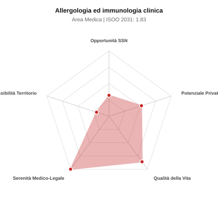

# Scheda di Orientamento: Allergologia ed immunologia clinica

[← Torna al Report Nazionale](../REPORT_NAZIONALE_MEDCAREER2031.md) | [Guida alla Consultazione](../GUIDA_ALLA_CONSULTAZIONE.md)

---

## 1. Profilo di Sintesi (Coorte SSM 2026–2031)

| Parametro | Valore / Dettaglio |
| :--- | :--- |
| **Area Disciplinare** | Medica |
| **Durata del Corso** | 4 anni |
| **Semaforo di Occupabilità al 2031** | 🔴 **ROSSO (Rischio Pletora / Elevata Saturazione SSN)** |
| **Verdetto di Carriera** | **Pletora / Grave Saturazione** |
| **Indice ISOO Nazionale (Baseline)** | **1.83** (Range Scenari: 1.58 – 2.03) |
| **Probabilità Assunzione Concorso SSN** | **32.0%** |
| **Qualità della Vita (QoL Score)** | **86 / 100** |
| **Redditività Lorda Annua Stimata (REP)**| **~112,900 €** (Netto stimato: ~62,100 €) |

### Inquadramento Clinico e Prospettiva Occupazionale
Diagnosi e trattamento delle patologie allergiche respiratorie, cutanee, alimentari, da farmaci e veleno di imenotteri, nonche gestione dei difetti del sistema immunitario primitivi e secondari.

> [!NOTE]
> **Prospettiva al 2031 per chi entra a novembre 2026**:
> Forte esubero di specialisti rispetto alle posizioni ospedaliere disponibili al 2031; altissima concorrenza nei concorsi, sbocco quasi obbligato nella libera professione pura.

---

## 2. Flusso Formativo e Ricambio Generazionale

I dati ministeriali (MUR / MEF / ANAAO) evidenziano la seguente dinamica di ricambio della forza lavoro per il quinquennio 2026–2031:

- **Contratti annui stimati (media 2024-2026)**: 85 borse/anno
- **Totale contratti stanziati nel quinquennio**: 425
- **Tasso fisiologico di abbandono / riassegnazione**: 2.0%
- **Nuovi specialisti effettivi al 2031**: 416 medici formati
- **Specialisti SSN attivi censiti a inizio periodo**: 220
- **Uscite stimate per pensionamento (2026–2031)**: 84 dirigenti medici
- **Uscite per dimissioni volontarie / passaggio al privato**: 22 dirigenti medici
- **Fabbisogno netto di rimpiazzo SSN (con fattore demografico)**: 106 posti

---

## 3. Analisi Comparativa Multi-Scenario al 2031

Il modello Stock-Flow a 5 anni simula la convergenza tra domanda e offerta al momento del conseguimento del titolo specialistico sotto 3 differenti assetti normativi ed economici:

| Indicatore Occupazionale | Scenario 1: Baseline Inerziale | Scenario 2: Pletora Grave (Worst) | Scenario 3: Riforma Correttiva (Best) |
| :--- | :---: | :---: | :---: |
| **Uscite Totali SSN (Pensionamenti + Esodo)** | 106 | 87 | 121 |
| **Fabbisogno Netto Stimato SSN** | 106 | 87 | 121 |
| **Nuovi Diplomati Effettivi** | 416 | 437 | 354 |
| **Saldo Netto SSN (Nuovi - Fabbisogno)** | **+310** | **+350** | **+233** |
| **Indice ISOO (Offerta / Domanda Totale)** | **1.83** | **2.03** | **1.58** |
| **Probabilità Assunzione Concorso SSN** | **32.0%** | **25.0%** | **43.0%** |
| **Verdetto Scenario** | Pletora / Grave Saturazione | Pletora / Grave Saturazione | Pletora / Grave Saturazione |

---

## 4. Quadro Territoriale: Domanda e Offerta nelle 21 Regioni e P.A.

La tabella seguente illustra la proiezione occupazionale al 2031 (Scenario Baseline) per ciascuna Regione e Provincia Autonoma, ordinata dal territorio con **maggior fabbisogno non coperto** a quello più saturo:

| Regione / P.A. | Medici Attivi 2026 | Uscite Totali SSN | Nuovi Assegnati | Saldo Netto 2031 | ISOO Reg. | Semaforo |
| :--- | :---: | :---: | :---: | :---: | :---: | :---: |
| Molise | 1 | 0 | 0 | 0 | 2.00 | 🔴 |
| Valle d'Aosta | 1 | 0 | 0 | 0 | 2.00 | 🔴 |
| Umbria | 3 | 1 | 5 | +4 | 2.50 | 🔴 |
| Basilicata | 2 | 1 | 5 | +4 | 2.50 | 🔴 |
| P.A. Trento | 2 | 1 | 5 | +4 | 2.50 | 🔴 |
| P.A. Bolzano | 2 | 1 | 5 | +4 | 2.50 | 🔴 |
| Marche | 6 | 3 | 10 | +7 | 1.67 | 🔴 |
| Liguria | 6 | 3 | 10 | +7 | 1.67 | 🔴 |
| Sardegna | 6 | 3 | 10 | +7 | 1.67 | 🔴 |
| Friuli-Venezia Giulia | 4 | 2 | 10 | +8 | 2.00 | 🔴 |
| Abruzzo | 5 | 2 | 10 | +8 | 2.00 | 🔴 |
| Calabria | 7 | 4 | 15 | +11 | 1.88 | 🔴 |
| Toscana | 14 | 6 | 24 | +18 | 1.85 | 🔴 |
| Piemonte | 16 | 8 | 29 | +21 | 1.81 | 🔴 |
| Emilia-Romagna | 17 | 8 | 29 | +21 | 1.81 | 🔴 |
| Puglia | 14 | 6 | 29 | +23 | 2.07 | 🔴 |
| Sicilia | 18 | 9 | 34 | +25 | 1.79 | 🔴 |
| Veneto | 18 | 8 | 34 | +26 | 1.89 | 🔴 |
| Campania | 21 | 10 | 39 | +29 | 1.86 | 🔴 |
| Lazio | 21 | 10 | 39 | +29 | 1.86 | 🔴 |
| Lombardia | 38 | 18 | 74 | +56 | 1.85 | 🔴 |

> [!TIP]
> **Dinamica Geografica**:
> Le regioni in verde presentano carenza strutturale con concorsi che si prevedono aperti e con elevata probabilita di vincita immediata. Nei territori contrassegnati in rosso, il numero di nuovi specialisti supera il ricambio fisiologico ospedaliero, rendendo necessaria una pianificazione extra-regionale o uno sbocco nella medicina privata.

---

## 5. Scorecard: Qualità della Vita e Redditività Economica

### Radar Chart Professionale a 5 Dimensioni

### Indicatori di Qualità della Vita (QoL Score: 86/100)
- **Notti di guardia attive medie al mese**: 0.5 turni/mese
- **Reperibilità notturne/festive medie al mese**: 1.0 turni/mese
- **Ore settimanali effettive stimate**: 40 ore (compresi straordinari operativi)
- **Classe di rischio medico-legale**: Classe 1 su 5
- **Indice di Burnout percepito nella disciplina**: 40 / 100

### Scomposizione Redditività Economica Potenziale (REP)
- **Retribuzione Base SSN + Indennità contrattuali stimate**: ~76,400 € lordi/anno
- **Potenziale Libera Professione / Attività intramuraria out-of-pocket**: ~36,500 € lordi/anno
- **Reddito Annuo Lordo Complessivo Stimato**: ~112,900 €
- **Stima Netta Annuale (aliquote IRPEF ordinarie + previdenza ENPAM)**: ~62,100 € netti/anno

---

## 6. Guida Clinico-Strategica per lo Specializzando

### Sub-Specializzazioni ad Alto Valore Aggiunto
Per differenziarsi sul mercato e acquisire una solida barriera all'ingresso professionale, si consiglia di costruire competenze nelle seguenti sotto-branche durante la scuola:
- **Immunoterapia specifica (AIT) e desensibilizzazione farmacologica avanzata**
- **Gestione dei farmaci biologici per asma grave, poliposi nasale e dermatite atopica**
- **Diagnostica molecolare allergologica di precisione (Component-Resolved Diagnostics - CRD)**
- **Immunodeficienze primitive dell adulto e malattie autoimmuni rare**

### Competenze Tecniche e Strumentali Raccomandate
Abilità pratiche da padroneggiare prima del diploma specialistico per massimizzare l'autonomia clinica:
- **Esecuzione e interpretazione di prick test, patch test e test di provocazione orale/bronchiale**
- **Spirometria semplice e globale con test di reversibilita e dosaggio FeNO**
- **Rinoscopia anteriore e citologia nasale**
- **Gestione delle reazioni anafilattiche complesse e protocolli di reinduzione**

### Sbocchi nel Mercato del Lavoro
Sbocco ospedaliero SSN limitato a pochi centri di riferimento e poliambulatori distrettuali; eccellente potenziale nella libera professione pura e in poliambulatori polispecialistici privati.

### Strategia Territoriale e Mobilità
Maggiore saturazione nelle citta universitarie; forte domanda insoddisfatta nei centri di provincia e poliambulatori privati del Centro-Nord.

### Gestione del Rischio Professionale e Work-Life Balance
Rischio medico-legale estremamente basso (Classe 1). Qualita della vita al vertice: assenza quasi totale di guardie notturne attive e reperibilita festive.

---
[← Torna al Report Nazionale](../REPORT_NAZIONALE_MEDCAREER2031.md) | [Guida alla Consultazione](../GUIDA_ALLA_CONSULTAZIONE.md)
