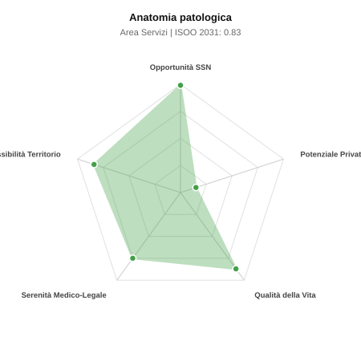

# Scheda di Orientamento: Anatomia patologica

[← Torna al Report Nazionale](../REPORT_NAZIONALE_MEDCAREER2031.md) | [Guida alla Consultazione](../GUIDA_ALLA_CONSULTAZIONE.md)

---

## 1. Profilo di Sintesi (Coorte SSM 2026–2031)

| Parametro | Valore / Dettaglio |
| :--- | :--- |
| **Area Disciplinare** | Servizi |
| **Durata del Corso** | 4 anni |
| **Semaforo di Occupabilità al 2031** | 🟢 **VERDE CHIARO (Equilibrio Fisiologico / Buona Occupabilità)** |
| **Verdetto di Carriera** | **Equilibrio Fisiologico** |
| **Indice ISOO Nazionale (Baseline)** | **0.83** (Range Scenari: 0.66 – 1.05) |
| **Probabilità Assunzione Concorso SSN** | **99.0%** |
| **Qualità della Vita (QoL Score)** | **87 / 100** |
| **Redditività Lorda Annua Stimata (REP)**| **~86,500 €** (Netto stimato: ~47,600 €) |

### Inquadramento Clinico e Prospettiva Occupazionale
Perno diagnostico e prognostico insostituibile dell oncologia moderna: esami istologici, citologici, riscontri autoptici e profiling biomolecolare dei tessuti neoplastici per terapie mirate.

> [!NOTE]
> **Prospettiva al 2031 per chi entra a novembre 2026**:
> Buon bilanciamento tra uscite e nuovi specialisti; accesso regolare al SSN tramite concorso e spazio nel settore convenzionato.

---

## 2. Flusso Formativo e Ricambio Generazionale

I dati ministeriali (MUR / MEF / ANAAO) evidenziano la seguente dinamica di ricambio della forza lavoro per il quinquennio 2026–2031:

- **Contratti annui stimati (media 2024-2026)**: 175 borse/anno
- **Totale contratti stanziati nel quinquennio**: 875
- **Tasso fisiologico di abbandono / riassegnazione**: 30.0%
- **Nuovi specialisti effettivi al 2031**: 612 medici formati
- **Specialisti SSN attivi censiti a inizio periodo**: 1,380
- **Uscite stimate per pensionamento (2026–2031)**: 524 dirigenti medici
- **Uscite per dimissioni volontarie / passaggio al privato**: 138 dirigenti medici
- **Fabbisogno netto di rimpiazzo SSN (con fattore demografico)**: 690 posti

---

## 3. Analisi Comparativa Multi-Scenario al 2031

Il modello Stock-Flow a 5 anni simula la convergenza tra domanda e offerta al momento del conseguimento del titolo specialistico sotto 3 differenti assetti normativi ed economici:

| Indicatore Occupazionale | Scenario 1: Baseline Inerziale | Scenario 2: Pletora Grave (Worst) | Scenario 3: Riforma Correttiva (Best) |
| :--- | :---: | :---: | :---: |
| **Uscite Totali SSN (Pensionamenti + Esodo)** | 662 | 543 | 755 |
| **Fabbisogno Netto Stimato SSN** | 690 | 561 | 794 |
| **Nuovi Diplomati Effettivi** | 612 | 643 | 551 |
| **Saldo Netto SSN (Nuovi - Fabbisogno)** | **-78** | **+82** | **-243** |
| **Indice ISOO (Offerta / Domanda Totale)** | **0.83** | **1.05** | **0.66** |
| **Probabilità Assunzione Concorso SSN** | **99.0%** | **92.7%** | **99.0%** |
| **Verdetto Scenario** | Equilibrio Fisiologico | Equilibrio Fisiologico | Carenza Severa (Assunzione Immediata) |

---

## 4. Quadro Territoriale: Domanda e Offerta nelle 21 Regioni e P.A.

La tabella seguente illustra la proiezione occupazionale al 2031 (Scenario Baseline) per ciascuna Regione e Provincia Autonoma, ordinata dal territorio con **maggior fabbisogno non coperto** a quello più saturo:

| Regione / P.A. | Medici Attivi 2026 | Uscite Totali SSN | Nuovi Assegnati | Saldo Netto 2031 | ISOO Reg. | Semaforo |
| :--- | :---: | :---: | :---: | :---: | :---: | :---: |
| Sicilia | 112 | 56 | 49 | -10 | 0.78 | 🟢 |
| Lombardia | 236 | 109 | 105 | -10 | 0.85 | 🟢 |
| Lazio | 134 | 64 | 59 | -9 | 0.81 | 🟢 |
| Puglia | 91 | 44 | 38 | -8 | 0.78 | 🟢 |
| Campania | 130 | 62 | 59 | -7 | 0.83 | 🟢 |
| Toscana | 86 | 42 | 38 | -6 | 0.81 | 🟢 |
| Emilia-Romagna | 105 | 50 | 46 | -6 | 0.82 | 🟢 |
| Veneto | 114 | 52 | 49 | -6 | 0.83 | 🟢 |
| Liguria | 35 | 18 | 14 | -5 | 0.70 | 🟢 |
| Marche | 35 | 17 | 14 | -4 | 0.74 | 🟢 |
| Calabria | 43 | 21 | 18 | -4 | 0.75 | 🟢 |
| Piemonte | 100 | 48 | 46 | -4 | 0.85 | 🟢 |
| Sardegna | 36 | 18 | 18 | -1 | 0.86 | 🟢 |
| Friuli-Venezia Giulia | 28 | 14 | 14 | -1 | 0.88 | 🟢 |
| Valle d'Aosta | 3 | 1 | 0 | -1 | 0.00 | 🟢 |
| Abruzzo | 30 | 14 | 14 | -1 | 0.88 | 🟢 |
| Umbria | 20 | 10 | 10 | 0 | 0.91 | 🟢 |
| Molise | 7 | 4 | 4 | 0 | 1.00 | 🟢 |
| Basilicata | 12 | 6 | 7 | +1 | 1.00 | 🟢 |
| P.A. Bolzano | 13 | 6 | 7 | +1 | 1.00 | 🟢 |
| P.A. Trento | 13 | 6 | 7 | +1 | 1.00 | 🟢 |

> [!TIP]
> **Dinamica Geografica**:
> Le regioni in verde presentano carenza strutturale con concorsi che si prevedono aperti e con elevata probabilita di vincita immediata. Nei territori contrassegnati in rosso, il numero di nuovi specialisti supera il ricambio fisiologico ospedaliero, rendendo necessaria una pianificazione extra-regionale o uno sbocco nella medicina privata.

---

## 5. Scorecard: Qualità della Vita e Redditività Economica

### Radar Chart Professionale a 5 Dimensioni

### Indicatori di Qualità della Vita (QoL Score: 87/100)
- **Notti di guardia attive medie al mese**: 0.0 turni/mese
- **Reperibilità notturne/festive medie al mese**: 0.5 turni/mese
- **Ore settimanali effettive stimate**: 38 ore (compresi straordinari operativi)
- **Classe di rischio medico-legale**: Classe 2 su 5
- **Indice di Burnout percepito nella disciplina**: 50 / 100

### Scomposizione Redditività Economica Potenziale (REP)
- **Retribuzione Base SSN + Indennità contrattuali stimate**: ~76,000 € lordi/anno
- **Potenziale Libera Professione / Attività intramuraria out-of-pocket**: ~10,500 € lordi/anno
- **Reddito Annuo Lordo Complessivo Stimato**: ~86,500 €
- **Stima Netta Annuale (aliquote IRPEF ordinarie + previdenza ENPAM)**: ~47,600 € netti/anno

---

## 6. Guida Clinico-Strategica per lo Specializzando

### Sub-Specializzazioni ad Alto Valore Aggiunto
Per differenziarsi sul mercato e acquisire una solida barriera all'ingresso professionale, si consiglia di costruire competenze nelle seguenti sotto-branche durante la scuola:
- **Patologia molecolare e Next-Generation Sequencing (NGS) per target oncologici**
- **Dermatopatologia ed ematopatologia diagnostica avanzata**
- **Digital pathology, telepatologia e algoritmi AI applicati all imaging tissutale**
- **Patologia urologica e gastroenterologica ad alta complessita**

### Competenze Tecniche e Strumentali Raccomandate
Abilità pratiche da padroneggiare prima del diploma specialistico per massimizzare l'autonomia clinica:
- **Campionamento macroscopico e diagnosi intraoperatoria al congelatore (estemporanea)**
- **Istoctochimica avanzata, ibridazione in situ (FISH, CISH)**
- **Estrazione acidi nucleici da sezioni FFPE e interpretazione panel NGS**
- **Utilizzo di scanner digitali e piattaforme Whole Slide Imaging (WSI)**

### Sbocchi nel Mercato del Lavoro
Assunzione immediata garantita nel SSN per gravissima carenza di specialisti e mancato ricambio generazionale. Opportunita in crescita nei laboratori privati accreditati.

### Strategia Territoriale e Mobilità
Carenza drammatica in tutto il territorio nazionale, in particolare nelle ASL spoke del Nord e Centro Italia con concorsi regolarmente deserti.

### Gestione del Rischio Professionale e Work-Life Balance
Rischio medico-legale moderato (Classe 2-3) legato a mancate o ritardate diagnosi di malignita. Ottima qualita della vita: zero notti, turni diurni regolari, reperibilita limitate.

---
[← Torna al Report Nazionale](../REPORT_NAZIONALE_MEDCAREER2031.md) | [Guida alla Consultazione](../GUIDA_ALLA_CONSULTAZIONE.md)
