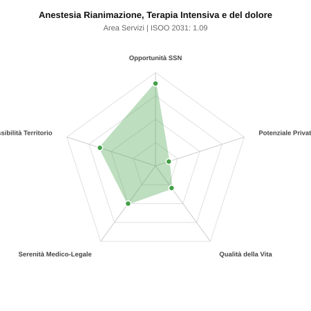

# Scheda di Orientamento: Anestesia Rianimazione, Terapia Intensiva e del dolore

[← Torna al Report Nazionale](../REPORT_NAZIONALE_MEDCAREER2031.md) | [Guida alla Consultazione](../GUIDA_ALLA_CONSULTAZIONE.md)

---

## 1. Profilo di Sintesi (Coorte SSM 2026–2031)

| Parametro | Valore / Dettaglio |
| :--- | :--- |
| **Area Disciplinare** | Servizi |
| **Durata del Corso** | 5 anni |
| **Semaforo di Occupabilità al 2031** | 🟢 **VERDE CHIARO (Equilibrio Fisiologico / Buona Occupabilità)** |
| **Verdetto di Carriera** | **Equilibrio Fisiologico** |
| **Indice ISOO Nazionale (Baseline)** | **1.09** (Range Scenari: 0.88 – 1.36) |
| **Probabilità Assunzione Concorso SSN** | **88.3%** |
| **Qualità della Vita (QoL Score)** | **29 / 100** |
| **Redditività Lorda Annua Stimata (REP)**| **~91,100 €** (Netto stimato: ~50,100 €) |

### Inquadramento Clinico e Prospettiva Occupazionale
Disciplina cardine per tutte le attivita chirurgiche, la gestione dell urgenza perioperatoria, la terapia intensiva generale e specialistica e la medicina del dolore acuto e cronico.

> [!NOTE]
> **Prospettiva al 2031 per chi entra a novembre 2026**:
> Buon bilanciamento tra uscite e nuovi specialisti; accesso regolare al SSN tramite concorso e spazio nel settore convenzionato.

---

## 2. Flusso Formativo e Ricambio Generazionale

I dati ministeriali (MUR / MEF / ANAAO) evidenziano la seguente dinamica di ricambio della forza lavoro per il quinquennio 2026–2031:

- **Contratti annui stimati (media 2024-2026)**: 1,540 borse/anno
- **Totale contratti stanziati nel quinquennio**: 7,700
- **Tasso fisiologico di abbandono / riassegnazione**: 14.0%
- **Nuovi specialisti effettivi al 2031**: 6,622 medici formati
- **Specialisti SSN attivi censiti a inizio periodo**: 11,500
- **Uscite stimate per pensionamento (2026–2031)**: 4,370 dirigenti medici
- **Uscite per dimissioni volontarie / passaggio al privato**: 1,150 dirigenti medici
- **Fabbisogno netto di rimpiazzo SSN (con fattore demografico)**: 5,506 posti

---

## 3. Analisi Comparativa Multi-Scenario al 2031

Il modello Stock-Flow a 5 anni simula la convergenza tra domanda e offerta al momento del conseguimento del titolo specialistico sotto 3 differenti assetti normativi ed economici:

| Indicatore Occupazionale | Scenario 1: Baseline Inerziale | Scenario 2: Pletora Grave (Worst) | Scenario 3: Riforma Correttiva (Best) |
| :--- | :---: | :---: | :---: |
| **Uscite Totali SSN (Pensionamenti + Esodo)** | 5,520 | 4,531 | 6,291 |
| **Fabbisogno Netto Stimato SSN** | 5,506 | 4,522 | 6,272 |
| **Nuovi Diplomati Effettivi** | 6,622 | 6,953 | 5,960 |
| **Saldo Netto SSN (Nuovi - Fabbisogno)** | **+1116** | **+2431** | **-312** |
| **Indice ISOO (Offerta / Domanda Totale)** | **1.09** | **1.36** | **0.88** |
| **Probabilità Assunzione Concorso SSN** | **88.3%** | **69.1%** | **99.0%** |
| **Verdetto Scenario** | Equilibrio Fisiologico | Competitivo / Rischio Saturazione | Equilibrio Fisiologico |

---

## 4. Quadro Territoriale: Domanda e Offerta nelle 21 Regioni e P.A.

La tabella seguente illustra la proiezione occupazionale al 2031 (Scenario Baseline) per ciascuna Regione e Provincia Autonoma, ordinata dal territorio con **maggior fabbisogno non coperto** a quello più saturo:

| Regione / P.A. | Medici Attivi 2026 | Uscite Totali SSN | Nuovi Assegnati | Saldo Netto 2031 | ISOO Reg. | Semaforo |
| :--- | :---: | :---: | :---: | :---: | :---: | :---: |
| Molise | 56 | 28 | 30 | +2 | 0.97 | 🟢 |
| Valle d'Aosta | 24 | 11 | 13 | +2 | 1.08 | 🟢 |
| P.A. Trento | 107 | 50 | 60 | +10 | 1.09 | 🟢 |
| Basilicata | 102 | 51 | 60 | +10 | 1.09 | 🟢 |
| P.A. Bolzano | 106 | 49 | 60 | +11 | 1.11 | 🟢 |
| Umbria | 166 | 80 | 95 | +15 | 1.08 | 🟢 |
| Friuli-Venezia Giulia | 233 | 112 | 133 | +21 | 1.08 | 🟢 |
| Liguria | 295 | 148 | 172 | +24 | 1.06 | 🟢 |
| Abruzzo | 247 | 119 | 142 | +24 | 1.09 | 🟢 |
| Calabria | 357 | 178 | 206 | +30 | 1.07 | 🟢 |
| Marche | 289 | 139 | 168 | +30 | 1.10 | 🟢 |
| Sardegna | 303 | 145 | 176 | +33 | 1.11 | 🟢 |
| Toscana | 714 | 342 | 413 | +72 | 1.10 | 🟢 |
| Puglia | 754 | 362 | 434 | +76 | 1.10 | 🟢 |
| Sicilia | 932 | 465 | 538 | +77 | 1.06 | 🟢 |
| Piemonte | 830 | 398 | 477 | +79 | 1.09 | 🟢 |
| Emilia-Romagna | 873 | 419 | 503 | +82 | 1.09 | 🟢 |
| Lazio | 1,114 | 534 | 641 | +108 | 1.09 | 🟢 |
| Veneto | 948 | 437 | 546 | +109 | 1.13 | 🟢 |
| Campania | 1,087 | 522 | 628 | +111 | 1.10 | 🟢 |
| Lombardia | 1,963 | 905 | 1,131 | +222 | 1.13 | 🟢 |

> [!TIP]
> **Dinamica Geografica**:
> Le regioni in verde presentano carenza strutturale con concorsi che si prevedono aperti e con elevata probabilita di vincita immediata. Nei territori contrassegnati in rosso, il numero di nuovi specialisti supera il ricambio fisiologico ospedaliero, rendendo necessaria una pianificazione extra-regionale o uno sbocco nella medicina privata.

---

## 5. Scorecard: Qualità della Vita e Redditività Economica

### Radar Chart Professionale a 5 Dimensioni

### Indicatori di Qualità della Vita (QoL Score: 29/100)
- **Notti di guardia attive medie al mese**: 5.5 turni/mese
- **Reperibilità notturne/festive medie al mese**: 4.5 turni/mese
- **Ore settimanali effettive stimate**: 48 ore (compresi straordinari operativi)
- **Classe di rischio medico-legale**: Classe 3 su 5
- **Indice di Burnout percepito nella disciplina**: 80 / 100

### Scomposizione Redditività Economica Potenziale (REP)
- **Retribuzione Base SSN + Indennità contrattuali stimate**: ~80,600 € lordi/anno
- **Potenziale Libera Professione / Attività intramuraria out-of-pocket**: ~10,500 € lordi/anno
- **Reddito Annuo Lordo Complessivo Stimato**: ~91,100 €
- **Stima Netta Annuale (aliquote IRPEF ordinarie + previdenza ENPAM)**: ~50,100 € netti/anno

---

## 6. Guida Clinico-Strategica per lo Specializzando

### Sub-Specializzazioni ad Alto Valore Aggiunto
Per differenziarsi sul mercato e acquisire una solida barriera all'ingresso professionale, si consiglia di costruire competenze nelle seguenti sotto-branche durante la scuola:
- **Terapia Intensiva e Rianimazione cardio-toraco-vascolare e neuro-rianimazione**
- **Anestesia loco-regionale ecoguidata e gestione del dolore perioperatorio**
- **Terapia del dolore cronico invasiva (neuromodulazione, radiofrequenza, pompe intratecali)**
- **Elisoccorso, emergenza intra- ed extraospedaliera e maxi-emergenze**

### Competenze Tecniche e Strumentali Raccomandate
Abilità pratiche da padroneggiare prima del diploma specialistico per massimizzare l'autonomia clinica:
- **Gestione avanzata delle vie aeree difficili (videolaringoscopi, fibroscopia)**
- **Cateterismo vascolare centrale e arterioso ecoguidato, monitoraggio emodinamico avanzato**
- **Ventilazione meccanica invasiva e non invasiva, tecniche di depurazione extracorporea (CRRT, ECMO)**
- **Blocchi nervosi periferici ecoguidati di parete e plesso**

### Sbocchi nel Mercato del Lavoro
Piena occupabilita con assunzione istantanea a tempo indeterminato nel SSN (spesso gia durante la scuola con contratti Calabria). Elevatissima richiesta nelle cliniche private accreditate.

### Strategia Territoriale e Mobilità
Carenza endemica uniforme su tutto il territorio nazionale. Ampia liberta di scelta della sede desiderata.

### Gestione del Rischio Professionale e Work-Life Balance
Rischio medico-legale medio-alto (Classe 4) per criticita dei pazienti. Notti frequenti e reperibilita, ma la terapia del dolore ambulatoriale offre un ottima via di fuga programmata.

---
[← Torna al Report Nazionale](../REPORT_NAZIONALE_MEDCAREER2031.md) | [Guida alla Consultazione](../GUIDA_ALLA_CONSULTAZIONE.md)
