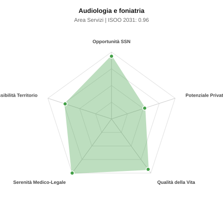

# Scheda di Orientamento: Audiologia e foniatria

[← Torna al Report Nazionale](../REPORT_NAZIONALE_MEDCAREER2031.md) | [Guida alla Consultazione](../GUIDA_ALLA_CONSULTAZIONE.md)

---

## 1. Profilo di Sintesi (Coorte SSM 2026–2031)

| Parametro | Valore / Dettaglio |
| :--- | :--- |
| **Area Disciplinare** | Servizi |
| **Durata del Corso** | 4 anni |
| **Semaforo di Occupabilità al 2031** | 🟢 **VERDE CHIARO (Equilibrio Fisiologico / Buona Occupabilità)** |
| **Verdetto di Carriera** | **Equilibrio Fisiologico** |
| **Indice ISOO Nazionale (Baseline)** | **0.96** (Range Scenari: 0.81 – 1.15) |
| **Probabilità Assunzione Concorso SSN** | **93.7%** |
| **Qualità della Vita (QoL Score)** | **93 / 100** |
| **Redditività Lorda Annua Stimata (REP)**| **~112,500 €** (Netto stimato: ~61,900 €) |

### Inquadramento Clinico e Prospettiva Occupazionale
Prevenzione, diagnosi, terapia e riabilitazione delle patologie dell apparato uditivo e vestibolare, del linguaggio, della voce, della deglutizione e funzioni cognitive correlate.

> [!NOTE]
> **Prospettiva al 2031 per chi entra a novembre 2026**:
> Buon bilanciamento tra uscite e nuovi specialisti; accesso regolare al SSN tramite concorso e spazio nel settore convenzionato.

---

## 2. Flusso Formativo e Ricambio Generazionale

I dati ministeriali (MUR / MEF / ANAAO) evidenziano la seguente dinamica di ricambio della forza lavoro per il quinquennio 2026–2031:

- **Contratti annui stimati (media 2024-2026)**: 35 borse/anno
- **Totale contratti stanziati nel quinquennio**: 175
- **Tasso fisiologico di abbandono / riassegnazione**: 8.0%
- **Nuovi specialisti effettivi al 2031**: 161 medici formati
- **Specialisti SSN attivi censiti a inizio periodo**: 250
- **Uscite stimate per pensionamento (2026–2031)**: 95 dirigenti medici
- **Uscite per dimissioni volontarie / passaggio al privato**: 25 dirigenti medici
- **Fabbisogno netto di rimpiazzo SSN (con fattore demografico)**: 120 posti

---

## 3. Analisi Comparativa Multi-Scenario al 2031

Il modello Stock-Flow a 5 anni simula la convergenza tra domanda e offerta al momento del conseguimento del titolo specialistico sotto 3 differenti assetti normativi ed economici:

| Indicatore Occupazionale | Scenario 1: Baseline Inerziale | Scenario 2: Pletora Grave (Worst) | Scenario 3: Riforma Correttiva (Best) |
| :--- | :---: | :---: | :---: |
| **Uscite Totali SSN (Pensionamenti + Esodo)** | 120 | 98 | 137 |
| **Fabbisogno Netto Stimato SSN** | 120 | 98 | 137 |
| **Nuovi Diplomati Effettivi** | 161 | 169 | 145 |
| **Saldo Netto SSN (Nuovi - Fabbisogno)** | **+41** | **+71** | **+8** |
| **Indice ISOO (Offerta / Domanda Totale)** | **0.96** | **1.15** | **0.81** |
| **Probabilità Assunzione Concorso SSN** | **93.7%** | **72.9%** | **99.0%** |
| **Verdetto Scenario** | Equilibrio Fisiologico | Equilibrio Fisiologico | Equilibrio Fisiologico |

---

## 4. Quadro Territoriale: Domanda e Offerta nelle 21 Regioni e P.A.

La tabella seguente illustra la proiezione occupazionale al 2031 (Scenario Baseline) per ciascuna Regione e Provincia Autonoma, ordinata dal territorio con **maggior fabbisogno non coperto** a quello più saturo:

| Regione / P.A. | Medici Attivi 2026 | Uscite Totali SSN | Nuovi Assegnati | Saldo Netto 2031 | ISOO Reg. | Semaforo |
| :--- | :---: | :---: | :---: | :---: | :---: | :---: |
| Basilicata | 2 | 1 | 0 | -1 | 0.00 | 🟢 |
| P.A. Bolzano | 2 | 1 | 0 | -1 | 0.00 | 🟢 |
| P.A. Trento | 2 | 1 | 0 | -1 | 0.00 | 🟢 |
| Molise | 1 | 0 | 0 | 0 | 2.00 | 🔴 |
| Valle d'Aosta | 1 | 0 | 0 | 0 | 2.00 | 🔴 |
| Puglia | 16 | 8 | 9 | +1 | 0.82 | 🟢 |
| Toscana | 16 | 8 | 9 | +1 | 0.82 | 🟢 |
| Calabria | 8 | 4 | 5 | +1 | 1.00 | 🟢 |
| Sardegna | 7 | 4 | 5 | +1 | 1.00 | 🟢 |
| Liguria | 6 | 3 | 5 | +2 | 1.25 | 🟠 |
| Marche | 6 | 3 | 5 | +2 | 1.25 | 🟠 |
| Abruzzo | 5 | 2 | 5 | +3 | 1.67 | 🔴 |
| Umbria | 4 | 2 | 5 | +3 | 1.67 | 🔴 |
| Lazio | 24 | 11 | 14 | +3 | 0.93 | 🟢 |
| Friuli-Venezia Giulia | 5 | 2 | 5 | +3 | 1.67 | 🔴 |
| Campania | 24 | 11 | 14 | +3 | 0.93 | 🟢 |
| Veneto | 21 | 10 | 14 | +4 | 1.00 | 🟢 |
| Sicilia | 20 | 10 | 14 | +4 | 1.00 | 🟢 |
| Emilia-Romagna | 19 | 9 | 14 | +5 | 1.08 | 🟢 |
| Piemonte | 18 | 9 | 14 | +5 | 1.08 | 🟢 |
| Lombardia | 43 | 20 | 28 | +8 | 1.00 | 🟢 |

> [!TIP]
> **Dinamica Geografica**:
> Le regioni in verde presentano carenza strutturale con concorsi che si prevedono aperti e con elevata probabilita di vincita immediata. Nei territori contrassegnati in rosso, il numero di nuovi specialisti supera il ricambio fisiologico ospedaliero, rendendo necessaria una pianificazione extra-regionale o uno sbocco nella medicina privata.

---

## 5. Scorecard: Qualità della Vita e Redditività Economica

### Radar Chart Professionale a 5 Dimensioni

### Indicatori di Qualità della Vita (QoL Score: 93/100)
- **Notti di guardia attive medie al mese**: 0.0 turni/mese
- **Reperibilità notturne/festive medie al mese**: 0.5 turni/mese
- **Ore settimanali effettive stimate**: 38 ore (compresi straordinari operativi)
- **Classe di rischio medico-legale**: Classe 1 su 5
- **Indice di Burnout percepito nella disciplina**: 35 / 100

### Scomposizione Redditività Economica Potenziale (REP)
- **Retribuzione Base SSN + Indennità contrattuali stimate**: ~76,000 € lordi/anno
- **Potenziale Libera Professione / Attività intramuraria out-of-pocket**: ~36,500 € lordi/anno
- **Reddito Annuo Lordo Complessivo Stimato**: ~112,500 €
- **Stima Netta Annuale (aliquote IRPEF ordinarie + previdenza ENPAM)**: ~61,900 € netti/anno

---

## 6. Guida Clinico-Strategica per lo Specializzando

### Sub-Specializzazioni ad Alto Valore Aggiunto
Per differenziarsi sul mercato e acquisire una solida barriera all'ingresso professionale, si consiglia di costruire competenze nelle seguenti sotto-branche durante la scuola:
- **Vestibologia clinica e riabilitazione dei disturbi dell equilibrio**
- **Audiologia infantile, screening uditivo neonatale e impianti cocleari**
- **Fonochirurgia e foniatria artistica per professionisti della voce**
- **Deglutologia e gestione delle disfagie nell anziano e nel paziente neurologico**

### Competenze Tecniche e Strumentali Raccomandate
Abilità pratiche da padroneggiare prima del diploma specialistico per massimizzare l'autonomia clinica:
- **Audiometria tonale, vocale, impedenzometria e potenziali evocati uditivi (ABR, ASSR)**
- **Video Head Impulse Test (vHIT), videonistagmografia (VNG) e manovre vestibolari**
- **Fibrolaringoscopia con valutazione della deglutizione (FEES)**
- **Programmazione e mappaggio di impianti cocleari e protesi acustiche**

### Sbocchi nel Mercato del Lavoro
Posti ospedalieri SSN contenuti ma stabili (afferenti a ORL o Riabilitazione); forte richiesta sul territorio in centri acustici privati, centri riabilitativi e studi privati.

### Strategia Territoriale e Mobilità
Opportunita concentrate nei poli pediatrici, centri otologici e distretti ad alta densita di anziani.

### Gestione del Rischio Professionale e Work-Life Balance
Rischio medico-legale molto basso (Classe 1). Ottima qualita della vita: lavoro ambulatoriale programmato, zero notti attive, nessun turno d urgenza.

---
[← Torna al Report Nazionale](../REPORT_NAZIONALE_MEDCAREER2031.md) | [Guida alla Consultazione](../GUIDA_ALLA_CONSULTAZIONE.md)
