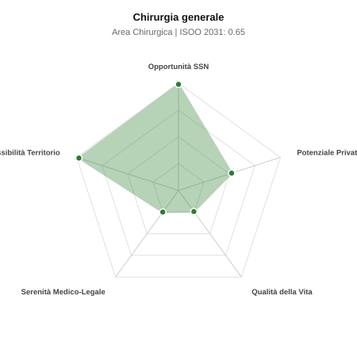

# Scheda di Orientamento: Chirurgia generale

[← Torna al Report Nazionale](../REPORT_NAZIONALE_MEDCAREER2031.md) | [Guida alla Consultazione](../GUIDA_ALLA_CONSULTAZIONE.md)

---

## 1. Profilo di Sintesi (Coorte SSM 2026–2031)

| Parametro | Valore / Dettaglio |
| :--- | :--- |
| **Area Disciplinare** | Chirurgica |
| **Durata del Corso** | 5 anni |
| **Semaforo di Occupabilità al 2031** | 🟢 **VERDE SCURO (Carenza Elevata / Assunzione Immediata)** |
| **Verdetto di Carriera** | **Carenza Severa (Assunzione Immediata)** |
| **Indice ISOO Nazionale (Baseline)** | **0.65** (Range Scenari: 0.53 – 0.80) |
| **Probabilità Assunzione Concorso SSN** | **99.0%** |
| **Qualità della Vita (QoL Score)** | **24 / 100** |
| **Redditività Lorda Annua Stimata (REP)**| **~116,700 €** (Netto stimato: ~64,200 €) |

### Inquadramento Clinico e Prospettiva Occupazionale
Colonna portante della sanita chirurgica per la patologia addominale oncologica e benigna, la chirurgia d urgenza/trauma, la patologia endocrina e della parete addominale.

> [!NOTE]
> **Prospettiva al 2031 per chi entra a novembre 2026**:
> Posti vacanti diffusi e concorsi spesso deserti; altissima probabilità di assunzione prima del titolo o subito dopo (Decreto Calabria).

---

## 2. Flusso Formativo e Ricambio Generazionale

I dati ministeriali (MUR / MEF / ANAAO) evidenziano la seguente dinamica di ricambio della forza lavoro per il quinquennio 2026–2031:

- **Contratti annui stimati (media 2024-2026)**: 690 borse/anno
- **Totale contratti stanziati nel quinquennio**: 3,450
- **Tasso fisiologico di abbandono / riassegnazione**: 18.0%
- **Nuovi specialisti effettivi al 2031**: 2,829 medici formati
- **Specialisti SSN attivi censiti a inizio periodo**: 7,000
- **Uscite stimate per pensionamento (2026–2031)**: 2,660 dirigenti medici
- **Uscite per dimissioni volontarie / passaggio al privato**: 700 dirigenti medici
- **Fabbisogno netto di rimpiazzo SSN (con fattore demografico)**: 3,503 posti

---

## 3. Analisi Comparativa Multi-Scenario al 2031

Il modello Stock-Flow a 5 anni simula la convergenza tra domanda e offerta al momento del conseguimento del titolo specialistico sotto 3 differenti assetti normativi ed economici:

| Indicatore Occupazionale | Scenario 1: Baseline Inerziale | Scenario 2: Pletora Grave (Worst) | Scenario 3: Riforma Correttiva (Best) |
| :--- | :---: | :---: | :---: |
| **Uscite Totali SSN (Pensionamenti + Esodo)** | 3,360 | 2,758 | 3,829 |
| **Fabbisogno Netto Stimato SSN** | 3,503 | 2,852 | 4,024 |
| **Nuovi Diplomati Effettivi** | 2,829 | 2,970 | 2,546 |
| **Saldo Netto SSN (Nuovi - Fabbisogno)** | **-674** | **+118** | **-1478** |
| **Indice ISOO (Offerta / Domanda Totale)** | **0.65** | **0.80** | **0.53** |
| **Probabilità Assunzione Concorso SSN** | **99.0%** | **99.0%** | **99.0%** |
| **Verdetto Scenario** | Carenza Severa (Assunzione Immediata) | Carenza Severa (Assunzione Immediata) | Carenza Severa (Assunzione Immediata) |

---

## 4. Quadro Territoriale: Domanda e Offerta nelle 21 Regioni e P.A.

La tabella seguente illustra la proiezione occupazionale al 2031 (Scenario Baseline) per ciascuna Regione e Provincia Autonoma, ordinata dal territorio con **maggior fabbisogno non coperto** a quello più saturo:

| Regione / P.A. | Medici Attivi 2026 | Uscite Totali SSN | Nuovi Assegnati | Saldo Netto 2031 | ISOO Reg. | Semaforo |
| :--- | :---: | :---: | :---: | :---: | :---: | :---: |
| Lombardia | 1,195 | 551 | 484 | -97 | 0.67 | 🟢 |
| Campania | 661 | 317 | 266 | -71 | 0.64 | 🟢 |
| Lazio | 678 | 326 | 275 | -70 | 0.65 | 🟢 |
| Sicilia | 567 | 283 | 230 | -66 | 0.63 | 🟢 |
| Emilia-Romagna | 532 | 255 | 213 | -53 | 0.65 | 🟢 |
| Puglia | 459 | 220 | 184 | -47 | 0.65 | 🟢 |
| Veneto | 577 | 266 | 234 | -47 | 0.67 | 🟢 |
| Piemonte | 505 | 242 | 205 | -45 | 0.66 | 🟢 |
| Toscana | 435 | 209 | 176 | -41 | 0.66 | 🟢 |
| Calabria | 217 | 109 | 86 | -28 | 0.62 | 🟢 |
| Liguria | 180 | 90 | 74 | -19 | 0.64 | 🟢 |
| Marche | 176 | 85 | 70 | -19 | 0.64 | 🟢 |
| Sardegna | 185 | 88 | 74 | -18 | 0.65 | 🟢 |
| Friuli-Venezia Giulia | 142 | 68 | 57 | -14 | 0.65 | 🟢 |
| Abruzzo | 150 | 72 | 62 | -13 | 0.67 | 🟢 |
| Umbria | 101 | 48 | 41 | -9 | 0.66 | 🟢 |
| Basilicata | 62 | 31 | 25 | -7 | 0.64 | 🟢 |
| Molise | 34 | 17 | 12 | -6 | 0.55 | 🟢 |
| P.A. Bolzano | 64 | 29 | 25 | -6 | 0.66 | 🟢 |
| P.A. Trento | 65 | 29 | 25 | -6 | 0.66 | 🟢 |
| Valle d'Aosta | 15 | 8 | 4 | -4 | 0.44 | 🟢 |

> [!TIP]
> **Dinamica Geografica**:
> Le regioni in verde presentano carenza strutturale con concorsi che si prevedono aperti e con elevata probabilita di vincita immediata. Nei territori contrassegnati in rosso, il numero di nuovi specialisti supera il ricambio fisiologico ospedaliero, rendendo necessaria una pianificazione extra-regionale o uno sbocco nella medicina privata.

---

## 5. Scorecard: Qualità della Vita e Redditività Economica

### Radar Chart Professionale a 5 Dimensioni

### Indicatori di Qualità della Vita (QoL Score: 24/100)
- **Notti di guardia attive medie al mese**: 5.0 turni/mese
- **Reperibilità notturne/festive medie al mese**: 5.0 turni/mese
- **Ore settimanali effettive stimate**: 50 ore (compresi straordinari operativi)
- **Classe di rischio medico-legale**: Classe 4 su 5
- **Indice di Burnout percepito nella disciplina**: 75 / 100

### Scomposizione Redditività Economica Potenziale (REP)
- **Retribuzione Base SSN + Indennità contrattuali stimate**: ~80,200 € lordi/anno
- **Potenziale Libera Professione / Attività intramuraria out-of-pocket**: ~36,500 € lordi/anno
- **Reddito Annuo Lordo Complessivo Stimato**: ~116,700 €
- **Stima Netta Annuale (aliquote IRPEF ordinarie + previdenza ENPAM)**: ~64,200 € netti/anno

---

## 6. Guida Clinico-Strategica per lo Specializzando

### Sub-Specializzazioni ad Alto Valore Aggiunto
Per differenziarsi sul mercato e acquisire una solida barriera all'ingresso professionale, si consiglia di costruire competenze nelle seguenti sotto-branche durante la scuola:
- **Chirurgia oncologica dell apparato digerente (colon-retto, fegato, stomaco)**
- **Chirurgia laparoscopica avanzata e robotica assistita (da Vinci)**
- **Chirurgia d urgenza, trauma care e damage control surgery**
- **Chirurgia bariatrica e metabolica, proctologia ed ernie complesse**

### Competenze Tecniche e Strumentali Raccomandate
Abilità pratiche da padroneggiare prima del diploma specialistico per massimizzare l'autonomia clinica:
- **Resezioni coliche, gastriche ed epatiche laparoscopiche/robotiche**
- **Suture ed anastomosi meccaniche e manuali intracorporee**
- **Posizionamento accessi venosi centrali (Port-a-cath, PICC-port)**
- **Endoscopia digestiva chirurgica operativa e gestione delle sepsi addominali**

### Sbocchi nel Mercato del Lavoro
Carenza acuta nei concorsi pubblici SSN: le graduatorie ospedaliere si esauriscono sistematicamente per l abbandono verso il privato o specialita meno gravose.

### Strategia Territoriale e Mobilità
Fabbisogno massiccio e diffuso sia negli Hub che negli Spoke in tutte le Regioni italiane, con sofferenza nelle ASL periferiche.

### Gestione del Rischio Professionale e Work-Life Balance
Rischio medico-legale alto (Classe 4) per contenziosi su complicanze ed urgenze. Turnover impegnativo con notti di pronto soccorso e reperibilita.

---
[← Torna al Report Nazionale](../REPORT_NAZIONALE_MEDCAREER2031.md) | [Guida alla Consultazione](../GUIDA_ALLA_CONSULTAZIONE.md)
