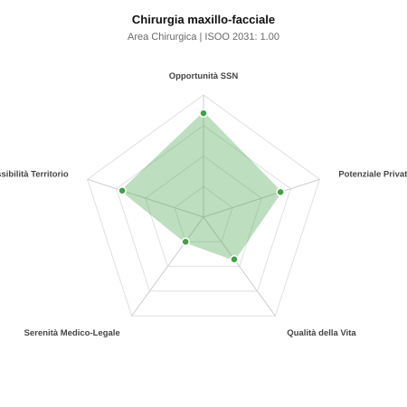

# Scheda di Orientamento: Chirurgia maxillo-facciale

[← Torna al Report Nazionale](../REPORT_NAZIONALE_MEDCAREER2031.md) | [Guida alla Consultazione](../GUIDA_ALLA_CONSULTAZIONE.md)

---

## 1. Profilo di Sintesi (Coorte SSM 2026–2031)

| Parametro | Valore / Dettaglio |
| :--- | :--- |
| **Area Disciplinare** | Chirurgica |
| **Durata del Corso** | 5 anni |
| **Semaforo di Occupabilità al 2031** | 🟢 **VERDE CHIARO (Equilibrio Fisiologico / Buona Occupabilità)** |
| **Verdetto di Carriera** | **Equilibrio Fisiologico** |
| **Indice ISOO Nazionale (Baseline)** | **1.00** (Range Scenari: 0.83 – 1.16) |
| **Probabilità Assunzione Concorso SSN** | **85.0%** |
| **Qualità della Vita (QoL Score)** | **43 / 100** |
| **Redditività Lorda Annua Stimata (REP)**| **~125,000 €** (Netto stimato: ~68,700 €) |

### Inquadramento Clinico e Prospettiva Occupazionale
Chirurgia ricostruttiva e oncologica del distretto facciale, traumatologia scheletrica della faccia, chirurgia ortognatica, malformazioni cranio-facciali e dell ATM.

> [!NOTE]
> **Prospettiva al 2031 per chi entra a novembre 2026**:
> Buon bilanciamento tra uscite e nuovi specialisti; accesso regolare al SSN tramite concorso e spazio nel settore convenzionato.

---

## 2. Flusso Formativo e Ricambio Generazionale

I dati ministeriali (MUR / MEF / ANAAO) evidenziano la seguente dinamica di ricambio della forza lavoro per il quinquennio 2026–2031:

- **Contratti annui stimati (media 2024-2026)**: 55 borse/anno
- **Totale contratti stanziati nel quinquennio**: 275
- **Tasso fisiologico di abbandono / riassegnazione**: 3.0%
- **Nuovi specialisti effettivi al 2031**: 267 medici formati
- **Specialisti SSN attivi censiti a inizio periodo**: 350
- **Uscite stimate per pensionamento (2026–2031)**: 133 dirigenti medici
- **Uscite per dimissioni volontarie / passaggio al privato**: 35 dirigenti medici
- **Fabbisogno netto di rimpiazzo SSN (con fattore demografico)**: 168 posti

---

## 3. Analisi Comparativa Multi-Scenario al 2031

Il modello Stock-Flow a 5 anni simula la convergenza tra domanda e offerta al momento del conseguimento del titolo specialistico sotto 3 differenti assetti normativi ed economici:

| Indicatore Occupazionale | Scenario 1: Baseline Inerziale | Scenario 2: Pletora Grave (Worst) | Scenario 3: Riforma Correttiva (Best) |
| :--- | :---: | :---: | :---: |
| **Uscite Totali SSN (Pensionamenti + Esodo)** | 168 | 138 | 191 |
| **Fabbisogno Netto Stimato SSN** | 168 | 138 | 190 |
| **Nuovi Diplomati Effettivi** | 267 | 280 | 227 |
| **Saldo Netto SSN (Nuovi - Fabbisogno)** | **+99** | **+142** | **+37** |
| **Indice ISOO (Offerta / Domanda Totale)** | **1.00** | **1.16** | **0.83** |
| **Probabilità Assunzione Concorso SSN** | **85.0%** | **66.6%** | **99.0%** |
| **Verdetto Scenario** | Equilibrio Fisiologico | Competitivo / Rischio Saturazione | Equilibrio Fisiologico |

---

## 4. Quadro Territoriale: Domanda e Offerta nelle 21 Regioni e P.A.

La tabella seguente illustra la proiezione occupazionale al 2031 (Scenario Baseline) per ciascuna Regione e Provincia Autonoma, ordinata dal territorio con **maggior fabbisogno non coperto** a quello più saturo:

| Regione / P.A. | Medici Attivi 2026 | Uscite Totali SSN | Nuovi Assegnati | Saldo Netto 2031 | ISOO Reg. | Semaforo |
| :--- | :---: | :---: | :---: | :---: | :---: | :---: |
| Basilicata | 3 | 1 | 0 | -1 | 0.00 | 🟢 |
| Molise | 2 | 1 | 0 | -1 | 0.00 | 🟢 |
| Liguria | 9 | 5 | 5 | 0 | 0.71 | 🟢 |
| Valle d'Aosta | 1 | 0 | 0 | 0 | 2.00 | 🔴 |
| Marche | 9 | 4 | 5 | +1 | 0.83 | 🟢 |
| Sardegna | 9 | 4 | 5 | +1 | 0.83 | 🟢 |
| Abruzzo | 8 | 4 | 5 | +1 | 0.83 | 🟢 |
| Friuli-Venezia Giulia | 7 | 4 | 5 | +1 | 0.83 | 🟢 |
| Umbria | 5 | 2 | 5 | +3 | 1.25 | 🟠 |
| P.A. Bolzano | 3 | 1 | 5 | +4 | 1.67 | 🔴 |
| P.A. Trento | 3 | 1 | 5 | +4 | 1.67 | 🔴 |
| Calabria | 11 | 5 | 10 | +5 | 1.11 | 🟢 |
| Toscana | 22 | 10 | 15 | +5 | 0.94 | 🟢 |
| Sicilia | 28 | 14 | 19 | +5 | 0.91 | 🟢 |
| Emilia-Romagna | 27 | 13 | 19 | +6 | 0.95 | 🟢 |
| Piemonte | 25 | 12 | 19 | +7 | 1.00 | 🟢 |
| Campania | 33 | 16 | 24 | +8 | 0.96 | 🟢 |
| Puglia | 23 | 11 | 19 | +8 | 1.06 | 🟢 |
| Lazio | 34 | 16 | 24 | +8 | 0.96 | 🟢 |
| Veneto | 29 | 13 | 24 | +11 | 1.09 | 🟢 |
| Lombardia | 60 | 28 | 44 | +16 | 1.00 | 🟢 |

> [!TIP]
> **Dinamica Geografica**:
> Le regioni in verde presentano carenza strutturale con concorsi che si prevedono aperti e con elevata probabilita di vincita immediata. Nei territori contrassegnati in rosso, il numero di nuovi specialisti supera il ricambio fisiologico ospedaliero, rendendo necessaria una pianificazione extra-regionale o uno sbocco nella medicina privata.

---

## 5. Scorecard: Qualità della Vita e Redditività Economica

### Radar Chart Professionale a 5 Dimensioni

### Indicatori di Qualità della Vita (QoL Score: 43/100)
- **Notti di guardia attive medie al mese**: 3.0 turni/mese
- **Reperibilità notturne/festive medie al mese**: 4.0 turni/mese
- **Ore settimanali effettive stimate**: 46 ore (compresi straordinari operativi)
- **Classe di rischio medico-legale**: Classe 4 su 5
- **Indice di Burnout percepito nella disciplina**: 65 / 100

### Scomposizione Redditività Economica Potenziale (REP)
- **Retribuzione Base SSN + Indennità contrattuali stimate**: ~78,600 € lordi/anno
- **Potenziale Libera Professione / Attività intramuraria out-of-pocket**: ~46,400 € lordi/anno
- **Reddito Annuo Lordo Complessivo Stimato**: ~125,000 €
- **Stima Netta Annuale (aliquote IRPEF ordinarie + previdenza ENPAM)**: ~68,700 € netti/anno

---

## 6. Guida Clinico-Strategica per lo Specializzando

### Sub-Specializzazioni ad Alto Valore Aggiunto
Per differenziarsi sul mercato e acquisire una solida barriera all'ingresso professionale, si consiglia di costruire competenze nelle seguenti sotto-branche durante la scuola:
- **Chirurgia ortognatica e correzione 3D delle disgnazie dento-scheletriche**
- **Oncologia testa-collo con ricostruzione con lembi liberi microvascolari**
- **Traumatologia cranio-maxillo-facciale complessa**
- **Chirurgia pre-implantare avanzata e chirurgia dell articolazione temporo-mandibolare**

### Competenze Tecniche e Strumentali Raccomandate
Abilità pratiche da padroneggiare prima del diploma specialistico per massimizzare l'autonomia clinica:
- **Osteotomie mascellari e mandibolari secondo Le Fort e sagittal split**
- **Microchirurgia vascolare e anastomosi vascolari per lembi liberi**
- **Pianificazione chirurgica virtuale 3D (VSP) e guide di taglio custom**
- **Artroscopia e chirurgia aperta dell ATM**

### Sbocchi nel Mercato del Lavoro
Posti ospedalieri limitati a centri Hub traumatologici e oncologici; redditivita privata straordinaria nella chirurgia ortognatica, estetica facciale e implantologia.

### Strategia Territoriale e Mobilità
L attivita SSN richiede radicamento nei centri di riferimento; libera professione fiorente nei grandi bacini metropolitani e province ricche.

### Gestione del Rischio Professionale e Work-Life Balance
Rischio medico-legale elevato (Classe 4) per esiti estetico-funzionali del volto. Qualita della vita ospedaliera intensa, ma con transizione verso il privato elettivo.

---
[← Torna al Report Nazionale](../REPORT_NAZIONALE_MEDCAREER2031.md) | [Guida alla Consultazione](../GUIDA_ALLA_CONSULTAZIONE.md)
