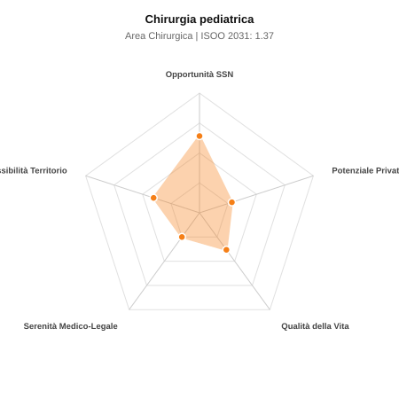

# Scheda di Orientamento: Chirurgia pediatrica

[← Torna al Report Nazionale](../REPORT_NAZIONALE_MEDCAREER2031.md) | [Guida alla Consultazione](../GUIDA_ALLA_CONSULTAZIONE.md)

---

## 1. Profilo di Sintesi (Coorte SSM 2026–2031)

| Parametro | Valore / Dettaglio |
| :--- | :--- |
| **Area Disciplinare** | Chirurgica |
| **Durata del Corso** | 5 anni |
| **Semaforo di Occupabilità al 2031** | 🟠 **ARANCIONE (Saturazione Moderata / Concorrenza Concorsuale)** |
| **Verdetto di Carriera** | **Competitivo / Rischio Saturazione** |
| **Indice ISOO Nazionale (Baseline)** | **1.37** (Range Scenari: 1.09 – 1.64) |
| **Probabilità Assunzione Concorso SSN** | **64.1%** |
| **Qualità della Vita (QoL Score)** | **38 / 100** |
| **Redditività Lorda Annua Stimata (REP)**| **~98,900 €** (Netto stimato: ~54,400 €) |

### Inquadramento Clinico e Prospettiva Occupazionale
Trattamento chirurgico delle malformazioni congenite neonatali e patologie chirurgiche acquisite dell infanzia e adolescenza, in elezione e urgenza.

> [!NOTE]
> **Prospettiva al 2031 per chi entra a novembre 2026**:
> Graduatorie concorsuali affollate; tempi di attesa per tempo indeterminato SSN mediamente più lunghi; necessario appoggiarsi al privato accreditato.

---

## 2. Flusso Formativo e Ricambio Generazionale

I dati ministeriali (MUR / MEF / ANAAO) evidenziano la seguente dinamica di ricambio della forza lavoro per il quinquennio 2026–2031:

- **Contratti annui stimati (media 2024-2026)**: 60 borse/anno
- **Totale contratti stanziati nel quinquennio**: 300
- **Tasso fisiologico di abbandono / riassegnazione**: 4.0%
- **Nuovi specialisti effettivi al 2031**: 288 medici formati
- **Specialisti SSN attivi censiti a inizio periodo**: 360
- **Uscite stimate per pensionamento (2026–2031)**: 137 dirigenti medici
- **Uscite per dimissioni volontarie / passaggio al privato**: 36 dirigenti medici
- **Fabbisogno netto di rimpiazzo SSN (con fattore demografico)**: 164 posti

---

## 3. Analisi Comparativa Multi-Scenario al 2031

Il modello Stock-Flow a 5 anni simula la convergenza tra domanda e offerta al momento del conseguimento del titolo specialistico sotto 3 differenti assetti normativi ed economici:

| Indicatore Occupazionale | Scenario 1: Baseline Inerziale | Scenario 2: Pletora Grave (Worst) | Scenario 3: Riforma Correttiva (Best) |
| :--- | :---: | :---: | :---: |
| **Uscite Totali SSN (Pensionamenti + Esodo)** | 173 | 142 | 198 |
| **Fabbisogno Netto Stimato SSN** | 164 | 136 | 186 |
| **Nuovi Diplomati Effettivi** | 288 | 302 | 245 |
| **Saldo Netto SSN (Nuovi - Fabbisogno)** | **+124** | **+166** | **+59** |
| **Indice ISOO (Offerta / Domanda Totale)** | **1.37** | **1.64** | **1.09** |
| **Probabilità Assunzione Concorso SSN** | **64.1%** | **50.7%** | **85.4%** |
| **Verdetto Scenario** | Competitivo / Rischio Saturazione | Pletora / Grave Saturazione | Equilibrio Fisiologico |

---

## 4. Quadro Territoriale: Domanda e Offerta nelle 21 Regioni e P.A.

La tabella seguente illustra la proiezione occupazionale al 2031 (Scenario Baseline) per ciascuna Regione e Provincia Autonoma, ordinata dal territorio con **maggior fabbisogno non coperto** a quello più saturo:

| Regione / P.A. | Medici Attivi 2026 | Uscite Totali SSN | Nuovi Assegnati | Saldo Netto 2031 | ISOO Reg. | Semaforo |
| :--- | :---: | :---: | :---: | :---: | :---: | :---: |
| Molise | 2 | 1 | 0 | -1 | 0.00 | 🟢 |
| Valle d'Aosta | 1 | 0 | 0 | 0 | 2.00 | 🔴 |
| Friuli-Venezia Giulia | 7 | 4 | 5 | +1 | 1.00 | 🟢 |
| Abruzzo | 8 | 4 | 5 | +1 | 1.00 | 🟢 |
| Umbria | 5 | 2 | 5 | +3 | 1.67 | 🔴 |
| P.A. Bolzano | 3 | 1 | 5 | +4 | 2.50 | 🔴 |
| P.A. Trento | 3 | 1 | 5 | +4 | 2.50 | 🔴 |
| Basilicata | 3 | 1 | 5 | +4 | 2.50 | 🔴 |
| Liguria | 9 | 5 | 10 | +5 | 1.43 | 🟠 |
| Calabria | 11 | 5 | 10 | +5 | 1.43 | 🟠 |
| Marche | 9 | 4 | 10 | +6 | 1.67 | 🔴 |
| Sardegna | 9 | 4 | 10 | +6 | 1.67 | 🔴 |
| Piemonte | 26 | 13 | 19 | +7 | 1.27 | 🟠 |
| Toscana | 22 | 10 | 19 | +9 | 1.46 | 🔴 |
| Puglia | 24 | 11 | 19 | +9 | 1.46 | 🔴 |
| Sicilia | 29 | 15 | 24 | +10 | 1.33 | 🟠 |
| Veneto | 30 | 14 | 24 | +11 | 1.41 | 🟠 |
| Emilia-Romagna | 27 | 13 | 24 | +12 | 1.50 | 🔴 |
| Lazio | 35 | 17 | 29 | +13 | 1.38 | 🟠 |
| Campania | 34 | 16 | 29 | +14 | 1.45 | 🟠 |
| Lombardia | 61 | 28 | 48 | +21 | 1.37 | 🟠 |

> [!TIP]
> **Dinamica Geografica**:
> Le regioni in verde presentano carenza strutturale con concorsi che si prevedono aperti e con elevata probabilita di vincita immediata. Nei territori contrassegnati in rosso, il numero di nuovi specialisti supera il ricambio fisiologico ospedaliero, rendendo necessaria una pianificazione extra-regionale o uno sbocco nella medicina privata.

---

## 5. Scorecard: Qualità della Vita e Redditività Economica

### Radar Chart Professionale a 5 Dimensioni

### Indicatori di Qualità della Vita (QoL Score: 38/100)
- **Notti di guardia attive medie al mese**: 3.5 turni/mese
- **Reperibilità notturne/festive medie al mese**: 4.5 turni/mese
- **Ore settimanali effettive stimate**: 46 ore (compresi straordinari operativi)
- **Classe di rischio medico-legale**: Classe 4 su 5
- **Indice di Burnout percepito nella disciplina**: 70 / 100

### Scomposizione Redditività Economica Potenziale (REP)
- **Retribuzione Base SSN + Indennità contrattuali stimate**: ~79,000 € lordi/anno
- **Potenziale Libera Professione / Attività intramuraria out-of-pocket**: ~19,900 € lordi/anno
- **Reddito Annuo Lordo Complessivo Stimato**: ~98,900 €
- **Stima Netta Annuale (aliquote IRPEF ordinarie + previdenza ENPAM)**: ~54,400 € netti/anno

---

## 6. Guida Clinico-Strategica per lo Specializzando

### Sub-Specializzazioni ad Alto Valore Aggiunto
Per differenziarsi sul mercato e acquisire una solida barriera all'ingresso professionale, si consiglia di costruire competenze nelle seguenti sotto-branche durante la scuola:
- **Chirurgia neonatale delle grandi malformazioni (atresia esofagea, gastroschisi)**
- **Chirurgia urologica pediatrica ricostruttiva (ipospadie, reflusso)**
- **Laparoscopia e toracoscopia mininvasiva pediatrica**
- **Oncologia chirurgica pediatrica (tumore di Wilms, neuroblastoma)**

### Competenze Tecniche e Strumentali Raccomandate
Abilità pratiche da padroneggiare prima del diploma specialistico per massimizzare l'autonomia clinica:
- **Microchirurgia neonatale su vasi e visceri di calibro millimetrico**
- **Tecniche laparoscopiche per appendicite, criptorchidismo, cisti**
- **Urodinamica pediatrica e cistoscopia operativa**
- **Accessi venosi centrali ecoguidati neonatali**

### Sbocchi nel Mercato del Lavoro
Assorbimento concentrato negli ospedali pediatrici (Meyer, Gaslini, Bambino Gesu) e policlinici. Mercato privato limitato a day surgery minore.

### Strategia Territoriale e Mobilità
Iper-concentrazione nei pochi centri regionali; mobilita obbligata per chi desidera una carriera ospedaliera di vertice.

### Gestione del Rischio Professionale e Work-Life Balance
Rischio medico-legale alto (Classe 4) per la vulnerabilita dei piccoli pazienti. Notti di guardia nei centri pediatrici; casistica altamente gratificante.

---
[← Torna al Report Nazionale](../REPORT_NAZIONALE_MEDCAREER2031.md) | [Guida alla Consultazione](../GUIDA_ALLA_CONSULTAZIONE.md)
