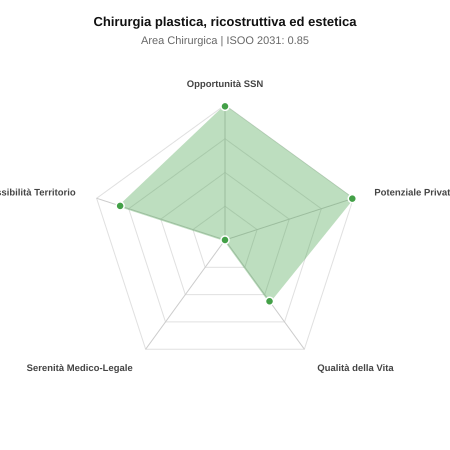

# Scheda di Orientamento: Chirurgia plastica, ricostruttiva ed estetica

[← Torna al Report Nazionale](../REPORT_NAZIONALE_MEDCAREER2031.md) | [Guida alla Consultazione](../GUIDA_ALLA_CONSULTAZIONE.md)

---

## 1. Profilo di Sintesi (Coorte SSM 2026–2031)

| Parametro | Valore / Dettaglio |
| :--- | :--- |
| **Area Disciplinare** | Chirurgica |
| **Durata del Corso** | 5 anni |
| **Semaforo di Occupabilità al 2031** | 🟢 **VERDE CHIARO (Equilibrio Fisiologico / Buona Occupabilità)** |
| **Verdetto di Carriera** | **Equilibrio Fisiologico** |
| **Indice ISOO Nazionale (Baseline)** | **0.85** (Range Scenari: 0.72 – 0.96) |
| **Probabilità Assunzione Concorso SSN** | **99.0%** |
| **Qualità della Vita (QoL Score)** | **56 / 100** |
| **Redditività Lorda Annua Stimata (REP)**| **~146,700 €** (Netto stimato: ~80,700 €) |

### Inquadramento Clinico e Prospettiva Occupazionale
Ricostruzione tessutale post-oncologica e post-traumatica (mammella, arti, testa-collo), chirurgia delle ustioni, malformazioni e chirurgia estetica morfofunzionale.

> [!NOTE]
> **Prospettiva al 2031 per chi entra a novembre 2026**:
> Buon bilanciamento tra uscite e nuovi specialisti; accesso regolare al SSN tramite concorso e spazio nel settore convenzionato.

---

## 2. Flusso Formativo e Ricambio Generazionale

I dati ministeriali (MUR / MEF / ANAAO) evidenziano la seguente dinamica di ricambio della forza lavoro per il quinquennio 2026–2031:

- **Contratti annui stimati (media 2024-2026)**: 110 borse/anno
- **Totale contratti stanziati nel quinquennio**: 550
- **Tasso fisiologico di abbandono / riassegnazione**: 1.0%
- **Nuovi specialisti effettivi al 2031**: 544 medici formati
- **Specialisti SSN attivi censiti a inizio periodo**: 700
- **Uscite stimate per pensionamento (2026–2031)**: 266 dirigenti medici
- **Uscite per dimissioni volontarie / passaggio al privato**: 70 dirigenti medici
- **Fabbisogno netto di rimpiazzo SSN (con fattore demografico)**: 335 posti

---

## 3. Analisi Comparativa Multi-Scenario al 2031

Il modello Stock-Flow a 5 anni simula la convergenza tra domanda e offerta al momento del conseguimento del titolo specialistico sotto 3 differenti assetti normativi ed economici:

| Indicatore Occupazionale | Scenario 1: Baseline Inerziale | Scenario 2: Pletora Grave (Worst) | Scenario 3: Riforma Correttiva (Best) |
| :--- | :---: | :---: | :---: |
| **Uscite Totali SSN (Pensionamenti + Esodo)** | 336 | 276 | 383 |
| **Fabbisogno Netto Stimato SSN** | 335 | 275 | 382 |
| **Nuovi Diplomati Effettivi** | 544 | 572 | 463 |
| **Saldo Netto SSN (Nuovi - Fabbisogno)** | **+209** | **+297** | **+81** |
| **Indice ISOO (Offerta / Domanda Totale)** | **0.85** | **0.96** | **0.72** |
| **Probabilità Assunzione Concorso SSN** | **99.0%** | **78.6%** | **99.0%** |
| **Verdetto Scenario** | Equilibrio Fisiologico | Equilibrio Fisiologico | Carenza Severa (Assunzione Immediata) |

---

## 4. Quadro Territoriale: Domanda e Offerta nelle 21 Regioni e P.A.

La tabella seguente illustra la proiezione occupazionale al 2031 (Scenario Baseline) per ciascuna Regione e Provincia Autonoma, ordinata dal territorio con **maggior fabbisogno non coperto** a quello più saturo:

| Regione / P.A. | Medici Attivi 2026 | Uscite Totali SSN | Nuovi Assegnati | Saldo Netto 2031 | ISOO Reg. | Semaforo |
| :--- | :---: | :---: | :---: | :---: | :---: | :---: |
| Valle d'Aosta | 1 | 0 | 0 | 0 | 2.00 | 🔴 |
| P.A. Trento | 7 | 4 | 5 | +1 | 0.71 | 🟢 |
| Abruzzo | 15 | 8 | 10 | +2 | 0.71 | 🟢 |
| Basilicata | 6 | 3 | 5 | +2 | 0.83 | 🟢 |
| P.A. Bolzano | 6 | 3 | 5 | +2 | 0.83 | 🟢 |
| Molise | 3 | 1 | 5 | +4 | 1.25 | 🟠 |
| Calabria | 22 | 11 | 15 | +4 | 0.79 | 🟢 |
| Friuli-Venezia Giulia | 14 | 6 | 10 | +4 | 0.83 | 🟢 |
| Umbria | 10 | 5 | 10 | +5 | 0.91 | 🟢 |
| Liguria | 18 | 9 | 15 | +6 | 0.88 | 🟢 |
| Marche | 18 | 9 | 15 | +6 | 0.88 | 🟢 |
| Sardegna | 18 | 9 | 15 | +6 | 0.88 | 🟢 |
| Puglia | 46 | 22 | 35 | +13 | 0.85 | 🟢 |
| Toscana | 43 | 20 | 35 | +15 | 0.90 | 🟢 |
| Emilia-Romagna | 53 | 25 | 40 | +15 | 0.85 | 🟢 |
| Piemonte | 51 | 24 | 40 | +16 | 0.87 | 🟢 |
| Sicilia | 57 | 29 | 45 | +16 | 0.83 | 🟢 |
| Veneto | 58 | 27 | 45 | +18 | 0.86 | 🟢 |
| Campania | 66 | 32 | 50 | +18 | 0.83 | 🟢 |
| Lazio | 68 | 33 | 54 | +21 | 0.86 | 🟢 |
| Lombardia | 120 | 55 | 94 | +39 | 0.88 | 🟢 |

> [!TIP]
> **Dinamica Geografica**:
> Le regioni in verde presentano carenza strutturale con concorsi che si prevedono aperti e con elevata probabilita di vincita immediata. Nei territori contrassegnati in rosso, il numero di nuovi specialisti supera il ricambio fisiologico ospedaliero, rendendo necessaria una pianificazione extra-regionale o uno sbocco nella medicina privata.

---

## 5. Scorecard: Qualità della Vita e Redditività Economica

### Radar Chart Professionale a 5 Dimensioni

### Indicatori di Qualità della Vita (QoL Score: 56/100)
- **Notti di guardia attive medie al mese**: 1.5 turni/mese
- **Reperibilità notturne/festive medie al mese**: 3.0 turni/mese
- **Ore settimanali effettive stimate**: 42 ore (compresi straordinari operativi)
- **Classe di rischio medico-legale**: Classe 5 su 5
- **Indice di Burnout percepito nella disciplina**: 50 / 100

### Scomposizione Redditività Economica Potenziale (REP)
- **Retribuzione Base SSN + Indennità contrattuali stimate**: ~77,300 € lordi/anno
- **Potenziale Libera Professione / Attività intramuraria out-of-pocket**: ~69,400 € lordi/anno
- **Reddito Annuo Lordo Complessivo Stimato**: ~146,700 €
- **Stima Netta Annuale (aliquote IRPEF ordinarie + previdenza ENPAM)**: ~80,700 € netti/anno

---

## 6. Guida Clinico-Strategica per lo Specializzando

### Sub-Specializzazioni ad Alto Valore Aggiunto
Per differenziarsi sul mercato e acquisire una solida barriera all'ingresso professionale, si consiglia di costruire competenze nelle seguenti sotto-branche durante la scuola:
- **Microchirurgia ricostruttiva mammaria (lembo DIEP, PAP) post-mastectomia**
- **Chirurgia plastica post-bariatrica (body contouring)**
- **Chirurgia estetica avanzata del volto e del corpo (rinoplastica, lifting)**
- **Trattamento avanzato ferite difficili, ulcere e grandi ustioni**

### Competenze Tecniche e Strumentali Raccomandate
Abilità pratiche da padroneggiare prima del diploma specialistico per massimizzare l'autonomia clinica:
- **Dissezione lembi peduncolati e liberi microvascolari**
- **Lipofilling e trapianto di tessuto adiposo purificato**
- **Innesti cutanei a spessore parziale/totale e sostituti dermici**
- **Laser dermatologici e iniettabili (tossina botulinica, filler)**

### Sbocchi nel Mercato del Lavoro
Posizioni SSN limitate a Breast Unit e centri traumi; potenziale economico nella libera professione pura ai vertici assoluti (REP tra le piu alte in Italia).

### Strategia Territoriale e Mobilità
Libera professione capillare in tutta Italia con tariffe al massimo nei capoluoghi del Centro-Nord e grandi citta.

### Gestione del Rischio Professionale e Work-Life Balance
Rischio medico-legale medio-alto (Classe 3-4) per aspettative estetiche. Qualita della vita eccellente nella pratica privata (zero notti, weekend liberi).

---
[← Torna al Report Nazionale](../REPORT_NAZIONALE_MEDCAREER2031.md) | [Guida alla Consultazione](../GUIDA_ALLA_CONSULTAZIONE.md)
