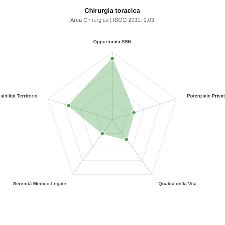

# Scheda di Orientamento: Chirurgia toracica

[← Torna al Report Nazionale](../REPORT_NAZIONALE_MEDCAREER2031.md) | [Guida alla Consultazione](../GUIDA_ALLA_CONSULTAZIONE.md)

---

## 1. Profilo di Sintesi (Coorte SSM 2026–2031)

| Parametro | Valore / Dettaglio |
| :--- | :--- |
| **Area Disciplinare** | Chirurgica |
| **Durata del Corso** | 5 anni |
| **Semaforo di Occupabilità al 2031** | 🟢 **VERDE CHIARO (Equilibrio Fisiologico / Buona Occupabilità)** |
| **Verdetto di Carriera** | **Equilibrio Fisiologico** |
| **Indice ISOO Nazionale (Baseline)** | **1.03** (Range Scenari: 0.84 – 1.26) |
| **Probabilità Assunzione Concorso SSN** | **90.6%** |
| **Qualità della Vita (QoL Score)** | **36 / 100** |
| **Redditività Lorda Annua Stimata (REP)**| **~102,600 €** (Netto stimato: ~56,400 €) |

### Inquadramento Clinico e Prospettiva Occupazionale
Chirurgia delle patologie polmonari, mediastiniche, pleuriche, tracheali e parete toracica, con vocazione oncologica (carcinoma polmonare, mesotelioma).

> [!NOTE]
> **Prospettiva al 2031 per chi entra a novembre 2026**:
> Buon bilanciamento tra uscite e nuovi specialisti; accesso regolare al SSN tramite concorso e spazio nel settore convenzionato.

---

## 2. Flusso Formativo e Ricambio Generazionale

I dati ministeriali (MUR / MEF / ANAAO) evidenziano la seguente dinamica di ricambio della forza lavoro per il quinquennio 2026–2031:

- **Contratti annui stimati (media 2024-2026)**: 90 borse/anno
- **Totale contratti stanziati nel quinquennio**: 450
- **Tasso fisiologico di abbandono / riassegnazione**: 15.0%
- **Nuovi specialisti effettivi al 2031**: 382 medici formati
- **Specialisti SSN attivi censiti a inizio periodo**: 600
- **Uscite stimate per pensionamento (2026–2031)**: 228 dirigenti medici
- **Uscite per dimissioni volontarie / passaggio al privato**: 60 dirigenti medici
- **Fabbisogno netto di rimpiazzo SSN (con fattore demografico)**: 300 posti

---

## 3. Analisi Comparativa Multi-Scenario al 2031

Il modello Stock-Flow a 5 anni simula la convergenza tra domanda e offerta al momento del conseguimento del titolo specialistico sotto 3 differenti assetti normativi ed economici:

| Indicatore Occupazionale | Scenario 1: Baseline Inerziale | Scenario 2: Pletora Grave (Worst) | Scenario 3: Riforma Correttiva (Best) |
| :--- | :---: | :---: | :---: |
| **Uscite Totali SSN (Pensionamenti + Esodo)** | 288 | 236 | 328 |
| **Fabbisogno Netto Stimato SSN** | 300 | 244 | 345 |
| **Nuovi Diplomati Effettivi** | 382 | 402 | 344 |
| **Saldo Netto SSN (Nuovi - Fabbisogno)** | **+82** | **+158** | **-1** |
| **Indice ISOO (Offerta / Domanda Totale)** | **1.03** | **1.26** | **0.84** |
| **Probabilità Assunzione Concorso SSN** | **90.6%** | **70.0%** | **99.0%** |
| **Verdetto Scenario** | Equilibrio Fisiologico | Competitivo / Rischio Saturazione | Equilibrio Fisiologico |

---

## 4. Quadro Territoriale: Domanda e Offerta nelle 21 Regioni e P.A.

La tabella seguente illustra la proiezione occupazionale al 2031 (Scenario Baseline) per ciascuna Regione e Provincia Autonoma, ordinata dal territorio con **maggior fabbisogno non coperto** a quello più saturo:

| Regione / P.A. | Medici Attivi 2026 | Uscite Totali SSN | Nuovi Assegnati | Saldo Netto 2031 | ISOO Reg. | Semaforo |
| :--- | :---: | :---: | :---: | :---: | :---: | :---: |
| Molise | 3 | 1 | 0 | -1 | 0.00 | 🟢 |
| Liguria | 15 | 8 | 8 | 0 | 0.80 | 🟢 |
| Marche | 15 | 8 | 8 | 0 | 0.80 | 🟢 |
| Sardegna | 16 | 8 | 8 | 0 | 0.80 | 🟢 |
| Valle d'Aosta | 1 | 0 | 0 | 0 | 2.00 | 🔴 |
| Umbria | 9 | 4 | 4 | 0 | 0.80 | 🟢 |
| P.A. Trento | 6 | 3 | 4 | +1 | 1.00 | 🟢 |
| P.A. Bolzano | 6 | 3 | 4 | +1 | 1.00 | 🟢 |
| Friuli-Venezia Giulia | 12 | 6 | 8 | +2 | 1.00 | 🟢 |
| Abruzzo | 13 | 6 | 8 | +2 | 1.00 | 🟢 |
| Basilicata | 5 | 2 | 4 | +2 | 1.33 | 🟠 |
| Calabria | 19 | 10 | 13 | +3 | 1.08 | 🟢 |
| Sicilia | 49 | 25 | 30 | +4 | 0.94 | 🟢 |
| Piemonte | 43 | 20 | 26 | +5 | 1.00 | 🟢 |
| Puglia | 39 | 19 | 26 | +6 | 1.04 | 🟢 |
| Veneto | 49 | 23 | 30 | +6 | 1.00 | 🟢 |
| Emilia-Romagna | 46 | 22 | 30 | +7 | 1.03 | 🟢 |
| Toscana | 37 | 18 | 26 | +7 | 1.08 | 🟢 |
| Campania | 57 | 28 | 38 | +8 | 1.03 | 🟢 |
| Lazio | 58 | 28 | 38 | +8 | 1.03 | 🟢 |
| Lombardia | 102 | 47 | 64 | +14 | 1.03 | 🟢 |

> [!TIP]
> **Dinamica Geografica**:
> Le regioni in verde presentano carenza strutturale con concorsi che si prevedono aperti e con elevata probabilita di vincita immediata. Nei territori contrassegnati in rosso, il numero di nuovi specialisti supera il ricambio fisiologico ospedaliero, rendendo necessaria una pianificazione extra-regionale o uno sbocco nella medicina privata.

---

## 5. Scorecard: Qualità della Vita e Redditività Economica

### Radar Chart Professionale a 5 Dimensioni

### Indicatori di Qualità della Vita (QoL Score: 36/100)
- **Notti di guardia attive medie al mese**: 3.5 turni/mese
- **Reperibilità notturne/festive medie al mese**: 4.5 turni/mese
- **Ore settimanali effettive stimate**: 48 ore (compresi straordinari operativi)
- **Classe di rischio medico-legale**: Classe 4 su 5
- **Indice di Burnout percepito nella disciplina**: 70 / 100

### Scomposizione Redditività Economica Potenziale (REP)
- **Retribuzione Base SSN + Indennità contrattuali stimate**: ~78,900 € lordi/anno
- **Potenziale Libera Professione / Attività intramuraria out-of-pocket**: ~23,700 € lordi/anno
- **Reddito Annuo Lordo Complessivo Stimato**: ~102,600 €
- **Stima Netta Annuale (aliquote IRPEF ordinarie + previdenza ENPAM)**: ~56,400 € netti/anno

---

## 6. Guida Clinico-Strategica per lo Specializzando

### Sub-Specializzazioni ad Alto Valore Aggiunto
Per differenziarsi sul mercato e acquisire una solida barriera all'ingresso professionale, si consiglia di costruire competenze nelle seguenti sotto-branche durante la scuola:
- **Chirurgia toracoscopica uniportale (VATS uniportal) e robotica (RATS)**
- **Chirurgia tracheo-bronchiale complessa e resezioni sleeve**
- **Trattamento chirurgico delle deformita toraciche (pectus excavatum)**
- **Trapianto polmonare e trattamento del pneumotorace recidivante**

### Competenze Tecniche e Strumentali Raccomandate
Abilità pratiche da padroneggiare prima del diploma specialistico per massimizzare l'autonomia clinica:
- **Lobectomie, segmentectomie e pneumonectomie toracoscopiche**
- **Broncoscopia rigida con disostruzione laser e stent endotracheali**
- **Linfoadenectomie mediastiniche radicali**
- **Drenaggi toracici ecoguidati e toracoscopia medica**

### Sbocchi nel Mercato del Lavoro
Attivita concentrata in Hub SSN e centri oncologici di riferimento (IRCCS). Turnover fisiologico equilibrato con concorsi selettivi sul curriculum chirurgico pratico.

### Strategia Territoriale e Mobilità
Presenza focalizzata sui policlinici universitari e grandi presidi ospedalieri provinciali con chirurgia ad alta complessita.

### Gestione del Rischio Professionale e Work-Life Balance
Rischio medico-legale elevato (Classe 4) per criticita respiratoria post-operatoria. Guardie e reperibilita ben organizzate, ottimo profilo accademico.

---
[← Torna al Report Nazionale](../REPORT_NAZIONALE_MEDCAREER2031.md) | [Guida alla Consultazione](../GUIDA_ALLA_CONSULTAZIONE.md)
