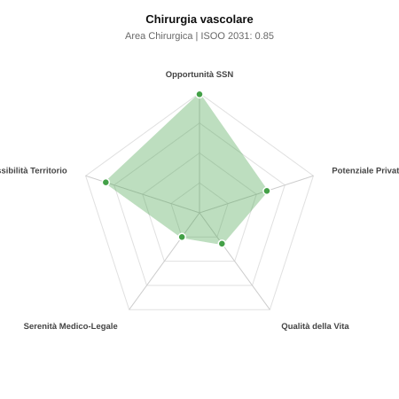

# Scheda di Orientamento: Chirurgia vascolare

[← Torna al Report Nazionale](../REPORT_NAZIONALE_MEDCAREER2031.md) | [Guida alla Consultazione](../GUIDA_ALLA_CONSULTAZIONE.md)

---

## 1. Profilo di Sintesi (Coorte SSM 2026–2031)

| Parametro | Valore / Dettaglio |
| :--- | :--- |
| **Area Disciplinare** | Chirurgica |
| **Durata del Corso** | 5 anni |
| **Semaforo di Occupabilità al 2031** | 🟢 **VERDE CHIARO (Equilibrio Fisiologico / Buona Occupabilità)** |
| **Verdetto di Carriera** | **Equilibrio Fisiologico** |
| **Indice ISOO Nazionale (Baseline)** | **0.85** (Range Scenari: 0.70 – 1.01) |
| **Probabilità Assunzione Concorso SSN** | **99.0%** |
| **Qualità della Vita (QoL Score)** | **32 / 100** |
| **Redditività Lorda Annua Stimata (REP)**| **~120,700 €** (Netto stimato: ~66,400 €) |

### Inquadramento Clinico e Prospettiva Occupazionale
Diagnosi e trattamento chirurgico ed endovascolare delle patologie arteriose (aneurismi, carotidi, arteriopatie periferiche) e venose degli arti e dell addome.

> [!NOTE]
> **Prospettiva al 2031 per chi entra a novembre 2026**:
> Buon bilanciamento tra uscite e nuovi specialisti; accesso regolare al SSN tramite concorso e spazio nel settore convenzionato.

---

## 2. Flusso Formativo e Ricambio Generazionale

I dati ministeriali (MUR / MEF / ANAAO) evidenziano la seguente dinamica di ricambio della forza lavoro per il quinquennio 2026–2031:

- **Contratti annui stimati (media 2024-2026)**: 115 borse/anno
- **Totale contratti stanziati nel quinquennio**: 575
- **Tasso fisiologico di abbandono / riassegnazione**: 8.0%
- **Nuovi specialisti effettivi al 2031**: 529 medici formati
- **Specialisti SSN attivi censiti a inizio periodo**: 900
- **Uscite stimate per pensionamento (2026–2031)**: 342 dirigenti medici
- **Uscite per dimissioni volontarie / passaggio al privato**: 90 dirigenti medici
- **Fabbisogno netto di rimpiazzo SSN (con fattore demografico)**: 450 posti

---

## 3. Analisi Comparativa Multi-Scenario al 2031

Il modello Stock-Flow a 5 anni simula la convergenza tra domanda e offerta al momento del conseguimento del titolo specialistico sotto 3 differenti assetti normativi ed economici:

| Indicatore Occupazionale | Scenario 1: Baseline Inerziale | Scenario 2: Pletora Grave (Worst) | Scenario 3: Riforma Correttiva (Best) |
| :--- | :---: | :---: | :---: |
| **Uscite Totali SSN (Pensionamenti + Esodo)** | 432 | 355 | 492 |
| **Fabbisogno Netto Stimato SSN** | 450 | 367 | 517 |
| **Nuovi Diplomati Effettivi** | 529 | 555 | 476 |
| **Saldo Netto SSN (Nuovi - Fabbisogno)** | **+79** | **+188** | **-41** |
| **Indice ISOO (Offerta / Domanda Totale)** | **0.85** | **1.01** | **0.70** |
| **Probabilità Assunzione Concorso SSN** | **99.0%** | **86.1%** | **99.0%** |
| **Verdetto Scenario** | Equilibrio Fisiologico | Equilibrio Fisiologico | Carenza Severa (Assunzione Immediata) |

---

## 4. Quadro Territoriale: Domanda e Offerta nelle 21 Regioni e P.A.

La tabella seguente illustra la proiezione occupazionale al 2031 (Scenario Baseline) per ciascuna Regione e Provincia Autonoma, ordinata dal territorio con **maggior fabbisogno non coperto** a quello più saturo:

| Regione / P.A. | Medici Attivi 2026 | Uscite Totali SSN | Nuovi Assegnati | Saldo Netto 2031 | ISOO Reg. | Semaforo |
| :--- | :---: | :---: | :---: | :---: | :---: | :---: |
| Valle d'Aosta | 2 | 1 | 0 | -1 | 0.00 | 🟢 |
| Abruzzo | 19 | 9 | 9 | 0 | 0.75 | 🟢 |
| Friuli-Venezia Giulia | 18 | 9 | 9 | 0 | 0.75 | 🟢 |
| Basilicata | 8 | 4 | 5 | +1 | 0.83 | 🟢 |
| P.A. Bolzano | 8 | 4 | 5 | +1 | 0.83 | 🟢 |
| P.A. Trento | 8 | 4 | 5 | +1 | 0.83 | 🟢 |
| Sardegna | 24 | 11 | 14 | +2 | 0.82 | 🟢 |
| Liguria | 23 | 11 | 14 | +3 | 0.88 | 🟢 |
| Molise | 4 | 2 | 5 | +3 | 1.25 | 🟠 |
| Sicilia | 73 | 36 | 41 | +3 | 0.79 | 🟢 |
| Marche | 23 | 11 | 14 | +3 | 0.88 | 🟢 |
| Calabria | 28 | 14 | 18 | +3 | 0.86 | 🟢 |
| Umbria | 13 | 6 | 9 | +3 | 1.00 | 🟢 |
| Toscana | 56 | 27 | 32 | +4 | 0.82 | 🟢 |
| Piemonte | 65 | 31 | 37 | +5 | 0.84 | 🟢 |
| Veneto | 74 | 34 | 41 | +5 | 0.82 | 🟢 |
| Emilia-Romagna | 68 | 33 | 41 | +7 | 0.85 | 🟢 |
| Lazio | 87 | 42 | 51 | +7 | 0.84 | 🟢 |
| Campania | 85 | 40 | 51 | +8 | 0.85 | 🟢 |
| Puglia | 59 | 28 | 37 | +8 | 0.90 | 🟢 |
| Lombardia | 154 | 71 | 92 | +17 | 0.88 | 🟢 |

> [!TIP]
> **Dinamica Geografica**:
> Le regioni in verde presentano carenza strutturale con concorsi che si prevedono aperti e con elevata probabilita di vincita immediata. Nei territori contrassegnati in rosso, il numero di nuovi specialisti supera il ricambio fisiologico ospedaliero, rendendo necessaria una pianificazione extra-regionale o uno sbocco nella medicina privata.

---

## 5. Scorecard: Qualità della Vita e Redditività Economica

### Radar Chart Professionale a 5 Dimensioni

### Indicatori di Qualità della Vita (QoL Score: 32/100)
- **Notti di guardia attive medie al mese**: 4.0 turni/mese
- **Reperibilità notturne/festive medie al mese**: 5.0 turni/mese
- **Ore settimanali effettive stimate**: 48 ore (compresi straordinari operativi)
- **Classe di rischio medico-legale**: Classe 4 su 5
- **Indice di Burnout percepito nella disciplina**: 70 / 100

### Scomposizione Redditività Economica Potenziale (REP)
- **Retribuzione Base SSN + Indennità contrattuali stimate**: ~79,300 € lordi/anno
- **Potenziale Libera Professione / Attività intramuraria out-of-pocket**: ~41,400 € lordi/anno
- **Reddito Annuo Lordo Complessivo Stimato**: ~120,700 €
- **Stima Netta Annuale (aliquote IRPEF ordinarie + previdenza ENPAM)**: ~66,400 € netti/anno

---

## 6. Guida Clinico-Strategica per lo Specializzando

### Sub-Specializzazioni ad Alto Valore Aggiunto
Per differenziarsi sul mercato e acquisire una solida barriera all'ingresso professionale, si consiglia di costruire competenze nelle seguenti sotto-branche durante la scuola:
- **Trattamento endovascolare avanzato aneurismi aortici (EVAR, TEVAR, FEVAR)**
- **Rivascolarizzazione periferica per ischemia critica d arto e piede diabetico**
- **Chirurgia carotidea (endoarteriectomia e stenting carotideo)**
- **Flebologia mininvasiva (laser, radiofrequenza, colle cianoacriliche)**

### Competenze Tecniche e Strumentali Raccomandate
Abilità pratiche da padroneggiare prima del diploma specialistico per massimizzare l'autonomia clinica:
- **Ecocolordoppler vascolare periferico, carotideo e aortico**
- **Tecniche angiografiche ed endovascolari con navigazione fluoroscopica**
- **Bypass arteriosi periferici protesici e venosi**
- **Confezionamento e revisione fistole artero-venose per dialisi**

### Sbocchi nel Mercato del Lavoro
Ottima occupabilita nel SSN per l invecchiamento demografico che incrementa le vasculopatie; solido mercato privato ambulatoriale nella diagnostica Doppler e flebologia.

### Strategia Territoriale e Mobilità
Carenza costante negli ospedali Hub del Centro-Nord; forte richiesta nei centri convenzionati specialistici.

### Gestione del Rischio Professionale e Work-Life Balance
Rischio medico-legale alto (Classe 4) per rischio di ictus perioperatorio carotideo o amputazioni nell ischemia acuta. Reperibilita frequenti per urgenze vascolari.

---
[← Torna al Report Nazionale](../REPORT_NAZIONALE_MEDCAREER2031.md) | [Guida alla Consultazione](../GUIDA_ALLA_CONSULTAZIONE.md)
