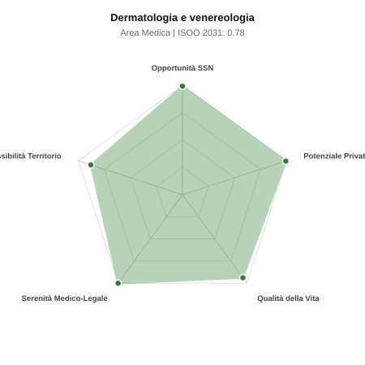

# Scheda di Orientamento: Dermatologia e venereologia

[← Torna al Report Nazionale](../REPORT_NAZIONALE_MEDCAREER2031.md) | [Guida alla Consultazione](../GUIDA_ALLA_CONSULTAZIONE.md)

---

## 1. Profilo di Sintesi (Coorte SSM 2026–2031)

| Parametro | Valore / Dettaglio |
| :--- | :--- |
| **Area Disciplinare** | Medica |
| **Durata del Corso** | 4 anni |
| **Semaforo di Occupabilità al 2031** | 🟢 **VERDE SCURO (Carenza Elevata / Assunzione Immediata)** |
| **Verdetto di Carriera** | **Carenza Severa (Assunzione Immediata)** |
| **Indice ISOO Nazionale (Baseline)** | **0.78** (Range Scenari: 0.65 – 0.88) |
| **Probabilità Assunzione Concorso SSN** | **99.0%** |
| **Qualità della Vita (QoL Score)** | **94 / 100** |
| **Redditività Lorda Annua Stimata (REP)**| **~145,400 €** (Netto stimato: ~80,000 €) |

### Inquadramento Clinico e Prospettiva Occupazionale
Diagnosi e terapia medica e chirurgica delle malattie cutanee, annessiali, mucose e MST; prevenzione oncologica del melanoma ed epiteliomi.

> [!NOTE]
> **Prospettiva al 2031 per chi entra a novembre 2026**:
> Posti vacanti diffusi e concorsi spesso deserti; altissima probabilità di assunzione prima del titolo o subito dopo (Decreto Calabria).

---

## 2. Flusso Formativo e Ricambio Generazionale

I dati ministeriali (MUR / MEF / ANAAO) evidenziano la seguente dinamica di ricambio della forza lavoro per il quinquennio 2026–2031:

- **Contratti annui stimati (media 2024-2026)**: 125 borse/anno
- **Totale contratti stanziati nel quinquennio**: 625
- **Tasso fisiologico di abbandono / riassegnazione**: 1.0%
- **Nuovi specialisti effettivi al 2031**: 619 medici formati
- **Specialisti SSN attivi censiti a inizio periodo**: 950
- **Uscite stimate per pensionamento (2026–2031)**: 361 dirigenti medici
- **Uscite per dimissioni volontarie / passaggio al privato**: 95 dirigenti medici
- **Fabbisogno netto di rimpiazzo SSN (con fattore demografico)**: 455 posti

---

## 3. Analisi Comparativa Multi-Scenario al 2031

Il modello Stock-Flow a 5 anni simula la convergenza tra domanda e offerta al momento del conseguimento del titolo specialistico sotto 3 differenti assetti normativi ed economici:

| Indicatore Occupazionale | Scenario 1: Baseline Inerziale | Scenario 2: Pletora Grave (Worst) | Scenario 3: Riforma Correttiva (Best) |
| :--- | :---: | :---: | :---: |
| **Uscite Totali SSN (Pensionamenti + Esodo)** | 456 | 375 | 520 |
| **Fabbisogno Netto Stimato SSN** | 455 | 374 | 518 |
| **Nuovi Diplomati Effettivi** | 619 | 650 | 526 |
| **Saldo Netto SSN (Nuovi - Fabbisogno)** | **+164** | **+276** | **+8** |
| **Indice ISOO (Offerta / Domanda Totale)** | **0.78** | **0.88** | **0.65** |
| **Probabilità Assunzione Concorso SSN** | **99.0%** | **94.1%** | **99.0%** |
| **Verdetto Scenario** | Carenza Severa (Assunzione Immediata) | Equilibrio Fisiologico | Carenza Severa (Assunzione Immediata) |

---

## 4. Quadro Territoriale: Domanda e Offerta nelle 21 Regioni e P.A.

La tabella seguente illustra la proiezione occupazionale al 2031 (Scenario Baseline) per ciascuna Regione e Provincia Autonoma, ordinata dal territorio con **maggior fabbisogno non coperto** a quello più saturo:

| Regione / P.A. | Medici Attivi 2026 | Uscite Totali SSN | Nuovi Assegnati | Saldo Netto 2031 | ISOO Reg. | Semaforo |
| :--- | :---: | :---: | :---: | :---: | :---: | :---: |
| Valle d'Aosta | 2 | 1 | 0 | -1 | 0.00 | 🟢 |
| Basilicata | 8 | 4 | 5 | +1 | 0.71 | 🟢 |
| P.A. Bolzano | 9 | 4 | 5 | +1 | 0.71 | 🟢 |
| P.A. Trento | 9 | 4 | 5 | +1 | 0.71 | 🟢 |
| Sardegna | 25 | 12 | 15 | +3 | 0.75 | 🟢 |
| Liguria | 24 | 12 | 15 | +3 | 0.75 | 🟢 |
| Molise | 5 | 2 | 5 | +3 | 1.00 | 🟢 |
| Marche | 24 | 11 | 15 | +4 | 0.79 | 🟢 |
| Umbria | 14 | 6 | 10 | +4 | 0.83 | 🟢 |
| Calabria | 29 | 15 | 20 | +5 | 0.77 | 🟢 |
| Abruzzo | 20 | 10 | 15 | +5 | 0.83 | 🟢 |
| Friuli-Venezia Giulia | 19 | 9 | 15 | +6 | 0.88 | 🟢 |
| Puglia | 62 | 30 | 40 | +10 | 0.77 | 🟢 |
| Sicilia | 77 | 39 | 50 | +11 | 0.75 | 🟢 |
| Emilia-Romagna | 72 | 34 | 45 | +11 | 0.76 | 🟢 |
| Piemonte | 69 | 33 | 45 | +12 | 0.78 | 🟢 |
| Toscana | 59 | 28 | 40 | +12 | 0.80 | 🟢 |
| Veneto | 78 | 36 | 50 | +14 | 0.78 | 🟢 |
| Lazio | 92 | 44 | 59 | +15 | 0.77 | 🟢 |
| Campania | 90 | 43 | 59 | +16 | 0.78 | 🟢 |
| Lombardia | 162 | 74 | 104 | +30 | 0.79 | 🟢 |

> [!TIP]
> **Dinamica Geografica**:
> Le regioni in verde presentano carenza strutturale con concorsi che si prevedono aperti e con elevata probabilita di vincita immediata. Nei territori contrassegnati in rosso, il numero di nuovi specialisti supera il ricambio fisiologico ospedaliero, rendendo necessaria una pianificazione extra-regionale o uno sbocco nella medicina privata.

---

## 5. Scorecard: Qualità della Vita e Redditività Economica

### Radar Chart Professionale a 5 Dimensioni

### Indicatori di Qualità della Vita (QoL Score: 94/100)
- **Notti di guardia attive medie al mese**: 0.0 turni/mese
- **Reperibilità notturne/festive medie al mese**: 0.5 turni/mese
- **Ore settimanali effettive stimate**: 38 ore (compresi straordinari operativi)
- **Classe di rischio medico-legale**: Classe 1 su 5
- **Indice di Burnout percepito nella disciplina**: 30 / 100

### Scomposizione Redditività Economica Potenziale (REP)
- **Retribuzione Base SSN + Indennità contrattuali stimate**: ~76,000 € lordi/anno
- **Potenziale Libera Professione / Attività intramuraria out-of-pocket**: ~69,400 € lordi/anno
- **Reddito Annuo Lordo Complessivo Stimato**: ~145,400 €
- **Stima Netta Annuale (aliquote IRPEF ordinarie + previdenza ENPAM)**: ~80,000 € netti/anno

---

## 6. Guida Clinico-Strategica per lo Specializzando

### Sub-Specializzazioni ad Alto Valore Aggiunto
Per differenziarsi sul mercato e acquisire una solida barriera all'ingresso professionale, si consiglia di costruire competenze nelle seguenti sotto-branche durante la scuola:
- **Dermatologia oncologica e dermatoscopia digitale in epiluminescenza**
- **Dermatologia infiammatoria e farmaci biologici per psoriasi e dermatite atopica**
- **Chirurgia dermatologica oncologica (chirurgia di Mohs)**
- **Dermatologia estetica, laserterapia e tricologia clinica**

### Competenze Tecniche e Strumentali Raccomandate
Abilità pratiche da padroneggiare prima del diploma specialistico per massimizzare l'autonomia clinica:
- **Epiluminescenza e videodermatoscopia per lesioni pigmentate**
- **Biopsie a punch, curettage e diatermocoagulazione**
- **Asportazione chirurgica epiteliomi con lembi di avanzamento**
- **Applicazione laser ablativi (CO2), vascolari e patch test epicutanei**

### Sbocchi nel Mercato del Lavoro
Posti SSN numericamente ristretti ma compensati dalla totale dominanza e autonomia nella libera professione pura, con saturazione immediata delle agende private.

### Strategia Territoriale e Mobilità
Opportunita private eccezionali su tutto il territorio nazionale con tariffe di prestazione molto elevate.

### Gestione del Rischio Professionale e Work-Life Balance
Rischio medico-legale basso (Classe 2, mancata diagnosi precoce melanoma). Qualita della vita al top assoluto (QoL > 85): niente notti ne reperibilita festive.

---
[← Torna al Report Nazionale](../REPORT_NAZIONALE_MEDCAREER2031.md) | [Guida alla Consultazione](../GUIDA_ALLA_CONSULTAZIONE.md)
