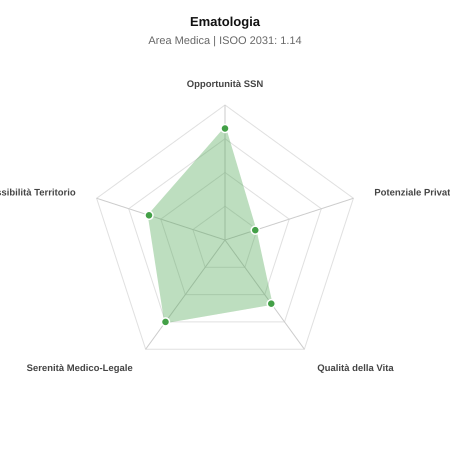

# Scheda di Orientamento: Ematologia

[← Torna al Report Nazionale](../REPORT_NAZIONALE_MEDCAREER2031.md) | [Guida alla Consultazione](../GUIDA_ALLA_CONSULTAZIONE.md)

---

## 1. Profilo di Sintesi (Coorte SSM 2026–2031)

| Parametro | Valore / Dettaglio |
| :--- | :--- |
| **Area Disciplinare** | Medica |
| **Durata del Corso** | 4 anni |
| **Semaforo di Occupabilità al 2031** | 🟢 **VERDE CHIARO (Equilibrio Fisiologico / Buona Occupabilità)** |
| **Verdetto di Carriera** | **Equilibrio Fisiologico** |
| **Indice ISOO Nazionale (Baseline)** | **1.14** (Range Scenari: 0.92 – 1.41) |
| **Probabilità Assunzione Concorso SSN** | **82.6%** |
| **Qualità della Vita (QoL Score)** | **58 / 100** |
| **Redditività Lorda Annua Stimata (REP)**| **~94,600 €** (Netto stimato: ~52,000 €) |

### Inquadramento Clinico e Prospettiva Occupazionale
Diagnosi e cura delle patologie neoplastiche e non neoplastiche del sangue, midollo e organi linfatici: leucemie, linfomi, mielomi, anemie e coagulopatie.

> [!NOTE]
> **Prospettiva al 2031 per chi entra a novembre 2026**:
> Buon bilanciamento tra uscite e nuovi specialisti; accesso regolare al SSN tramite concorso e spazio nel settore convenzionato.

---

## 2. Flusso Formativo e Ricambio Generazionale

I dati ministeriali (MUR / MEF / ANAAO) evidenziano la seguente dinamica di ricambio della forza lavoro per il quinquennio 2026–2031:

- **Contratti annui stimati (media 2024-2026)**: 204 borse/anno
- **Totale contratti stanziati nel quinquennio**: 1,020
- **Tasso fisiologico di abbandono / riassegnazione**: 5.0%
- **Nuovi specialisti effettivi al 2031**: 969 medici formati
- **Specialisti SSN attivi censiti a inizio periodo**: 1,450
- **Uscite stimate per pensionamento (2026–2031)**: 551 dirigenti medici
- **Uscite per dimissioni volontarie / passaggio al privato**: 145 dirigenti medici
- **Fabbisogno netto di rimpiazzo SSN (con fattore demografico)**: 726 posti

---

## 3. Analisi Comparativa Multi-Scenario al 2031

Il modello Stock-Flow a 5 anni simula la convergenza tra domanda e offerta al momento del conseguimento del titolo specialistico sotto 3 differenti assetti normativi ed economici:

| Indicatore Occupazionale | Scenario 1: Baseline Inerziale | Scenario 2: Pletora Grave (Worst) | Scenario 3: Riforma Correttiva (Best) |
| :--- | :---: | :---: | :---: |
| **Uscite Totali SSN (Pensionamenti + Esodo)** | 696 | 571 | 794 |
| **Fabbisogno Netto Stimato SSN** | 726 | 590 | 834 |
| **Nuovi Diplomati Effettivi** | 969 | 1,017 | 872 |
| **Saldo Netto SSN (Nuovi - Fabbisogno)** | **+243** | **+427** | **+38** |
| **Indice ISOO (Offerta / Domanda Totale)** | **1.14** | **1.41** | **0.92** |
| **Probabilità Assunzione Concorso SSN** | **82.6%** | **63.9%** | **99.0%** |
| **Verdetto Scenario** | Equilibrio Fisiologico | Competitivo / Rischio Saturazione | Equilibrio Fisiologico |

---

## 4. Quadro Territoriale: Domanda e Offerta nelle 21 Regioni e P.A.

La tabella seguente illustra la proiezione occupazionale al 2031 (Scenario Baseline) per ciascuna Regione e Provincia Autonoma, ordinata dal territorio con **maggior fabbisogno non coperto** a quello più saturo:

| Regione / P.A. | Medici Attivi 2026 | Uscite Totali SSN | Nuovi Assegnati | Saldo Netto 2031 | ISOO Reg. | Semaforo |
| :--- | :---: | :---: | :---: | :---: | :---: | :---: |
| Valle d'Aosta | 3 | 1 | 0 | -1 | 0.00 | 🟢 |
| Molise | 7 | 4 | 5 | +1 | 1.00 | 🟢 |
| Abruzzo | 31 | 15 | 19 | +3 | 1.00 | 🟢 |
| Liguria | 37 | 19 | 24 | +4 | 1.04 | 🟢 |
| Friuli-Venezia Giulia | 29 | 14 | 19 | +4 | 1.06 | 🟢 |
| P.A. Bolzano | 13 | 6 | 10 | +4 | 1.43 | 🟠 |
| Umbria | 21 | 10 | 14 | +4 | 1.17 | 🟠 |
| Basilicata | 13 | 6 | 10 | +4 | 1.43 | 🟠 |
| P.A. Trento | 13 | 6 | 10 | +4 | 1.43 | 🟠 |
| Calabria | 45 | 22 | 28 | +5 | 1.04 | 🟢 |
| Marche | 36 | 18 | 24 | +5 | 1.09 | 🟢 |
| Sardegna | 38 | 18 | 24 | +5 | 1.09 | 🟢 |
| Puglia | 95 | 46 | 62 | +14 | 1.11 | 🟢 |
| Emilia-Romagna | 110 | 53 | 71 | +16 | 1.11 | 🟢 |
| Toscana | 90 | 43 | 62 | +17 | 1.17 | 🟠 |
| Piemonte | 105 | 50 | 71 | +19 | 1.16 | 🟠 |
| Sicilia | 117 | 59 | 81 | +19 | 1.11 | 🟢 |
| Campania | 137 | 66 | 90 | +20 | 1.10 | 🟢 |
| Veneto | 119 | 55 | 81 | +23 | 1.17 | 🟠 |
| Lazio | 140 | 67 | 95 | +24 | 1.13 | 🟢 |
| Lombardia | 248 | 115 | 166 | +45 | 1.16 | 🟠 |

> [!TIP]
> **Dinamica Geografica**:
> Le regioni in verde presentano carenza strutturale con concorsi che si prevedono aperti e con elevata probabilita di vincita immediata. Nei territori contrassegnati in rosso, il numero di nuovi specialisti supera il ricambio fisiologico ospedaliero, rendendo necessaria una pianificazione extra-regionale o uno sbocco nella medicina privata.

---

## 5. Scorecard: Qualità della Vita e Redditività Economica

### Radar Chart Professionale a 5 Dimensioni

### Indicatori di Qualità della Vita (QoL Score: 58/100)
- **Notti di guardia attive medie al mese**: 2.5 turni/mese
- **Reperibilità notturne/festive medie al mese**: 3.0 turni/mese
- **Ore settimanali effettive stimate**: 44 ore (compresi straordinari operativi)
- **Classe di rischio medico-legale**: Classe 2 su 5
- **Indice di Burnout percepito nella disciplina**: 65 / 100

### Scomposizione Redditività Economica Potenziale (REP)
- **Retribuzione Base SSN + Indennità contrattuali stimate**: ~78,100 € lordi/anno
- **Potenziale Libera Professione / Attività intramuraria out-of-pocket**: ~16,500 € lordi/anno
- **Reddito Annuo Lordo Complessivo Stimato**: ~94,600 €
- **Stima Netta Annuale (aliquote IRPEF ordinarie + previdenza ENPAM)**: ~52,000 € netti/anno

---

## 6. Guida Clinico-Strategica per lo Specializzando

### Sub-Specializzazioni ad Alto Valore Aggiunto
Per differenziarsi sul mercato e acquisire una solida barriera all'ingresso professionale, si consiglia di costruire competenze nelle seguenti sotto-branche durante la scuola:
- **Immunoterapia cellulare e terapie con cellule CAR-T**
- **Trapianto di cellule staminali emopoietiche autologo e allogenico**
- **Ematologia della coagulazione, trombosi ed emostasi patologica**
- **Mielodisplasie e sindromi mieloproliferative croniche**

### Competenze Tecniche e Strumentali Raccomandate
Abilità pratiche da padroneggiare prima del diploma specialistico per massimizzare l'autonomia clinica:
- **Aspirato midollare e biopsia osteomidollare con citochimica**
- **Lettura morfologica striscio ematico periferico e midollare**
- **Citofluorimetria a flusso per tipizzazione cloni neoplastici**
- **Gestione chemioterapie ad alte dosi e inibitori tirosin-chinasici**

### Sbocchi nel Mercato del Lavoro
Assorbimento prevalente nel SSN presso centri oncoematologici e policlinici con trapianto; crescenti opportunita in laboratori e clinical trials farmaceutici.

### Strategia Territoriale e Mobilità
Fabbisogno costante nei centri Hub del Centro-Nord; reclutamento ospedaliero fluido per l alta specializzazione.

### Gestione del Rischio Professionale e Work-Life Balance
Rischio medico-legale medio (Classe 3) per tossicita farmacologica e infezioni opportunistiche severe. Guardie di reparto e reperibilita specialistiche.

---
[← Torna al Report Nazionale](../REPORT_NAZIONALE_MEDCAREER2031.md) | [Guida alla Consultazione](../GUIDA_ALLA_CONSULTAZIONE.md)
