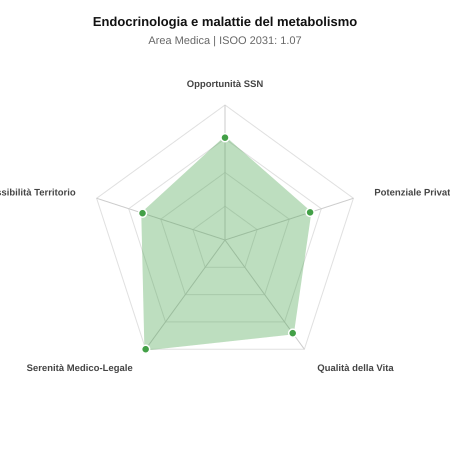

# Scheda di Orientamento: Endocrinologia e malattie del metabolismo

[← Torna al Report Nazionale](../REPORT_NAZIONALE_MEDCAREER2031.md) | [Guida alla Consultazione](../GUIDA_ALLA_CONSULTAZIONE.md)

---

## 1. Profilo di Sintesi (Coorte SSM 2026–2031)

| Parametro | Valore / Dettaglio |
| :--- | :--- |
| **Area Disciplinare** | Medica |
| **Durata del Corso** | 4 anni |
| **Semaforo di Occupabilità al 2031** | 🟢 **VERDE CHIARO (Equilibrio Fisiologico / Buona Occupabilità)** |
| **Verdetto di Carriera** | **Equilibrio Fisiologico** |
| **Indice ISOO Nazionale (Baseline)** | **1.07** (Range Scenari: 0.88 – 1.24) |
| **Probabilità Assunzione Concorso SSN** | **75.8%** |
| **Qualità della Vita (QoL Score)** | **85 / 100** |
| **Redditività Lorda Annua Stimata (REP)**| **~122,900 €** (Netto stimato: ~67,600 €) |

### Inquadramento Clinico e Prospettiva Occupazionale
Diagnosi e terapia delle patologie delle ghiandole endocrine (tiroide, ipofisi, surrene), diabete mellito, dislipidemie, obesita e osteoporosi.

> [!NOTE]
> **Prospettiva al 2031 per chi entra a novembre 2026**:
> Buon bilanciamento tra uscite e nuovi specialisti; accesso regolare al SSN tramite concorso e spazio nel settore convenzionato.

---

## 2. Flusso Formativo e Ricambio Generazionale

I dati ministeriali (MUR / MEF / ANAAO) evidenziano la seguente dinamica di ricambio della forza lavoro per il quinquennio 2026–2031:

- **Contratti annui stimati (media 2024-2026)**: 200 borse/anno
- **Totale contratti stanziati nel quinquennio**: 1,000
- **Tasso fisiologico di abbandono / riassegnazione**: 2.0%
- **Nuovi specialisti effettivi al 2031**: 980 medici formati
- **Specialisti SSN attivi censiti a inizio periodo**: 1,100
- **Uscite stimate per pensionamento (2026–2031)**: 418 dirigenti medici
- **Uscite per dimissioni volontarie / passaggio al privato**: 110 dirigenti medici
- **Fabbisogno netto di rimpiazzo SSN (con fattore demografico)**: 550 posti

---

## 3. Analisi Comparativa Multi-Scenario al 2031

Il modello Stock-Flow a 5 anni simula la convergenza tra domanda e offerta al momento del conseguimento del titolo specialistico sotto 3 differenti assetti normativi ed economici:

| Indicatore Occupazionale | Scenario 1: Baseline Inerziale | Scenario 2: Pletora Grave (Worst) | Scenario 3: Riforma Correttiva (Best) |
| :--- | :---: | :---: | :---: |
| **Uscite Totali SSN (Pensionamenti + Esodo)** | 528 | 433 | 602 |
| **Fabbisogno Netto Stimato SSN** | 550 | 448 | 633 |
| **Nuovi Diplomati Effettivi** | 980 | 1,029 | 833 |
| **Saldo Netto SSN (Nuovi - Fabbisogno)** | **+430** | **+581** | **+200** |
| **Indice ISOO (Offerta / Domanda Totale)** | **1.07** | **1.24** | **0.88** |
| **Probabilità Assunzione Concorso SSN** | **75.8%** | **58.8%** | **99.0%** |
| **Verdetto Scenario** | Equilibrio Fisiologico | Competitivo / Rischio Saturazione | Equilibrio Fisiologico |

---

## 4. Quadro Territoriale: Domanda e Offerta nelle 21 Regioni e P.A.

La tabella seguente illustra la proiezione occupazionale al 2031 (Scenario Baseline) per ciascuna Regione e Provincia Autonoma, ordinata dal territorio con **maggior fabbisogno non coperto** a quello più saturo:

| Regione / P.A. | Medici Attivi 2026 | Uscite Totali SSN | Nuovi Assegnati | Saldo Netto 2031 | ISOO Reg. | Semaforo |
| :--- | :---: | :---: | :---: | :---: | :---: | :---: |
| Valle d'Aosta | 2 | 1 | 0 | -1 | 0.00 | 🟢 |
| Molise | 5 | 2 | 5 | +3 | 1.25 | 🟠 |
| P.A. Bolzano | 10 | 5 | 10 | +5 | 1.11 | 🟢 |
| Basilicata | 10 | 5 | 10 | +5 | 1.11 | 🟢 |
| P.A. Trento | 10 | 5 | 10 | +5 | 1.11 | 🟢 |
| Umbria | 16 | 8 | 15 | +7 | 1.07 | 🟢 |
| Marche | 28 | 14 | 24 | +9 | 1.00 | 🟢 |
| Abruzzo | 24 | 11 | 20 | +9 | 1.11 | 🟢 |
| Sardegna | 29 | 14 | 24 | +9 | 1.00 | 🟢 |
| Liguria | 28 | 14 | 24 | +10 | 1.04 | 🟢 |
| Friuli-Venezia Giulia | 22 | 10 | 20 | +10 | 1.18 | 🟠 |
| Calabria | 34 | 17 | 29 | +11 | 1.00 | 🟢 |
| Toscana | 68 | 33 | 59 | +25 | 1.05 | 🟢 |
| Puglia | 72 | 34 | 64 | +28 | 1.07 | 🟢 |
| Piemonte | 79 | 38 | 69 | +30 | 1.06 | 🟢 |
| Sicilia | 89 | 45 | 78 | +31 | 1.03 | 🟢 |
| Emilia-Romagna | 84 | 40 | 74 | +32 | 1.07 | 🟢 |
| Veneto | 91 | 42 | 78 | +34 | 1.07 | 🟢 |
| Lazio | 107 | 52 | 93 | +38 | 1.03 | 🟢 |
| Campania | 104 | 50 | 93 | +40 | 1.06 | 🟢 |
| Lombardia | 188 | 87 | 167 | +75 | 1.08 | 🟢 |

> [!TIP]
> **Dinamica Geografica**:
> Le regioni in verde presentano carenza strutturale con concorsi che si prevedono aperti e con elevata probabilita di vincita immediata. Nei territori contrassegnati in rosso, il numero di nuovi specialisti supera il ricambio fisiologico ospedaliero, rendendo necessaria una pianificazione extra-regionale o uno sbocco nella medicina privata.

---

## 5. Scorecard: Qualità della Vita e Redditività Economica

### Radar Chart Professionale a 5 Dimensioni

### Indicatori di Qualità della Vita (QoL Score: 85/100)
- **Notti di guardia attive medie al mese**: 0.5 turni/mese
- **Reperibilità notturne/festive medie al mese**: 1.0 turni/mese
- **Ore settimanali effettive stimate**: 40 ore (compresi straordinari operativi)
- **Classe di rischio medico-legale**: Classe 1 su 5
- **Indice di Burnout percepito nella disciplina**: 45 / 100

### Scomposizione Redditività Economica Potenziale (REP)
- **Retribuzione Base SSN + Indennità contrattuali stimate**: ~76,500 € lordi/anno
- **Potenziale Libera Professione / Attività intramuraria out-of-pocket**: ~46,400 € lordi/anno
- **Reddito Annuo Lordo Complessivo Stimato**: ~122,900 €
- **Stima Netta Annuale (aliquote IRPEF ordinarie + previdenza ENPAM)**: ~67,600 € netti/anno

---

## 6. Guida Clinico-Strategica per lo Specializzando

### Sub-Specializzazioni ad Alto Valore Aggiunto
Per differenziarsi sul mercato e acquisire una solida barriera all'ingresso professionale, si consiglia di costruire competenze nelle seguenti sotto-branche durante la scuola:
- **Tiroideologia diagnostica e oncologica avanzata**
- **Tecnologia applicata al diabete (microinfusori, sensori CGM)**
- **Neuroendocrinologia e patologie ipofisarie complesse**
- **Andrologia medica e disfunzioni riproduttive**

### Competenze Tecniche e Strumentali Raccomandate
Abilità pratiche da padroneggiare prima del diploma specialistico per massimizzare l'autonomia clinica:
- **Ecografia tiroidea e paratiroidea ad alta risoluzione con color-Doppler**
- **Agoaspirato tiroideo ecoguidato (FNAC) per esame citologico**
- **Termoablazione con radiofrequenza o laser dei noduli tiroidei**
- **Gestione test dinamici di stimolo e soppressione ormonale**

### Sbocchi nel Mercato del Lavoro
Posti ospedalieri dedicati contenuti (spesso in Medicina Interna); floridissima attivita specialistica ambulatoriale SUMAI e libera professione privata.

### Strategia Territoriale e Mobilità
Altissima richiesta privata su tutto il territorio per la diffusione epidemica di patologie tiroidee, diabete e obesita.

### Gestione del Rischio Professionale e Work-Life Balance
Rischio medico-legale molto basso (Classe 1). Eccellente qualita della vita: orari regolari, assenza di turni notturni (salvo turni di reparto internistico).

---
[← Torna al Report Nazionale](../REPORT_NAZIONALE_MEDCAREER2031.md) | [Guida alla Consultazione](../GUIDA_ALLA_CONSULTAZIONE.md)
