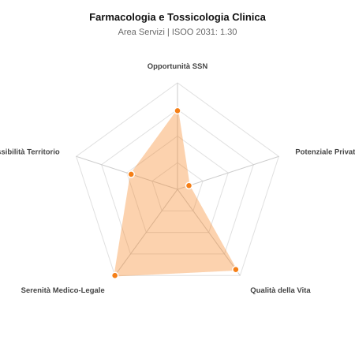

# Scheda di Orientamento: Farmacologia e Tossicologia Clinica

[← Torna al Report Nazionale](../REPORT_NAZIONALE_MEDCAREER2031.md) | [Guida alla Consultazione](../GUIDA_ALLA_CONSULTAZIONE.md)

---

## 1. Profilo di Sintesi (Coorte SSM 2026–2031)

| Parametro | Valore / Dettaglio |
| :--- | :--- |
| **Area Disciplinare** | Servizi |
| **Durata del Corso** | 4 anni |
| **Semaforo di Occupabilità al 2031** | 🟠 **ARANCIONE (Saturazione Moderata / Concorrenza Concorsuale)** |
| **Verdetto di Carriera** | **Competitivo / Rischio Saturazione** |
| **Indice ISOO Nazionale (Baseline)** | **1.30** (Range Scenari: 1.04 – 1.62) |
| **Probabilità Assunzione Concorso SSN** | **73.8%** |
| **Qualità della Vita (QoL Score)** | **93 / 100** |
| **Redditività Lorda Annua Stimata (REP)**| **~83,900 €** (Netto stimato: ~46,200 €) |

### Inquadramento Clinico e Prospettiva Occupazionale
Valutazione uso appropriato ed efficacia dei farmaci, farmacovigilanza, monitoraggio terapeutico (TDM), tossicologia clinica e sperimentazioni cliniche.

> [!NOTE]
> **Prospettiva al 2031 per chi entra a novembre 2026**:
> Graduatorie concorsuali affollate; tempi di attesa per tempo indeterminato SSN mediamente più lunghi; necessario appoggiarsi al privato accreditato.

---

## 2. Flusso Formativo e Ricambio Generazionale

I dati ministeriali (MUR / MEF / ANAAO) evidenziano la seguente dinamica di ricambio della forza lavoro per il quinquennio 2026–2031:

- **Contratti annui stimati (media 2024-2026)**: 105 borse/anno
- **Totale contratti stanziati nel quinquennio**: 525
- **Tasso fisiologico di abbandono / riassegnazione**: 42.0%
- **Nuovi specialisti effettivi al 2031**: 305 medici formati
- **Specialisti SSN attivi censiti a inizio periodo**: 450
- **Uscite stimate per pensionamento (2026–2031)**: 171 dirigenti medici
- **Uscite per dimissioni volontarie / passaggio al privato**: 45 dirigenti medici
- **Fabbisogno netto di rimpiazzo SSN (con fattore demografico)**: 215 posti

---

## 3. Analisi Comparativa Multi-Scenario al 2031

Il modello Stock-Flow a 5 anni simula la convergenza tra domanda e offerta al momento del conseguimento del titolo specialistico sotto 3 differenti assetti normativi ed economici:

| Indicatore Occupazionale | Scenario 1: Baseline Inerziale | Scenario 2: Pletora Grave (Worst) | Scenario 3: Riforma Correttiva (Best) |
| :--- | :---: | :---: | :---: |
| **Uscite Totali SSN (Pensionamenti + Esodo)** | 216 | 177 | 247 |
| **Fabbisogno Netto Stimato SSN** | 215 | 177 | 246 |
| **Nuovi Diplomati Effettivi** | 305 | 320 | 274 |
| **Saldo Netto SSN (Nuovi - Fabbisogno)** | **+90** | **+143** | **+28** |
| **Indice ISOO (Offerta / Domanda Totale)** | **1.30** | **1.62** | **1.04** |
| **Probabilità Assunzione Concorso SSN** | **73.8%** | **57.9%** | **93.9%** |
| **Verdetto Scenario** | Competitivo / Rischio Saturazione | Pletora / Grave Saturazione | Equilibrio Fisiologico |

---

## 4. Quadro Territoriale: Domanda e Offerta nelle 21 Regioni e P.A.

La tabella seguente illustra la proiezione occupazionale al 2031 (Scenario Baseline) per ciascuna Regione e Provincia Autonoma, ordinata dal territorio con **maggior fabbisogno non coperto** a quello più saturo:

| Regione / P.A. | Medici Attivi 2026 | Uscite Totali SSN | Nuovi Assegnati | Saldo Netto 2031 | ISOO Reg. | Semaforo |
| :--- | :---: | :---: | :---: | :---: | :---: | :---: |
| Valle d'Aosta | 1 | 0 | 0 | 0 | 2.00 | 🔴 |
| Abruzzo | 10 | 5 | 6 | +1 | 1.20 | 🟠 |
| Basilicata | 4 | 2 | 3 | +1 | 1.50 | 🔴 |
| Calabria | 14 | 7 | 9 | +2 | 1.12 | 🟢 |
| Molise | 2 | 1 | 3 | +2 | 3.00 | 🔴 |
| P.A. Trento | 4 | 1 | 3 | +2 | 3.00 | 🔴 |
| P.A. Bolzano | 4 | 1 | 3 | +2 | 3.00 | 🔴 |
| Friuli-Venezia Giulia | 9 | 4 | 6 | +2 | 1.50 | 🔴 |
| Umbria | 6 | 3 | 6 | +3 | 2.00 | 🔴 |
| Liguria | 12 | 6 | 9 | +3 | 1.29 | 🟠 |
| Sardegna | 12 | 6 | 9 | +3 | 1.29 | 🟠 |
| Marche | 11 | 5 | 9 | +4 | 1.50 | 🔴 |
| Toscana | 28 | 14 | 20 | +6 | 1.33 | 🟠 |
| Puglia | 30 | 14 | 20 | +6 | 1.33 | 🟠 |
| Emilia-Romagna | 34 | 16 | 23 | +7 | 1.35 | 🟠 |
| Lazio | 44 | 21 | 29 | +8 | 1.26 | 🟠 |
| Piemonte | 32 | 15 | 23 | +8 | 1.44 | 🟠 |
| Sicilia | 36 | 18 | 26 | +8 | 1.30 | 🟠 |
| Veneto | 37 | 17 | 26 | +9 | 1.37 | 🟠 |
| Campania | 43 | 20 | 29 | +9 | 1.32 | 🟠 |
| Lombardia | 77 | 36 | 52 | +16 | 1.33 | 🟠 |

> [!TIP]
> **Dinamica Geografica**:
> Le regioni in verde presentano carenza strutturale con concorsi che si prevedono aperti e con elevata probabilita di vincita immediata. Nei territori contrassegnati in rosso, il numero di nuovi specialisti supera il ricambio fisiologico ospedaliero, rendendo necessaria una pianificazione extra-regionale o uno sbocco nella medicina privata.

---

## 5. Scorecard: Qualità della Vita e Redditività Economica

### Radar Chart Professionale a 5 Dimensioni

### Indicatori di Qualità della Vita (QoL Score: 93/100)
- **Notti di guardia attive medie al mese**: 0.0 turni/mese
- **Reperibilità notturne/festive medie al mese**: 0.5 turni/mese
- **Ore settimanali effettive stimate**: 38 ore (compresi straordinari operativi)
- **Classe di rischio medico-legale**: Classe 1 su 5
- **Indice di Burnout percepito nella disciplina**: 35 / 100

### Scomposizione Redditività Economica Potenziale (REP)
- **Retribuzione Base SSN + Indennità contrattuali stimate**: ~76,000 € lordi/anno
- **Potenziale Libera Professione / Attività intramuraria out-of-pocket**: ~7,900 € lordi/anno
- **Reddito Annuo Lordo Complessivo Stimato**: ~83,900 €
- **Stima Netta Annuale (aliquote IRPEF ordinarie + previdenza ENPAM)**: ~46,200 € netti/anno

---

## 6. Guida Clinico-Strategica per lo Specializzando

### Sub-Specializzazioni ad Alto Valore Aggiunto
Per differenziarsi sul mercato e acquisire una solida barriera all'ingresso professionale, si consiglia di costruire competenze nelle seguenti sotto-branche durante la scuola:
- **Farmacogenomica e medicina personalizzata per dosaggio farmaci**
- **Tossicologia d urgenza e gestione avvelenamenti nei Centri Antiveleni (CAV)**
- **Direzione medica e Clinical Research Management in Big Pharma**
- **Farmacoeconomia, HTA e comitati etici per la ricerca**

### Competenze Tecniche e Strumentali Raccomandate
Abilità pratiche da padroneggiare prima del diploma specialistico per massimizzare l'autonomia clinica:
- **Interpretazione dosaggi ematici (TDM) e curve farmacocinetiche**
- **Utilizzo database di farmacovigilanza (EudraVigilance, RNF)**
- **Stesura protocolli di studio clinico secondo Good Clinical Practice (GCP)**
- **Consulenza tossicologica per sostanze d abuso e tossici industriali**

### Sbocchi nel Mercato del Lavoro
Ruoli ospedalieri nei Centri Antiveleni e commissioni terapeutiche; eccezionale sbocco nel settore industriale (Pharma, CRO, AIFA, EMA) con stipendi corporate.

### Strategia Territoriale e Mobilità
Hub farmaceutici concentrati a Milano, Roma e poli biotech regionali. Possibilita di carriera internazionale e smart working diffuso.

### Gestione del Rischio Professionale e Work-Life Balance
Rischio medico-legale minimo (Classe 1). Ottima qualita della vita, assenza di turni notturni routinari (eccetto CAV), flessibilita contrattuale.

---
[← Torna al Report Nazionale](../REPORT_NAZIONALE_MEDCAREER2031.md) | [Guida alla Consultazione](../GUIDA_ALLA_CONSULTAZIONE.md)
