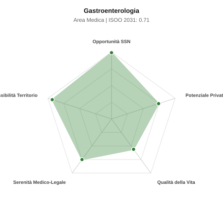

# Scheda di Orientamento: Gastroenterologia

[← Torna al Report Nazionale](../REPORT_NAZIONALE_MEDCAREER2031.md) | [Guida alla Consultazione](../GUIDA_ALLA_CONSULTAZIONE.md)

---

## 1. Profilo di Sintesi (Coorte SSM 2026–2031)

| Parametro | Valore / Dettaglio |
| :--- | :--- |
| **Area Disciplinare** | Medica |
| **Durata del Corso** | 4 anni |
| **Semaforo di Occupabilità al 2031** | 🟢 **VERDE SCURO (Carenza Elevata / Assunzione Immediata)** |
| **Verdetto di Carriera** | **Carenza Severa (Assunzione Immediata)** |
| **Indice ISOO Nazionale (Baseline)** | **0.71** (Range Scenari: 0.57 – 0.84) |
| **Probabilità Assunzione Concorso SSN** | **99.0%** |
| **Qualità della Vita (QoL Score)** | **56 / 100** |
| **Redditività Lorda Annua Stimata (REP)**| **~129,900 €** (Netto stimato: ~71,400 €) |

### Inquadramento Clinico e Prospettiva Occupazionale
Prevenzione, diagnosi e trattamento delle malattie dell apparato digerente, fegato, vie biliari e pancreas, con forte componente interventistica endoscopica.

> [!NOTE]
> **Prospettiva al 2031 per chi entra a novembre 2026**:
> Posti vacanti diffusi e concorsi spesso deserti; altissima probabilità di assunzione prima del titolo o subito dopo (Decreto Calabria).

---

## 2. Flusso Formativo e Ricambio Generazionale

I dati ministeriali (MUR / MEF / ANAAO) evidenziano la seguente dinamica di ricambio della forza lavoro per il quinquennio 2026–2031:

- **Contratti annui stimati (media 2024-2026)**: 206 borse/anno
- **Totale contratti stanziati nel quinquennio**: 1,030
- **Tasso fisiologico di abbandono / riassegnazione**: 2.0%
- **Nuovi specialisti effettivi al 2031**: 1,009 medici formati
- **Specialisti SSN attivi censiti a inizio periodo**: 2,000
- **Uscite stimate per pensionamento (2026–2031)**: 760 dirigenti medici
- **Uscite per dimissioni volontarie / passaggio al privato**: 200 dirigenti medici
- **Fabbisogno netto di rimpiazzo SSN (con fattore demografico)**: 1,001 posti

---

## 3. Analisi Comparativa Multi-Scenario al 2031

Il modello Stock-Flow a 5 anni simula la convergenza tra domanda e offerta al momento del conseguimento del titolo specialistico sotto 3 differenti assetti normativi ed economici:

| Indicatore Occupazionale | Scenario 1: Baseline Inerziale | Scenario 2: Pletora Grave (Worst) | Scenario 3: Riforma Correttiva (Best) |
| :--- | :---: | :---: | :---: |
| **Uscite Totali SSN (Pensionamenti + Esodo)** | 960 | 788 | 1,094 |
| **Fabbisogno Netto Stimato SSN** | 1,001 | 815 | 1,150 |
| **Nuovi Diplomati Effettivi** | 1,009 | 1,060 | 858 |
| **Saldo Netto SSN (Nuovi - Fabbisogno)** | **+8** | **+245** | **-292** |
| **Indice ISOO (Offerta / Domanda Totale)** | **0.71** | **0.84** | **0.57** |
| **Probabilità Assunzione Concorso SSN** | **99.0%** | **99.0%** | **99.0%** |
| **Verdetto Scenario** | Carenza Severa (Assunzione Immediata) | Equilibrio Fisiologico | Carenza Severa (Assunzione Immediata) |

---

## 4. Quadro Territoriale: Domanda e Offerta nelle 21 Regioni e P.A.

La tabella seguente illustra la proiezione occupazionale al 2031 (Scenario Baseline) per ciascuna Regione e Provincia Autonoma, ordinata dal territorio con **maggior fabbisogno non coperto** a quello più saturo:

| Regione / P.A. | Medici Attivi 2026 | Uscite Totali SSN | Nuovi Assegnati | Saldo Netto 2031 | ISOO Reg. | Semaforo |
| :--- | :---: | :---: | :---: | :---: | :---: | :---: |
| Campania | 189 | 91 | 93 | -4 | 0.68 | 🟢 |
| Calabria | 62 | 31 | 29 | -3 | 0.66 | 🟢 |
| Liguria | 51 | 25 | 24 | -2 | 0.67 | 🟢 |
| Sicilia | 162 | 81 | 83 | -2 | 0.70 | 🟢 |
| Sardegna | 53 | 25 | 24 | -2 | 0.67 | 🟢 |
| Valle d'Aosta | 4 | 2 | 0 | -2 | 0.00 | 🟢 |
| Abruzzo | 43 | 20 | 20 | -1 | 0.69 | 🟢 |
| Marche | 50 | 24 | 24 | -1 | 0.69 | 🟢 |
| Friuli-Venezia Giulia | 40 | 19 | 20 | 0 | 0.71 | 🟢 |
| Molise | 10 | 5 | 5 | 0 | 0.71 | 🟢 |
| Umbria | 29 | 14 | 15 | 0 | 0.71 | 🟢 |
| Lazio | 194 | 93 | 98 | 0 | 0.70 | 🟢 |
| P.A. Trento | 19 | 9 | 10 | 0 | 0.71 | 🟢 |
| P.A. Bolzano | 18 | 8 | 10 | +1 | 0.77 | 🟢 |
| Basilicata | 18 | 9 | 10 | +1 | 0.77 | 🟢 |
| Emilia-Romagna | 152 | 73 | 78 | +2 | 0.72 | 🟢 |
| Veneto | 165 | 76 | 83 | +3 | 0.73 | 🟢 |
| Toscana | 124 | 59 | 64 | +3 | 0.73 | 🟢 |
| Piemonte | 144 | 69 | 74 | +3 | 0.72 | 🟢 |
| Puglia | 131 | 63 | 69 | +3 | 0.73 | 🟢 |
| Lombardia | 341 | 157 | 172 | +7 | 0.73 | 🟢 |

> [!TIP]
> **Dinamica Geografica**:
> Le regioni in verde presentano carenza strutturale con concorsi che si prevedono aperti e con elevata probabilita di vincita immediata. Nei territori contrassegnati in rosso, il numero di nuovi specialisti supera il ricambio fisiologico ospedaliero, rendendo necessaria una pianificazione extra-regionale o uno sbocco nella medicina privata.

---

## 5. Scorecard: Qualità della Vita e Redditività Economica

### Radar Chart Professionale a 5 Dimensioni

### Indicatori di Qualità della Vita (QoL Score: 56/100)
- **Notti di guardia attive medie al mese**: 2.5 turni/mese
- **Reperibilità notturne/festive medie al mese**: 3.5 turni/mese
- **Ore settimanali effettive stimate**: 45 ore (compresi straordinari operativi)
- **Classe di rischio medico-legale**: Classe 2 su 5
- **Indice di Burnout percepito nella disciplina**: 60 / 100

### Scomposizione Redditività Economica Potenziale (REP)
- **Retribuzione Base SSN + Indennità contrattuali stimate**: ~78,100 € lordi/anno
- **Potenziale Libera Professione / Attività intramuraria out-of-pocket**: ~51,800 € lordi/anno
- **Reddito Annuo Lordo Complessivo Stimato**: ~129,900 €
- **Stima Netta Annuale (aliquote IRPEF ordinarie + previdenza ENPAM)**: ~71,400 € netti/anno

---

## 6. Guida Clinico-Strategica per lo Specializzando

### Sub-Specializzazioni ad Alto Valore Aggiunto
Per differenziarsi sul mercato e acquisire una solida barriera all'ingresso professionale, si consiglia di costruire competenze nelle seguenti sotto-branche durante la scuola:
- **Endoscopia digestiva diagnostica e operativa avanzata (ERCP, ecoendoscopia)**
- **Epatologia clinica, cirrosi, epatocarcinoma e trapianto epatico**
- **Malattie infiammatorie croniche intestinali (MICI) e biologici**
- **Fisiopatologia digestiva e motilita (manometria HR, pH-impedenziometria)**

### Competenze Tecniche e Strumentali Raccomandate
Abilità pratiche da padroneggiare prima del diploma specialistico per massimizzare l'autonomia clinica:
- **EGDS e colonscopia con polipectomie complesse e mucosectomie (EMR/ESD)**
- **Ecoendoscopia (EUS) con biopsia con ago sottile (FNA/FNB) pancreatica**
- **Posizionamento stent biliari ed enterici, legatura varici esofagee**
- **Ecografia addominale con contrasto (CEUS) ed elastometria epatica**

### Sbocchi nel Mercato del Lavoro
Fortissima richiesta sia negli ospedali pubblici (screening colon-retto e urgenze emorragiche) sia nelle cliniche e studi privati per indagini endoscopiche.

### Strategia Territoriale e Mobilità
Carenza diffusa di endoscopisti in quasi tutte le regioni; ottime opportunita per chi acquisisce autonomia procedurale.

### Gestione del Rischio Professionale e Work-Life Balance
Rischio medico-legale medio-alto (Classe 3-4) per complicanze endoscopiche (perforazioni). Impegno ospedaliero con reperibilita per emorragie acute; ricchi proventi privati.

---
[← Torna al Report Nazionale](../REPORT_NAZIONALE_MEDCAREER2031.md) | [Guida alla Consultazione](../GUIDA_ALLA_CONSULTAZIONE.md)
