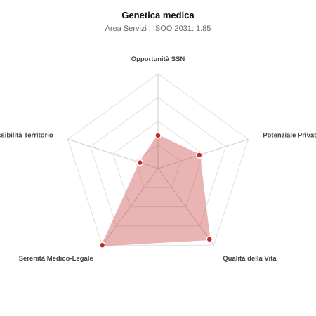

# Scheda di Orientamento: Genetica medica

[← Torna al Report Nazionale](../REPORT_NAZIONALE_MEDCAREER2031.md) | [Guida alla Consultazione](../GUIDA_ALLA_CONSULTAZIONE.md)

---

## 1. Profilo di Sintesi (Coorte SSM 2026–2031)

| Parametro | Valore / Dettaglio |
| :--- | :--- |
| **Area Disciplinare** | Servizi |
| **Durata del Corso** | 4 anni |
| **Semaforo di Occupabilità al 2031** | 🔴 **ROSSO (Rischio Pletora / Elevata Saturazione SSN)** |
| **Verdetto di Carriera** | **Pletora / Grave Saturazione** |
| **Indice ISOO Nazionale (Baseline)** | **1.85** (Range Scenari: 1.57 – 2.09) |
| **Probabilità Assunzione Concorso SSN** | **34.8%** |
| **Qualità della Vita (QoL Score)** | **92 / 100** |
| **Redditività Lorda Annua Stimata (REP)**| **~108,000 €** (Netto stimato: ~59,400 €) |

### Inquadramento Clinico e Prospettiva Occupazionale
Consulenza genetica, diagnosi e gestione clinica delle malattie genetiche rare, anomalie cromosomiche, dismorfologia e sindromi di predisposizione al cancro.

> [!NOTE]
> **Prospettiva al 2031 per chi entra a novembre 2026**:
> Forte esubero di specialisti rispetto alle posizioni ospedaliere disponibili al 2031; altissima concorrenza nei concorsi, sbocco quasi obbligato nella libera professione pura.

---

## 2. Flusso Formativo e Ricambio Generazionale

I dati ministeriali (MUR / MEF / ANAAO) evidenziano la seguente dinamica di ricambio della forza lavoro per il quinquennio 2026–2031:

- **Contratti annui stimati (media 2024-2026)**: 70 borse/anno
- **Totale contratti stanziati nel quinquennio**: 350
- **Tasso fisiologico di abbandono / riassegnazione**: 4.0%
- **Nuovi specialisti effettivi al 2031**: 336 medici formati
- **Specialisti SSN attivi censiti a inizio periodo**: 200
- **Uscite stimate per pensionamento (2026–2031)**: 76 dirigenti medici
- **Uscite per dimissioni volontarie / passaggio al privato**: 20 dirigenti medici
- **Fabbisogno netto di rimpiazzo SSN (con fattore demografico)**: 96 posti

---

## 3. Analisi Comparativa Multi-Scenario al 2031

Il modello Stock-Flow a 5 anni simula la convergenza tra domanda e offerta al momento del conseguimento del titolo specialistico sotto 3 differenti assetti normativi ed economici:

| Indicatore Occupazionale | Scenario 1: Baseline Inerziale | Scenario 2: Pletora Grave (Worst) | Scenario 3: Riforma Correttiva (Best) |
| :--- | :---: | :---: | :---: |
| **Uscite Totali SSN (Pensionamenti + Esodo)** | 96 | 79 | 109 |
| **Fabbisogno Netto Stimato SSN** | 96 | 79 | 109 |
| **Nuovi Diplomati Effettivi** | 336 | 353 | 286 |
| **Saldo Netto SSN (Nuovi - Fabbisogno)** | **+240** | **+274** | **+177** |
| **Indice ISOO (Offerta / Domanda Totale)** | **1.85** | **2.09** | **1.57** |
| **Probabilità Assunzione Concorso SSN** | **34.8%** | **27.3%** | **46.4%** |
| **Verdetto Scenario** | Pletora / Grave Saturazione | Pletora / Grave Saturazione | Pletora / Grave Saturazione |

---

## 4. Quadro Territoriale: Domanda e Offerta nelle 21 Regioni e P.A.

La tabella seguente illustra la proiezione occupazionale al 2031 (Scenario Baseline) per ciascuna Regione e Provincia Autonoma, ordinata dal territorio con **maggior fabbisogno non coperto** a quello più saturo:

| Regione / P.A. | Medici Attivi 2026 | Uscite Totali SSN | Nuovi Assegnati | Saldo Netto 2031 | ISOO Reg. | Semaforo |
| :--- | :---: | :---: | :---: | :---: | :---: | :---: |
| Molise | 1 | 0 | 0 | 0 | 2.00 | 🔴 |
| Valle d'Aosta | 1 | 0 | 0 | 0 | 2.00 | 🔴 |
| Friuli-Venezia Giulia | 4 | 2 | 5 | +3 | 1.67 | 🔴 |
| Basilicata | 2 | 1 | 5 | +4 | 2.50 | 🔴 |
| P.A. Trento | 2 | 1 | 5 | +4 | 2.50 | 🔴 |
| P.A. Bolzano | 2 | 1 | 5 | +4 | 2.50 | 🔴 |
| Umbria | 3 | 1 | 5 | +4 | 2.50 | 🔴 |
| Calabria | 6 | 3 | 10 | +7 | 1.67 | 🔴 |
| Liguria | 5 | 2 | 10 | +8 | 2.00 | 🔴 |
| Sardegna | 5 | 2 | 10 | +8 | 2.00 | 🔴 |
| Marche | 5 | 2 | 10 | +8 | 2.00 | 🔴 |
| Abruzzo | 4 | 2 | 10 | +8 | 2.00 | 🔴 |
| Toscana | 12 | 6 | 19 | +13 | 1.73 | 🔴 |
| Emilia-Romagna | 15 | 8 | 24 | +16 | 1.71 | 🔴 |
| Puglia | 13 | 6 | 24 | +18 | 2.00 | 🔴 |
| Piemonte | 14 | 6 | 24 | +18 | 2.00 | 🔴 |
| Veneto | 16 | 8 | 29 | +21 | 1.93 | 🔴 |
| Sicilia | 16 | 8 | 29 | +21 | 1.93 | 🔴 |
| Campania | 19 | 9 | 34 | +25 | 1.89 | 🔴 |
| Lazio | 19 | 9 | 34 | +25 | 1.89 | 🔴 |
| Lombardia | 34 | 15 | 58 | +43 | 1.93 | 🔴 |

> [!TIP]
> **Dinamica Geografica**:
> Le regioni in verde presentano carenza strutturale con concorsi che si prevedono aperti e con elevata probabilita di vincita immediata. Nei territori contrassegnati in rosso, il numero di nuovi specialisti supera il ricambio fisiologico ospedaliero, rendendo necessaria una pianificazione extra-regionale o uno sbocco nella medicina privata.

---

## 5. Scorecard: Qualità della Vita e Redditività Economica

### Radar Chart Professionale a 5 Dimensioni

### Indicatori di Qualità della Vita (QoL Score: 92/100)
- **Notti di guardia attive medie al mese**: 0.0 turni/mese
- **Reperibilità notturne/festive medie al mese**: 0.5 turni/mese
- **Ore settimanali effettive stimate**: 38 ore (compresi straordinari operativi)
- **Classe di rischio medico-legale**: Classe 1 su 5
- **Indice di Burnout percepito nella disciplina**: 40 / 100

### Scomposizione Redditività Economica Potenziale (REP)
- **Retribuzione Base SSN + Indennità contrattuali stimate**: ~76,000 € lordi/anno
- **Potenziale Libera Professione / Attività intramuraria out-of-pocket**: ~32,000 € lordi/anno
- **Reddito Annuo Lordo Complessivo Stimato**: ~108,000 €
- **Stima Netta Annuale (aliquote IRPEF ordinarie + previdenza ENPAM)**: ~59,400 € netti/anno

---

## 6. Guida Clinico-Strategica per lo Specializzando

### Sub-Specializzazioni ad Alto Valore Aggiunto
Per differenziarsi sul mercato e acquisire una solida barriera all'ingresso professionale, si consiglia di costruire competenze nelle seguenti sotto-branche durante la scuola:
- **Oncogenetica e consulenza per sindromi neoplastiche ereditarie (BRCA, Lynch)**
- **Genomica clinica e interpretazione sequenziamento esoma/genoma (WES/WGS)**
- **Genetica prenatale, preimpianto e diagnosi neonatale precoce**
- **Neurogenetica e malattie metaboliche ereditarie**

### Competenze Tecniche e Strumentali Raccomandate
Abilità pratiche da padroneggiare prima del diploma specialistico per massimizzare l'autonomia clinica:
- **Costruzione e analisi dell albero genealogico clinico multifamiliare**
- **Interpretazione referti cariotipo, array-CGH e varianti NGS (ACMG)**
- **Conduzione consulenze genetiche pre-test e post-test per consenso informato**
- **Utilizzo database genomici (ClinVar, OMIM, gnomAD, DECIPHER)**

### Sbocchi nel Mercato del Lavoro
Posti SSN in centri ospedalieri universitari e laboratori di genetica; forte espansione in laboratori privati di genomica, centri PMA e consulenze oncogenetiche.

### Strategia Territoriale e Mobilità
Attivita clinica nei capoluoghi sede di policlinico; telemedicina e tele-genetica in rapida crescita nazionale.

### Gestione del Rischio Professionale e Work-Life Balance
Rischio medico-legale medio (Classe 2-3) legato a interpretazione varianti incerte (VUS). Qualita della vita eccellente: zero notti, ritmi regolari.

---
[← Torna al Report Nazionale](../REPORT_NAZIONALE_MEDCAREER2031.md) | [Guida alla Consultazione](../GUIDA_ALLA_CONSULTAZIONE.md)
