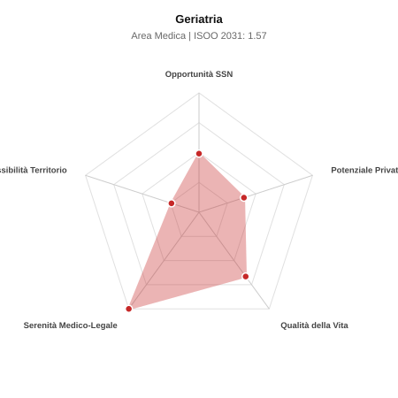

# Scheda di Orientamento: Geriatria

[← Torna al Report Nazionale](../REPORT_NAZIONALE_MEDCAREER2031.md) | [Guida alla Consultazione](../GUIDA_ALLA_CONSULTAZIONE.md)

---

## 1. Profilo di Sintesi (Coorte SSM 2026–2031)

| Parametro | Valore / Dettaglio |
| :--- | :--- |
| **Area Disciplinare** | Medica |
| **Durata del Corso** | 4 anni |
| **Semaforo di Occupabilità al 2031** | 🔴 **ROSSO (Rischio Pletora / Elevata Saturazione SSN)** |
| **Verdetto di Carriera** | **Pletora / Grave Saturazione** |
| **Indice ISOO Nazionale (Baseline)** | **1.57** (Range Scenari: 1.36 – 1.91) |
| **Probabilità Assunzione Concorso SSN** | **49.1%** |
| **Qualità della Vita (QoL Score)** | **66 / 100** |
| **Redditività Lorda Annua Stimata (REP)**| **~106,200 €** (Netto stimato: ~58,400 €) |

### Inquadramento Clinico e Prospettiva Occupazionale
Gestione globale e integrata della salute dell anziano con multimorbidita, fragilita, polifarmacoterapia e declino funzionale/cognitivo.

> [!NOTE]
> **Prospettiva al 2031 per chi entra a novembre 2026**:
> Forte esubero di specialisti rispetto alle posizioni ospedaliere disponibili al 2031; altissima concorrenza nei concorsi, sbocco quasi obbligato nella libera professione pura.

---

## 2. Flusso Formativo e Ricambio Generazionale

I dati ministeriali (MUR / MEF / ANAAO) evidenziano la seguente dinamica di ricambio della forza lavoro per il quinquennio 2026–2031:

- **Contratti annui stimati (media 2024-2026)**: 390 borse/anno
- **Totale contratti stanziati nel quinquennio**: 1,950
- **Tasso fisiologico di abbandono / riassegnazione**: 16.0%
- **Nuovi specialisti effettivi al 2031**: 1,638 medici formati
- **Specialisti SSN attivi censiti a inizio periodo**: 1,350
- **Uscite stimate per pensionamento (2026–2031)**: 513 dirigenti medici
- **Uscite per dimissioni volontarie / passaggio al privato**: 135 dirigenti medici
- **Fabbisogno netto di rimpiazzo SSN (con fattore demografico)**: 679 posti

---

## 3. Analisi Comparativa Multi-Scenario al 2031

Il modello Stock-Flow a 5 anni simula la convergenza tra domanda e offerta al momento del conseguimento del titolo specialistico sotto 3 differenti assetti normativi ed economici:

| Indicatore Occupazionale | Scenario 1: Baseline Inerziale | Scenario 2: Pletora Grave (Worst) | Scenario 3: Riforma Correttiva (Best) |
| :--- | :---: | :---: | :---: |
| **Uscite Totali SSN (Pensionamenti + Esodo)** | 648 | 532 | 738 |
| **Fabbisogno Netto Stimato SSN** | 679 | 519 | 758 |
| **Nuovi Diplomati Effettivi** | 1,638 | 1,720 | 1,474 |
| **Saldo Netto SSN (Nuovi - Fabbisogno)** | **+959** | **+1201** | **+716** |
| **Indice ISOO (Offerta / Domanda Totale)** | **1.57** | **1.91** | **1.36** |
| **Probabilità Assunzione Concorso SSN** | **49.1%** | **35.7%** | **60.9%** |
| **Verdetto Scenario** | Pletora / Grave Saturazione | Pletora / Grave Saturazione | Competitivo / Rischio Saturazione |

---

## 4. Quadro Territoriale: Domanda e Offerta nelle 21 Regioni e P.A.

La tabella seguente illustra la proiezione occupazionale al 2031 (Scenario Baseline) per ciascuna Regione e Provincia Autonoma, ordinata dal territorio con **maggior fabbisogno non coperto** a quello più saturo:

| Regione / P.A. | Medici Attivi 2026 | Uscite Totali SSN | Nuovi Assegnati | Saldo Netto 2031 | ISOO Reg. | Semaforo |
| :--- | :---: | :---: | :---: | :---: | :---: | :---: |
| Valle d'Aosta | 3 | 1 | 4 | +3 | 2.00 | 🔴 |
| Molise | 7 | 4 | 8 | +4 | 1.33 | 🟠 |
| Basilicata | 12 | 6 | 13 | +6 | 1.30 | 🟠 |
| P.A. Trento | 13 | 6 | 17 | +10 | 1.54 | 🔴 |
| P.A. Bolzano | 12 | 5 | 17 | +11 | 1.70 | 🔴 |
| Umbria | 19 | 9 | 25 | +15 | 1.56 | 🔴 |
| Abruzzo | 29 | 14 | 34 | +18 | 1.42 | 🟠 |
| Friuli-Venezia Giulia | 27 | 13 | 34 | +20 | 1.54 | 🔴 |
| Sardegna | 36 | 18 | 42 | +22 | 1.45 | 🟠 |
| Liguria | 35 | 18 | 42 | +22 | 1.45 | 🟠 |
| Marche | 34 | 16 | 42 | +25 | 1.61 | 🔴 |
| Calabria | 42 | 21 | 50 | +26 | 1.43 | 🟠 |
| Toscana | 84 | 40 | 101 | +57 | 1.53 | 🔴 |
| Puglia | 89 | 43 | 109 | +60 | 1.49 | 🔴 |
| Piemonte | 97 | 47 | 118 | +66 | 1.51 | 🔴 |
| Emilia-Romagna | 103 | 49 | 126 | +72 | 1.54 | 🔴 |
| Sicilia | 109 | 54 | 134 | +73 | 1.47 | 🔴 |
| Veneto | 111 | 51 | 134 | +77 | 1.54 | 🔴 |
| Campania | 128 | 62 | 155 | +84 | 1.48 | 🔴 |
| Lazio | 131 | 63 | 160 | +90 | 1.52 | 🔴 |
| Lombardia | 230 | 106 | 281 | +163 | 1.56 | 🔴 |

> [!TIP]
> **Dinamica Geografica**:
> Le regioni in verde presentano carenza strutturale con concorsi che si prevedono aperti e con elevata probabilita di vincita immediata. Nei territori contrassegnati in rosso, il numero di nuovi specialisti supera il ricambio fisiologico ospedaliero, rendendo necessaria una pianificazione extra-regionale o uno sbocco nella medicina privata.

---

## 5. Scorecard: Qualità della Vita e Redditività Economica

### Radar Chart Professionale a 5 Dimensioni

### Indicatori di Qualità della Vita (QoL Score: 66/100)
- **Notti di guardia attive medie al mese**: 3.0 turni/mese
- **Reperibilità notturne/festive medie al mese**: 2.0 turni/mese
- **Ore settimanali effettive stimate**: 42 ore (compresi straordinari operativi)
- **Classe di rischio medico-legale**: Classe 1 su 5
- **Indice di Burnout percepito nella disciplina**: 60 / 100

### Scomposizione Redditività Economica Potenziale (REP)
- **Retribuzione Base SSN + Indennità contrattuali stimate**: ~78,500 € lordi/anno
- **Potenziale Libera Professione / Attività intramuraria out-of-pocket**: ~27,700 € lordi/anno
- **Reddito Annuo Lordo Complessivo Stimato**: ~106,200 €
- **Stima Netta Annuale (aliquote IRPEF ordinarie + previdenza ENPAM)**: ~58,400 € netti/anno

---

## 6. Guida Clinico-Strategica per lo Specializzando

### Sub-Specializzazioni ad Alto Valore Aggiunto
Per differenziarsi sul mercato e acquisire una solida barriera all'ingresso professionale, si consiglia di costruire competenze nelle seguenti sotto-branche durante la scuola:
- **Ortogeriatria e gestione anziano traumatizzato/chirurgico**
- **Psicogeriatria e demenze complesse nei CDCD**
- **Valutazione Multidimensionale Geriatrica (VMD) per Cure Intermedie**
- **Deprescribing clinico e farmacologia geriatrica**

### Competenze Tecniche e Strumentali Raccomandate
Abilità pratiche da padroneggiare prima del diploma specialistico per massimizzare l'autonomia clinica:
- **Somministrazione scale VMD (CGA: CIRS, ADL, IADL, SPPB, MMSE)**
- **Ecografia clinica bedside per scompenso e polmoniti nell anziano**
- **Gestione e titolazione terapie deterioramento cognitivo e disturbi comportamentali**
- **Pianificazione percorsi di dimissione protetta ospedale-territorio**

### Sbocchi nel Mercato del Lavoro
Fabbisogno trainato dal fortissimo invecchiamento demografico. Sbocco eccezionale negli Ospedali di Comunita e Case della Comunita (PNRR / DM 77), e direzioni sanitarie RSA.

### Strategia Territoriale e Mobilità
Richiesta altissima in tutte le regioni con indice di vecchiaia elevato (Liguria, Friuli, Piemonte, Centro Italia).

### Gestione del Rischio Professionale e Work-Life Balance
Rischio medico-legale medio-basso (Classe 2). Intenso nei reparti per acuti, molto sostenibile e gratificante nella riabilitazione e nei CDCD territoriali.

---
[← Torna al Report Nazionale](../REPORT_NAZIONALE_MEDCAREER2031.md) | [Guida alla Consultazione](../GUIDA_ALLA_CONSULTAZIONE.md)
