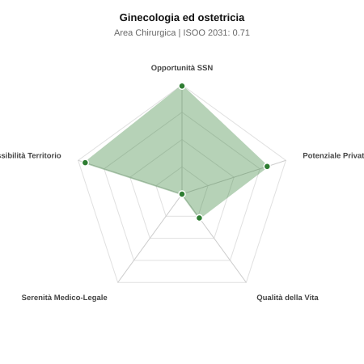

# Scheda di Orientamento: Ginecologia ed ostetricia

[← Torna al Report Nazionale](../REPORT_NAZIONALE_MEDCAREER2031.md) | [Guida alla Consultazione](../GUIDA_ALLA_CONSULTAZIONE.md)

---

## 1. Profilo di Sintesi (Coorte SSM 2026–2031)

| Parametro | Valore / Dettaglio |
| :--- | :--- |
| **Area Disciplinare** | Chirurgica |
| **Durata del Corso** | 5 anni |
| **Semaforo di Occupabilità al 2031** | 🟢 **VERDE SCURO (Carenza Elevata / Assunzione Immediata)** |
| **Verdetto di Carriera** | **Carenza Severa (Assunzione Immediata)** |
| **Indice ISOO Nazionale (Baseline)** | **0.71** (Range Scenari: 0.58 – 0.83) |
| **Probabilità Assunzione Concorso SSN** | **99.0%** |
| **Qualità della Vita (QoL Score)** | **27 / 100** |
| **Redditività Lorda Annua Stimata (REP)**| **~137,200 €** (Netto stimato: ~75,500 €) |

### Inquadramento Clinico e Prospettiva Occupazionale
Assistenza alla gravidanza, parto e puerperio; diagnosi e cura delle patologie dell apparato riproduttivo femminile e della fertilita.

> [!NOTE]
> **Prospettiva al 2031 per chi entra a novembre 2026**:
> Posti vacanti diffusi e concorsi spesso deserti; altissima probabilità di assunzione prima del titolo o subito dopo (Decreto Calabria).

---

## 2. Flusso Formativo e Ricambio Generazionale

I dati ministeriali (MUR / MEF / ANAAO) evidenziano la seguente dinamica di ricambio della forza lavoro per il quinquennio 2026–2031:

- **Contratti annui stimati (media 2024-2026)**: 525 borse/anno
- **Totale contratti stanziati nel quinquennio**: 2,625
- **Tasso fisiologico di abbandono / riassegnazione**: 4.0%
- **Nuovi specialisti effettivi al 2031**: 2,520 medici formati
- **Specialisti SSN attivi censiti a inizio periodo**: 5,000
- **Uscite stimate per pensionamento (2026–2031)**: 1,900 dirigenti medici
- **Uscite per dimissioni volontarie / passaggio al privato**: 500 dirigenti medici
- **Fabbisogno netto di rimpiazzo SSN (con fattore demografico)**: 2,394 posti

---

## 3. Analisi Comparativa Multi-Scenario al 2031

Il modello Stock-Flow a 5 anni simula la convergenza tra domanda e offerta al momento del conseguimento del titolo specialistico sotto 3 differenti assetti normativi ed economici:

| Indicatore Occupazionale | Scenario 1: Baseline Inerziale | Scenario 2: Pletora Grave (Worst) | Scenario 3: Riforma Correttiva (Best) |
| :--- | :---: | :---: | :---: |
| **Uscite Totali SSN (Pensionamenti + Esodo)** | 2,400 | 1,970 | 2,735 |
| **Fabbisogno Netto Stimato SSN** | 2,394 | 1,966 | 2,727 |
| **Nuovi Diplomati Effettivi** | 2,520 | 2,646 | 2,142 |
| **Saldo Netto SSN (Nuovi - Fabbisogno)** | **+126** | **+680** | **-585** |
| **Indice ISOO (Offerta / Domanda Totale)** | **0.71** | **0.83** | **0.58** |
| **Probabilità Assunzione Concorso SSN** | **99.0%** | **99.0%** | **99.0%** |
| **Verdetto Scenario** | Carenza Severa (Assunzione Immediata) | Equilibrio Fisiologico | Carenza Severa (Assunzione Immediata) |

---

## 4. Quadro Territoriale: Domanda e Offerta nelle 21 Regioni e P.A.

La tabella seguente illustra la proiezione occupazionale al 2031 (Scenario Baseline) per ciascuna Regione e Provincia Autonoma, ordinata dal territorio con **maggior fabbisogno non coperto** a quello più saturo:

| Regione / P.A. | Medici Attivi 2026 | Uscite Totali SSN | Nuovi Assegnati | Saldo Netto 2031 | ISOO Reg. | Semaforo |
| :--- | :---: | :---: | :---: | :---: | :---: | :---: |
| Liguria | 128 | 64 | 62 | -2 | 0.67 | 🟢 |
| Calabria | 155 | 78 | 77 | 0 | 0.69 | 🟢 |
| Valle d'Aosta | 10 | 5 | 5 | 0 | 0.71 | 🟢 |
| Abruzzo | 107 | 52 | 53 | +1 | 0.70 | 🟢 |
| Marche | 126 | 61 | 62 | +1 | 0.70 | 🟢 |
| Molise | 24 | 12 | 14 | +2 | 0.78 | 🟢 |
| P.A. Bolzano | 46 | 22 | 24 | +2 | 0.73 | 🟢 |
| Basilicata | 45 | 22 | 24 | +2 | 0.73 | 🟢 |
| P.A. Trento | 47 | 22 | 24 | +2 | 0.73 | 🟢 |
| Umbria | 72 | 34 | 38 | +4 | 0.74 | 🟢 |
| Friuli-Venezia Giulia | 101 | 48 | 53 | +5 | 0.74 | 🟢 |
| Sardegna | 132 | 63 | 67 | +5 | 0.72 | 🟢 |
| Sicilia | 405 | 202 | 206 | +6 | 0.70 | 🟢 |
| Puglia | 328 | 158 | 163 | +7 | 0.71 | 🟢 |
| Emilia-Romagna | 380 | 182 | 192 | +9 | 0.71 | 🟢 |
| Piemonte | 361 | 173 | 182 | +9 | 0.71 | 🟢 |
| Toscana | 310 | 149 | 158 | +9 | 0.71 | 🟢 |
| Lazio | 484 | 232 | 245 | +13 | 0.71 | 🟢 |
| Veneto | 412 | 190 | 206 | +16 | 0.72 | 🟢 |
| Campania | 472 | 226 | 240 | +16 | 0.72 | 🟢 |
| Lombardia | 854 | 393 | 432 | +37 | 0.73 | 🟢 |

> [!TIP]
> **Dinamica Geografica**:
> Le regioni in verde presentano carenza strutturale con concorsi che si prevedono aperti e con elevata probabilita di vincita immediata. Nei territori contrassegnati in rosso, il numero di nuovi specialisti supera il ricambio fisiologico ospedaliero, rendendo necessaria una pianificazione extra-regionale o uno sbocco nella medicina privata.

---

## 5. Scorecard: Qualità della Vita e Redditività Economica

### Radar Chart Professionale a 5 Dimensioni

### Indicatori di Qualità della Vita (QoL Score: 27/100)
- **Notti di guardia attive medie al mese**: 4.5 turni/mese
- **Reperibilità notturne/festive medie al mese**: 4.5 turni/mese
- **Ore settimanali effettive stimate**: 48 ore (compresi straordinari operativi)
- **Classe di rischio medico-legale**: Classe 5 su 5
- **Indice di Burnout percepito nella disciplina**: 75 / 100

### Scomposizione Redditività Economica Potenziale (REP)
- **Retribuzione Base SSN + Indennità contrattuali stimate**: ~79,800 € lordi/anno
- **Potenziale Libera Professione / Attività intramuraria out-of-pocket**: ~57,400 € lordi/anno
- **Reddito Annuo Lordo Complessivo Stimato**: ~137,200 €
- **Stima Netta Annuale (aliquote IRPEF ordinarie + previdenza ENPAM)**: ~75,500 € netti/anno

---

## 6. Guida Clinico-Strategica per lo Specializzando

### Sub-Specializzazioni ad Alto Valore Aggiunto
Per differenziarsi sul mercato e acquisire una solida barriera all'ingresso professionale, si consiglia di costruire competenze nelle seguenti sotto-branche durante la scuola:
- **Medicina prenatale, ecografia morfologica di II livello e diagnosi invasiva**
- **Oncologia ginecologica chirurgica avanzata e chemioterapia**
- **Chirurgia mininvasiva laparoscopica e isteroscopica per endometriosi e miomi**
- **Fisiopatologia della riproduzione umana e procreazione medicalmente assistita (PMA)**

### Competenze Tecniche e Strumentali Raccomandate
Abilità pratiche da padroneggiare prima del diploma specialistico per massimizzare l'autonomia clinica:
- **Gestione travaglio di parto, cardiotocografia intrapartum e taglio cesareo**
- **Ecografia ginecologica 3D e pelvica transvaginale; ecografia ostetrica accreditata**
- **Isteroscopia diagnostica e operativa ambulatoriale (Office Hysteroscopy)**
- **Laparoscopia pelvica per annessiectomie, miomectomie e isterectomie**

### Sbocchi nel Mercato del Lavoro
Forte richiesta nei concorsi SSN per la fuga di specialisti verso la libera professione; mercato privato straordinariamente redditizio (visite, ecografie, PMA, parti privati).

### Strategia Territoriale e Mobilità
Carenza acuta di personale di sala parto negli ospedali pubblici; fiorente libera professione in ogni distretto.

### Gestione del Rischio Professionale e Work-Life Balance
Rischio medico-legale tra i piu elevati (Classe 5, premi assicurativi alti per sinistri perinatali). Turni notturni e festivi pesanti nei punti nascita.

---
[← Torna al Report Nazionale](../REPORT_NAZIONALE_MEDCAREER2031.md) | [Guida alla Consultazione](../GUIDA_ALLA_CONSULTAZIONE.md)
