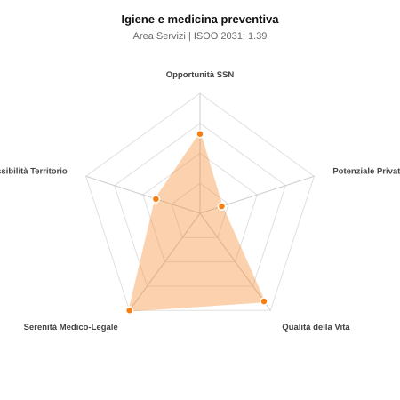

# Scheda di Orientamento: Igiene e medicina preventiva

[← Torna al Report Nazionale](../REPORT_NAZIONALE_MEDCAREER2031.md) | [Guida alla Consultazione](../GUIDA_ALLA_CONSULTAZIONE.md)

---

## 1. Profilo di Sintesi (Coorte SSM 2026–2031)

| Parametro | Valore / Dettaglio |
| :--- | :--- |
| **Area Disciplinare** | Servizi |
| **Durata del Corso** | 4 anni |
| **Semaforo di Occupabilità al 2031** | 🟠 **ARANCIONE (Saturazione Moderata / Concorrenza Concorsuale)** |
| **Verdetto di Carriera** | **Competitivo / Rischio Saturazione** |
| **Indice ISOO Nazionale (Baseline)** | **1.39** (Range Scenari: 1.16 – 1.81) |
| **Probabilità Assunzione Concorso SSN** | **66.1%** |
| **Qualità della Vita (QoL Score)** | **91 / 100** |
| **Redditività Lorda Annua Stimata (REP)**| **~89,300 €** (Netto stimato: ~49,100 €) |

### Inquadramento Clinico e Prospettiva Occupazionale
Tutela e promozione della salute collettiva, epidemiologia, direzione e organizzazione dei servizi sanitari, igiene ospedaliera, profilassi vaccinale e prevenzione ambientale.

> [!NOTE]
> **Prospettiva al 2031 per chi entra a novembre 2026**:
> Graduatorie concorsuali affollate; tempi di attesa per tempo indeterminato SSN mediamente più lunghi; necessario appoggiarsi al privato accreditato.

---

## 2. Flusso Formativo e Ricambio Generazionale

I dati ministeriali (MUR / MEF / ANAAO) evidenziano la seguente dinamica di ricambio della forza lavoro per il quinquennio 2026–2031:

- **Contratti annui stimati (media 2024-2026)**: 560 borse/anno
- **Totale contratti stanziati nel quinquennio**: 2,800
- **Tasso fisiologico di abbandono / riassegnazione**: 12.0%
- **Nuovi specialisti effettivi al 2031**: 2,464 medici formati
- **Specialisti SSN attivi censiti a inizio periodo**: 3,000
- **Uscite stimate per pensionamento (2026–2031)**: 1,140 dirigenti medici
- **Uscite per dimissioni volontarie / passaggio al privato**: 300 dirigenti medici
- **Fabbisogno netto di rimpiazzo SSN (con fattore demografico)**: 1,508 posti

---

## 3. Analisi Comparativa Multi-Scenario al 2031

Il modello Stock-Flow a 5 anni simula la convergenza tra domanda e offerta al momento del conseguimento del titolo specialistico sotto 3 differenti assetti normativi ed economici:

| Indicatore Occupazionale | Scenario 1: Baseline Inerziale | Scenario 2: Pletora Grave (Worst) | Scenario 3: Riforma Correttiva (Best) |
| :--- | :---: | :---: | :---: |
| **Uscite Totali SSN (Pensionamenti + Esodo)** | 1,440 | 1,182 | 1,641 |
| **Fabbisogno Netto Stimato SSN** | 1,508 | 1,153 | 1,685 |
| **Nuovi Diplomati Effettivi** | 2,464 | 2,587 | 2,218 |
| **Saldo Netto SSN (Nuovi - Fabbisogno)** | **+956** | **+1434** | **+533** |
| **Indice ISOO (Offerta / Domanda Totale)** | **1.39** | **1.81** | **1.16** |
| **Probabilità Assunzione Concorso SSN** | **66.1%** | **48.2%** | **82.1%** |
| **Verdetto Scenario** | Competitivo / Rischio Saturazione | Pletora / Grave Saturazione | Competitivo / Rischio Saturazione |

---

## 4. Quadro Territoriale: Domanda e Offerta nelle 21 Regioni e P.A.

La tabella seguente illustra la proiezione occupazionale al 2031 (Scenario Baseline) per ciascuna Regione e Provincia Autonoma, ordinata dal territorio con **maggior fabbisogno non coperto** a quello più saturo:

| Regione / P.A. | Medici Attivi 2026 | Uscite Totali SSN | Nuovi Assegnati | Saldo Netto 2031 | ISOO Reg. | Semaforo |
| :--- | :---: | :---: | :---: | :---: | :---: | :---: |
| Valle d'Aosta | 6 | 3 | 4 | +1 | 1.33 | 🟠 |
| Molise | 15 | 8 | 13 | +5 | 1.44 | 🟠 |
| P.A. Bolzano | 28 | 13 | 22 | +8 | 1.38 | 🟠 |
| Basilicata | 27 | 14 | 22 | +8 | 1.38 | 🟠 |
| P.A. Trento | 28 | 13 | 22 | +8 | 1.38 | 🟠 |
| Umbria | 43 | 20 | 35 | +14 | 1.40 | 🟠 |
| Friuli-Venezia Giulia | 61 | 29 | 48 | +18 | 1.37 | 🟠 |
| Liguria | 77 | 39 | 62 | +21 | 1.29 | 🟠 |
| Abruzzo | 64 | 30 | 53 | +22 | 1.43 | 🟠 |
| Marche | 75 | 36 | 62 | +24 | 1.38 | 🟠 |
| Calabria | 93 | 46 | 75 | +27 | 1.34 | 🟠 |
| Sardegna | 79 | 38 | 66 | +27 | 1.44 | 🟠 |
| Toscana | 186 | 90 | 154 | +60 | 1.40 | 🟠 |
| Puglia | 197 | 95 | 163 | +64 | 1.41 | 🟠 |
| Piemonte | 217 | 104 | 176 | +67 | 1.38 | 🟠 |
| Sicilia | 243 | 121 | 198 | +72 | 1.35 | 🟠 |
| Emilia-Romagna | 228 | 110 | 189 | +73 | 1.39 | 🟠 |
| Veneto | 247 | 114 | 202 | +82 | 1.43 | 🟠 |
| Campania | 283 | 136 | 233 | +91 | 1.40 | 🟠 |
| Lazio | 291 | 140 | 238 | +91 | 1.38 | 🟠 |
| Lombardia | 512 | 236 | 422 | +173 | 1.44 | 🟠 |

> [!TIP]
> **Dinamica Geografica**:
> Le regioni in verde presentano carenza strutturale con concorsi che si prevedono aperti e con elevata probabilita di vincita immediata. Nei territori contrassegnati in rosso, il numero di nuovi specialisti supera il ricambio fisiologico ospedaliero, rendendo necessaria una pianificazione extra-regionale o uno sbocco nella medicina privata.

---

## 5. Scorecard: Qualità della Vita e Redditività Economica

### Radar Chart Professionale a 5 Dimensioni

### Indicatori di Qualità della Vita (QoL Score: 91/100)
- **Notti di guardia attive medie al mese**: 0.0 turni/mese
- **Reperibilità notturne/festive medie al mese**: 1.0 turni/mese
- **Ore settimanali effettive stimate**: 38 ore (compresi straordinari operativi)
- **Classe di rischio medico-legale**: Classe 1 su 5
- **Indice di Burnout percepito nella disciplina**: 40 / 100

### Scomposizione Redditività Economica Potenziale (REP)
- **Retribuzione Base SSN + Indennità contrattuali stimate**: ~76,000 € lordi/anno
- **Potenziale Libera Professione / Attività intramuraria out-of-pocket**: ~13,300 € lordi/anno
- **Reddito Annuo Lordo Complessivo Stimato**: ~89,300 €
- **Stima Netta Annuale (aliquote IRPEF ordinarie + previdenza ENPAM)**: ~49,100 € netti/anno

---

## 6. Guida Clinico-Strategica per lo Specializzando

### Sub-Specializzazioni ad Alto Valore Aggiunto
Per differenziarsi sul mercato e acquisire una solida barriera all'ingresso professionale, si consiglia di costruire competenze nelle seguenti sotto-branche durante la scuola:
- **Direzione medica di presidio ospedaliero e programmazione sanitaria**
- **Igiene degli alimenti, nutrizione e sanita pubblica nei Dipartimenti di Prevenzione**
- **Epidemiologia applicata, biostatistica e sorveglianza malattie infettive e croniche**
- **Risk management ospedaliero e controllo infezioni nosocomiali (ICA)**

### Competenze Tecniche e Strumentali Raccomandate
Abilità pratiche da padroneggiare prima del diploma specialistico per massimizzare l'autonomia clinica:
- **Stesura protocolli di disinfezione, sterilizzazione e stewardship antibiotica**
- **Elaborazione e analisi di flussi informativi sanitari (SDO, registri)**
- **Audit clinici, accreditamento strutture sanitarie e gestione budget**
- **Pianificazione e conduzione campagne vaccinali di popolazione**

### Sbocchi nel Mercato del Lavoro
Accesso diretto a ruoli dirigenziali stabili nelle Direzioni Mediche di Ospedale, Direzioni Sanitarie ASL/IRCCS, Dipartimenti di Prevenzione e Ministero della Salute.

### Strategia Territoriale e Mobilità
Opportunita stabili e omogenee su base regionale, con rapida progressione di carriera per chi ha competenze manageriali.

### Gestione del Rischio Professionale e Work-Life Balance
Rischio medico-legale molto basso (Classe 1). Ottima qualita della vita: orari d ufficio, assenza di guardie notturne di corsia, equilibrio vita-lavoro.

---
[← Torna al Report Nazionale](../REPORT_NAZIONALE_MEDCAREER2031.md) | [Guida alla Consultazione](../GUIDA_ALLA_CONSULTAZIONE.md)
