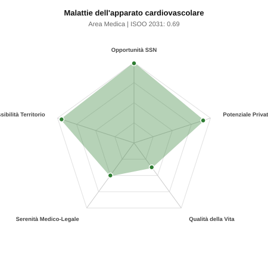

# Scheda di Orientamento: Malattie dell'apparato cardiovascolare

[← Torna al Report Nazionale](../REPORT_NAZIONALE_MEDCAREER2031.md) | [Guida alla Consultazione](../GUIDA_ALLA_CONSULTAZIONE.md)

---

## 1. Profilo di Sintesi (Coorte SSM 2026–2031)

| Parametro | Valore / Dettaglio |
| :--- | :--- |
| **Area Disciplinare** | Medica |
| **Durata del Corso** | 4 anni |
| **Semaforo di Occupabilità al 2031** | 🟢 **VERDE SCURO (Carenza Elevata / Assunzione Immediata)** |
| **Verdetto di Carriera** | **Carenza Severa (Assunzione Immediata)** |
| **Indice ISOO Nazionale (Baseline)** | **0.69** (Range Scenari: 0.56 – 0.81) |
| **Probabilità Assunzione Concorso SSN** | **99.0%** |
| **Qualità della Vita (QoL Score)** | **37 / 100** |
| **Redditività Lorda Annua Stimata (REP)**| **~142,600 €** (Netto stimato: ~78,500 €) |

### Inquadramento Clinico e Prospettiva Occupazionale
Prevenzione, diagnosi e terapia delle patologie cardiovascolari (cardiopatia ischemica, scompenso cardiaco, aritmie, valvulopatie, ipertensione).

> [!NOTE]
> **Prospettiva al 2031 per chi entra a novembre 2026**:
> Posti vacanti diffusi e concorsi spesso deserti; altissima probabilità di assunzione prima del titolo o subito dopo (Decreto Calabria).

---

## 2. Flusso Formativo e Ricambio Generazionale

I dati ministeriali (MUR / MEF / ANAAO) evidenziano la seguente dinamica di ricambio della forza lavoro per il quinquennio 2026–2031:

- **Contratti annui stimati (media 2024-2026)**: 580 borse/anno
- **Totale contratti stanziati nel quinquennio**: 2,900
- **Tasso fisiologico di abbandono / riassegnazione**: 1.0%
- **Nuovi specialisti effettivi al 2031**: 2,871 medici formati
- **Specialisti SSN attivi censiti a inizio periodo**: 5,400
- **Uscite stimate per pensionamento (2026–2031)**: 2,052 dirigenti medici
- **Uscite per dimissioni volontarie / passaggio al privato**: 540 dirigenti medici
- **Fabbisogno netto di rimpiazzo SSN (con fattore demografico)**: 2,702 posti

---

## 3. Analisi Comparativa Multi-Scenario al 2031

Il modello Stock-Flow a 5 anni simula la convergenza tra domanda e offerta al momento del conseguimento del titolo specialistico sotto 3 differenti assetti normativi ed economici:

| Indicatore Occupazionale | Scenario 1: Baseline Inerziale | Scenario 2: Pletora Grave (Worst) | Scenario 3: Riforma Correttiva (Best) |
| :--- | :---: | :---: | :---: |
| **Uscite Totali SSN (Pensionamenti + Esodo)** | 2,592 | 2,128 | 2,954 |
| **Fabbisogno Netto Stimato SSN** | 2,702 | 2,200 | 3,105 |
| **Nuovi Diplomati Effettivi** | 2,871 | 3,015 | 2,440 |
| **Saldo Netto SSN (Nuovi - Fabbisogno)** | **+169** | **+815** | **-665** |
| **Indice ISOO (Offerta / Domanda Totale)** | **0.69** | **0.81** | **0.56** |
| **Probabilità Assunzione Concorso SSN** | **99.0%** | **99.0%** | **99.0%** |
| **Verdetto Scenario** | Carenza Severa (Assunzione Immediata) | Equilibrio Fisiologico | Carenza Severa (Assunzione Immediata) |

---

## 4. Quadro Territoriale: Domanda e Offerta nelle 21 Regioni e P.A.

La tabella seguente illustra la proiezione occupazionale al 2031 (Scenario Baseline) per ciascuna Regione e Provincia Autonoma, ordinata dal territorio con **maggior fabbisogno non coperto** a quello più saturo:

| Regione / P.A. | Medici Attivi 2026 | Uscite Totali SSN | Nuovi Assegnati | Saldo Netto 2031 | ISOO Reg. | Semaforo |
| :--- | :---: | :---: | :---: | :---: | :---: | :---: |
| Abruzzo | 116 | 56 | 59 | 0 | 0.66 | 🟢 |
| Basilicata | 48 | 24 | 25 | 0 | 0.66 | 🟢 |
| P.A. Bolzano | 50 | 23 | 25 | 0 | 0.66 | 🟢 |
| Valle d'Aosta | 11 | 5 | 5 | 0 | 0.62 | 🟢 |
| P.A. Trento | 50 | 23 | 25 | +1 | 0.68 | 🟢 |
| Umbria | 78 | 38 | 40 | +1 | 0.68 | 🟢 |
| Calabria | 167 | 84 | 89 | +1 | 0.67 | 🟢 |
| Molise | 26 | 13 | 15 | +2 | 0.71 | 🟢 |
| Sardegna | 142 | 68 | 74 | +3 | 0.69 | 🟢 |
| Liguria | 139 | 69 | 74 | +3 | 0.69 | 🟢 |
| Sicilia | 438 | 219 | 233 | +4 | 0.67 | 🟢 |
| Friuli-Venezia Giulia | 109 | 52 | 59 | +5 | 0.70 | 🟢 |
| Marche | 136 | 66 | 74 | +5 | 0.70 | 🟢 |
| Puglia | 354 | 170 | 188 | +10 | 0.69 | 🟢 |
| Toscana | 335 | 161 | 178 | +11 | 0.69 | 🟢 |
| Campania | 510 | 245 | 272 | +12 | 0.68 | 🟢 |
| Emilia-Romagna | 410 | 197 | 218 | +12 | 0.69 | 🟢 |
| Lazio | 523 | 251 | 277 | +12 | 0.68 | 🟢 |
| Piemonte | 390 | 187 | 208 | +15 | 0.70 | 🟢 |
| Veneto | 445 | 205 | 238 | +21 | 0.70 | 🟢 |
| Lombardia | 922 | 425 | 490 | +42 | 0.70 | 🟢 |

> [!TIP]
> **Dinamica Geografica**:
> Le regioni in verde presentano carenza strutturale con concorsi che si prevedono aperti e con elevata probabilita di vincita immediata. Nei territori contrassegnati in rosso, il numero di nuovi specialisti supera il ricambio fisiologico ospedaliero, rendendo necessaria una pianificazione extra-regionale o uno sbocco nella medicina privata.

---

## 5. Scorecard: Qualità della Vita e Redditività Economica

### Radar Chart Professionale a 5 Dimensioni

### Indicatori di Qualità della Vita (QoL Score: 37/100)
- **Notti di guardia attive medie al mese**: 4.0 turni/mese
- **Reperibilità notturne/festive medie al mese**: 4.5 turni/mese
- **Ore settimanali effettive stimate**: 48 ore (compresi straordinari operativi)
- **Classe di rischio medico-legale**: Classe 3 su 5
- **Indice di Burnout percepito nella disciplina**: 70 / 100

### Scomposizione Redditività Economica Potenziale (REP)
- **Retribuzione Base SSN + Indennità contrattuali stimate**: ~79,300 € lordi/anno
- **Potenziale Libera Professione / Attività intramuraria out-of-pocket**: ~63,300 € lordi/anno
- **Reddito Annuo Lordo Complessivo Stimato**: ~142,600 €
- **Stima Netta Annuale (aliquote IRPEF ordinarie + previdenza ENPAM)**: ~78,500 € netti/anno

---

## 6. Guida Clinico-Strategica per lo Specializzando

### Sub-Specializzazioni ad Alto Valore Aggiunto
Per differenziarsi sul mercato e acquisire una solida barriera all'ingresso professionale, si consiglia di costruire competenze nelle seguenti sotto-branche durante la scuola:
- **Cardiologia interventistica emodinamica (coronarografie, angioplastica, TAVI)**
- **Elettrofisiologia clinica e stimolazione (ablazione FA, pacemaker, ICD)**
- **Imaging cardiovascolare avanzato (eco 3D, ecotransesofageo, RM cardiaca, cardio-TC)**
- **Cardiologia critica, UTIC e scompenso cardiaco avanzato**

### Competenze Tecniche e Strumentali Raccomandate
Abilità pratiche da padroneggiare prima del diploma specialistico per massimizzare l'autonomia clinica:
- **Ecocardiografia transtoracica, da stress e transesofagea**
- **Accesso vascolare radiale/femorale ed angioplastica coronarica con stent**
- **Impianto e programmazione loop recorder, PM biventricolari e defibrillatori**
- **Test da sforzo al cicloergometro e monitoraggio Holter ECG/pressorio**

### Sbocchi nel Mercato del Lavoro
Domanda di mercato straordinaria: assunzione garantita nel SSN (ospedali e UTIC), elevatissima richiesta nelle cliniche private e potenziale libero-professionale al top.

### Strategia Territoriale e Mobilità
Carenza estesa a livello nazionale. Il Centro-Nord offre assunzioni immediate; il mercato privato e saturo di domanda ovunque.

### Gestione del Rischio Professionale e Work-Life Balance
Rischio medico-legale medio-alto (Classe 4) per urgenze tempo-dipendenti. Turni UTIC e reperibilita H24 impegnativi in ospedale; QoL elevata nel privato/ambulatoriale.

---
[← Torna al Report Nazionale](../REPORT_NAZIONALE_MEDCAREER2031.md) | [Guida alla Consultazione](../GUIDA_ALLA_CONSULTAZIONE.md)
