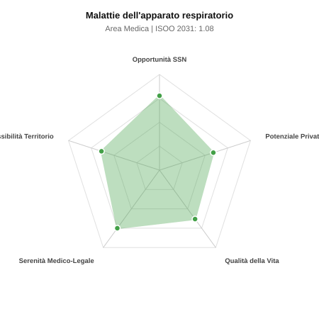

# Scheda di Orientamento: Malattie dell'apparato respiratorio

[← Torna al Report Nazionale](../REPORT_NAZIONALE_MEDCAREER2031.md) | [Guida alla Consultazione](../GUIDA_ALLA_CONSULTAZIONE.md)

---

## 1. Profilo di Sintesi (Coorte SSM 2026–2031)

| Parametro | Valore / Dettaglio |
| :--- | :--- |
| **Area Disciplinare** | Medica |
| **Durata del Corso** | 4 anni |
| **Semaforo di Occupabilità al 2031** | 🟢 **VERDE CHIARO (Equilibrio Fisiologico / Buona Occupabilità)** |
| **Verdetto di Carriera** | **Equilibrio Fisiologico** |
| **Indice ISOO Nazionale (Baseline)** | **1.08** (Range Scenari: 0.92 – 1.26) |
| **Probabilità Assunzione Concorso SSN** | **77.7%** |
| **Qualità della Vita (QoL Score)** | **63 / 100** |
| **Redditività Lorda Annua Stimata (REP)**| **~119,500 €** (Netto stimato: ~65,700 €) |

### Inquadramento Clinico e Prospettiva Occupazionale
Diagnosi e trattamento delle malattie polmonari e pleuriche: BPCO, asma grave, insufficienza respiratoria acuta e cronica, neoplasie polmonari, interstiziopatie e sonno.

> [!NOTE]
> **Prospettiva al 2031 per chi entra a novembre 2026**:
> Buon bilanciamento tra uscite e nuovi specialisti; accesso regolare al SSN tramite concorso e spazio nel settore convenzionato.

---

## 2. Flusso Formativo e Ricambio Generazionale

I dati ministeriali (MUR / MEF / ANAAO) evidenziano la seguente dinamica di ricambio della forza lavoro per il quinquennio 2026–2031:

- **Contratti annui stimati (media 2024-2026)**: 265 borse/anno
- **Totale contratti stanziati nel quinquennio**: 1,325
- **Tasso fisiologico di abbandono / riassegnazione**: 5.0%
- **Nuovi specialisti effettivi al 2031**: 1,259 medici formati
- **Specialisti SSN attivi censiti a inizio periodo**: 1,500
- **Uscite stimate per pensionamento (2026–2031)**: 570 dirigenti medici
- **Uscite per dimissioni volontarie / passaggio al privato**: 150 dirigenti medici
- **Fabbisogno netto di rimpiazzo SSN (con fattore demografico)**: 751 posti

---

## 3. Analisi Comparativa Multi-Scenario al 2031

Il modello Stock-Flow a 5 anni simula la convergenza tra domanda e offerta al momento del conseguimento del titolo specialistico sotto 3 differenti assetti normativi ed economici:

| Indicatore Occupazionale | Scenario 1: Baseline Inerziale | Scenario 2: Pletora Grave (Worst) | Scenario 3: Riforma Correttiva (Best) |
| :--- | :---: | :---: | :---: |
| **Uscite Totali SSN (Pensionamenti + Esodo)** | 720 | 591 | 821 |
| **Fabbisogno Netto Stimato SSN** | 751 | 611 | 863 |
| **Nuovi Diplomati Effettivi** | 1,259 | 1,322 | 1,133 |
| **Saldo Netto SSN (Nuovi - Fabbisogno)** | **+508** | **+711** | **+270** |
| **Indice ISOO (Offerta / Domanda Totale)** | **1.08** | **1.26** | **0.92** |
| **Probabilità Assunzione Concorso SSN** | **77.7%** | **60.2%** | **99.0%** |
| **Verdetto Scenario** | Equilibrio Fisiologico | Competitivo / Rischio Saturazione | Equilibrio Fisiologico |

---

## 4. Quadro Territoriale: Domanda e Offerta nelle 21 Regioni e P.A.

La tabella seguente illustra la proiezione occupazionale al 2031 (Scenario Baseline) per ciascuna Regione e Provincia Autonoma, ordinata dal territorio con **maggior fabbisogno non coperto** a quello più saturo:

| Regione / P.A. | Medici Attivi 2026 | Uscite Totali SSN | Nuovi Assegnati | Saldo Netto 2031 | ISOO Reg. | Semaforo |
| :--- | :---: | :---: | :---: | :---: | :---: | :---: |
| Molise | 7 | 4 | 5 | +1 | 0.83 | 🟢 |
| Basilicata | 13 | 6 | 10 | +4 | 1.11 | 🟢 |
| P.A. Bolzano | 14 | 6 | 10 | +4 | 1.11 | 🟢 |
| Valle d'Aosta | 3 | 1 | 5 | +4 | 1.67 | 🔴 |
| P.A. Trento | 14 | 6 | 10 | +4 | 1.11 | 🟢 |
| Umbria | 22 | 10 | 19 | +9 | 1.19 | 🟠 |
| Friuli-Venezia Giulia | 30 | 14 | 24 | +9 | 1.04 | 🟢 |
| Abruzzo | 32 | 15 | 28 | +12 | 1.12 | 🟢 |
| Liguria | 38 | 19 | 33 | +13 | 1.06 | 🟢 |
| Calabria | 47 | 24 | 38 | +13 | 1.00 | 🟢 |
| Sardegna | 40 | 19 | 33 | +13 | 1.06 | 🟢 |
| Marche | 38 | 18 | 33 | +14 | 1.10 | 🟢 |
| Toscana | 93 | 44 | 76 | +30 | 1.07 | 🟢 |
| Puglia | 98 | 47 | 81 | +32 | 1.07 | 🟢 |
| Sicilia | 122 | 61 | 100 | +36 | 1.03 | 🟢 |
| Piemonte | 108 | 52 | 90 | +36 | 1.07 | 🟢 |
| Emilia-Romagna | 114 | 54 | 95 | +39 | 1.09 | 🟢 |
| Veneto | 124 | 57 | 104 | +44 | 1.11 | 🟢 |
| Campania | 142 | 68 | 119 | +47 | 1.07 | 🟢 |
| Lazio | 145 | 69 | 124 | +51 | 1.09 | 🟢 |
| Lombardia | 256 | 118 | 214 | +90 | 1.10 | 🟢 |

> [!TIP]
> **Dinamica Geografica**:
> Le regioni in verde presentano carenza strutturale con concorsi che si prevedono aperti e con elevata probabilita di vincita immediata. Nei territori contrassegnati in rosso, il numero di nuovi specialisti supera il ricambio fisiologico ospedaliero, rendendo necessaria una pianificazione extra-regionale o uno sbocco nella medicina privata.

---

## 5. Scorecard: Qualità della Vita e Redditività Economica

### Radar Chart Professionale a 5 Dimensioni

### Indicatori di Qualità della Vita (QoL Score: 63/100)
- **Notti di guardia attive medie al mese**: 2.5 turni/mese
- **Reperibilità notturne/festive medie al mese**: 2.5 turni/mese
- **Ore settimanali effettive stimate**: 42 ore (compresi straordinari operativi)
- **Classe di rischio medico-legale**: Classe 2 su 5
- **Indice di Burnout percepito nella disciplina**: 60 / 100

### Scomposizione Redditività Economica Potenziale (REP)
- **Retribuzione Base SSN + Indennità contrattuali stimate**: ~78,100 € lordi/anno
- **Potenziale Libera Professione / Attività intramuraria out-of-pocket**: ~41,400 € lordi/anno
- **Reddito Annuo Lordo Complessivo Stimato**: ~119,500 €
- **Stima Netta Annuale (aliquote IRPEF ordinarie + previdenza ENPAM)**: ~65,700 € netti/anno

---

## 6. Guida Clinico-Strategica per lo Specializzando

### Sub-Specializzazioni ad Alto Valore Aggiunto
Per differenziarsi sul mercato e acquisire una solida barriera all'ingresso professionale, si consiglia di costruire competenze nelle seguenti sotto-branche durante la scuola:
- **Pneumologia interventistica (broncoscopia con EBUS, toracoscopia medica)**
- **Terapia Sub-Intensiva Respiratoria (UTIR) e ventilazione non invasiva (NIV)**
- **Medicina del sonno e disturbi respiratori (OSAS, titolazione CPAP)**
- **Pneumopatie infiltrative diffuse (IPF) e fibrosi polmonare**

### Competenze Tecniche e Strumentali Raccomandate
Abilità pratiche da padroneggiare prima del diploma specialistico per massimizzare l'autonomia clinica:
- **Broncofibroscopia diagnostica con broncoaspirato, BAL e biopsie**
- **EBUS-TBNA per stadiazione mediastinica mininvasiva**
- **Spirometria globale, pletismografia corporea, DLCO ed emogasanalisi**
- **Drenaggi toracici ed ecografia polmonare bedside**

### Sbocchi nel Mercato del Lavoro
Forte domanda post-pandemica negli ospedali SSN per la gestione di UTIR e degenze; solido mercato privato territoriale nella medicina del sonno (OSAS) e allergologia.

### Strategia Territoriale e Mobilità
Richiesta elevata nelle aree industriali e regioni del Nord con alta prevalenza di BPCO; ottime posizioni ospedaliere disponibili.

### Gestione del Rischio Professionale e Work-Life Balance
Rischio medico-legale medio (Classe 3) su insufficienza respiratoria acuta. Turni ospedalieri intensi in UTIR, ampie possibilita ambulatoriali equilibrate.

---
[← Torna al Report Nazionale](../REPORT_NAZIONALE_MEDCAREER2031.md) | [Guida alla Consultazione](../GUIDA_ALLA_CONSULTAZIONE.md)
