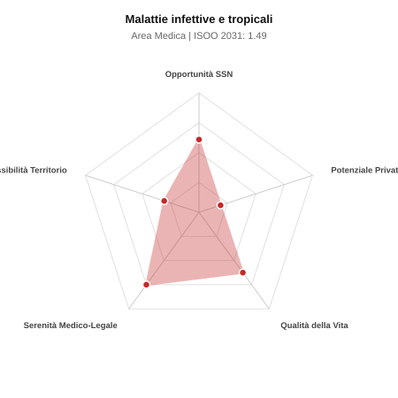

# Scheda di Orientamento: Malattie infettive e tropicali

[← Torna al Report Nazionale](../REPORT_NAZIONALE_MEDCAREER2031.md) | [Guida alla Consultazione](../GUIDA_ALLA_CONSULTAZIONE.md)

---

## 1. Profilo di Sintesi (Coorte SSM 2026–2031)

| Parametro | Valore / Dettaglio |
| :--- | :--- |
| **Area Disciplinare** | Medica |
| **Durata del Corso** | 4 anni |
| **Semaforo di Occupabilità al 2031** | 🔴 **ROSSO (Rischio Pletora / Elevata Saturazione SSN)** |
| **Verdetto di Carriera** | **Pletora / Grave Saturazione** |
| **Indice ISOO Nazionale (Baseline)** | **1.49** (Range Scenari: 1.22 – 1.82) |
| **Probabilità Assunzione Concorso SSN** | **60.9%** |
| **Qualità della Vita (QoL Score)** | **62 / 100** |
| **Redditività Lorda Annua Stimata (REP)**| **~91,400 €** (Netto stimato: ~50,300 €) |

### Inquadramento Clinico e Prospettiva Occupazionale
Prevenzione, diagnosi e terapia di infezioni batteriche, virali, micotiche, sepsi, infezioni da germi multiresistenti (MDR), HIV/AIDS, epatiti e medicina dei viaggi.

> [!NOTE]
> **Prospettiva al 2031 per chi entra a novembre 2026**:
> Forte esubero di specialisti rispetto alle posizioni ospedaliere disponibili al 2031; altissima concorrenza nei concorsi, sbocco quasi obbligato nella libera professione pura.

---

## 2. Flusso Formativo e Ricambio Generazionale

I dati ministeriali (MUR / MEF / ANAAO) evidenziano la seguente dinamica di ricambio della forza lavoro per il quinquennio 2026–2031:

- **Contratti annui stimati (media 2024-2026)**: 250 borse/anno
- **Totale contratti stanziati nel quinquennio**: 1,250
- **Tasso fisiologico di abbandono / riassegnazione**: 5.0%
- **Nuovi specialisti effettivi al 2031**: 1,188 medici formati
- **Specialisti SSN attivi censiti a inizio periodo**: 1,400
- **Uscite stimate per pensionamento (2026–2031)**: 532 dirigenti medici
- **Uscite per dimissioni volontarie / passaggio al privato**: 140 dirigenti medici
- **Fabbisogno netto di rimpiazzo SSN (con fattore demografico)**: 670 posti

---

## 3. Analisi Comparativa Multi-Scenario al 2031

Il modello Stock-Flow a 5 anni simula la convergenza tra domanda e offerta al momento del conseguimento del titolo specialistico sotto 3 differenti assetti normativi ed economici:

| Indicatore Occupazionale | Scenario 1: Baseline Inerziale | Scenario 2: Pletora Grave (Worst) | Scenario 3: Riforma Correttiva (Best) |
| :--- | :---: | :---: | :---: |
| **Uscite Totali SSN (Pensionamenti + Esodo)** | 672 | 552 | 766 |
| **Fabbisogno Netto Stimato SSN** | 670 | 551 | 764 |
| **Nuovi Diplomati Effettivi** | 1,188 | 1,247 | 1,069 |
| **Saldo Netto SSN (Nuovi - Fabbisogno)** | **+518** | **+696** | **+305** |
| **Indice ISOO (Offerta / Domanda Totale)** | **1.49** | **1.82** | **1.22** |
| **Probabilità Assunzione Concorso SSN** | **60.9%** | **47.7%** | **77.2%** |
| **Verdetto Scenario** | Pletora / Grave Saturazione | Pletora / Grave Saturazione | Competitivo / Rischio Saturazione |

---

## 4. Quadro Territoriale: Domanda e Offerta nelle 21 Regioni e P.A.

La tabella seguente illustra la proiezione occupazionale al 2031 (Scenario Baseline) per ciascuna Regione e Provincia Autonoma, ordinata dal territorio con **maggior fabbisogno non coperto** a quello più saturo:

| Regione / P.A. | Medici Attivi 2026 | Uscite Totali SSN | Nuovi Assegnati | Saldo Netto 2031 | ISOO Reg. | Semaforo |
| :--- | :---: | :---: | :---: | :---: | :---: | :---: |
| Molise | 7 | 4 | 5 | +1 | 1.00 | 🟢 |
| Basilicata | 12 | 6 | 10 | +4 | 1.43 | 🟠 |
| P.A. Bolzano | 13 | 6 | 10 | +4 | 1.43 | 🟠 |
| Valle d'Aosta | 3 | 1 | 5 | +4 | 2.50 | 🔴 |
| P.A. Trento | 13 | 6 | 10 | +4 | 1.43 | 🟠 |
| Umbria | 20 | 10 | 19 | +9 | 1.58 | 🔴 |
| Liguria | 36 | 18 | 28 | +10 | 1.33 | 🟠 |
| Abruzzo | 30 | 14 | 24 | +10 | 1.41 | 🟠 |
| Friuli-Venezia Giulia | 28 | 14 | 24 | +10 | 1.41 | 🟠 |
| Marche | 35 | 17 | 28 | +11 | 1.40 | 🟠 |
| Sardegna | 37 | 18 | 33 | +15 | 1.50 | 🔴 |
| Calabria | 43 | 21 | 38 | +17 | 1.52 | 🔴 |
| Puglia | 92 | 44 | 76 | +32 | 1.46 | 🔴 |
| Toscana | 87 | 42 | 76 | +34 | 1.52 | 🔴 |
| Piemonte | 101 | 48 | 86 | +38 | 1.51 | 🔴 |
| Emilia-Romagna | 106 | 51 | 90 | +39 | 1.48 | 🔴 |
| Sicilia | 113 | 56 | 95 | +40 | 1.46 | 🔴 |
| Veneto | 115 | 54 | 100 | +46 | 1.54 | 🔴 |
| Lazio | 136 | 66 | 114 | +48 | 1.46 | 🔴 |
| Campania | 132 | 63 | 114 | +52 | 1.54 | 🔴 |
| Lombardia | 239 | 110 | 204 | +94 | 1.54 | 🔴 |

> [!TIP]
> **Dinamica Geografica**:
> Le regioni in verde presentano carenza strutturale con concorsi che si prevedono aperti e con elevata probabilita di vincita immediata. Nei territori contrassegnati in rosso, il numero di nuovi specialisti supera il ricambio fisiologico ospedaliero, rendendo necessaria una pianificazione extra-regionale o uno sbocco nella medicina privata.

---

## 5. Scorecard: Qualità della Vita e Redditività Economica

### Radar Chart Professionale a 5 Dimensioni

### Indicatori di Qualità della Vita (QoL Score: 62/100)
- **Notti di guardia attive medie al mese**: 2.5 turni/mese
- **Reperibilità notturne/festive medie al mese**: 2.5 turni/mese
- **Ore settimanali effettive stimate**: 42 ore (compresi straordinari operativi)
- **Classe di rischio medico-legale**: Classe 2 su 5
- **Indice di Burnout percepito nella disciplina**: 65 / 100

### Scomposizione Redditività Economica Potenziale (REP)
- **Retribuzione Base SSN + Indennità contrattuali stimate**: ~78,100 € lordi/anno
- **Potenziale Libera Professione / Attività intramuraria out-of-pocket**: ~13,300 € lordi/anno
- **Reddito Annuo Lordo Complessivo Stimato**: ~91,400 €
- **Stima Netta Annuale (aliquote IRPEF ordinarie + previdenza ENPAM)**: ~50,300 € netti/anno

---

## 6. Guida Clinico-Strategica per lo Specializzando

### Sub-Specializzazioni ad Alto Valore Aggiunto
Per differenziarsi sul mercato e acquisire una solida barriera all'ingresso professionale, si consiglia di costruire competenze nelle seguenti sotto-branche durante la scuola:
- **Antimicrobial Stewardship e gestione patogeni multiresistenti**
- **Infezioni nell ospite immunocompromesso (trapianti e oncoematologia)**
- **Infezione da HIV avanzata e nuove terapie long-acting**
- **Medicina tropicale, arbovirosi emergenti (Dengue, West Nile)**

### Competenze Tecniche e Strumentali Raccomandate
Abilità pratiche da padroneggiare prima del diploma specialistico per massimizzare l'autonomia clinica:
- **Consulenza infettivologica intraospedaliera per ottimizzazione antibiotici**
- **Rachicentesi diagnostica e test molecolari rapidi (PCR multiplex)**
- **Gestione regimi antivirali complessi e monitoraggio tossicita**
- **Applicazione protocolli di isolamento e prevenzione ICA**

### Sbocchi nel Mercato del Lavoro
Assunzione prevalentemente ospedaliera nel SSN, con ruolo strategico potenziato per le infezioni nosocomiali (ICA) e consulenze. Attivita privata su medicina dei viaggi e MST.

### Strategia Territoriale e Mobilità
Posti stabili negli Hub e Spoke con degenza infettivologica; ruolo cruciale nei comitati infezioni ospedaliere.

### Gestione del Rischio Professionale e Work-Life Balance
Rischio medico-legale medio (Classe 2-3). Buona qualita della vita rispetto ad altre discipline internistiche d urgenza: guardie condivise con l area medica.

---
[← Torna al Report Nazionale](../REPORT_NAZIONALE_MEDCAREER2031.md) | [Guida alla Consultazione](../GUIDA_ALLA_CONSULTAZIONE.md)
