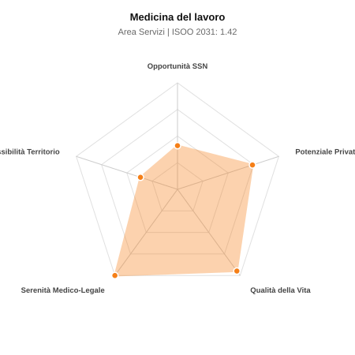

# Scheda di Orientamento: Medicina del lavoro

[← Torna al Report Nazionale](../REPORT_NAZIONALE_MEDCAREER2031.md) | [Guida alla Consultazione](../GUIDA_ALLA_CONSULTAZIONE.md)

---

## 1. Profilo di Sintesi (Coorte SSM 2026–2031)

| Parametro | Valore / Dettaglio |
| :--- | :--- |
| **Area Disciplinare** | Servizi |
| **Durata del Corso** | 4 anni |
| **Semaforo di Occupabilità al 2031** | 🟠 **ARANCIONE (Saturazione Moderata / Concorrenza Concorsuale)** |
| **Verdetto di Carriera** | **Competitivo / Rischio Saturazione** |
| **Indice ISOO Nazionale (Baseline)** | **1.42** (Range Scenari: 1.28 – 1.56) |
| **Probabilità Assunzione Concorso SSN** | **41.0%** |
| **Qualità della Vita (QoL Score)** | **95 / 100** |
| **Redditività Lorda Annua Stimata (REP)**| **~127,800 €** (Netto stimato: ~70,300 €) |

### Inquadramento Clinico e Prospettiva Occupazionale
Tutela e sicurezza dei lavoratori nei luoghi di lavoro, valutazione dei rischi lavorativi, sorveglianza sanitaria, ergonomia e idoneita alla mansione.

> [!NOTE]
> **Prospettiva al 2031 per chi entra a novembre 2026**:
> Graduatorie concorsuali affollate; tempi di attesa per tempo indeterminato SSN mediamente più lunghi; necessario appoggiarsi al privato accreditato.

---

## 2. Flusso Formativo e Ricambio Generazionale

I dati ministeriali (MUR / MEF / ANAAO) evidenziano la seguente dinamica di ricambio della forza lavoro per il quinquennio 2026–2031:

- **Contratti annui stimati (media 2024-2026)**: 190 borse/anno
- **Totale contratti stanziati nel quinquennio**: 950
- **Tasso fisiologico di abbandono / riassegnazione**: 10.0%
- **Nuovi specialisti effettivi al 2031**: 855 medici formati
- **Specialisti SSN attivi censiti a inizio periodo**: 520
- **Uscite stimate per pensionamento (2026–2031)**: 198 dirigenti medici
- **Uscite per dimissioni volontarie / passaggio al privato**: 52 dirigenti medici
- **Fabbisogno netto di rimpiazzo SSN (con fattore demografico)**: 249 posti

---

## 3. Analisi Comparativa Multi-Scenario al 2031

Il modello Stock-Flow a 5 anni simula la convergenza tra domanda e offerta al momento del conseguimento del titolo specialistico sotto 3 differenti assetti normativi ed economici:

| Indicatore Occupazionale | Scenario 1: Baseline Inerziale | Scenario 2: Pletora Grave (Worst) | Scenario 3: Riforma Correttiva (Best) |
| :--- | :---: | :---: | :---: |
| **Uscite Totali SSN (Pensionamenti + Esodo)** | 250 | 205 | 285 |
| **Fabbisogno Netto Stimato SSN** | 249 | 205 | 284 |
| **Nuovi Diplomati Effettivi** | 855 | 898 | 770 |
| **Saldo Netto SSN (Nuovi - Fabbisogno)** | **+606** | **+693** | **+486** |
| **Indice ISOO (Offerta / Domanda Totale)** | **1.42** | **1.56** | **1.28** |
| **Probabilità Assunzione Concorso SSN** | **41.0%** | **32.2%** | **52.0%** |
| **Verdetto Scenario** | Competitivo / Rischio Saturazione | Pletora / Grave Saturazione | Competitivo / Rischio Saturazione |

---

## 4. Quadro Territoriale: Domanda e Offerta nelle 21 Regioni e P.A.

La tabella seguente illustra la proiezione occupazionale al 2031 (Scenario Baseline) per ciascuna Regione e Provincia Autonoma, ordinata dal territorio con **maggior fabbisogno non coperto** a quello più saturo:

| Regione / P.A. | Medici Attivi 2026 | Uscite Totali SSN | Nuovi Assegnati | Saldo Netto 2031 | ISOO Reg. | Semaforo |
| :--- | :---: | :---: | :---: | :---: | :---: | :---: |
| Valle d'Aosta | 1 | 0 | 0 | 0 | 2.00 | 🔴 |
| Molise | 3 | 1 | 4 | +3 | 1.33 | 🟠 |
| P.A. Bolzano | 5 | 2 | 9 | +7 | 1.50 | 🔴 |
| Basilicata | 5 | 2 | 9 | +7 | 1.50 | 🔴 |
| P.A. Trento | 5 | 2 | 9 | +7 | 1.50 | 🔴 |
| Umbria | 8 | 4 | 14 | +10 | 1.40 | 🟠 |
| Friuli-Venezia Giulia | 11 | 5 | 18 | +13 | 1.50 | 🔴 |
| Abruzzo | 11 | 5 | 18 | +13 | 1.50 | 🔴 |
| Marche | 13 | 6 | 22 | +16 | 1.47 | 🔴 |
| Sardegna | 14 | 6 | 22 | +16 | 1.47 | 🔴 |
| Liguria | 13 | 6 | 22 | +16 | 1.47 | 🔴 |
| Calabria | 16 | 8 | 27 | +19 | 1.42 | 🟠 |
| Puglia | 34 | 16 | 54 | +38 | 1.42 | 🟠 |
| Toscana | 32 | 15 | 54 | +39 | 1.46 | 🔴 |
| Emilia-Romagna | 39 | 19 | 63 | +44 | 1.40 | 🟠 |
| Piemonte | 38 | 18 | 63 | +45 | 1.43 | 🟠 |
| Sicilia | 42 | 21 | 68 | +47 | 1.39 | 🟠 |
| Veneto | 43 | 20 | 72 | +52 | 1.44 | 🟠 |
| Campania | 49 | 24 | 81 | +57 | 1.40 | 🟠 |
| Lazio | 50 | 24 | 81 | +57 | 1.40 | 🟠 |
| Lombardia | 89 | 41 | 144 | +103 | 1.43 | 🟠 |

> [!TIP]
> **Dinamica Geografica**:
> Le regioni in verde presentano carenza strutturale con concorsi che si prevedono aperti e con elevata probabilita di vincita immediata. Nei territori contrassegnati in rosso, il numero di nuovi specialisti supera il ricambio fisiologico ospedaliero, rendendo necessaria una pianificazione extra-regionale o uno sbocco nella medicina privata.

---

## 5. Scorecard: Qualità della Vita e Redditività Economica

### Radar Chart Professionale a 5 Dimensioni

### Indicatori di Qualità della Vita (QoL Score: 95/100)
- **Notti di guardia attive medie al mese**: 0.0 turni/mese
- **Reperibilità notturne/festive medie al mese**: 0.0 turni/mese
- **Ore settimanali effettive stimate**: 38 ore (compresi straordinari operativi)
- **Classe di rischio medico-legale**: Classe 1 su 5
- **Indice di Burnout percepito nella disciplina**: 35 / 100

### Scomposizione Redditività Economica Potenziale (REP)
- **Retribuzione Base SSN + Indennità contrattuali stimate**: ~76,000 € lordi/anno
- **Potenziale Libera Professione / Attività intramuraria out-of-pocket**: ~51,800 € lordi/anno
- **Reddito Annuo Lordo Complessivo Stimato**: ~127,800 €
- **Stima Netta Annuale (aliquote IRPEF ordinarie + previdenza ENPAM)**: ~70,300 € netti/anno

---

## 6. Guida Clinico-Strategica per lo Specializzando

### Sub-Specializzazioni ad Alto Valore Aggiunto
Per differenziarsi sul mercato e acquisire una solida barriera all'ingresso professionale, si consiglia di costruire competenze nelle seguenti sotto-branche durante la scuola:
- **Tossicologia industriale, monitoraggio biologico e rischio chimico/cancerogeno**
- **Ergonomia e prevenzione disturbi muscolo-scheletrici da lavoro**
- **Gestione rischio psicosociale e stress lavoro-correlato nelle grandi imprese**
- **Consulenza tecnica e peritale in malattie professionali e infortuni**

### Competenze Tecniche e Strumentali Raccomandate
Abilità pratiche da padroneggiare prima del diploma specialistico per massimizzare l'autonomia clinica:
- **Elaborazione Protocollo di Sorveglianza Sanitaria e DVR aziendale**
- **Spirometrie aziendali, audiometrie di screening e test visiotest**
- **Sopralluoghi negli ambienti di lavoro e valutazione parametri ambientali**
- **Formulazione giudizi di idoneita specifica alla mansione**

### Sbocchi nel Mercato del Lavoro
Ruolo di Medico Competente (D.Lgs. 81/08): mercato privato floridissimo con incarichi continuativi presso aziende, banche, industrie; ruoli stabili nei servizi SPSAL ASL.

### Strategia Territoriale e Mobilità
Domanda massiccia e continuativa in tutte le aree produttive del Centro-Nord, ma presente ovunque.

### Gestione del Rischio Professionale e Work-Life Balance
Rischio medico-legale moderato (Classe 2, ispettivo/amministrativo). Qualita della vita superba (QoL > 85): niente notti, niente festivi, totale autonomia oraria.

---
[← Torna al Report Nazionale](../REPORT_NAZIONALE_MEDCAREER2031.md) | [Guida alla Consultazione](../GUIDA_ALLA_CONSULTAZIONE.md)
