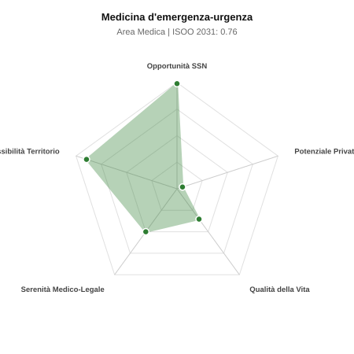

# Scheda di Orientamento: Medicina d'emergenza-urgenza

[← Torna al Report Nazionale](../REPORT_NAZIONALE_MEDCAREER2031.md) | [Guida alla Consultazione](../GUIDA_ALLA_CONSULTAZIONE.md)

---

## 1. Profilo di Sintesi (Coorte SSM 2026–2031)

| Parametro | Valore / Dettaglio |
| :--- | :--- |
| **Area Disciplinare** | Medica |
| **Durata del Corso** | 4 anni |
| **Semaforo di Occupabilità al 2031** | 🟢 **VERDE SCURO (Carenza Elevata / Assunzione Immediata)** |
| **Verdetto di Carriera** | **Carenza Severa (Assunzione Immediata)** |
| **Indice ISOO Nazionale (Baseline)** | **0.76** (Range Scenari: 0.60 – 0.96) |
| **Probabilità Assunzione Concorso SSN** | **99.0%** |
| **Qualità della Vita (QoL Score)** | **35 / 100** |
| **Redditività Lorda Annua Stimata (REP)**| **~93,800 €** (Netto stimato: ~51,600 €) |

### Inquadramento Clinico e Prospettiva Occupazionale
Valutazione rapida, stabilizzazione e trattamento dei pazienti critici acuti in Pronto Soccorso, Medicina d Urgenza, OBI e nel sistema 118 territoriale.

> [!NOTE]
> **Prospettiva al 2031 per chi entra a novembre 2026**:
> Posti vacanti diffusi e concorsi spesso deserti; altissima probabilità di assunzione prima del titolo o subito dopo (Decreto Calabria).

---

## 2. Flusso Formativo e Ricambio Generazionale

I dati ministeriali (MUR / MEF / ANAAO) evidenziano la seguente dinamica di ricambio della forza lavoro per il quinquennio 2026–2031:

- **Contratti annui stimati (media 2024-2026)**: 925 borse/anno
- **Totale contratti stanziati nel quinquennio**: 4,625
- **Tasso fisiologico di abbandono / riassegnazione**: 48.0%
- **Nuovi specialisti effettivi al 2031**: 2,405 medici formati
- **Specialisti SSN attivi censiti a inizio periodo**: 6,500
- **Uscite stimate per pensionamento (2026–2031)**: 2,470 dirigenti medici
- **Uscite per dimissioni volontarie / passaggio al privato**: 650 dirigenti medici
- **Fabbisogno netto di rimpiazzo SSN (con fattore demografico)**: 3,112 posti

---

## 3. Analisi Comparativa Multi-Scenario al 2031

Il modello Stock-Flow a 5 anni simula la convergenza tra domanda e offerta al momento del conseguimento del titolo specialistico sotto 3 differenti assetti normativi ed economici:

| Indicatore Occupazionale | Scenario 1: Baseline Inerziale | Scenario 2: Pletora Grave (Worst) | Scenario 3: Riforma Correttiva (Best) |
| :--- | :---: | :---: | :---: |
| **Uscite Totali SSN (Pensionamenti + Esodo)** | 3,120 | 2,561 | 3,555 |
| **Fabbisogno Netto Stimato SSN** | 3,112 | 2,556 | 3,544 |
| **Nuovi Diplomati Effettivi** | 2,405 | 2,525 | 2,164 |
| **Saldo Netto SSN (Nuovi - Fabbisogno)** | **-707** | **-31** | **-1380** |
| **Indice ISOO (Offerta / Domanda Totale)** | **0.76** | **0.96** | **0.60** |
| **Probabilità Assunzione Concorso SSN** | **99.0%** | **99.0%** | **99.0%** |
| **Verdetto Scenario** | Carenza Severa (Assunzione Immediata) | Equilibrio Fisiologico | Carenza Severa (Assunzione Immediata) |

---

## 4. Quadro Territoriale: Domanda e Offerta nelle 21 Regioni e P.A.

La tabella seguente illustra la proiezione occupazionale al 2031 (Scenario Baseline) per ciascuna Regione e Provincia Autonoma, ordinata dal territorio con **maggior fabbisogno non coperto** a quello più saturo:

| Regione / P.A. | Medici Attivi 2026 | Uscite Totali SSN | Nuovi Assegnati | Saldo Netto 2031 | ISOO Reg. | Semaforo |
| :--- | :---: | :---: | :---: | :---: | :---: | :---: |
| Lombardia | 1,110 | 512 | 411 | -103 | 0.78 | 🟢 |
| Lazio | 630 | 302 | 234 | -67 | 0.76 | 🟢 |
| Sicilia | 527 | 263 | 195 | -66 | 0.73 | 🟢 |
| Campania | 614 | 294 | 226 | -65 | 0.76 | 🟢 |
| Emilia-Romagna | 494 | 237 | 182 | -56 | 0.75 | 🟢 |
| Piemonte | 469 | 225 | 174 | -51 | 0.76 | 🟢 |
| Veneto | 536 | 247 | 198 | -49 | 0.78 | 🟢 |
| Toscana | 403 | 193 | 148 | -45 | 0.75 | 🟢 |
| Puglia | 426 | 205 | 159 | -44 | 0.76 | 🟢 |
| Calabria | 202 | 101 | 75 | -25 | 0.73 | 🟢 |
| Liguria | 167 | 84 | 62 | -22 | 0.72 | 🟢 |
| Sardegna | 171 | 82 | 62 | -19 | 0.75 | 🟢 |
| Marche | 163 | 78 | 60 | -18 | 0.75 | 🟢 |
| Abruzzo | 140 | 67 | 52 | -15 | 0.75 | 🟢 |
| Friuli-Venezia Giulia | 132 | 63 | 49 | -14 | 0.77 | 🟢 |
| Umbria | 94 | 45 | 34 | -11 | 0.74 | 🟢 |
| Basilicata | 58 | 29 | 21 | -7 | 0.72 | 🟢 |
| Molise | 32 | 16 | 10 | -6 | 0.62 | 🟢 |
| P.A. Bolzano | 60 | 28 | 23 | -5 | 0.79 | 🟢 |
| P.A. Trento | 61 | 28 | 23 | -5 | 0.79 | 🟢 |
| Valle d'Aosta | 14 | 6 | 5 | -1 | 0.83 | 🟢 |

> [!TIP]
> **Dinamica Geografica**:
> Le regioni in verde presentano carenza strutturale con concorsi che si prevedono aperti e con elevata probabilita di vincita immediata. Nei territori contrassegnati in rosso, il numero di nuovi specialisti supera il ricambio fisiologico ospedaliero, rendendo necessaria una pianificazione extra-regionale o uno sbocco nella medicina privata.

---

## 5. Scorecard: Qualità della Vita e Redditività Economica

### Radar Chart Professionale a 5 Dimensioni

### Indicatori di Qualità della Vita (QoL Score: 35/100)
- **Notti di guardia attive medie al mese**: 6.5 turni/mese
- **Reperibilità notturne/festive medie al mese**: 1.0 turni/mese
- **Ore settimanali effettive stimate**: 48 ore (compresi straordinari operativi)
- **Classe di rischio medico-legale**: Classe 3 su 5
- **Indice di Burnout percepito nella disciplina**: 90 / 100

### Scomposizione Redditività Economica Potenziale (REP)
- **Retribuzione Base SSN + Indennità contrattuali stimate**: ~90,000 € lordi/anno
- **Potenziale Libera Professione / Attività intramuraria out-of-pocket**: ~3,800 € lordi/anno
- **Reddito Annuo Lordo Complessivo Stimato**: ~93,800 €
- **Stima Netta Annuale (aliquote IRPEF ordinarie + previdenza ENPAM)**: ~51,600 € netti/anno

---

## 6. Guida Clinico-Strategica per lo Specializzando

### Sub-Specializzazioni ad Alto Valore Aggiunto
Per differenziarsi sul mercato e acquisire una solida barriera all'ingresso professionale, si consiglia di costruire competenze nelle seguenti sotto-branche durante la scuola:
- **Medicina d urgenza critica e gestione shock/arresto cardiaco (ACLS)**
- **Ecografia clinica d emergenza integrata (POCUS torace, FAST addominale, vasi)**
- **Tossicologia d urgenza e gestione traumi maggiori (ATLS)**
- **Emergenza pre-ospedaliera, automedica ed elisoccorso HEMS**

### Competenze Tecniche e Strumentali Raccomandate
Abilità pratiche da padroneggiare prima del diploma specialistico per massimizzare l'autonomia clinica:
- **Intubazione d emergenza, vie aeree difficili, cricotiroidotomia**
- **Accesso vascolare ecoguidato centrale, periferico e intraosseo**
- **Toracocentesi evacuativa, drenaggio toracico e pericardiocentesi**
- **Sedazione procedurale, cardioversione elettrica e pacing transcutaneo**

### Sbocchi nel Mercato del Lavoro
Assunzione istantanea a tempo indeterminato in concorso (arruolamento totale). Bonus contrattuali e indennita PS potenziate; progressione rapida a ruoli direttivi.

### Strategia Territoriale e Mobilità
Carenza drammatica e diffusa in ogni singola azienda sanitaria italiana, dagli Hub metropolitani ai presidi di frontiera.

### Gestione del Rischio Professionale e Work-Life Balance
Rischio medico-legale elevato (Classe 4-5) per crowding e decisioni in tempo zero sotto stress. Ritmi orari duri (notti/festivi), burnout elevato: richiede forte vocazione.

---
[← Torna al Report Nazionale](../REPORT_NAZIONALE_MEDCAREER2031.md) | [Guida alla Consultazione](../GUIDA_ALLA_CONSULTAZIONE.md)
