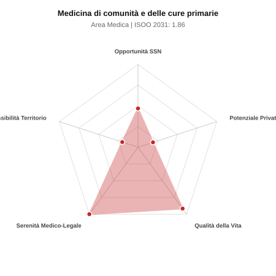

# Scheda di Orientamento: Medicina di comunità e delle cure primarie

[← Torna al Report Nazionale](../REPORT_NAZIONALE_MEDCAREER2031.md) | [Guida alla Consultazione](../GUIDA_ALLA_CONSULTAZIONE.md)

---

## 1. Profilo di Sintesi (Coorte SSM 2026–2031)

| Parametro | Valore / Dettaglio |
| :--- | :--- |
| **Area Disciplinare** | Medica |
| **Durata del Corso** | 4 anni |
| **Semaforo di Occupabilità al 2031** | 🔴 **ROSSO (Rischio Pletora / Elevata Saturazione SSN)** |
| **Verdetto di Carriera** | **Pletora / Grave Saturazione** |
| **Indice ISOO Nazionale (Baseline)** | **1.86** (Range Scenari: 1.54 – 2.40) |
| **Probabilità Assunzione Concorso SSN** | **46.8%** |
| **Qualità della Vita (QoL Score)** | **92 / 100** |
| **Redditività Lorda Annua Stimata (REP)**| **~89,300 €** (Netto stimato: ~49,100 €) |

### Inquadramento Clinico e Prospettiva Occupazionale
Organizzazione e gestione dei servizi territoriali, distretti sanitari, Case della Comunita, continuita assistenziale, cronici e integrazione sociosanitaria.

> [!NOTE]
> **Prospettiva al 2031 per chi entra a novembre 2026**:
> Forte esubero di specialisti rispetto alle posizioni ospedaliere disponibili al 2031; altissima concorrenza nei concorsi, sbocco quasi obbligato nella libera professione pura.

---

## 2. Flusso Formativo e Ricambio Generazionale

I dati ministeriali (MUR / MEF / ANAAO) evidenziano la seguente dinamica di ricambio della forza lavoro per il quinquennio 2026–2031:

- **Contratti annui stimati (media 2024-2026)**: 125 borse/anno
- **Totale contratti stanziati nel quinquennio**: 625
- **Tasso fisiologico di abbandono / riassegnazione**: 32.0%
- **Nuovi specialisti effettivi al 2031**: 425 medici formati
- **Specialisti SSN attivi censiti a inizio periodo**: 350
- **Uscite stimate per pensionamento (2026–2031)**: 133 dirigenti medici
- **Uscite per dimissioni volontarie / passaggio al privato**: 35 dirigenti medici
- **Fabbisogno netto di rimpiazzo SSN (con fattore demografico)**: 184 posti

---

## 3. Analisi Comparativa Multi-Scenario al 2031

Il modello Stock-Flow a 5 anni simula la convergenza tra domanda e offerta al momento del conseguimento del titolo specialistico sotto 3 differenti assetti normativi ed economici:

| Indicatore Occupazionale | Scenario 1: Baseline Inerziale | Scenario 2: Pletora Grave (Worst) | Scenario 3: Riforma Correttiva (Best) |
| :--- | :---: | :---: | :---: |
| **Uscite Totali SSN (Pensionamenti + Esodo)** | 168 | 138 | 191 |
| **Fabbisogno Netto Stimato SSN** | 184 | 139 | 207 |
| **Nuovi Diplomati Effettivi** | 425 | 446 | 382 |
| **Saldo Netto SSN (Nuovi - Fabbisogno)** | **+241** | **+307** | **+175** |
| **Indice ISOO (Offerta / Domanda Totale)** | **1.86** | **2.40** | **1.54** |
| **Probabilità Assunzione Concorso SSN** | **46.8%** | **33.7%** | **58.5%** |
| **Verdetto Scenario** | Pletora / Grave Saturazione | Pletora / Grave Saturazione | Pletora / Grave Saturazione |

---

## 4. Quadro Territoriale: Domanda e Offerta nelle 21 Regioni e P.A.

La tabella seguente illustra la proiezione occupazionale al 2031 (Scenario Baseline) per ciascuna Regione e Provincia Autonoma, ordinata dal territorio con **maggior fabbisogno non coperto** a quello più saturo:

| Regione / P.A. | Medici Attivi 2026 | Uscite Totali SSN | Nuovi Assegnati | Saldo Netto 2031 | ISOO Reg. | Semaforo |
| :--- | :---: | :---: | :---: | :---: | :---: | :---: |
| Valle d'Aosta | 1 | 0 | 0 | 0 | 2.00 | 🔴 |
| Basilicata | 3 | 1 | 3 | +2 | 3.00 | 🔴 |
| P.A. Bolzano | 3 | 1 | 3 | +2 | 3.00 | 🔴 |
| Molise | 2 | 1 | 3 | +2 | 3.00 | 🔴 |
| P.A. Trento | 3 | 1 | 3 | +2 | 3.00 | 🔴 |
| Umbria | 5 | 2 | 7 | +5 | 2.33 | 🔴 |
| Liguria | 9 | 5 | 10 | +5 | 1.67 | 🔴 |
| Friuli-Venezia Giulia | 7 | 4 | 10 | +6 | 2.00 | 🔴 |
| Marche | 9 | 4 | 10 | +6 | 2.00 | 🔴 |
| Sardegna | 9 | 4 | 10 | +6 | 2.00 | 🔴 |
| Abruzzo | 8 | 4 | 10 | +6 | 2.00 | 🔴 |
| Calabria | 11 | 5 | 14 | +9 | 2.33 | 🔴 |
| Puglia | 23 | 11 | 27 | +15 | 1.80 | 🔴 |
| Toscana | 22 | 10 | 27 | +16 | 1.93 | 🔴 |
| Emilia-Romagna | 27 | 13 | 31 | +17 | 1.82 | 🔴 |
| Piemonte | 25 | 12 | 31 | +18 | 1.94 | 🔴 |
| Sicilia | 28 | 14 | 34 | +19 | 1.79 | 🔴 |
| Veneto | 29 | 13 | 34 | +20 | 1.89 | 🔴 |
| Campania | 33 | 16 | 41 | +23 | 1.86 | 🔴 |
| Lazio | 34 | 16 | 41 | +23 | 1.86 | 🔴 |
| Lombardia | 60 | 28 | 71 | +40 | 1.82 | 🔴 |

> [!TIP]
> **Dinamica Geografica**:
> Le regioni in verde presentano carenza strutturale con concorsi che si prevedono aperti e con elevata probabilita di vincita immediata. Nei territori contrassegnati in rosso, il numero di nuovi specialisti supera il ricambio fisiologico ospedaliero, rendendo necessaria una pianificazione extra-regionale o uno sbocco nella medicina privata.

---

## 5. Scorecard: Qualità della Vita e Redditività Economica

### Radar Chart Professionale a 5 Dimensioni

### Indicatori di Qualità della Vita (QoL Score: 92/100)
- **Notti di guardia attive medie al mese**: 0.0 turni/mese
- **Reperibilità notturne/festive medie al mese**: 0.5 turni/mese
- **Ore settimanali effettive stimate**: 38 ore (compresi straordinari operativi)
- **Classe di rischio medico-legale**: Classe 1 su 5
- **Indice di Burnout percepito nella disciplina**: 45 / 100

### Scomposizione Redditività Economica Potenziale (REP)
- **Retribuzione Base SSN + Indennità contrattuali stimate**: ~76,000 € lordi/anno
- **Potenziale Libera Professione / Attività intramuraria out-of-pocket**: ~13,300 € lordi/anno
- **Reddito Annuo Lordo Complessivo Stimato**: ~89,300 €
- **Stima Netta Annuale (aliquote IRPEF ordinarie + previdenza ENPAM)**: ~49,100 € netti/anno

---

## 6. Guida Clinico-Strategica per lo Specializzando

### Sub-Specializzazioni ad Alto Valore Aggiunto
Per differenziarsi sul mercato e acquisire una solida barriera all'ingresso professionale, si consiglia di costruire competenze nelle seguenti sotto-branche durante la scuola:
- **Coordinamento clinico-gestionale Case della Comunita e Ospedali di Comunita**
- **Cure intermedie e continuita ospedale-territorio per evitare ricoveri**
- **Pianificazione sociosanitaria per non-autosufficienza**
- **Epidemiologia di popolazione applicata al territorio**

### Competenze Tecniche e Strumentali Raccomandate
Abilità pratiche da padroneggiare prima del diploma specialistico per massimizzare l'autonomia clinica:
- **Community Assessment dei bisogni di salute di distretto**
- **Progettazione PDTA territoriali multiprofessionali**
- **Coordinamento equipe (MMG, infermieri di famiglia, assistenti sociali)**
- **Monitoraggio indicatori di salute territoriale e telemedicina**

### Sbocchi nel Mercato del Lavoro
Specialita universitaria per i dirigenti medici del territorio previsti dal PNRR / DM 77. Ruoli dirigenziali stabili nelle direzioni distrettuali e cure primarie.

### Strategia Territoriale e Mobilità
Fabbisogno in forte espansione in tutte le Regioni per l attivazione della rete territoriale.

### Gestione del Rischio Professionale e Work-Life Balance
Rischio medico-legale basso (Classe 1). Ottima qualita della vita lavorativa: orari diurni e organizzativi, zero notti di pronto soccorso.

---
[← Torna al Report Nazionale](../REPORT_NAZIONALE_MEDCAREER2031.md) | [Guida alla Consultazione](../GUIDA_ALLA_CONSULTAZIONE.md)
