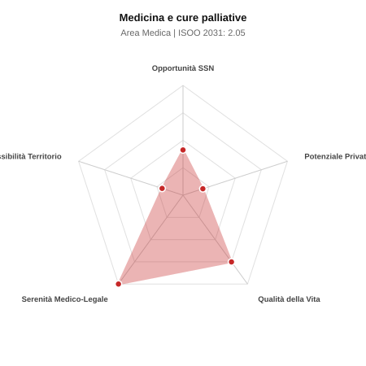

# Scheda di Orientamento: Medicina e cure palliative

[← Torna al Report Nazionale](../REPORT_NAZIONALE_MEDCAREER2031.md) | [Guida alla Consultazione](../GUIDA_ALLA_CONSULTAZIONE.md)

---

## 1. Profilo di Sintesi (Coorte SSM 2026–2031)

| Parametro | Valore / Dettaglio |
| :--- | :--- |
| **Area Disciplinare** | Medica |
| **Durata del Corso** | 4 anni |
| **Semaforo di Occupabilità al 2031** | 🔴 **ROSSO (Rischio Pletora / Elevata Saturazione SSN)** |
| **Verdetto di Carriera** | **Pletora / Grave Saturazione** |
| **Indice ISOO Nazionale (Baseline)** | **2.05** (Range Scenari: 1.71 – 2.47) |
| **Probabilità Assunzione Concorso SSN** | **41.2%** |
| **Qualità della Vita (QoL Score)** | **75 / 100** |
| **Redditività Lorda Annua Stimata (REP)**| **~90,200 €** (Netto stimato: ~49,600 €) |

### Inquadramento Clinico e Prospettiva Occupazionale
Cura attiva e globale dei malati con patologie inguaribili ed evolutive a prognosi infausta, controllo del dolore e sintomi refrattari, supporto alla famiglia.

> [!NOTE]
> **Prospettiva al 2031 per chi entra a novembre 2026**:
> Forte esubero di specialisti rispetto alle posizioni ospedaliere disponibili al 2031; altissima concorrenza nei concorsi, sbocco quasi obbligato nella libera professione pura.

---

## 2. Flusso Formativo e Ricambio Generazionale

I dati ministeriali (MUR / MEF / ANAAO) evidenziano la seguente dinamica di ricambio della forza lavoro per il quinquennio 2026–2031:

- **Contratti annui stimati (media 2024-2026)**: 140 borse/anno
- **Totale contratti stanziati nel quinquennio**: 700
- **Tasso fisiologico di abbandono / riassegnazione**: 28.0%
- **Nuovi specialisti effettivi al 2031**: 504 medici formati
- **Specialisti SSN attivi censiti a inizio periodo**: 400
- **Uscite stimate per pensionamento (2026–2031)**: 152 dirigenti medici
- **Uscite per dimissioni volontarie / passaggio al privato**: 40 dirigenti medici
- **Fabbisogno netto di rimpiazzo SSN (con fattore demografico)**: 192 posti

---

## 3. Analisi Comparativa Multi-Scenario al 2031

Il modello Stock-Flow a 5 anni simula la convergenza tra domanda e offerta al momento del conseguimento del titolo specialistico sotto 3 differenti assetti normativi ed economici:

| Indicatore Occupazionale | Scenario 1: Baseline Inerziale | Scenario 2: Pletora Grave (Worst) | Scenario 3: Riforma Correttiva (Best) |
| :--- | :---: | :---: | :---: |
| **Uscite Totali SSN (Pensionamenti + Esodo)** | 192 | 158 | 219 |
| **Fabbisogno Netto Stimato SSN** | 192 | 158 | 218 |
| **Nuovi Diplomati Effettivi** | 504 | 529 | 454 |
| **Saldo Netto SSN (Nuovi - Fabbisogno)** | **+312** | **+371** | **+236** |
| **Indice ISOO (Offerta / Domanda Totale)** | **2.05** | **2.47** | **1.71** |
| **Probabilità Assunzione Concorso SSN** | **41.2%** | **32.3%** | **51.9%** |
| **Verdetto Scenario** | Pletora / Grave Saturazione | Pletora / Grave Saturazione | Pletora / Grave Saturazione |

---

## 4. Quadro Territoriale: Domanda e Offerta nelle 21 Regioni e P.A.

La tabella seguente illustra la proiezione occupazionale al 2031 (Scenario Baseline) per ciascuna Regione e Provincia Autonoma, ordinata dal territorio con **maggior fabbisogno non coperto** a quello più saturo:

| Regione / P.A. | Medici Attivi 2026 | Uscite Totali SSN | Nuovi Assegnati | Saldo Netto 2031 | ISOO Reg. | Semaforo |
| :--- | :---: | :---: | :---: | :---: | :---: | :---: |
| Valle d'Aosta | 1 | 0 | 0 | 0 | 2.00 | 🔴 |
| Basilicata | 4 | 2 | 4 | +2 | 2.00 | 🔴 |
| P.A. Bolzano | 4 | 1 | 4 | +3 | 4.00 | 🔴 |
| Molise | 2 | 1 | 4 | +3 | 4.00 | 🔴 |
| P.A. Trento | 4 | 1 | 4 | +3 | 4.00 | 🔴 |
| Umbria | 6 | 3 | 7 | +4 | 1.75 | 🔴 |
| Friuli-Venezia Giulia | 8 | 4 | 11 | +7 | 2.20 | 🔴 |
| Abruzzo | 9 | 4 | 11 | +7 | 2.20 | 🔴 |
| Calabria | 12 | 6 | 14 | +8 | 2.00 | 🔴 |
| Liguria | 10 | 5 | 14 | +9 | 2.33 | 🔴 |
| Marche | 10 | 5 | 14 | +9 | 2.33 | 🔴 |
| Sardegna | 11 | 5 | 14 | +9 | 2.33 | 🔴 |
| Puglia | 26 | 13 | 32 | +18 | 1.88 | 🔴 |
| Toscana | 25 | 12 | 32 | +19 | 2.00 | 🔴 |
| Piemonte | 29 | 14 | 36 | +21 | 1.90 | 🔴 |
| Sicilia | 32 | 16 | 40 | +23 | 1.91 | 🔴 |
| Emilia-Romagna | 30 | 14 | 40 | +25 | 2.10 | 🔴 |
| Veneto | 33 | 15 | 43 | +27 | 2.05 | 🔴 |
| Campania | 38 | 18 | 47 | +27 | 1.88 | 🔴 |
| Lazio | 39 | 19 | 50 | +30 | 2.00 | 🔴 |
| Lombardia | 68 | 32 | 86 | +52 | 2.00 | 🔴 |

> [!TIP]
> **Dinamica Geografica**:
> Le regioni in verde presentano carenza strutturale con concorsi che si prevedono aperti e con elevata probabilita di vincita immediata. Nei territori contrassegnati in rosso, il numero di nuovi specialisti supera il ricambio fisiologico ospedaliero, rendendo necessaria una pianificazione extra-regionale o uno sbocco nella medicina privata.

---

## 5. Scorecard: Qualità della Vita e Redditività Economica

### Radar Chart Professionale a 5 Dimensioni

### Indicatori di Qualità della Vita (QoL Score: 75/100)
- **Notti di guardia attive medie al mese**: 1.0 turni/mese
- **Reperibilità notturne/festive medie al mese**: 2.5 turni/mese
- **Ore settimanali effettive stimate**: 40 ore (compresi straordinari operativi)
- **Classe di rischio medico-legale**: Classe 1 su 5
- **Indice di Burnout percepito nella disciplina**: 65 / 100

### Scomposizione Redditività Economica Potenziale (REP)
- **Retribuzione Base SSN + Indennità contrattuali stimate**: ~76,900 € lordi/anno
- **Potenziale Libera Professione / Attività intramuraria out-of-pocket**: ~13,300 € lordi/anno
- **Reddito Annuo Lordo Complessivo Stimato**: ~90,200 €
- **Stima Netta Annuale (aliquote IRPEF ordinarie + previdenza ENPAM)**: ~49,600 € netti/anno

---

## 6. Guida Clinico-Strategica per lo Specializzando

### Sub-Specializzazioni ad Alto Valore Aggiunto
Per differenziarsi sul mercato e acquisire una solida barriera all'ingresso professionale, si consiglia di costruire competenze nelle seguenti sotto-branche durante la scuola:
- **Cure palliative domiciliari complesse (UCPDOM)**
- **Cure palliative specialistiche in Hospice residenziale**
- **Simultaneous Care precoce in oncologia e insufficienze d organo terminali**
- **Bioetica clinica e Pianificazione Condivisa delle Cure (PCC, DAT)**

### Competenze Tecniche e Strumentali Raccomandate
Abilità pratiche da padroneggiare prima del diploma specialistico per massimizzare l'autonomia clinica:
- **Titolazione oppioidi maggiori e adiuvanti per dolore neuropatico**
- **Utilizzo di elastometri e pompe infusionali continue sottocutanee**
- **Sedazione palliativa profonda per sintomi refrattari (linee guida SICP)**
- **Accessi vascolari ecoguidati e gestione drenaggi a permanenza**

### Sbocchi nel Mercato del Lavoro
Mercato in forte espansione grazie alla Legge 38/2010 e all accreditamento delle Reti di Cure Palliative; assunzioni stabili nel SSN e fondazioni non-profit convenzionate.

### Strategia Territoriale e Mobilità
Opportunita omogenee sul territorio nazionale per lo sviluppo capillare degli Hospice.

### Gestione del Rischio Professionale e Work-Life Balance
Rischio medico-legale molto basso (Classe 1). Carico emotivo rilevante, compensato da gratificazione umana e orari diurni regolari.

---
[← Torna al Report Nazionale](../REPORT_NAZIONALE_MEDCAREER2031.md) | [Guida alla Consultazione](../GUIDA_ALLA_CONSULTAZIONE.md)
