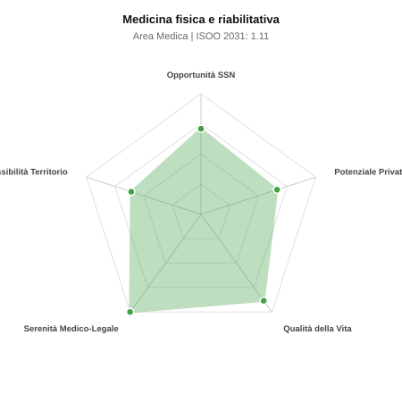

# Scheda di Orientamento: Medicina fisica e riabilitativa

[← Torna al Report Nazionale](../REPORT_NAZIONALE_MEDCAREER2031.md) | [Guida alla Consultazione](../GUIDA_ALLA_CONSULTAZIONE.md)

---

## 1. Profilo di Sintesi (Coorte SSM 2026–2031)

| Parametro | Valore / Dettaglio |
| :--- | :--- |
| **Area Disciplinare** | Medica |
| **Durata del Corso** | 4 anni |
| **Semaforo di Occupabilità al 2031** | 🟢 **VERDE CHIARO (Equilibrio Fisiologico / Buona Occupabilità)** |
| **Verdetto di Carriera** | **Equilibrio Fisiologico** |
| **Indice ISOO Nazionale (Baseline)** | **1.11** (Range Scenari: 0.94 – 1.33) |
| **Probabilità Assunzione Concorso SSN** | **71.0%** |
| **Qualità della Vita (QoL Score)** | **88 / 100** |
| **Redditività Lorda Annua Stimata (REP)**| **~122,900 €** (Netto stimato: ~67,600 €) |

### Inquadramento Clinico e Prospettiva Occupazionale
Recupero dell autonomia e funzione motoria, cognitiva e comunicativa in pazienti con disabilita neurologiche, ortopediche, reumatologiche e oncologiche.

> [!NOTE]
> **Prospettiva al 2031 per chi entra a novembre 2026**:
> Buon bilanciamento tra uscite e nuovi specialisti; accesso regolare al SSN tramite concorso e spazio nel settore convenzionato.

---

## 2. Flusso Formativo e Ricambio Generazionale

I dati ministeriali (MUR / MEF / ANAAO) evidenziano la seguente dinamica di ricambio della forza lavoro per il quinquennio 2026–2031:

- **Contratti annui stimati (media 2024-2026)**: 340 borse/anno
- **Totale contratti stanziati nel quinquennio**: 1,700
- **Tasso fisiologico di abbandono / riassegnazione**: 3.0%
- **Nuovi specialisti effettivi al 2031**: 1,649 medici formati
- **Specialisti SSN attivi censiti a inizio periodo**: 1,650
- **Uscite stimate per pensionamento (2026–2031)**: 627 dirigenti medici
- **Uscite per dimissioni volontarie / passaggio al privato**: 165 dirigenti medici
- **Fabbisogno netto di rimpiazzo SSN (con fattore demografico)**: 867 posti

---

## 3. Analisi Comparativa Multi-Scenario al 2031

Il modello Stock-Flow a 5 anni simula la convergenza tra domanda e offerta al momento del conseguimento del titolo specialistico sotto 3 differenti assetti normativi ed economici:

| Indicatore Occupazionale | Scenario 1: Baseline Inerziale | Scenario 2: Pletora Grave (Worst) | Scenario 3: Riforma Correttiva (Best) |
| :--- | :---: | :---: | :---: |
| **Uscite Totali SSN (Pensionamenti + Esodo)** | 792 | 650 | 903 |
| **Fabbisogno Netto Stimato SSN** | 867 | 657 | 978 |
| **Nuovi Diplomati Effettivi** | 1,649 | 1,731 | 1,402 |
| **Saldo Netto SSN (Nuovi - Fabbisogno)** | **+782** | **+1074** | **+424** |
| **Indice ISOO (Offerta / Domanda Totale)** | **1.11** | **1.33** | **0.94** |
| **Probabilità Assunzione Concorso SSN** | **71.0%** | **51.3%** | **94.2%** |
| **Verdetto Scenario** | Equilibrio Fisiologico | Competitivo / Rischio Saturazione | Equilibrio Fisiologico |

---

## 4. Quadro Territoriale: Domanda e Offerta nelle 21 Regioni e P.A.

La tabella seguente illustra la proiezione occupazionale al 2031 (Scenario Baseline) per ciascuna Regione e Provincia Autonoma, ordinata dal territorio con **maggior fabbisogno non coperto** a quello più saturo:

| Regione / P.A. | Medici Attivi 2026 | Uscite Totali SSN | Nuovi Assegnati | Saldo Netto 2031 | ISOO Reg. | Semaforo |
| :--- | :---: | :---: | :---: | :---: | :---: | :---: |
| Valle d'Aosta | 3 | 1 | 5 | +4 | 1.67 | 🔴 |
| Basilicata | 15 | 8 | 15 | +6 | 1.00 | 🟢 |
| Molise | 8 | 4 | 10 | +6 | 1.25 | 🟠 |
| P.A. Bolzano | 15 | 7 | 15 | +7 | 1.07 | 🟢 |
| P.A. Trento | 15 | 7 | 15 | +7 | 1.07 | 🟢 |
| Umbria | 24 | 11 | 24 | +12 | 1.14 | 🟢 |
| Abruzzo | 35 | 17 | 34 | +15 | 1.06 | 🟢 |
| Friuli-Venezia Giulia | 33 | 16 | 34 | +17 | 1.13 | 🟢 |
| Sardegna | 44 | 21 | 44 | +21 | 1.13 | 🟢 |
| Liguria | 42 | 21 | 44 | +21 | 1.13 | 🟢 |
| Marche | 41 | 20 | 44 | +22 | 1.16 | 🟠 |
| Calabria | 51 | 25 | 53 | +26 | 1.13 | 🟢 |
| Toscana | 102 | 49 | 102 | +49 | 1.12 | 🟢 |
| Puglia | 108 | 52 | 107 | +50 | 1.10 | 🟢 |
| Piemonte | 119 | 57 | 121 | +59 | 1.13 | 🟢 |
| Emilia-Romagna | 125 | 60 | 126 | +60 | 1.11 | 🟢 |
| Sicilia | 134 | 66 | 136 | +63 | 1.11 | 🟢 |
| Veneto | 136 | 63 | 136 | +66 | 1.13 | 🟢 |
| Campania | 156 | 75 | 155 | +71 | 1.09 | 🟢 |
| Lazio | 160 | 77 | 160 | +75 | 1.11 | 🟢 |
| Lombardia | 282 | 130 | 281 | +137 | 1.13 | 🟢 |

> [!TIP]
> **Dinamica Geografica**:
> Le regioni in verde presentano carenza strutturale con concorsi che si prevedono aperti e con elevata probabilita di vincita immediata. Nei territori contrassegnati in rosso, il numero di nuovi specialisti supera il ricambio fisiologico ospedaliero, rendendo necessaria una pianificazione extra-regionale o uno sbocco nella medicina privata.

---

## 5. Scorecard: Qualità della Vita e Redditività Economica

### Radar Chart Professionale a 5 Dimensioni

### Indicatori di Qualità della Vita (QoL Score: 88/100)
- **Notti di guardia attive medie al mese**: 0.5 turni/mese
- **Reperibilità notturne/festive medie al mese**: 1.0 turni/mese
- **Ore settimanali effettive stimate**: 38 ore (compresi straordinari operativi)
- **Classe di rischio medico-legale**: Classe 1 su 5
- **Indice di Burnout percepito nella disciplina**: 40 / 100

### Scomposizione Redditività Economica Potenziale (REP)
- **Retribuzione Base SSN + Indennità contrattuali stimate**: ~76,500 € lordi/anno
- **Potenziale Libera Professione / Attività intramuraria out-of-pocket**: ~46,400 € lordi/anno
- **Reddito Annuo Lordo Complessivo Stimato**: ~122,900 €
- **Stima Netta Annuale (aliquote IRPEF ordinarie + previdenza ENPAM)**: ~67,600 € netti/anno

---

## 6. Guida Clinico-Strategica per lo Specializzando

### Sub-Specializzazioni ad Alto Valore Aggiunto
Per differenziarsi sul mercato e acquisire una solida barriera all'ingresso professionale, si consiglia di costruire competenze nelle seguenti sotto-branche durante la scuola:
- **Neuroriabilitazione ad alta intensita (ictus, traumi cranici, lesioni midollari)**
- **Riabilitazione robotica ed esoscheletri per il cammino**
- **Riabilitazione ortopedica post-chirurgica e traumatica dello sport**
- **Interventistica riabilitativa ecoguidata e spasticita focale**

### Competenze Tecniche e Strumentali Raccomandate
Abilità pratiche da padroneggiare prima del diploma specialistico per massimizzare l'autonomia clinica:
- **Infiltrazioni articolari, periarticolari ed epidurali ecoguidate**
- **Iniezione tossina botulinica ecoguidata o con EMG per la spasticita**
- **Stesura Progetto Riabilitativo Individuale (PRI) e prescrizione protesica**
- **Valutazione baropodometrica e Gait Analysis**

### Sbocchi nel Mercato del Lavoro
Ottimo equilibrio tra SSN (reparti riabilitazione cod. 56 e lungodegenza) e settore privato accreditato (centri convenzionati, cliniche), oltre a libera professione.

### Strategia Territoriale e Mobilità
Elevata richiesta in tutta Italia legata alla cronicita e demografia; forte presenza di strutture convenzionate nel Centro-Sud.

### Gestione del Rischio Professionale e Work-Life Balance
Rischio medico-legale basso (Classe 1-2). Qualita della vita eccellente (QoL > 80): orari stabili, notti rarissime, nessun pronto soccorso.

---
[← Torna al Report Nazionale](../REPORT_NAZIONALE_MEDCAREER2031.md) | [Guida alla Consultazione](../GUIDA_ALLA_CONSULTAZIONE.md)
