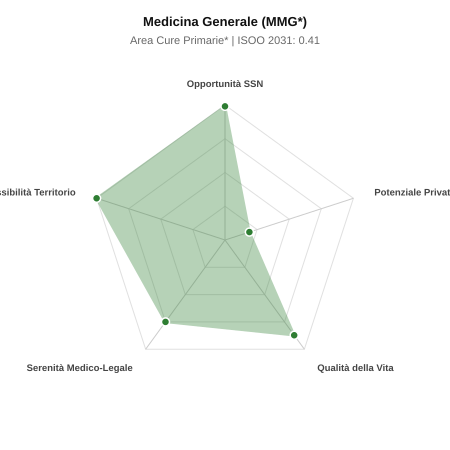

# Scheda di Orientamento: Medicina Generale (MMG*)

[← Torna al Report Nazionale](../REPORT_NAZIONALE_MEDCAREER2031.md) | [Guida alla Consultazione](../GUIDA_ALLA_CONSULTAZIONE.md)

---

## 1. Profilo di Sintesi (Coorte SSM 2026–2031)

| Parametro | Valore / Dettaglio |
| :--- | :--- |
| **Area Disciplinare** | Cure Primarie* |
| **Durata del Corso** | 3 anni |
| **Semaforo di Occupabilità al 2031** | 🟢 **VERDE SCURO (Carenza Elevata / Assunzione Immediata)** |
| **Verdetto di Carriera** | **Carenza Severa (Assunzione Immediata)** |
| **Indice ISOO Nazionale (Baseline)** | **0.41** (Range Scenari: 0.33 – 0.56) |
| **Probabilità Assunzione Concorso SSN** | **99.0%** |
| **Qualità della Vita (QoL Score)** | **87 / 100** |
| **Redditività Lorda Annua Stimata (REP)**| **~110,000 €** (Netto stimato: ~58,000 €) |

### Inquadramento Clinico e Prospettiva Occupazionale
Fondamento dell assistenza primaria sul territorio: presa in carico olistica, continuativa e longitudinale della persona e della comunita, gestione cronicita.

> [!NOTE]
> **Prospettiva al 2031 per chi entra a novembre 2026**:
> Posti vacanti diffusi e concorsi spesso deserti; altissima probabilità di assunzione prima del titolo o subito dopo (Decreto Calabria).

---

## 2. Flusso Formativo e Ricambio Generazionale

I dati ministeriali (MUR / MEF / ANAAO) evidenziano la seguente dinamica di ricambio della forza lavoro per il quinquennio 2026–2031:

- **Contratti annui stimati (media 2024-2026)**: 2,700 borse/anno
- **Totale contratti stanziati nel quinquennio**: 13,500
- **Tasso fisiologico di abbandono / riassegnazione**: 12.0%
- **Nuovi specialisti effettivi al 2031**: 11,880 medici formati
- **Specialisti SSN attivi censiti a inizio periodo**: 39,366
- **Uscite stimate per pensionamento (2026–2031)**: 21,258 dirigenti medici
- **Uscite per dimissioni volontarie / passaggio al privato**: 3,937 dirigenti medici
- **Fabbisogno netto di rimpiazzo SSN (con fattore demografico)**: 27,579 posti

---

## 3. Analisi Comparativa Multi-Scenario al 2031

Il modello Stock-Flow a 5 anni simula la convergenza tra domanda e offerta al momento del conseguimento del titolo specialistico sotto 3 differenti assetti normativi ed economici:

| Indicatore Occupazionale | Scenario 1: Baseline Inerziale | Scenario 2: Pletora Grave (Worst) | Scenario 3: Riforma Correttiva (Best) |
| :--- | :---: | :---: | :---: |
| **Uscite Totali SSN (Pensionamenti + Esodo)** | 25,195 | 20,549 | 28,777 |
| **Fabbisogno Netto Stimato SSN** | 27,579 | 20,770 | 31,152 |
| **Nuovi Diplomati Effettivi** | 11,880 | 12,474 | 10,692 |
| **Saldo Netto SSN (Nuovi - Fabbisogno)** | **-15699** | **-8296** | **-20460** |
| **Indice ISOO (Offerta / Domanda Totale)** | **0.41** | **0.56** | **0.33** |
| **Probabilità Assunzione Concorso SSN** | **99.0%** | **99.0%** | **99.0%** |
| **Verdetto Scenario** | Carenza Severa (Assunzione Immediata) | Carenza Severa (Assunzione Immediata) | Carenza Severa (Assunzione Immediata) |

---

## 4. Quadro Territoriale: Domanda e Offerta nelle 21 Regioni e P.A.

La tabella seguente illustra la proiezione occupazionale al 2031 (Scenario Baseline) per ciascuna Regione e Provincia Autonoma, ordinata dal territorio con **maggior fabbisogno non coperto** a quello più saturo:

| Regione / P.A. | Medici Attivi 2026 | Uscite Totali SSN | Nuovi Assegnati | Saldo Netto 2031 | ISOO Reg. | Semaforo |
| :--- | :---: | :---: | :---: | :---: | :---: | :---: |
| Lombardia | 6,721 | 4,120 | 2,028 | -2530 | 0.42 | 🟢 |
| Lazio | 3,813 | 2,440 | 1,153 | -1556 | 0.41 | 🟢 |
| Campania | 3,720 | 2,381 | 1,122 | -1536 | 0.40 | 🟢 |
| Sicilia | 3,190 | 2,128 | 964 | -1376 | 0.40 | 🟢 |
| Veneto | 3,244 | 1,988 | 981 | -1224 | 0.42 | 🟢 |
| Emilia-Romagna | 2,990 | 1,914 | 902 | -1198 | 0.41 | 🟢 |
| Piemonte | 2,842 | 1,819 | 858 | -1117 | 0.41 | 🟢 |
| Puglia | 2,582 | 1,652 | 779 | -1041 | 0.41 | 🟢 |
| Toscana | 2,444 | 1,564 | 739 | -964 | 0.41 | 🟢 |
| Calabria | 1,221 | 814 | 370 | -525 | 0.40 | 🟢 |
| Liguria | 1,010 | 674 | 304 | -427 | 0.40 | 🟢 |
| Sardegna | 1,038 | 665 | 312 | -420 | 0.41 | 🟢 |
| Marche | 988 | 633 | 299 | -394 | 0.41 | 🟢 |
| Abruzzo | 846 | 542 | 255 | -340 | 0.41 | 🟢 |
| Friuli-Venezia Giulia | 797 | 510 | 242 | -314 | 0.42 | 🟢 |
| Umbria | 568 | 364 | 172 | -225 | 0.41 | 🟢 |
| Basilicata | 351 | 234 | 106 | -150 | 0.40 | 🟢 |
| P.A. Bolzano | 362 | 222 | 110 | -141 | 0.42 | 🟢 |
| P.A. Trento | 366 | 225 | 110 | -141 | 0.42 | 🟢 |
| Molise | 191 | 127 | 57 | -81 | 0.40 | 🟢 |
| Valle d'Aosta | 82 | 52 | 26 | -31 | 0.43 | 🟢 |

> [!TIP]
> **Dinamica Geografica**:
> Le regioni in verde presentano carenza strutturale con concorsi che si prevedono aperti e con elevata probabilita di vincita immediata. Nei territori contrassegnati in rosso, il numero di nuovi specialisti supera il ricambio fisiologico ospedaliero, rendendo necessaria una pianificazione extra-regionale o uno sbocco nella medicina privata.

---

## 5. Scorecard: Qualità della Vita e Redditività Economica

### Radar Chart Professionale a 5 Dimensioni

### Indicatori di Qualità della Vita (QoL Score: 87/100)
- **Notti di guardia attive medie al mese**: 0.0 turni/mese
- **Reperibilità notturne/festive medie al mese**: 0.0 turni/mese
- **Ore settimanali effettive stimate**: 36 ore (compresi straordinari operativi)
- **Classe di rischio medico-legale**: Classe 2 su 5
- **Indice di Burnout percepito nella disciplina**: 60 / 100

### Scomposizione Redditività Economica Potenziale (REP)
- **Retribuzione Base SSN + Indennità contrattuali stimate**: ~96,700 € lordi/anno
- **Potenziale Libera Professione / Attività intramuraria out-of-pocket**: ~13,300 € lordi/anno
- **Reddito Annuo Lordo Complessivo Stimato**: ~110,000 €
- **Stima Netta Annuale (aliquote IRPEF ordinarie + previdenza ENPAM)**: ~58,000 € netti/anno

---

## 6. Guida Clinico-Strategica per lo Specializzando

### Sub-Specializzazioni ad Alto Valore Aggiunto
Per differenziarsi sul mercato e acquisire una solida barriera all'ingresso professionale, si consiglia di costruire competenze nelle seguenti sotto-branche durante la scuola:
- **Gestione patologie croniche (diabete, ipertensione, BPCO, scompenso) secondo PDTA**
- **Medicina d iniziativa, screening oncologici e prevenzione di comunita**
- **Cure domiciliari integrate (ADI) e palliative di base**
- **Aggregazioni Funzionali Territoriali (AFT) e Case della Comunita**

### Competenze Tecniche e Strumentali Raccomandate
Abilità pratiche da padroneggiare prima del diploma specialistico per massimizzare l'autonomia clinica:
- **Ecografia Point-of-Care (POCUS) ambulatoriale e domiciliare**
- **Elettrocardiografia di base, spirometria semplice e holter pressorio (ABPM)**
- **Chirurgia ambulatoriale minore (suture, asportazione lesioni cutanee)**
- **Cartella clinica orientata per problemi (SOAP) e telemedicina**

### Sbocchi nel Mercato del Lavoro
Opportunita storiche irripetibili: pensionamento di oltre il 54% dei medici convenzionati attivi entro il 2031. Assegnazione immediata della carenza e massimale di 1.500 assistiti.

### Strategia Territoriale e Mobilità
Carenza devastante in tutto il Centro-Nord (Lombardia, Veneto, Piemonte, Emilia-Romagna, Toscana). Liberta quasi totale di scelta della sede.

### Gestione del Rischio Professionale e Work-Life Balance
Rischio medico-legale basso (Classe 1). Ottima flessibilita negli orari di studio e medicina di gruppo; burocrazia gestibile con personale di segreteria/infermieristico.

---
[← Torna al Report Nazionale](../REPORT_NAZIONALE_MEDCAREER2031.md) | [Guida alla Consultazione](../GUIDA_ALLA_CONSULTAZIONE.md)
