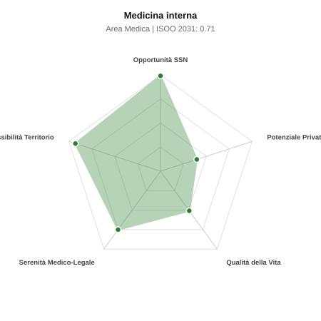

# Scheda di Orientamento: Medicina interna

[← Torna al Report Nazionale](../REPORT_NAZIONALE_MEDCAREER2031.md) | [Guida alla Consultazione](../GUIDA_ALLA_CONSULTAZIONE.md)

---

## 1. Profilo di Sintesi (Coorte SSM 2026–2031)

| Parametro | Valore / Dettaglio |
| :--- | :--- |
| **Area Disciplinare** | Medica |
| **Durata del Corso** | 4 anni |
| **Semaforo di Occupabilità al 2031** | 🟢 **VERDE SCURO (Carenza Elevata / Assunzione Immediata)** |
| **Verdetto di Carriera** | **Carenza Severa (Assunzione Immediata)** |
| **Indice ISOO Nazionale (Baseline)** | **0.71** (Range Scenari: 0.59 – 0.93) |
| **Probabilità Assunzione Concorso SSN** | **99.0%** |
| **Qualità della Vita (QoL Score)** | **51 / 100** |
| **Redditività Lorda Annua Stimata (REP)**| **~107,000 €** (Netto stimato: ~58,900 €) |

### Inquadramento Clinico e Prospettiva Occupazionale
La disciplina cardine della medicina ospedaliera: diagnosi e gestione di patologie complesse, multimorbidita, quadri atipici e coordinamento delle degenze acute.

> [!NOTE]
> **Prospettiva al 2031 per chi entra a novembre 2026**:
> Posti vacanti diffusi e concorsi spesso deserti; altissima probabilità di assunzione prima del titolo o subito dopo (Decreto Calabria).

---

## 2. Flusso Formativo e Ricambio Generazionale

I dati ministeriali (MUR / MEF / ANAAO) evidenziano la seguente dinamica di ricambio della forza lavoro per il quinquennio 2026–2031:

- **Contratti annui stimati (media 2024-2026)**: 810 borse/anno
- **Totale contratti stanziati nel quinquennio**: 4,050
- **Tasso fisiologico di abbandono / riassegnazione**: 12.0%
- **Nuovi specialisti effettivi al 2031**: 3,564 medici formati
- **Specialisti SSN attivi censiti a inizio periodo**: 8,000
- **Uscite stimate per pensionamento (2026–2031)**: 3,040 dirigenti medici
- **Uscite per dimissioni volontarie / passaggio al privato**: 800 dirigenti medici
- **Fabbisogno netto di rimpiazzo SSN (con fattore demografico)**: 4,203 posti

---

## 3. Analisi Comparativa Multi-Scenario al 2031

Il modello Stock-Flow a 5 anni simula la convergenza tra domanda e offerta al momento del conseguimento del titolo specialistico sotto 3 differenti assetti normativi ed economici:

| Indicatore Occupazionale | Scenario 1: Baseline Inerziale | Scenario 2: Pletora Grave (Worst) | Scenario 3: Riforma Correttiva (Best) |
| :--- | :---: | :---: | :---: |
| **Uscite Totali SSN (Pensionamenti + Esodo)** | 3,840 | 3,152 | 4,376 |
| **Fabbisogno Netto Stimato SSN** | 4,203 | 3,186 | 4,737 |
| **Nuovi Diplomati Effettivi** | 3,564 | 3,742 | 3,208 |
| **Saldo Netto SSN (Nuovi - Fabbisogno)** | **-639** | **+556** | **-1529** |
| **Indice ISOO (Offerta / Domanda Totale)** | **0.71** | **0.93** | **0.59** |
| **Probabilità Assunzione Concorso SSN** | **99.0%** | **99.0%** | **99.0%** |
| **Verdetto Scenario** | Carenza Severa (Assunzione Immediata) | Equilibrio Fisiologico | Carenza Severa (Assunzione Immediata) |

---

## 4. Quadro Territoriale: Domanda e Offerta nelle 21 Regioni e P.A.

La tabella seguente illustra la proiezione occupazionale al 2031 (Scenario Baseline) per ciascuna Regione e Provincia Autonoma, ordinata dal territorio con **maggior fabbisogno non coperto** a quello più saturo:

| Regione / P.A. | Medici Attivi 2026 | Uscite Totali SSN | Nuovi Assegnati | Saldo Netto 2031 | ISOO Reg. | Semaforo |
| :--- | :---: | :---: | :---: | :---: | :---: | :---: |
| Lombardia | 1,366 | 630 | 607 | -90 | 0.73 | 🟢 |
| Lazio | 775 | 372 | 343 | -70 | 0.70 | 🟢 |
| Sicilia | 648 | 324 | 290 | -66 | 0.69 | 🟢 |
| Campania | 756 | 363 | 339 | -66 | 0.71 | 🟢 |
| Emilia-Romagna | 608 | 292 | 273 | -47 | 0.72 | 🟢 |
| Piemonte | 578 | 278 | 255 | -47 | 0.71 | 🟢 |
| Puglia | 525 | 252 | 233 | -45 | 0.71 | 🟢 |
| Veneto | 659 | 304 | 295 | -42 | 0.73 | 🟢 |
| Toscana | 497 | 239 | 220 | -40 | 0.71 | 🟢 |
| Calabria | 248 | 124 | 110 | -26 | 0.69 | 🟢 |
| Liguria | 205 | 102 | 92 | -19 | 0.70 | 🟢 |
| Sardegna | 211 | 101 | 92 | -19 | 0.70 | 🟢 |
| Marche | 201 | 96 | 88 | -17 | 0.70 | 🟢 |
| Abruzzo | 172 | 82 | 75 | -15 | 0.70 | 🟢 |
| Friuli-Venezia Giulia | 162 | 78 | 70 | -15 | 0.69 | 🟢 |
| Umbria | 115 | 56 | 53 | -8 | 0.73 | 🟢 |
| P.A. Bolzano | 74 | 34 | 31 | -8 | 0.67 | 🟢 |
| Basilicata | 71 | 35 | 31 | -7 | 0.69 | 🟢 |
| Molise | 39 | 20 | 18 | -4 | 0.69 | 🟢 |
| P.A. Trento | 74 | 34 | 35 | -3 | 0.76 | 🟢 |
| Valle d'Aosta | 17 | 8 | 9 | 0 | 0.82 | 🟢 |

> [!TIP]
> **Dinamica Geografica**:
> Le regioni in verde presentano carenza strutturale con concorsi che si prevedono aperti e con elevata probabilita di vincita immediata. Nei territori contrassegnati in rosso, il numero di nuovi specialisti supera il ricambio fisiologico ospedaliero, rendendo necessaria una pianificazione extra-regionale o uno sbocco nella medicina privata.

---

## 5. Scorecard: Qualità della Vita e Redditività Economica

### Radar Chart Professionale a 5 Dimensioni

### Indicatori di Qualità della Vita (QoL Score: 51/100)
- **Notti di guardia attive medie al mese**: 4.0 turni/mese
- **Reperibilità notturne/festive medie al mese**: 2.5 turni/mese
- **Ore settimanali effettive stimate**: 45 ore (compresi straordinari operativi)
- **Classe di rischio medico-legale**: Classe 2 su 5
- **Indice di Burnout percepito nella disciplina**: 75 / 100

### Scomposizione Redditività Economica Potenziale (REP)
- **Retribuzione Base SSN + Indennità contrattuali stimate**: ~79,300 € lordi/anno
- **Potenziale Libera Professione / Attività intramuraria out-of-pocket**: ~27,700 € lordi/anno
- **Reddito Annuo Lordo Complessivo Stimato**: ~107,000 €
- **Stima Netta Annuale (aliquote IRPEF ordinarie + previdenza ENPAM)**: ~58,900 € netti/anno

---

## 6. Guida Clinico-Strategica per lo Specializzando

### Sub-Specializzazioni ad Alto Valore Aggiunto
Per differenziarsi sul mercato e acquisire una solida barriera all'ingresso professionale, si consiglia di costruire competenze nelle seguenti sotto-branche durante la scuola:
- **Ecografia clinica internistica Point-of-Care (POCUS) multisistemica**
- **Medicina vascolare e trombosi (tromboembolismo, anticoagulazione)**
- **Epatologia internistica e malattie autoimmuni sistemiche complesse**
- **Sub-intensiva medica e gestione del paziente instabile**

### Competenze Tecniche e Strumentali Raccomandate
Abilità pratiche da padroneggiare prima del diploma specialistico per massimizzare l'autonomia clinica:
- **Ecografia internistica addome, torace e tronchi sovraortici**
- **Paracentesi, toracocentesi diagnostica/evacuativa ed emogasanalisi**
- **Ventilazione non invasiva (CPAP/BiPAP) e insufficienze d organo acute**
- **Riconciliazione terapeutica e deprescribing nell anziano**

### Sbocchi nel Mercato del Lavoro
Richiesta massiccia e ininterrotta nei concorsi pubblici SSN: le Medicine Interne sono i reparti con piu posti letto e carenza d organico cronica. Assunzione garantita.

### Strategia Territoriale e Mobilità
Carenza di internisti in tutta la Penisola, con estrema facilita di reclutamento sia negli Hub che negli Spoke.

### Gestione del Rischio Professionale e Work-Life Balance
Rischio medico-legale medio-alto (Classe 3-4) per la fragilita dei degenti. Ritmi ospedalieri intensi con frequenti guardie notturne dipartimentali e festivi.

---
[← Torna al Report Nazionale](../REPORT_NAZIONALE_MEDCAREER2031.md) | [Guida alla Consultazione](../GUIDA_ALLA_CONSULTAZIONE.md)
