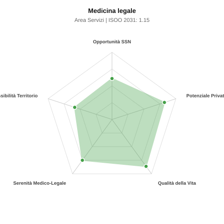

# Scheda di Orientamento: Medicina legale

[← Torna al Report Nazionale](../REPORT_NAZIONALE_MEDCAREER2031.md) | [Guida alla Consultazione](../GUIDA_ALLA_CONSULTAZIONE.md)

---

## 1. Profilo di Sintesi (Coorte SSM 2026–2031)

| Parametro | Valore / Dettaglio |
| :--- | :--- |
| **Area Disciplinare** | Servizi |
| **Durata del Corso** | 4 anni |
| **Semaforo di Occupabilità al 2031** | 🟢 **VERDE CHIARO (Equilibrio Fisiologico / Buona Occupabilità)** |
| **Verdetto di Carriera** | **Equilibrio Fisiologico** |
| **Indice ISOO Nazionale (Baseline)** | **1.15** (Range Scenari: 0.99 – 1.28) |
| **Probabilità Assunzione Concorso SSN** | **60.9%** |
| **Qualità della Vita (QoL Score)** | **86 / 100** |
| **Redditività Lorda Annua Stimata (REP)**| **~133,400 €** (Netto stimato: ~73,400 €) |

### Inquadramento Clinico e Prospettiva Occupazionale
Applicazione delle scienze mediche al diritto civile, penale, assicurativo e deontologico: accertamento causale, danno biologico e responsabilita sanitaria.

> [!NOTE]
> **Prospettiva al 2031 per chi entra a novembre 2026**:
> Buon bilanciamento tra uscite e nuovi specialisti; accesso regolare al SSN tramite concorso e spazio nel settore convenzionato.

---

## 2. Flusso Formativo e Ricambio Generazionale

I dati ministeriali (MUR / MEF / ANAAO) evidenziano la seguente dinamica di ricambio della forza lavoro per il quinquennio 2026–2031:

- **Contratti annui stimati (media 2024-2026)**: 155 borse/anno
- **Totale contratti stanziati nel quinquennio**: 775
- **Tasso fisiologico di abbandono / riassegnazione**: 3.0%
- **Nuovi specialisti effettivi al 2031**: 752 medici formati
- **Specialisti SSN attivi censiti a inizio periodo**: 650
- **Uscite stimate per pensionamento (2026–2031)**: 247 dirigenti medici
- **Uscite per dimissioni volontarie / passaggio al privato**: 65 dirigenti medici
- **Fabbisogno netto di rimpiazzo SSN (con fattore demografico)**: 311 posti

---

## 3. Analisi Comparativa Multi-Scenario al 2031

Il modello Stock-Flow a 5 anni simula la convergenza tra domanda e offerta al momento del conseguimento del titolo specialistico sotto 3 differenti assetti normativi ed economici:

| Indicatore Occupazionale | Scenario 1: Baseline Inerziale | Scenario 2: Pletora Grave (Worst) | Scenario 3: Riforma Correttiva (Best) |
| :--- | :---: | :---: | :---: |
| **Uscite Totali SSN (Pensionamenti + Esodo)** | 312 | 256 | 356 |
| **Fabbisogno Netto Stimato SSN** | 311 | 255 | 355 |
| **Nuovi Diplomati Effettivi** | 752 | 789 | 639 |
| **Saldo Netto SSN (Nuovi - Fabbisogno)** | **+441** | **+534** | **+284** |
| **Indice ISOO (Offerta / Domanda Totale)** | **1.15** | **1.28** | **0.99** |
| **Probabilità Assunzione Concorso SSN** | **60.9%** | **47.6%** | **81.9%** |
| **Verdetto Scenario** | Equilibrio Fisiologico | Competitivo / Rischio Saturazione | Equilibrio Fisiologico |

---

## 4. Quadro Territoriale: Domanda e Offerta nelle 21 Regioni e P.A.

La tabella seguente illustra la proiezione occupazionale al 2031 (Scenario Baseline) per ciascuna Regione e Provincia Autonoma, ordinata dal territorio con **maggior fabbisogno non coperto** a quello più saturo:

| Regione / P.A. | Medici Attivi 2026 | Uscite Totali SSN | Nuovi Assegnati | Saldo Netto 2031 | ISOO Reg. | Semaforo |
| :--- | :---: | :---: | :---: | :---: | :---: | :---: |
| Valle d'Aosta | 1 | 0 | 0 | 0 | 2.00 | 🔴 |
| Basilicata | 6 | 3 | 5 | +2 | 1.00 | 🟢 |
| P.A. Bolzano | 6 | 3 | 5 | +2 | 1.00 | 🟢 |
| P.A. Trento | 6 | 3 | 5 | +2 | 1.00 | 🟢 |
| Molise | 3 | 1 | 5 | +4 | 1.67 | 🔴 |
| Umbria | 9 | 4 | 10 | +6 | 1.11 | 🟢 |
| Friuli-Venezia Giulia | 13 | 6 | 15 | +9 | 1.15 | 🟠 |
| Abruzzo | 14 | 6 | 15 | +9 | 1.15 | 🟠 |
| Liguria | 17 | 9 | 19 | +10 | 1.06 | 🟢 |
| Marche | 16 | 8 | 19 | +11 | 1.12 | 🟢 |
| Sardegna | 17 | 8 | 19 | +11 | 1.12 | 🟢 |
| Calabria | 20 | 10 | 24 | +14 | 1.14 | 🟢 |
| Puglia | 43 | 20 | 48 | +28 | 1.14 | 🟢 |
| Toscana | 40 | 19 | 48 | +29 | 1.17 | 🟠 |
| Piemonte | 47 | 23 | 53 | +30 | 1.13 | 🟢 |
| Emilia-Romagna | 49 | 24 | 58 | +34 | 1.14 | 🟢 |
| Sicilia | 53 | 26 | 63 | +37 | 1.15 | 🟢 |
| Veneto | 54 | 24 | 63 | +39 | 1.19 | 🟠 |
| Lazio | 63 | 30 | 73 | +43 | 1.14 | 🟢 |
| Campania | 61 | 29 | 73 | +44 | 1.16 | 🟠 |
| Lombardia | 111 | 51 | 126 | +75 | 1.16 | 🟠 |

> [!TIP]
> **Dinamica Geografica**:
> Le regioni in verde presentano carenza strutturale con concorsi che si prevedono aperti e con elevata probabilita di vincita immediata. Nei territori contrassegnati in rosso, il numero di nuovi specialisti supera il ricambio fisiologico ospedaliero, rendendo necessaria una pianificazione extra-regionale o uno sbocco nella medicina privata.

---

## 5. Scorecard: Qualità della Vita e Redditività Economica

### Radar Chart Professionale a 5 Dimensioni

### Indicatori di Qualità della Vita (QoL Score: 86/100)
- **Notti di guardia attive medie al mese**: 0.0 turni/mese
- **Reperibilità notturne/festive medie al mese**: 1.0 turni/mese
- **Ore settimanali effettive stimate**: 38 ore (compresi straordinari operativi)
- **Classe di rischio medico-legale**: Classe 2 su 5
- **Indice di Burnout percepito nella disciplina**: 45 / 100

### Scomposizione Redditività Economica Potenziale (REP)
- **Retribuzione Base SSN + Indennità contrattuali stimate**: ~76,000 € lordi/anno
- **Potenziale Libera Professione / Attività intramuraria out-of-pocket**: ~57,400 € lordi/anno
- **Reddito Annuo Lordo Complessivo Stimato**: ~133,400 €
- **Stima Netta Annuale (aliquote IRPEF ordinarie + previdenza ENPAM)**: ~73,400 € netti/anno

---

## 6. Guida Clinico-Strategica per lo Specializzando

### Sub-Specializzazioni ad Alto Valore Aggiunto
Per differenziarsi sul mercato e acquisire una solida barriera all'ingresso professionale, si consiglia di costruire competenze nelle seguenti sotto-branche durante la scuola:
- **Patologia forense, tanatologia e autopsie giudiziarie**
- **Responsabilita professionale sanitaria e contenzioso da malpractice**
- **Medicina legale previdenziale (INPS, INAIL) e invalidita civile (L. 104)**
- **Medicina assicurativa privata (ramo infortuni e RC terzi/auto)**

### Competenze Tecniche e Strumentali Raccomandate
Abilità pratiche da padroneggiare prima del diploma specialistico per massimizzare l'autonomia clinica:
- **Esecuzione autopsie giudiziarie e prelievi medico-legali**
- **Stesura perizie e consulenze tecniche CTU (tribunali) e CTP**
- **Valutazione tabellare del danno alla persona (micro/macropermanenti)**
- **Comitati valutazione sinistri (CVS) aziendali e audit di clinical governance**

### Sbocchi nel Mercato del Lavoro
Triplice canale occupazionale: ruoli dirigenziali SSN, enti previdenziali pubblici (INPS, INAIL per concorso) e libera professione peritale pura ad alta redditivita.

### Strategia Territoriale e Mobilità
Opportunita su base provinciale legate a tribunali, sedi INPS e assicurazioni; mercato peritale privato molto redditizio.

### Gestione del Rischio Professionale e Work-Life Balance
Rischio medico-legale nullo sulla malpractice clinica (Classe 1). Qualita della vita superba: nessun turno notturno, orari totalmente gestibili in autonomia.

---
[← Torna al Report Nazionale](../REPORT_NAZIONALE_MEDCAREER2031.md) | [Guida alla Consultazione](../GUIDA_ALLA_CONSULTAZIONE.md)
