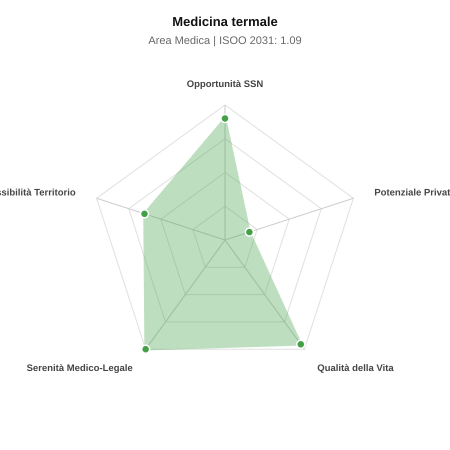

# Scheda di Orientamento: Medicina termale

[← Torna al Report Nazionale](../REPORT_NAZIONALE_MEDCAREER2031.md) | [Guida alla Consultazione](../GUIDA_ALLA_CONSULTAZIONE.md)

---

## 1. Profilo di Sintesi (Coorte SSM 2026–2031)

| Parametro | Valore / Dettaglio |
| :--- | :--- |
| **Area Disciplinare** | Medica |
| **Durata del Corso** | 4 anni |
| **Semaforo di Occupabilità al 2031** | 🟢 **VERDE CHIARO (Equilibrio Fisiologico / Buona Occupabilità)** |
| **Verdetto di Carriera** | **Equilibrio Fisiologico** |
| **Indice ISOO Nazionale (Baseline)** | **1.09** (Range Scenari: 0.85 – 1.44) |
| **Probabilità Assunzione Concorso SSN** | **90.0%** |
| **Qualità della Vita (QoL Score)** | **96 / 100** |
| **Redditività Lorda Annua Stimata (REP)**| **~89,300 €** (Netto stimato: ~49,100 €) |

### Inquadramento Clinico e Prospettiva Occupazionale
Uso a fini preventivi, curativi e riabilitativi delle acque minerali, fanghi e idroterapia per patologie croniche osteoarticolari, respiratorie e dermatologiche.

> [!NOTE]
> **Prospettiva al 2031 per chi entra a novembre 2026**:
> Buon bilanciamento tra uscite e nuovi specialisti; accesso regolare al SSN tramite concorso e spazio nel settore convenzionato.

---

## 2. Flusso Formativo e Ricambio Generazionale

I dati ministeriali (MUR / MEF / ANAAO) evidenziano la seguente dinamica di ricambio della forza lavoro per il quinquennio 2026–2031:

- **Contratti annui stimati (media 2024-2026)**: 5 borse/anno
- **Totale contratti stanziati nel quinquennio**: 25
- **Tasso fisiologico di abbandono / riassegnazione**: 50.0%
- **Nuovi specialisti effettivi al 2031**: 12 medici formati
- **Specialisti SSN attivi censiti a inizio periodo**: 20
- **Uscite stimate per pensionamento (2026–2031)**: 8 dirigenti medici
- **Uscite per dimissioni volontarie / passaggio al privato**: 2 dirigenti medici
- **Fabbisogno netto di rimpiazzo SSN (con fattore demografico)**: 10 posti

---

## 3. Analisi Comparativa Multi-Scenario al 2031

Il modello Stock-Flow a 5 anni simula la convergenza tra domanda e offerta al momento del conseguimento del titolo specialistico sotto 3 differenti assetti normativi ed economici:

| Indicatore Occupazionale | Scenario 1: Baseline Inerziale | Scenario 2: Pletora Grave (Worst) | Scenario 3: Riforma Correttiva (Best) |
| :--- | :---: | :---: | :---: |
| **Uscite Totali SSN (Pensionamenti + Esodo)** | 10 | 8 | 11 |
| **Fabbisogno Netto Stimato SSN** | 10 | 8 | 12 |
| **Nuovi Diplomati Effettivi** | 12 | 13 | 11 |
| **Saldo Netto SSN (Nuovi - Fabbisogno)** | **+2** | **+5** | **-1** |
| **Indice ISOO (Offerta / Domanda Totale)** | **1.09** | **1.44** | **0.85** |
| **Probabilità Assunzione Concorso SSN** | **90.0%** | **66.5%** | **99.0%** |
| **Verdetto Scenario** | Equilibrio Fisiologico | Competitivo / Rischio Saturazione | Equilibrio Fisiologico |

---

## 4. Quadro Territoriale: Domanda e Offerta nelle 21 Regioni e P.A.

La tabella seguente illustra la proiezione occupazionale al 2031 (Scenario Baseline) per ciascuna Regione e Provincia Autonoma, ordinata dal territorio con **maggior fabbisogno non coperto** a quello più saturo:

| Regione / P.A. | Medici Attivi 2026 | Uscite Totali SSN | Nuovi Assegnati | Saldo Netto 2031 | ISOO Reg. | Semaforo |
| :--- | :---: | :---: | :---: | :---: | :---: | :---: |
| Campania | 2 | 1 | 0 | -1 | 0.00 | 🟢 |
| Emilia-Romagna | 2 | 1 | 0 | -1 | 0.00 | 🟢 |
| Lazio | 2 | 1 | 0 | -1 | 0.00 | 🟢 |
| Sicilia | 2 | 1 | 0 | -1 | 0.00 | 🟢 |
| Veneto | 2 | 1 | 0 | -1 | 0.00 | 🟢 |
| Calabria | 1 | 0 | 0 | 0 | 2.00 | 🔴 |
| Friuli-Venezia Giulia | 1 | 0 | 0 | 0 | 2.00 | 🔴 |
| Basilicata | 1 | 0 | 0 | 0 | 2.00 | 🔴 |
| Liguria | 1 | 0 | 0 | 0 | 2.00 | 🔴 |
| Marche | 1 | 0 | 0 | 0 | 2.00 | 🔴 |
| Piemonte | 1 | 0 | 0 | 0 | 2.00 | 🔴 |
| Molise | 1 | 0 | 0 | 0 | 2.00 | 🔴 |
| Sardegna | 1 | 0 | 0 | 0 | 2.00 | 🔴 |
| Puglia | 1 | 0 | 0 | 0 | 2.00 | 🔴 |
| Toscana | 1 | 0 | 0 | 0 | 2.00 | 🔴 |
| Abruzzo | 1 | 0 | 0 | 0 | 2.00 | 🔴 |
| P.A. Trento | 1 | 0 | 0 | 0 | 2.00 | 🔴 |
| Umbria | 1 | 0 | 0 | 0 | 2.00 | 🔴 |
| Valle d'Aosta | 1 | 0 | 0 | 0 | 2.00 | 🔴 |
| P.A. Bolzano | 1 | 0 | 0 | 0 | 2.00 | 🔴 |
| Lombardia | 3 | 1 | 2 | +1 | 2.00 | 🔴 |

> [!TIP]
> **Dinamica Geografica**:
> Le regioni in verde presentano carenza strutturale con concorsi che si prevedono aperti e con elevata probabilita di vincita immediata. Nei territori contrassegnati in rosso, il numero di nuovi specialisti supera il ricambio fisiologico ospedaliero, rendendo necessaria una pianificazione extra-regionale o uno sbocco nella medicina privata.

---

## 5. Scorecard: Qualità della Vita e Redditività Economica

### Radar Chart Professionale a 5 Dimensioni

### Indicatori di Qualità della Vita (QoL Score: 96/100)
- **Notti di guardia attive medie al mese**: 0.0 turni/mese
- **Reperibilità notturne/festive medie al mese**: 0.0 turni/mese
- **Ore settimanali effettive stimate**: 38 ore (compresi straordinari operativi)
- **Classe di rischio medico-legale**: Classe 1 su 5
- **Indice di Burnout percepito nella disciplina**: 30 / 100

### Scomposizione Redditività Economica Potenziale (REP)
- **Retribuzione Base SSN + Indennità contrattuali stimate**: ~76,000 € lordi/anno
- **Potenziale Libera Professione / Attività intramuraria out-of-pocket**: ~13,300 € lordi/anno
- **Reddito Annuo Lordo Complessivo Stimato**: ~89,300 €
- **Stima Netta Annuale (aliquote IRPEF ordinarie + previdenza ENPAM)**: ~49,100 € netti/anno

---

## 6. Guida Clinico-Strategica per lo Specializzando

### Sub-Specializzazioni ad Alto Valore Aggiunto
Per differenziarsi sul mercato e acquisire una solida barriera all'ingresso professionale, si consiglia di costruire competenze nelle seguenti sotto-branche durante la scuola:
- **Riabilitazione termale in acqua (idrokinesiterapia) per esiti protesici/traumi**
- **Terapie inalatorie termali e crenoterapia per rinosinusiti croniche**
- **Fangoterapia per artrosi e fibromialgia**
- **Direzione sanitaria di complessi termali e medical wellness**

### Competenze Tecniche e Strumentali Raccomandate
Abilità pratiche da padroneggiare prima del diploma specialistico per massimizzare l'autonomia clinica:
- **Prescrizione protocolli crenoterapici personalizzati**
- **Valutazione funzionale vie aeree e apparato muscolo-scheletrico**
- **Supervisione igienico-sanitaria matrici termali**
- **Integrazione cicli termali nei percorsi riabilitativi SSN**

### Sbocchi nel Mercato del Lavoro
Posti SSN ospedalieri assenti; sbocco concentrato nella direzione medica di stabilimenti termali, resort benessere e strutture alberghiere d alto profilo.

### Strategia Territoriale e Mobilità
Mercato circoscritto alle aree termali (Veneto, Toscana, Campania, Emilia-Romagna, Trentino, Lazio).

### Gestione del Rischio Professionale e Work-Life Balance
Rischio medico-legale irrilevante (Classe 1). Qualita della vita eccellente, ritmi rilassati, completa assenza di turni notturni.

---
[← Torna al Report Nazionale](../REPORT_NAZIONALE_MEDCAREER2031.md) | [Guida alla Consultazione](../GUIDA_ALLA_CONSULTAZIONE.md)
