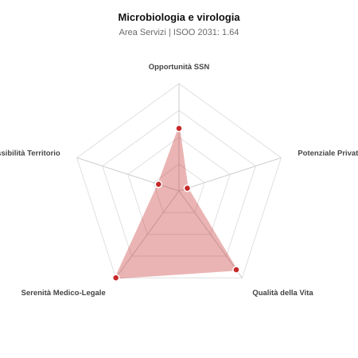

# Scheda di Orientamento: Microbiologia e virologia

[← Torna al Report Nazionale](../REPORT_NAZIONALE_MEDCAREER2031.md) | [Guida alla Consultazione](../GUIDA_ALLA_CONSULTAZIONE.md)

---

## 1. Profilo di Sintesi (Coorte SSM 2026–2031)

| Parametro | Valore / Dettaglio |
| :--- | :--- |
| **Area Disciplinare** | Servizi |
| **Durata del Corso** | 4 anni |
| **Semaforo di Occupabilità al 2031** | 🔴 **ROSSO (Rischio Pletora / Elevata Saturazione SSN)** |
| **Verdetto di Carriera** | **Pletora / Grave Saturazione** |
| **Indice ISOO Nazionale (Baseline)** | **1.64** (Range Scenari: 1.32 – 2.06) |
| **Probabilità Assunzione Concorso SSN** | **58.2%** |
| **Qualità della Vita (QoL Score)** | **91 / 100** |
| **Redditività Lorda Annua Stimata (REP)**| **~81,700 €** (Netto stimato: ~44,900 €) |

### Inquadramento Clinico e Prospettiva Occupazionale
Diagnosi di laboratorio delle infezioni batteriche, virali, fungine mediante colture, antibiogrammi, diagnostica molecolare e sequenziamento genomico.

> [!NOTE]
> **Prospettiva al 2031 per chi entra a novembre 2026**:
> Forte esubero di specialisti rispetto alle posizioni ospedaliere disponibili al 2031; altissima concorrenza nei concorsi, sbocco quasi obbligato nella libera professione pura.

---

## 2. Flusso Formativo e Ricambio Generazionale

I dati ministeriali (MUR / MEF / ANAAO) evidenziano la seguente dinamica di ricambio della forza lavoro per il quinquennio 2026–2031:

- **Contratti annui stimati (media 2024-2026)**: 110 borse/anno
- **Totale contratti stanziati nel quinquennio**: 550
- **Tasso fisiologico di abbandono / riassegnazione**: 38.0%
- **Nuovi specialisti effettivi al 2031**: 341 medici formati
- **Specialisti SSN attivi censiti a inizio periodo**: 400
- **Uscite stimate per pensionamento (2026–2031)**: 152 dirigenti medici
- **Uscite per dimissioni volontarie / passaggio al privato**: 40 dirigenti medici
- **Fabbisogno netto di rimpiazzo SSN (con fattore demografico)**: 192 posti

---

## 3. Analisi Comparativa Multi-Scenario al 2031

Il modello Stock-Flow a 5 anni simula la convergenza tra domanda e offerta al momento del conseguimento del titolo specialistico sotto 3 differenti assetti normativi ed economici:

| Indicatore Occupazionale | Scenario 1: Baseline Inerziale | Scenario 2: Pletora Grave (Worst) | Scenario 3: Riforma Correttiva (Best) |
| :--- | :---: | :---: | :---: |
| **Uscite Totali SSN (Pensionamenti + Esodo)** | 192 | 158 | 219 |
| **Fabbisogno Netto Stimato SSN** | 192 | 158 | 218 |
| **Nuovi Diplomati Effettivi** | 341 | 358 | 307 |
| **Saldo Netto SSN (Nuovi - Fabbisogno)** | **+149** | **+200** | **+89** |
| **Indice ISOO (Offerta / Domanda Totale)** | **1.64** | **2.06** | **1.32** |
| **Probabilità Assunzione Concorso SSN** | **58.2%** | **45.6%** | **73.4%** |
| **Verdetto Scenario** | Pletora / Grave Saturazione | Pletora / Grave Saturazione | Competitivo / Rischio Saturazione |

---

## 4. Quadro Territoriale: Domanda e Offerta nelle 21 Regioni e P.A.

La tabella seguente illustra la proiezione occupazionale al 2031 (Scenario Baseline) per ciascuna Regione e Provincia Autonoma, ordinata dal territorio con **maggior fabbisogno non coperto** a quello più saturo:

| Regione / P.A. | Medici Attivi 2026 | Uscite Totali SSN | Nuovi Assegnati | Saldo Netto 2031 | ISOO Reg. | Semaforo |
| :--- | :---: | :---: | :---: | :---: | :---: | :---: |
| Valle d'Aosta | 1 | 0 | 0 | 0 | 2.00 | 🔴 |
| Basilicata | 4 | 2 | 3 | +1 | 1.50 | 🔴 |
| Friuli-Venezia Giulia | 8 | 4 | 6 | +2 | 1.50 | 🔴 |
| Abruzzo | 9 | 4 | 6 | +2 | 1.50 | 🔴 |
| P.A. Bolzano | 4 | 1 | 3 | +2 | 3.00 | 🔴 |
| P.A. Trento | 4 | 1 | 3 | +2 | 3.00 | 🔴 |
| Molise | 2 | 1 | 3 | +2 | 3.00 | 🔴 |
| Calabria | 12 | 6 | 9 | +3 | 1.50 | 🔴 |
| Umbria | 6 | 3 | 6 | +3 | 2.00 | 🔴 |
| Liguria | 10 | 5 | 9 | +4 | 1.80 | 🔴 |
| Marche | 10 | 5 | 9 | +4 | 1.80 | 🔴 |
| Sardegna | 11 | 5 | 9 | +4 | 1.80 | 🔴 |
| Puglia | 26 | 13 | 22 | +9 | 1.57 | 🔴 |
| Toscana | 25 | 12 | 22 | +10 | 1.69 | 🔴 |
| Emilia-Romagna | 30 | 14 | 25 | +11 | 1.67 | 🔴 |
| Piemonte | 29 | 14 | 25 | +11 | 1.67 | 🔴 |
| Sicilia | 32 | 16 | 28 | +12 | 1.65 | 🔴 |
| Veneto | 33 | 15 | 28 | +13 | 1.75 | 🔴 |
| Campania | 38 | 18 | 31 | +13 | 1.63 | 🔴 |
| Lazio | 39 | 19 | 34 | +15 | 1.62 | 🔴 |
| Lombardia | 68 | 32 | 59 | +27 | 1.69 | 🔴 |

> [!TIP]
> **Dinamica Geografica**:
> Le regioni in verde presentano carenza strutturale con concorsi che si prevedono aperti e con elevata probabilita di vincita immediata. Nei territori contrassegnati in rosso, il numero di nuovi specialisti supera il ricambio fisiologico ospedaliero, rendendo necessaria una pianificazione extra-regionale o uno sbocco nella medicina privata.

---

## 5. Scorecard: Qualità della Vita e Redditività Economica

### Radar Chart Professionale a 5 Dimensioni

### Indicatori di Qualità della Vita (QoL Score: 91/100)
- **Notti di guardia attive medie al mese**: 0.0 turni/mese
- **Reperibilità notturne/festive medie al mese**: 1.0 turni/mese
- **Ore settimanali effettive stimate**: 38 ore (compresi straordinari operativi)
- **Classe di rischio medico-legale**: Classe 1 su 5
- **Indice di Burnout percepito nella disciplina**: 40 / 100

### Scomposizione Redditività Economica Potenziale (REP)
- **Retribuzione Base SSN + Indennità contrattuali stimate**: ~76,000 € lordi/anno
- **Potenziale Libera Professione / Attività intramuraria out-of-pocket**: ~5,700 € lordi/anno
- **Reddito Annuo Lordo Complessivo Stimato**: ~81,700 €
- **Stima Netta Annuale (aliquote IRPEF ordinarie + previdenza ENPAM)**: ~44,900 € netti/anno

---

## 6. Guida Clinico-Strategica per lo Specializzando

### Sub-Specializzazioni ad Alto Valore Aggiunto
Per differenziarsi sul mercato e acquisire una solida barriera all'ingresso professionale, si consiglia di costruire competenze nelle seguenti sotto-branche durante la scuola:
- **Diagnostica molecolare rapida dei patogeni respiratori e liquor (pannelli sindromici)**
- **Sorveglianza epidemiologica e genomica resistenze antimicrobiche (AMR)**
- **Virologia clinica e monitoraggio cariche virali (HIV, epatiti, virus respiratori)**
- **Microbiologia dell ospite immunocompromesso e protesico**

### Competenze Tecniche e Strumentali Raccomandate
Abilità pratiche da padroneggiare prima del diploma specialistico per massimizzare l'autonomia clinica:
- **Validazione antibiogrammi fenotipici e MIC automatizzata ed Etest**
- **Spettrometria di massa MALDI-TOF per identificazione microbica**
- **Real-Time PCR e sequenziamento NGS patogeni**
- **Refertazione interpretata in ottica di stewardship antimicrobica**

### Sbocchi nel Mercato del Lavoro
Posti nei laboratori ospedalieri di analisi SSN, ARPA e Istituti Zooprofilattici (IZS); opportunita nell industria diagnostica e grandi reti private.

### Strategia Territoriale e Mobilità
Turnover concentrato nei laboratori Hub ospedalieri e centralizzati ASL su base regionale.

### Gestione del Rischio Professionale e Work-Life Balance
Rischio medico-legale basso (Classe 1-2). Qualita della vita ottimale: lavoro di laboratorio programmato, assenza di guardie notturne attive.

---
[← Torna al Report Nazionale](../REPORT_NAZIONALE_MEDCAREER2031.md) | [Guida alla Consultazione](../GUIDA_ALLA_CONSULTAZIONE.md)
