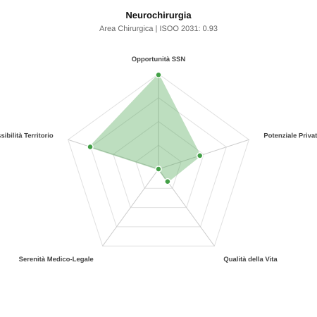

# Scheda di Orientamento: Neurochirurgia

[← Torna al Report Nazionale](../REPORT_NAZIONALE_MEDCAREER2031.md) | [Guida alla Consultazione](../GUIDA_ALLA_CONSULTAZIONE.md)

---

## 1. Profilo di Sintesi (Coorte SSM 2026–2031)

| Parametro | Valore / Dettaglio |
| :--- | :--- |
| **Area Disciplinare** | Chirurgica |
| **Durata del Corso** | 5 anni |
| **Semaforo di Occupabilità al 2031** | 🟢 **VERDE CHIARO (Equilibrio Fisiologico / Buona Occupabilità)** |
| **Verdetto di Carriera** | **Equilibrio Fisiologico** |
| **Indice ISOO Nazionale (Baseline)** | **0.93** (Range Scenari: 0.73 – 1.12) |
| **Probabilità Assunzione Concorso SSN** | **99.0%** |
| **Qualità della Vita (QoL Score)** | **16 / 100** |
| **Redditività Lorda Annua Stimata (REP)**| **~111,700 €** (Netto stimato: ~61,500 €) |

### Inquadramento Clinico e Prospettiva Occupazionale
Trattamento chirurgico delle patologie del SNC e periferico: tumori cerebrali e spinali, lesioni vascolari intracraniche, traumi cranio-vertebrali e rachide.

> [!NOTE]
> **Prospettiva al 2031 per chi entra a novembre 2026**:
> Buon bilanciamento tra uscite e nuovi specialisti; accesso regolare al SSN tramite concorso e spazio nel settore convenzionato.

---

## 2. Flusso Formativo e Ricambio Generazionale

I dati ministeriali (MUR / MEF / ANAAO) evidenziano la seguente dinamica di ricambio della forza lavoro per il quinquennio 2026–2031:

- **Contratti annui stimati (media 2024-2026)**: 112 borse/anno
- **Totale contratti stanziati nel quinquennio**: 560
- **Tasso fisiologico di abbandono / riassegnazione**: 4.0%
- **Nuovi specialisti effettivi al 2031**: 538 medici formati
- **Specialisti SSN attivi censiti a inizio periodo**: 880
- **Uscite stimate per pensionamento (2026–2031)**: 334 dirigenti medici
- **Uscite per dimissioni volontarie / passaggio al privato**: 88 dirigenti medici
- **Fabbisogno netto di rimpiazzo SSN (con fattore demografico)**: 440 posti

---

## 3. Analisi Comparativa Multi-Scenario al 2031

Il modello Stock-Flow a 5 anni simula la convergenza tra domanda e offerta al momento del conseguimento del titolo specialistico sotto 3 differenti assetti normativi ed economici:

| Indicatore Occupazionale | Scenario 1: Baseline Inerziale | Scenario 2: Pletora Grave (Worst) | Scenario 3: Riforma Correttiva (Best) |
| :--- | :---: | :---: | :---: |
| **Uscite Totali SSN (Pensionamenti + Esodo)** | 422 | 346 | 481 |
| **Fabbisogno Netto Stimato SSN** | 440 | 358 | 506 |
| **Nuovi Diplomati Effettivi** | 538 | 564 | 457 |
| **Saldo Netto SSN (Nuovi - Fabbisogno)** | **+98** | **+206** | **-49** |
| **Indice ISOO (Offerta / Domanda Totale)** | **0.93** | **1.12** | **0.73** |
| **Probabilità Assunzione Concorso SSN** | **99.0%** | **77.3%** | **99.0%** |
| **Verdetto Scenario** | Equilibrio Fisiologico | Equilibrio Fisiologico | Carenza Severa (Assunzione Immediata) |

---

## 4. Quadro Territoriale: Domanda e Offerta nelle 21 Regioni e P.A.

La tabella seguente illustra la proiezione occupazionale al 2031 (Scenario Baseline) per ciascuna Regione e Provincia Autonoma, ordinata dal territorio con **maggior fabbisogno non coperto** a quello più saturo:

| Regione / P.A. | Medici Attivi 2026 | Uscite Totali SSN | Nuovi Assegnati | Saldo Netto 2031 | ISOO Reg. | Semaforo |
| :--- | :---: | :---: | :---: | :---: | :---: | :---: |
| Calabria | 27 | 14 | 14 | -1 | 0.74 | 🟢 |
| Valle d'Aosta | 2 | 1 | 0 | -1 | 0.00 | 🟢 |
| Basilicata | 8 | 4 | 5 | +1 | 1.00 | 🟢 |
| Abruzzo | 19 | 9 | 10 | +1 | 0.83 | 🟢 |
| P.A. Bolzano | 8 | 4 | 5 | +1 | 1.00 | 🟢 |
| P.A. Trento | 8 | 4 | 5 | +1 | 1.00 | 🟢 |
| Friuli-Venezia Giulia | 18 | 9 | 10 | +1 | 0.83 | 🟢 |
| Sardegna | 23 | 11 | 14 | +2 | 0.88 | 🟢 |
| Molise | 4 | 2 | 5 | +3 | 1.67 | 🔴 |
| Liguria | 23 | 11 | 14 | +3 | 0.93 | 🟢 |
| Umbria | 13 | 6 | 10 | +4 | 1.11 | 🟢 |
| Marche | 22 | 10 | 14 | +4 | 1.00 | 🟢 |
| Puglia | 58 | 28 | 34 | +5 | 0.90 | 🟢 |
| Sicilia | 71 | 35 | 43 | +6 | 0.90 | 🟢 |
| Toscana | 55 | 27 | 34 | +6 | 0.92 | 🟢 |
| Piemonte | 64 | 30 | 38 | +7 | 0.93 | 🟢 |
| Veneto | 73 | 33 | 43 | +8 | 0.94 | 🟢 |
| Campania | 83 | 40 | 53 | +10 | 0.93 | 🟢 |
| Emilia-Romagna | 67 | 32 | 43 | +10 | 0.98 | 🟢 |
| Lazio | 85 | 40 | 53 | +11 | 0.95 | 🟢 |
| Lombardia | 150 | 69 | 91 | +18 | 0.95 | 🟢 |

> [!TIP]
> **Dinamica Geografica**:
> Le regioni in verde presentano carenza strutturale con concorsi che si prevedono aperti e con elevata probabilita di vincita immediata. Nei territori contrassegnati in rosso, il numero di nuovi specialisti supera il ricambio fisiologico ospedaliero, rendendo necessaria una pianificazione extra-regionale o uno sbocco nella medicina privata.

---

## 5. Scorecard: Qualità della Vita e Redditività Economica

### Radar Chart Professionale a 5 Dimensioni

### Indicatori di Qualità della Vita (QoL Score: 16/100)
- **Notti di guardia attive medie al mese**: 4.5 turni/mese
- **Reperibilità notturne/festive medie al mese**: 6.0 turni/mese
- **Ore settimanali effettive stimate**: 52 ore (compresi straordinari operativi)
- **Classe di rischio medico-legale**: Classe 5 su 5
- **Indice di Burnout percepito nella disciplina**: 80 / 100

### Scomposizione Redditività Economica Potenziale (REP)
- **Retribuzione Base SSN + Indennità contrattuali stimate**: ~79,700 € lordi/anno
- **Potenziale Libera Professione / Attività intramuraria out-of-pocket**: ~32,000 € lordi/anno
- **Reddito Annuo Lordo Complessivo Stimato**: ~111,700 €
- **Stima Netta Annuale (aliquote IRPEF ordinarie + previdenza ENPAM)**: ~61,500 € netti/anno

---

## 6. Guida Clinico-Strategica per lo Specializzando

### Sub-Specializzazioni ad Alto Valore Aggiunto
Per differenziarsi sul mercato e acquisire una solida barriera all'ingresso professionale, si consiglia di costruire competenze nelle seguenti sotto-branche durante la scuola:
- **Neuro-oncologia guidata da fluorescenza e chirurgia a paziente sveglio (Awake Surgery)**
- **Neurochirurgia vascolare ed endovascolare (aneurismi, MAV)**
- **Chirurgia vertebrale strumentata mininvasiva e neuronavigata**
- **Neurochirurgia funzionale (Deep Brain Stimulation - DBS per Parkinson)**

### Competenze Tecniche e Strumentali Raccomandate
Abilità pratiche da padroneggiare prima del diploma specialistico per massimizzare l'autonomia clinica:
- **Craniotomie per lesioni sovra/sottotentoriali con tecnica microchirurgica**
- **Microscopio operatorio, esoscopio, neuronavigazione 3D e CUSA**
- **Monitoraggio neurofisiologico intraoperatorio (IONM)**
- **Stabilizzazioni vertebrali percutanee e artrodesi**

### Sbocchi nel Mercato del Lavoro
Attivita concentrata in Hub di III livello ad alta complessita e cliniche neurochirurgiche d eccellenza. Posti selettivi ma garantiti per profili operativi validi.

### Strategia Territoriale e Mobilità
Centri Hub regionali del Centro-Nord con elevati volumi di chirurgia vertebrale e cranica.

### Gestione del Rischio Professionale e Work-Life Balance
Rischio medico-legale altissimo (Classe 5) per rischio di deficit neurologici permanenti. Impegno emotivo e fisico intenso, reperibilita d urgenza; compensato da proventi privati al vertice sul rachide.

---
[← Torna al Report Nazionale](../REPORT_NAZIONALE_MEDCAREER2031.md) | [Guida alla Consultazione](../GUIDA_ALLA_CONSULTAZIONE.md)
