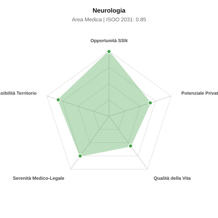

# Scheda di Orientamento: Neurologia

[← Torna al Report Nazionale](../REPORT_NAZIONALE_MEDCAREER2031.md) | [Guida alla Consultazione](../GUIDA_ALLA_CONSULTAZIONE.md)

---

## 1. Profilo di Sintesi (Coorte SSM 2026–2031)

| Parametro | Valore / Dettaglio |
| :--- | :--- |
| **Area Disciplinare** | Medica |
| **Durata del Corso** | 4 anni |
| **Semaforo di Occupabilità al 2031** | 🟢 **VERDE CHIARO (Equilibrio Fisiologico / Buona Occupabilità)** |
| **Verdetto di Carriera** | **Equilibrio Fisiologico** |
| **Indice ISOO Nazionale (Baseline)** | **0.85** (Range Scenari: 0.69 – 1.01) |
| **Probabilità Assunzione Concorso SSN** | **99.0%** |
| **Qualità della Vita (QoL Score)** | **56 / 100** |
| **Redditività Lorda Annua Stimata (REP)**| **~125,000 €** (Netto stimato: ~68,700 €) |

### Inquadramento Clinico e Prospettiva Occupazionale
Diagnosi e gestione delle malattie del SNC e periferico: ictus (Stroke Unit), sclerosi multipla, demenze, Parkinson, epilessia, cefalee e patologie neuromuscolari.

> [!NOTE]
> **Prospettiva al 2031 per chi entra a novembre 2026**:
> Buon bilanciamento tra uscite e nuovi specialisti; accesso regolare al SSN tramite concorso e spazio nel settore convenzionato.

---

## 2. Flusso Formativo e Ricambio Generazionale

I dati ministeriali (MUR / MEF / ANAAO) evidenziano la seguente dinamica di ricambio della forza lavoro per il quinquennio 2026–2031:

- **Contratti annui stimati (media 2024-2026)**: 310 borse/anno
- **Totale contratti stanziati nel quinquennio**: 1,550
- **Tasso fisiologico di abbandono / riassegnazione**: 3.0%
- **Nuovi specialisti effettivi al 2031**: 1,504 medici formati
- **Specialisti SSN attivi censiti a inizio periodo**: 2,400
- **Uscite stimate per pensionamento (2026–2031)**: 912 dirigenti medici
- **Uscite per dimissioni volontarie / passaggio al privato**: 240 dirigenti medici
- **Fabbisogno netto di rimpiazzo SSN (con fattore demografico)**: 1,201 posti

---

## 3. Analisi Comparativa Multi-Scenario al 2031

Il modello Stock-Flow a 5 anni simula la convergenza tra domanda e offerta al momento del conseguimento del titolo specialistico sotto 3 differenti assetti normativi ed economici:

| Indicatore Occupazionale | Scenario 1: Baseline Inerziale | Scenario 2: Pletora Grave (Worst) | Scenario 3: Riforma Correttiva (Best) |
| :--- | :---: | :---: | :---: |
| **Uscite Totali SSN (Pensionamenti + Esodo)** | 1,152 | 946 | 1,313 |
| **Fabbisogno Netto Stimato SSN** | 1,201 | 978 | 1,380 |
| **Nuovi Diplomati Effettivi** | 1,504 | 1,579 | 1,278 |
| **Saldo Netto SSN (Nuovi - Fabbisogno)** | **+303** | **+601** | **-102** |
| **Indice ISOO (Offerta / Domanda Totale)** | **0.85** | **1.01** | **0.69** |
| **Probabilità Assunzione Concorso SSN** | **99.0%** | **83.7%** | **99.0%** |
| **Verdetto Scenario** | Equilibrio Fisiologico | Equilibrio Fisiologico | Carenza Severa (Assunzione Immediata) |

---

## 4. Quadro Territoriale: Domanda e Offerta nelle 21 Regioni e P.A.

La tabella seguente illustra la proiezione occupazionale al 2031 (Scenario Baseline) per ciascuna Regione e Provincia Autonoma, ordinata dal territorio con **maggior fabbisogno non coperto** a quello più saturo:

| Regione / P.A. | Medici Attivi 2026 | Uscite Totali SSN | Nuovi Assegnati | Saldo Netto 2031 | ISOO Reg. | Semaforo |
| :--- | :---: | :---: | :---: | :---: | :---: | :---: |
| Umbria | 35 | 17 | 19 | +1 | 0.76 | 🟢 |
| Valle d'Aosta | 5 | 2 | 5 | +3 | 1.25 | 🟠 |
| Friuli-Venezia Giulia | 49 | 24 | 29 | +4 | 0.81 | 🟢 |
| Molise | 12 | 6 | 10 | +4 | 1.00 | 🟢 |
| P.A. Trento | 22 | 10 | 15 | +4 | 0.88 | 🟢 |
| P.A. Bolzano | 22 | 10 | 15 | +4 | 0.88 | 🟢 |
| Basilicata | 21 | 10 | 15 | +5 | 0.94 | 🟢 |
| Liguria | 62 | 31 | 39 | +7 | 0.85 | 🟢 |
| Sardegna | 63 | 30 | 39 | +8 | 0.87 | 🟢 |
| Abruzzo | 52 | 25 | 34 | +8 | 0.87 | 🟢 |
| Calabria | 74 | 37 | 48 | +9 | 0.84 | 🟢 |
| Marche | 60 | 29 | 39 | +9 | 0.89 | 🟢 |
| Toscana | 149 | 72 | 92 | +17 | 0.84 | 🟢 |
| Puglia | 157 | 76 | 97 | +17 | 0.84 | 🟢 |
| Sicilia | 194 | 96 | 121 | +20 | 0.83 | 🟢 |
| Piemonte | 173 | 83 | 107 | +21 | 0.85 | 🟢 |
| Emilia-Romagna | 182 | 87 | 116 | +25 | 0.87 | 🟢 |
| Campania | 227 | 109 | 141 | +25 | 0.84 | 🟢 |
| Lazio | 232 | 111 | 146 | +29 | 0.85 | 🟢 |
| Veneto | 198 | 91 | 126 | +30 | 0.88 | 🟢 |
| Lombardia | 410 | 189 | 257 | +58 | 0.87 | 🟢 |

> [!TIP]
> **Dinamica Geografica**:
> Le regioni in verde presentano carenza strutturale con concorsi che si prevedono aperti e con elevata probabilita di vincita immediata. Nei territori contrassegnati in rosso, il numero di nuovi specialisti supera il ricambio fisiologico ospedaliero, rendendo necessaria una pianificazione extra-regionale o uno sbocco nella medicina privata.

---

## 5. Scorecard: Qualità della Vita e Redditività Economica

### Radar Chart Professionale a 5 Dimensioni

### Indicatori di Qualità della Vita (QoL Score: 56/100)
- **Notti di guardia attive medie al mese**: 3.0 turni/mese
- **Reperibilità notturne/festive medie al mese**: 3.0 turni/mese
- **Ore settimanali effettive stimate**: 44 ore (compresi straordinari operativi)
- **Classe di rischio medico-legale**: Classe 2 su 5
- **Indice di Burnout percepito nella disciplina**: 65 / 100

### Scomposizione Redditività Economica Potenziale (REP)
- **Retribuzione Base SSN + Indennità contrattuali stimate**: ~78,600 € lordi/anno
- **Potenziale Libera Professione / Attività intramuraria out-of-pocket**: ~46,400 € lordi/anno
- **Reddito Annuo Lordo Complessivo Stimato**: ~125,000 €
- **Stima Netta Annuale (aliquote IRPEF ordinarie + previdenza ENPAM)**: ~68,700 € netti/anno

---

## 6. Guida Clinico-Strategica per lo Specializzando

### Sub-Specializzazioni ad Alto Valore Aggiunto
Per differenziarsi sul mercato e acquisire una solida barriera all'ingresso professionale, si consiglia di costruire competenze nelle seguenti sotto-branche durante la scuola:
- **Neurologia vascolare e gestione ictus acuto (trombolisi in Stroke Unit)**
- **Neurofisiopatologia clinica (EMG, potenziali evocati, video-EEG)**
- **Malattie neurodegenerative e disturbi del movimento (Parkinson)**
- **Neuroimmunologia e nuove terapie biologiche per la sclerosi multipla**

### Competenze Tecniche e Strumentali Raccomandate
Abilità pratiche da padroneggiare prima del diploma specialistico per massimizzare l'autonomia clinica:
- **Ecocolordoppler tronchi sovraortici e transcranico (TCD)**
- **Esecuzione ed interpretazione EEG ed elettromiografie (EMG/ENG)**
- **Rachicentesi diagnostica con bande oligoclonali liquorali**
- **Gestione infusioni per Parkinson avanzato e anticorpi per demenze**

### Sbocchi nel Mercato del Lavoro
Forte richiesta nei concorsi SSN per i turni di Stroke Unit e corsia; amplissimo mercato privato ambulatoriale (cefalee, neuropatie, tremori, demenze).

### Strategia Territoriale e Mobilità
Carenza costante nelle ASL del Nord e Centro Italia con assunzione celere; eccellente sviluppo di ambulatori privati.

### Gestione del Rischio Professionale e Work-Life Balance
Rischio medico-legale medio (Classe 3, finestra per trombolisi nell ictus). Turni di guardia ospedaliera in Stroke Unit, ampie opzioni ambulatoriali private.

---
[← Torna al Report Nazionale](../REPORT_NAZIONALE_MEDCAREER2031.md) | [Guida alla Consultazione](../GUIDA_ALLA_CONSULTAZIONE.md)
