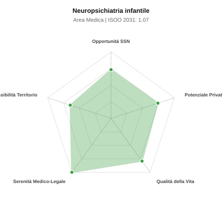

# Scheda di Orientamento: Neuropsichiatria infantile

[← Torna al Report Nazionale](../REPORT_NAZIONALE_MEDCAREER2031.md) | [Guida alla Consultazione](../GUIDA_ALLA_CONSULTAZIONE.md)

---

## 1. Profilo di Sintesi (Coorte SSM 2026–2031)

| Parametro | Valore / Dettaglio |
| :--- | :--- |
| **Area Disciplinare** | Medica |
| **Durata del Corso** | 4 anni |
| **Semaforo di Occupabilità al 2031** | 🟢 **VERDE CHIARO (Equilibrio Fisiologico / Buona Occupabilità)** |
| **Verdetto di Carriera** | **Equilibrio Fisiologico** |
| **Indice ISOO Nazionale (Baseline)** | **1.07** (Range Scenari: 0.91 – 1.21) |
| **Probabilità Assunzione Concorso SSN** | **73.1%** |
| **Qualità della Vita (QoL Score)** | **79 / 100** |
| **Redditività Lorda Annua Stimata (REP)**| **~128,600 €** (Netto stimato: ~70,800 €) |

### Inquadramento Clinico e Prospettiva Occupazionale
Prevenzione, diagnosi e riabilitazione dei disturbi neurologici, dello sviluppo e psichiatrici da 0 a 18 anni (autismo, ADHD, epilessie, disturbi condotta alimentare).

> [!NOTE]
> **Prospettiva al 2031 per chi entra a novembre 2026**:
> Buon bilanciamento tra uscite e nuovi specialisti; accesso regolare al SSN tramite concorso e spazio nel settore convenzionato.

---

## 2. Flusso Formativo e Ricambio Generazionale

I dati ministeriali (MUR / MEF / ANAAO) evidenziano la seguente dinamica di ricambio della forza lavoro per il quinquennio 2026–2031:

- **Contratti annui stimati (media 2024-2026)**: 215 borse/anno
- **Totale contratti stanziati nel quinquennio**: 1,075
- **Tasso fisiologico di abbandono / riassegnazione**: 2.0%
- **Nuovi specialisti effettivi al 2031**: 1,054 medici formati
- **Specialisti SSN attivi censiti a inizio periodo**: 1,200
- **Uscite stimate per pensionamento (2026–2031)**: 456 dirigenti medici
- **Uscite per dimissioni volontarie / passaggio al privato**: 120 dirigenti medici
- **Fabbisogno netto di rimpiazzo SSN (con fattore demografico)**: 547 posti

---

## 3. Analisi Comparativa Multi-Scenario al 2031

Il modello Stock-Flow a 5 anni simula la convergenza tra domanda e offerta al momento del conseguimento del titolo specialistico sotto 3 differenti assetti normativi ed economici:

| Indicatore Occupazionale | Scenario 1: Baseline Inerziale | Scenario 2: Pletora Grave (Worst) | Scenario 3: Riforma Correttiva (Best) |
| :--- | :---: | :---: | :---: |
| **Uscite Totali SSN (Pensionamenti + Esodo)** | 576 | 473 | 656 |
| **Fabbisogno Netto Stimato SSN** | 547 | 454 | 616 |
| **Nuovi Diplomati Effettivi** | 1,054 | 1,106 | 895 |
| **Saldo Netto SSN (Nuovi - Fabbisogno)** | **+507** | **+652** | **+279** |
| **Indice ISOO (Offerta / Domanda Totale)** | **1.07** | **1.21** | **0.91** |
| **Probabilità Assunzione Concorso SSN** | **73.1%** | **57.8%** | **97.0%** |
| **Verdetto Scenario** | Equilibrio Fisiologico | Competitivo / Rischio Saturazione | Equilibrio Fisiologico |

---

## 4. Quadro Territoriale: Domanda e Offerta nelle 21 Regioni e P.A.

La tabella seguente illustra la proiezione occupazionale al 2031 (Scenario Baseline) per ciascuna Regione e Provincia Autonoma, ordinata dal territorio con **maggior fabbisogno non coperto** a quello più saturo:

| Regione / P.A. | Medici Attivi 2026 | Uscite Totali SSN | Nuovi Assegnati | Saldo Netto 2031 | ISOO Reg. | Semaforo |
| :--- | :---: | :---: | :---: | :---: | :---: | :---: |
| Valle d'Aosta | 2 | 1 | 0 | -1 | 0.00 | 🟢 |
| Molise | 6 | 3 | 5 | +2 | 1.00 | 🟢 |
| P.A. Bolzano | 11 | 5 | 10 | +5 | 1.11 | 🟢 |
| Basilicata | 11 | 5 | 10 | +5 | 1.11 | 🟢 |
| P.A. Trento | 11 | 5 | 10 | +5 | 1.11 | 🟢 |
| Umbria | 17 | 8 | 15 | +7 | 1.07 | 🟢 |
| Friuli-Venezia Giulia | 24 | 11 | 20 | +9 | 1.05 | 🟢 |
| Marche | 30 | 14 | 24 | +11 | 1.04 | 🟢 |
| Abruzzo | 26 | 13 | 24 | +12 | 1.09 | 🟢 |
| Liguria | 31 | 15 | 29 | +14 | 1.07 | 🟢 |
| Sardegna | 32 | 15 | 29 | +15 | 1.11 | 🟢 |
| Calabria | 37 | 19 | 34 | +16 | 1.06 | 🟢 |
| Toscana | 74 | 35 | 64 | +31 | 1.07 | 🟢 |
| Puglia | 79 | 38 | 69 | +33 | 1.06 | 🟢 |
| Emilia-Romagna | 91 | 44 | 78 | +36 | 1.05 | 🟢 |
| Sicilia | 97 | 49 | 83 | +36 | 1.02 | 🟢 |
| Piemonte | 87 | 42 | 78 | +38 | 1.08 | 🟢 |
| Veneto | 99 | 46 | 88 | +44 | 1.10 | 🟢 |
| Campania | 113 | 54 | 98 | +47 | 1.06 | 🟢 |
| Lazio | 116 | 56 | 103 | +51 | 1.08 | 🟢 |
| Lombardia | 205 | 94 | 181 | +91 | 1.10 | 🟢 |

> [!TIP]
> **Dinamica Geografica**:
> Le regioni in verde presentano carenza strutturale con concorsi che si prevedono aperti e con elevata probabilita di vincita immediata. Nei territori contrassegnati in rosso, il numero di nuovi specialisti supera il ricambio fisiologico ospedaliero, rendendo necessaria una pianificazione extra-regionale o uno sbocco nella medicina privata.

---

## 5. Scorecard: Qualità della Vita e Redditività Economica

### Radar Chart Professionale a 5 Dimensioni

### Indicatori di Qualità della Vita (QoL Score: 79/100)
- **Notti di guardia attive medie al mese**: 1.0 turni/mese
- **Reperibilità notturne/festive medie al mese**: 1.5 turni/mese
- **Ore settimanali effettive stimate**: 40 ore (compresi straordinari operativi)
- **Classe di rischio medico-legale**: Classe 1 su 5
- **Indice di Burnout percepito nella disciplina**: 60 / 100

### Scomposizione Redditività Economica Potenziale (REP)
- **Retribuzione Base SSN + Indennità contrattuali stimate**: ~76,800 € lordi/anno
- **Potenziale Libera Professione / Attività intramuraria out-of-pocket**: ~51,800 € lordi/anno
- **Reddito Annuo Lordo Complessivo Stimato**: ~128,600 €
- **Stima Netta Annuale (aliquote IRPEF ordinarie + previdenza ENPAM)**: ~70,800 € netti/anno

---

## 6. Guida Clinico-Strategica per lo Specializzando

### Sub-Specializzazioni ad Alto Valore Aggiunto
Per differenziarsi sul mercato e acquisire una solida barriera all'ingresso professionale, si consiglia di costruire competenze nelle seguenti sotto-branche durante la scuola:
- **Disturbi dello Spettro Autistico (ASD) e diagnosi precoce**
- **Neurologia dello sviluppo ed epilessie rare farmaco-resistenti**
- **Psichiatria dell adolescenza e disturbi della nutrizione (DCA)**
- **Disturbi Specifici dell Apprendimento (DSA) e deficit attenzione (ADHD)**

### Competenze Tecniche e Strumentali Raccomandate
Abilità pratiche da padroneggiare prima del diploma specialistico per massimizzare l'autonomia clinica:
- **Test neuropsicologici standardizzati (ADOS-2, ADI-R, WISC-IV)**
- **Lettura ed interpretazione EEG pediatrici e video-poligrafie**
- **Gestione psicofarmacologica in eta evolutiva**
- **Stesura Piani Educativi Individualizzati (PEI)**

### Sbocchi nel Mercato del Lavoro
Carenza drammatica e acuta: concorsi ospedalieri e nei servizi territoriali UONPIA sistematicamente deserti. Domanda privata esplosa con agende sature di mesi.

### Strategia Territoriale e Mobilità
Occupabilita immediata garantita al 100% in qualunque provincia d Italia, massima liberta di collocazione.

### Gestione del Rischio Professionale e Work-Life Balance
Rischio medico-legale medio-basso (Classe 2). Qualita della vita eccellente (QoL > 85) nei servizi territoriali e nel privato (zero notti, orari regolari).

---
[← Torna al Report Nazionale](../REPORT_NAZIONALE_MEDCAREER2031.md) | [Guida alla Consultazione](../GUIDA_ALLA_CONSULTAZIONE.md)
