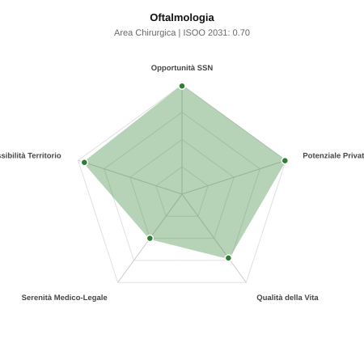

# Scheda di Orientamento: Oftalmologia

[← Torna al Report Nazionale](../REPORT_NAZIONALE_MEDCAREER2031.md) | [Guida alla Consultazione](../GUIDA_ALLA_CONSULTAZIONE.md)

---

## 1. Profilo di Sintesi (Coorte SSM 2026–2031)

| Parametro | Valore / Dettaglio |
| :--- | :--- |
| **Area Disciplinare** | Chirurgica |
| **Durata del Corso** | 4 anni |
| **Semaforo di Occupabilità al 2031** | 🟢 **VERDE SCURO (Carenza Elevata / Assunzione Immediata)** |
| **Verdetto di Carriera** | **Carenza Severa (Assunzione Immediata)** |
| **Indice ISOO Nazionale (Baseline)** | **0.70** (Range Scenari: 0.58 – 0.81) |
| **Probabilità Assunzione Concorso SSN** | **99.0%** |
| **Qualità della Vita (QoL Score)** | **72 / 100** |
| **Redditività Lorda Annua Stimata (REP)**| **~146,200 €** (Netto stimato: ~80,400 €) |

### Inquadramento Clinico e Prospettiva Occupazionale
Prevenzione, diagnosi e terapia medica e chirurgica delle malattie dell occhio, visione e annessi: cataratta, glaucoma, maculopatie, cornea e strabismo.

> [!NOTE]
> **Prospettiva al 2031 per chi entra a novembre 2026**:
> Posti vacanti diffusi e concorsi spesso deserti; altissima probabilità di assunzione prima del titolo o subito dopo (Decreto Calabria).

---

## 2. Flusso Formativo e Ricambio Generazionale

I dati ministeriali (MUR / MEF / ANAAO) evidenziano la seguente dinamica di ricambio della forza lavoro per il quinquennio 2026–2031:

- **Contratti annui stimati (media 2024-2026)**: 220 borse/anno
- **Totale contratti stanziati nel quinquennio**: 1,100
- **Tasso fisiologico di abbandono / riassegnazione**: 1.0%
- **Nuovi specialisti effettivi al 2031**: 1,089 medici formati
- **Specialisti SSN attivi censiti a inizio periodo**: 1,900
- **Uscite stimate per pensionamento (2026–2031)**: 722 dirigenti medici
- **Uscite per dimissioni volontarie / passaggio al privato**: 190 dirigenti medici
- **Fabbisogno netto di rimpiazzo SSN (con fattore demografico)**: 951 posti

---

## 3. Analisi Comparativa Multi-Scenario al 2031

Il modello Stock-Flow a 5 anni simula la convergenza tra domanda e offerta al momento del conseguimento del titolo specialistico sotto 3 differenti assetti normativi ed economici:

| Indicatore Occupazionale | Scenario 1: Baseline Inerziale | Scenario 2: Pletora Grave (Worst) | Scenario 3: Riforma Correttiva (Best) |
| :--- | :---: | :---: | :---: |
| **Uscite Totali SSN (Pensionamenti + Esodo)** | 912 | 749 | 1,039 |
| **Fabbisogno Netto Stimato SSN** | 951 | 774 | 1,092 |
| **Nuovi Diplomati Effettivi** | 1,089 | 1,143 | 926 |
| **Saldo Netto SSN (Nuovi - Fabbisogno)** | **+138** | **+369** | **-166** |
| **Indice ISOO (Offerta / Domanda Totale)** | **0.70** | **0.81** | **0.58** |
| **Probabilità Assunzione Concorso SSN** | **99.0%** | **99.0%** | **99.0%** |
| **Verdetto Scenario** | Carenza Severa (Assunzione Immediata) | Equilibrio Fisiologico | Carenza Severa (Assunzione Immediata) |

---

## 4. Quadro Territoriale: Domanda e Offerta nelle 21 Regioni e P.A.

La tabella seguente illustra la proiezione occupazionale al 2031 (Scenario Baseline) per ciascuna Regione e Provincia Autonoma, ordinata dal territorio con **maggior fabbisogno non coperto** a quello più saturo:

| Regione / P.A. | Medici Attivi 2026 | Uscite Totali SSN | Nuovi Assegnati | Saldo Netto 2031 | ISOO Reg. | Semaforo |
| :--- | :---: | :---: | :---: | :---: | :---: | :---: |
| Valle d'Aosta | 4 | 2 | 0 | -2 | 0.00 | 🟢 |
| Molise | 9 | 5 | 5 | 0 | 0.62 | 🟢 |
| Friuli-Venezia Giulia | 38 | 18 | 20 | +1 | 0.67 | 🟢 |
| Basilicata | 17 | 9 | 10 | +1 | 0.67 | 🟢 |
| P.A. Bolzano | 17 | 8 | 10 | +1 | 0.67 | 🟢 |
| P.A. Trento | 18 | 8 | 10 | +1 | 0.67 | 🟢 |
| Umbria | 27 | 13 | 15 | +2 | 0.71 | 🟢 |
| Calabria | 59 | 30 | 35 | +4 | 0.70 | 🟢 |
| Liguria | 49 | 25 | 30 | +4 | 0.70 | 🟢 |
| Abruzzo | 41 | 20 | 25 | +4 | 0.71 | 🟢 |
| Sardegna | 50 | 24 | 30 | +5 | 0.71 | 🟢 |
| Puglia | 125 | 60 | 69 | +6 | 0.68 | 🟢 |
| Marche | 48 | 23 | 30 | +6 | 0.73 | 🟢 |
| Sicilia | 154 | 76 | 89 | +9 | 0.69 | 🟢 |
| Toscana | 118 | 57 | 69 | +10 | 0.71 | 🟢 |
| Lazio | 184 | 88 | 104 | +11 | 0.69 | 🟢 |
| Piemonte | 137 | 66 | 79 | +11 | 0.70 | 🟢 |
| Veneto | 157 | 73 | 89 | +12 | 0.71 | 🟢 |
| Emilia-Romagna | 144 | 69 | 84 | +12 | 0.71 | 🟢 |
| Campania | 180 | 86 | 104 | +13 | 0.70 | 🟢 |
| Lombardia | 324 | 149 | 188 | +31 | 0.72 | 🟢 |

> [!TIP]
> **Dinamica Geografica**:
> Le regioni in verde presentano carenza strutturale con concorsi che si prevedono aperti e con elevata probabilita di vincita immediata. Nei territori contrassegnati in rosso, il numero di nuovi specialisti supera il ricambio fisiologico ospedaliero, rendendo necessaria una pianificazione extra-regionale o uno sbocco nella medicina privata.

---

## 5. Scorecard: Qualità della Vita e Redditività Economica

### Radar Chart Professionale a 5 Dimensioni

### Indicatori di Qualità della Vita (QoL Score: 72/100)
- **Notti di guardia attive medie al mese**: 1.0 turni/mese
- **Reperibilità notturne/festive medie al mese**: 2.0 turni/mese
- **Ore settimanali effettive stimate**: 40 ore (compresi straordinari operativi)
- **Classe di rischio medico-legale**: Classe 3 su 5
- **Indice di Burnout percepito nella disciplina**: 45 / 100

### Scomposizione Redditività Economica Potenziale (REP)
- **Retribuzione Base SSN + Indennità contrattuali stimate**: ~76,800 € lordi/anno
- **Potenziale Libera Professione / Attività intramuraria out-of-pocket**: ~69,400 € lordi/anno
- **Reddito Annuo Lordo Complessivo Stimato**: ~146,200 €
- **Stima Netta Annuale (aliquote IRPEF ordinarie + previdenza ENPAM)**: ~80,400 € netti/anno

---

## 6. Guida Clinico-Strategica per lo Specializzando

### Sub-Specializzazioni ad Alto Valore Aggiunto
Per differenziarsi sul mercato e acquisire una solida barriera all'ingresso professionale, si consiglia di costruire competenze nelle seguenti sotto-branche durante la scuola:
- **Chirurgia del segmento anteriore (cataratta con IOL premium, chirurgia refrattiva laser)**
- **Chirurgia e trattamenti vitreo-retinici (iniezioni intravitreali anti-VEGF, vitrectomia)**
- **Glaucoma diagnostica avanzata e chirurgia mininvasiva MIGS**
- **Cornea e trapianto endoteliale/lamellare (DMEK, DALK)**

### Competenze Tecniche e Strumentali Raccomandate
Abilità pratiche da padroneggiare prima del diploma specialistico per massimizzare l'autonomia clinica:
- **Tomografia Ottica Computerizzata (OCT/angio-OCT) e fluorangiografia**
- **Facoemulsificazione della cataratta con microincisione**
- **Laser retinico, YAG laser capsulotomia e iridotomia**
- **Iniezioni intravitreali di farmaci biologici e steroidi**

### Sbocchi nel Mercato del Lavoro
Posti ospedalieri SSN contenuti ma stabili; potenziale economico nella libera professione ambulatoriale e chirurgica tra i massimi al mondo (REP al vertice assoluto).

### Strategia Territoriale e Mobilità
Opportunita private straordinarie e capillari in ogni citta d Italia; la chirurgia ambulatoriale garantisce piena indipendenza professionale.

### Gestione del Rischio Professionale e Work-Life Balance
Rischio medico-legale medio (Classe 3, aspettative refrattive o endoftalmiti). Qualita della vita al top: niente notti, chirurgia diurna programmabile.

---
[← Torna al Report Nazionale](../REPORT_NAZIONALE_MEDCAREER2031.md) | [Guida alla Consultazione](../GUIDA_ALLA_CONSULTAZIONE.md)
