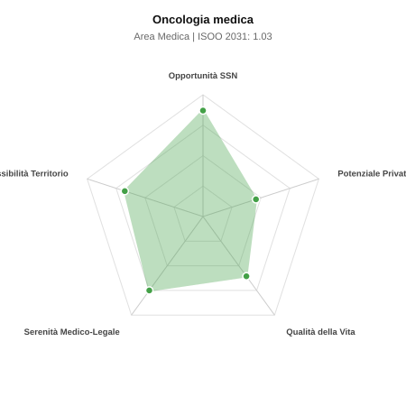

# Scheda di Orientamento: Oncologia medica

[← Torna al Report Nazionale](../REPORT_NAZIONALE_MEDCAREER2031.md) | [Guida alla Consultazione](../GUIDA_ALLA_CONSULTAZIONE.md)

---

## 1. Profilo di Sintesi (Coorte SSM 2026–2031)

| Parametro | Valore / Dettaglio |
| :--- | :--- |
| **Area Disciplinare** | Medica |
| **Durata del Corso** | 4 anni |
| **Semaforo di Occupabilità al 2031** | 🟢 **VERDE CHIARO (Equilibrio Fisiologico / Buona Occupabilità)** |
| **Verdetto di Carriera** | **Equilibrio Fisiologico** |
| **Indice ISOO Nazionale (Baseline)** | **1.03** (Range Scenari: 0.86 – 1.24) |
| **Probabilità Assunzione Concorso SSN** | **87.0%** |
| **Qualità della Vita (QoL Score)** | **61 / 100** |
| **Redditività Lorda Annua Stimata (REP)**| **~109,600 €** (Netto stimato: ~60,300 €) |

### Inquadramento Clinico e Prospettiva Occupazionale
Trattamento farmacologico sistemico delle neoplasie solide nell adulto, pianificazione multidisciplinare, gestione complicanze e trial clinici innovativi.

> [!NOTE]
> **Prospettiva al 2031 per chi entra a novembre 2026**:
> Buon bilanciamento tra uscite e nuovi specialisti; accesso regolare al SSN tramite concorso e spazio nel settore convenzionato.

---

## 2. Flusso Formativo e Ricambio Generazionale

I dati ministeriali (MUR / MEF / ANAAO) evidenziano la seguente dinamica di ricambio della forza lavoro per il quinquennio 2026–2031:

- **Contratti annui stimati (media 2024-2026)**: 310 borse/anno
- **Totale contratti stanziati nel quinquennio**: 1,550
- **Tasso fisiologico di abbandono / riassegnazione**: 5.0%
- **Nuovi specialisti effettivi al 2031**: 1,472 medici formati
- **Specialisti SSN attivi censiti a inizio periodo**: 2,100
- **Uscite stimate per pensionamento (2026–2031)**: 798 dirigenti medici
- **Uscite per dimissioni volontarie / passaggio al privato**: 210 dirigenti medici
- **Fabbisogno netto di rimpiazzo SSN (con fattore demografico)**: 1,051 posti

---

## 3. Analisi Comparativa Multi-Scenario al 2031

Il modello Stock-Flow a 5 anni simula la convergenza tra domanda e offerta al momento del conseguimento del titolo specialistico sotto 3 differenti assetti normativi ed economici:

| Indicatore Occupazionale | Scenario 1: Baseline Inerziale | Scenario 2: Pletora Grave (Worst) | Scenario 3: Riforma Correttiva (Best) |
| :--- | :---: | :---: | :---: |
| **Uscite Totali SSN (Pensionamenti + Esodo)** | 1,008 | 827 | 1,149 |
| **Fabbisogno Netto Stimato SSN** | 1,051 | 855 | 1,208 |
| **Nuovi Diplomati Effettivi** | 1,472 | 1,546 | 1,325 |
| **Saldo Netto SSN (Nuovi - Fabbisogno)** | **+421** | **+691** | **+117** |
| **Indice ISOO (Offerta / Domanda Totale)** | **1.03** | **1.24** | **0.86** |
| **Probabilità Assunzione Concorso SSN** | **87.0%** | **67.4%** | **99.0%** |
| **Verdetto Scenario** | Equilibrio Fisiologico | Competitivo / Rischio Saturazione | Equilibrio Fisiologico |

---

## 4. Quadro Territoriale: Domanda e Offerta nelle 21 Regioni e P.A.

La tabella seguente illustra la proiezione occupazionale al 2031 (Scenario Baseline) per ciascuna Regione e Provincia Autonoma, ordinata dal territorio con **maggior fabbisogno non coperto** a quello più saturo:

| Regione / P.A. | Medici Attivi 2026 | Uscite Totali SSN | Nuovi Assegnati | Saldo Netto 2031 | ISOO Reg. | Semaforo |
| :--- | :---: | :---: | :---: | :---: | :---: | :---: |
| Valle d'Aosta | 4 | 2 | 5 | +3 | 1.67 | 🔴 |
| Basilicata | 19 | 10 | 14 | +4 | 1.00 | 🟢 |
| Umbria | 30 | 14 | 19 | +4 | 0.95 | 🟢 |
| P.A. Bolzano | 19 | 9 | 14 | +4 | 1.00 | 🟢 |
| P.A. Trento | 20 | 9 | 14 | +4 | 1.00 | 🟢 |
| Molise | 10 | 5 | 10 | +5 | 1.25 | 🟠 |
| Friuli-Venezia Giulia | 43 | 20 | 28 | +7 | 1.00 | 🟢 |
| Liguria | 54 | 27 | 38 | +10 | 1.00 | 🟢 |
| Sardegna | 55 | 27 | 38 | +10 | 1.00 | 🟢 |
| Abruzzo | 45 | 21 | 33 | +11 | 1.10 | 🟢 |
| Marche | 53 | 25 | 38 | +12 | 1.06 | 🟢 |
| Calabria | 65 | 32 | 48 | +14 | 1.04 | 🟢 |
| Toscana | 130 | 62 | 90 | +26 | 1.03 | 🟢 |
| Puglia | 138 | 66 | 95 | +26 | 1.02 | 🟢 |
| Piemonte | 152 | 73 | 104 | +29 | 1.02 | 🟢 |
| Sicilia | 170 | 85 | 119 | +30 | 1.00 | 🟢 |
| Emilia-Romagna | 159 | 76 | 114 | +35 | 1.06 | 🟢 |
| Campania | 198 | 95 | 138 | +37 | 1.01 | 🟢 |
| Lazio | 203 | 97 | 142 | +39 | 1.02 | 🟢 |
| Veneto | 173 | 79 | 124 | +41 | 1.08 | 🟢 |
| Lombardia | 359 | 166 | 252 | +77 | 1.05 | 🟢 |

> [!TIP]
> **Dinamica Geografica**:
> Le regioni in verde presentano carenza strutturale con concorsi che si prevedono aperti e con elevata probabilita di vincita immediata. Nei territori contrassegnati in rosso, il numero di nuovi specialisti supera il ricambio fisiologico ospedaliero, rendendo necessaria una pianificazione extra-regionale o uno sbocco nella medicina privata.

---

## 5. Scorecard: Qualità della Vita e Redditività Economica

### Radar Chart Professionale a 5 Dimensioni

### Indicatori di Qualità della Vita (QoL Score: 61/100)
- **Notti di guardia attive medie al mese**: 2.0 turni/mese
- **Reperibilità notturne/festive medie al mese**: 2.5 turni/mese
- **Ore settimanali effettive stimate**: 44 ore (compresi straordinari operativi)
- **Classe di rischio medico-legale**: Classe 2 su 5
- **Indice di Burnout percepito nella disciplina**: 75 / 100

### Scomposizione Redditività Economica Potenziale (REP)
- **Retribuzione Base SSN + Indennità contrattuali stimate**: ~77,600 € lordi/anno
- **Potenziale Libera Professione / Attività intramuraria out-of-pocket**: ~32,000 € lordi/anno
- **Reddito Annuo Lordo Complessivo Stimato**: ~109,600 €
- **Stima Netta Annuale (aliquote IRPEF ordinarie + previdenza ENPAM)**: ~60,300 € netti/anno

---

## 6. Guida Clinico-Strategica per lo Specializzando

### Sub-Specializzazioni ad Alto Valore Aggiunto
Per differenziarsi sul mercato e acquisire una solida barriera all'ingresso professionale, si consiglia di costruire competenze nelle seguenti sotto-branche durante la scuola:
- **Immunoterapia oncologica con checkpoint inhibitors (anti-PD1/PD-L1)**
- **Terapie a bersaglio molecolare guidate da Comprehensive Genomic Profiling (NGS)**
- **Oncologia polmonare, senologica e gastroenterica complessa**
- **Sperimentazioni cliniche precoci (Phase I Units)**

### Competenze Tecniche e Strumentali Raccomandate
Abilità pratiche da padroneggiare prima del diploma specialistico per massimizzare l'autonomia clinica:
- **Prescrizione e gestione protocolli chemioterapici e immunoterapici**
- **Gestione delle tossicita immuno-mediate severe (coliti, polmoniti)**
- **Valutazione risposta radiologica secondo criteri RECIST/iRECIST**
- **Gestione cateteri venosi centrali (PICC, Port) e paracentesi**

### Sbocchi nel Mercato del Lavoro
Assorbimento solido e continuo nei concorsi ospedalieri SSN (reparti e Day Hospital) e IRCCS; crescenti sbocchi manageriali nel settore farmaceutico privato.

### Strategia Territoriale e Mobilità
Carenza fisiologica costante in tutto il Paese legata all aumento di pazienti oncologici lungo-sopravviventi che richiedono cure continuative.

### Gestione del Rischio Professionale e Work-Life Balance
Rischio medico-legale medio (Classe 3) per tossicita farmacologiche. Turni diurni/DH intensi, ma raramente urgenze notturne di sala; carico psicologico importante.

---
[← Torna al Report Nazionale](../REPORT_NAZIONALE_MEDCAREER2031.md) | [Guida alla Consultazione](../GUIDA_ALLA_CONSULTAZIONE.md)
