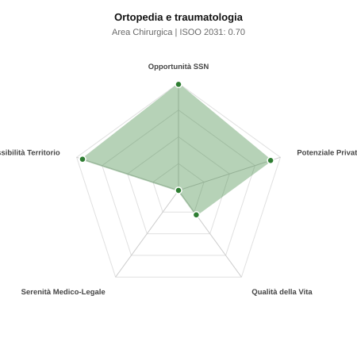

# Scheda di Orientamento: Ortopedia e traumatologia

[← Torna al Report Nazionale](../REPORT_NAZIONALE_MEDCAREER2031.md) | [Guida alla Consultazione](../GUIDA_ALLA_CONSULTAZIONE.md)

---

## 1. Profilo di Sintesi (Coorte SSM 2026–2031)

| Parametro | Valore / Dettaglio |
| :--- | :--- |
| **Area Disciplinare** | Chirurgica |
| **Durata del Corso** | 5 anni |
| **Semaforo di Occupabilità al 2031** | 🟢 **VERDE SCURO (Carenza Elevata / Assunzione Immediata)** |
| **Verdetto di Carriera** | **Carenza Severa (Assunzione Immediata)** |
| **Indice ISOO Nazionale (Baseline)** | **0.70** (Range Scenari: 0.57 – 0.82) |
| **Probabilità Assunzione Concorso SSN** | **99.0%** |
| **Qualità della Vita (QoL Score)** | **28 / 100** |
| **Redditività Lorda Annua Stimata (REP)**| **~142,600 €** (Netto stimato: ~78,500 €) |

### Inquadramento Clinico e Prospettiva Occupazionale
Trattamento chirurgico e conservativo delle patologie degenerative e traumatiche dell apparato muscolo-scheletrico: artrosi, fratture scheletriche e lesioni articolari.

> [!NOTE]
> **Prospettiva al 2031 per chi entra a novembre 2026**:
> Posti vacanti diffusi e concorsi spesso deserti; altissima probabilità di assunzione prima del titolo o subito dopo (Decreto Calabria).

---

## 2. Flusso Formativo e Ricambio Generazionale

I dati ministeriali (MUR / MEF / ANAAO) evidenziano la seguente dinamica di ricambio della forza lavoro per il quinquennio 2026–2031:

- **Contratti annui stimati (media 2024-2026)**: 472 borse/anno
- **Totale contratti stanziati nel quinquennio**: 2,360
- **Tasso fisiologico di abbandono / riassegnazione**: 4.0%
- **Nuovi specialisti effettivi al 2031**: 2,266 medici formati
- **Specialisti SSN attivi censiti a inizio periodo**: 4,200
- **Uscite stimate per pensionamento (2026–2031)**: 1,596 dirigenti medici
- **Uscite per dimissioni volontarie / passaggio al privato**: 420 dirigenti medici
- **Fabbisogno netto di rimpiazzo SSN (con fattore demografico)**: 2,102 posti

---

## 3. Analisi Comparativa Multi-Scenario al 2031

Il modello Stock-Flow a 5 anni simula la convergenza tra domanda e offerta al momento del conseguimento del titolo specialistico sotto 3 differenti assetti normativi ed economici:

| Indicatore Occupazionale | Scenario 1: Baseline Inerziale | Scenario 2: Pletora Grave (Worst) | Scenario 3: Riforma Correttiva (Best) |
| :--- | :---: | :---: | :---: |
| **Uscite Totali SSN (Pensionamenti + Esodo)** | 2,016 | 1,655 | 2,297 |
| **Fabbisogno Netto Stimato SSN** | 2,102 | 1,711 | 2,414 |
| **Nuovi Diplomati Effettivi** | 2,266 | 2,379 | 1,926 |
| **Saldo Netto SSN (Nuovi - Fabbisogno)** | **+164** | **+668** | **-488** |
| **Indice ISOO (Offerta / Domanda Totale)** | **0.70** | **0.82** | **0.57** |
| **Probabilità Assunzione Concorso SSN** | **99.0%** | **99.0%** | **99.0%** |
| **Verdetto Scenario** | Carenza Severa (Assunzione Immediata) | Equilibrio Fisiologico | Carenza Severa (Assunzione Immediata) |

---

## 4. Quadro Territoriale: Domanda e Offerta nelle 21 Regioni e P.A.

La tabella seguente illustra la proiezione occupazionale al 2031 (Scenario Baseline) per ciascuna Regione e Provincia Autonoma, ordinata dal territorio con **maggior fabbisogno non coperto** a quello più saturo:

| Regione / P.A. | Medici Attivi 2026 | Uscite Totali SSN | Nuovi Assegnati | Saldo Netto 2031 | ISOO Reg. | Semaforo |
| :--- | :---: | :---: | :---: | :---: | :---: | :---: |
| Basilicata | 37 | 19 | 19 | -1 | 0.63 | 🟢 |
| Molise | 20 | 10 | 10 | 0 | 0.67 | 🟢 |
| P.A. Trento | 39 | 18 | 19 | 0 | 0.66 | 🟢 |
| P.A. Bolzano | 39 | 18 | 19 | 0 | 0.66 | 🟢 |
| Valle d'Aosta | 9 | 4 | 5 | +1 | 0.71 | 🟢 |
| Sardegna | 111 | 53 | 58 | +2 | 0.68 | 🟢 |
| Liguria | 108 | 54 | 58 | +2 | 0.68 | 🟢 |
| Abruzzo | 90 | 43 | 48 | +3 | 0.70 | 🟢 |
| Umbria | 61 | 29 | 34 | +4 | 0.72 | 🟢 |
| Sicilia | 340 | 170 | 182 | +4 | 0.67 | 🟢 |
| Calabria | 130 | 65 | 72 | +4 | 0.69 | 🟢 |
| Friuli-Venezia Giulia | 85 | 40 | 48 | +6 | 0.73 | 🟢 |
| Marche | 105 | 50 | 58 | +6 | 0.72 | 🟢 |
| Toscana | 261 | 125 | 139 | +9 | 0.69 | 🟢 |
| Puglia | 275 | 132 | 149 | +11 | 0.70 | 🟢 |
| Campania | 397 | 191 | 216 | +13 | 0.69 | 🟢 |
| Emilia-Romagna | 319 | 153 | 173 | +13 | 0.70 | 🟢 |
| Piemonte | 303 | 145 | 163 | +13 | 0.70 | 🟢 |
| Lazio | 407 | 196 | 221 | +14 | 0.69 | 🟢 |
| Veneto | 346 | 160 | 187 | +18 | 0.71 | 🟢 |
| Lombardia | 717 | 331 | 389 | +40 | 0.71 | 🟢 |

> [!TIP]
> **Dinamica Geografica**:
> Le regioni in verde presentano carenza strutturale con concorsi che si prevedono aperti e con elevata probabilita di vincita immediata. Nei territori contrassegnati in rosso, il numero di nuovi specialisti supera il ricambio fisiologico ospedaliero, rendendo necessaria una pianificazione extra-regionale o uno sbocco nella medicina privata.

---

## 5. Scorecard: Qualità della Vita e Redditività Economica

### Radar Chart Professionale a 5 Dimensioni

### Indicatori di Qualità della Vita (QoL Score: 28/100)
- **Notti di guardia attive medie al mese**: 4.0 turni/mese
- **Reperibilità notturne/festive medie al mese**: 5.0 turni/mese
- **Ore settimanali effettive stimate**: 48 ore (compresi straordinari operativi)
- **Classe di rischio medico-legale**: Classe 5 su 5
- **Indice di Burnout percepito nella disciplina**: 70 / 100

### Scomposizione Redditività Economica Potenziale (REP)
- **Retribuzione Base SSN + Indennità contrattuali stimate**: ~79,300 € lordi/anno
- **Potenziale Libera Professione / Attività intramuraria out-of-pocket**: ~63,300 € lordi/anno
- **Reddito Annuo Lordo Complessivo Stimato**: ~142,600 €
- **Stima Netta Annuale (aliquote IRPEF ordinarie + previdenza ENPAM)**: ~78,500 € netti/anno

---

## 6. Guida Clinico-Strategica per lo Specializzando

### Sub-Specializzazioni ad Alto Valore Aggiunto
Per differenziarsi sul mercato e acquisire una solida barriera all'ingresso professionale, si consiglia di costruire competenze nelle seguenti sotto-branche durante la scuola:
- **Chirurgia protesica mininvasiva e robotica di anca e ginocchio**
- **Traumatologia scheletrica d urgenza e fissazione fratture complesse**
- **Chirurgia artroscopica e rigenerativa della spalla e del ginocchio (LCA)**
- **Chirurgia della mano, del piede e microchirurgia**

### Competenze Tecniche e Strumentali Raccomandate
Abilità pratiche da padroneggiare prima del diploma specialistico per massimizzare l'autonomia clinica:
- **Artroplastica totale d anca e ginocchio con navigazione computerizzata**
- **Riduzione e sintesi fratture con placche, chiodi e fissatori esterni**
- **Artroscopia diagnostica ed operativa**
- **Infiltrazioni articolari ecoguidate e manovre di riduzione lussazioni**

### Sbocchi nel Mercato del Lavoro
Carenza acuta nei concorsi pubblici traumatologici SSN per la durezza dei turni; contemporaneamente mercato privato convenzionato e libero tra i piu ricchi d Italia.

### Strategia Territoriale e Mobilità
Richiesta massiccia ovunque: SSN per fratture dell anziano in aumento demografico; cliniche private del Centro-Nord per protesica elettiva.

### Gestione del Rischio Professionale e Work-Life Balance
Rischio medico-legale elevato (Classe 4-5) per infezioni o dismetrie. Turni traumatologici fisicamente duri; la transizione verso il privato elettivo porta guadagni record.

---
[← Torna al Report Nazionale](../REPORT_NAZIONALE_MEDCAREER2031.md) | [Guida alla Consultazione](../GUIDA_ALLA_CONSULTAZIONE.md)
