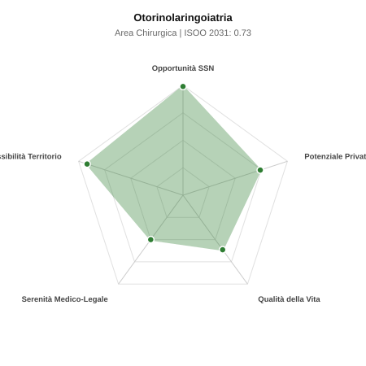

# Scheda di Orientamento: Otorinolaringoiatria

[← Torna al Report Nazionale](../REPORT_NAZIONALE_MEDCAREER2031.md) | [Guida alla Consultazione](../GUIDA_ALLA_CONSULTAZIONE.md)

---

## 1. Profilo di Sintesi (Coorte SSM 2026–2031)

| Parametro | Valore / Dettaglio |
| :--- | :--- |
| **Area Disciplinare** | Chirurgica |
| **Durata del Corso** | 4 anni |
| **Semaforo di Occupabilità al 2031** | 🟢 **VERDE SCURO (Carenza Elevata / Assunzione Immediata)** |
| **Verdetto di Carriera** | **Carenza Severa (Assunzione Immediata)** |
| **Indice ISOO Nazionale (Baseline)** | **0.73** (Range Scenari: 0.59 – 0.86) |
| **Probabilità Assunzione Concorso SSN** | **99.0%** |
| **Qualità della Vita (QoL Score)** | **61 / 100** |
| **Redditività Lorda Annua Stimata (REP)**| **~129,500 €** (Netto stimato: ~71,200 €) |

### Inquadramento Clinico e Prospettiva Occupazionale
Diagnosi e trattamento medico e chirurgico di orecchio, naso, seni paranasali, gola, laringe e distretto testa-collo in adulti e bambini.

> [!NOTE]
> **Prospettiva al 2031 per chi entra a novembre 2026**:
> Posti vacanti diffusi e concorsi spesso deserti; altissima probabilità di assunzione prima del titolo o subito dopo (Decreto Calabria).

---

## 2. Flusso Formativo e Ricambio Generazionale

I dati ministeriali (MUR / MEF / ANAAO) evidenziano la seguente dinamica di ricambio della forza lavoro per il quinquennio 2026–2031:

- **Contratti annui stimati (media 2024-2026)**: 185 borse/anno
- **Totale contratti stanziati nel quinquennio**: 925
- **Tasso fisiologico di abbandono / riassegnazione**: 3.0%
- **Nuovi specialisti effettivi al 2031**: 897 medici formati
- **Specialisti SSN attivi censiti a inizio periodo**: 1,800
- **Uscite stimate per pensionamento (2026–2031)**: 684 dirigenti medici
- **Uscite per dimissioni volontarie / passaggio al privato**: 180 dirigenti medici
- **Fabbisogno netto di rimpiazzo SSN (con fattore demografico)**: 862 posti

---

## 3. Analisi Comparativa Multi-Scenario al 2031

Il modello Stock-Flow a 5 anni simula la convergenza tra domanda e offerta al momento del conseguimento del titolo specialistico sotto 3 differenti assetti normativi ed economici:

| Indicatore Occupazionale | Scenario 1: Baseline Inerziale | Scenario 2: Pletora Grave (Worst) | Scenario 3: Riforma Correttiva (Best) |
| :--- | :---: | :---: | :---: |
| **Uscite Totali SSN (Pensionamenti + Esodo)** | 864 | 709 | 985 |
| **Fabbisogno Netto Stimato SSN** | 862 | 708 | 982 |
| **Nuovi Diplomati Effettivi** | 897 | 942 | 763 |
| **Saldo Netto SSN (Nuovi - Fabbisogno)** | **+35** | **+234** | **-219** |
| **Indice ISOO (Offerta / Domanda Totale)** | **0.73** | **0.86** | **0.59** |
| **Probabilità Assunzione Concorso SSN** | **99.0%** | **99.0%** | **99.0%** |
| **Verdetto Scenario** | Carenza Severa (Assunzione Immediata) | Equilibrio Fisiologico | Carenza Severa (Assunzione Immediata) |

---

## 4. Quadro Territoriale: Domanda e Offerta nelle 21 Regioni e P.A.

La tabella seguente illustra la proiezione occupazionale al 2031 (Scenario Baseline) per ciascuna Regione e Provincia Autonoma, ordinata dal territorio con **maggior fabbisogno non coperto** a quello più saturo:

| Regione / P.A. | Medici Attivi 2026 | Uscite Totali SSN | Nuovi Assegnati | Saldo Netto 2031 | ISOO Reg. | Semaforo |
| :--- | :---: | :---: | :---: | :---: | :---: | :---: |
| Valle d'Aosta | 4 | 2 | 0 | -2 | 0.00 | 🟢 |
| Toscana | 112 | 54 | 53 | -1 | 0.70 | 🟢 |
| Molise | 9 | 5 | 5 | 0 | 0.71 | 🟢 |
| Abruzzo | 39 | 19 | 19 | 0 | 0.70 | 🟢 |
| Liguria | 46 | 23 | 24 | +1 | 0.73 | 🟢 |
| Sardegna | 47 | 23 | 24 | +1 | 0.73 | 🟢 |
| Campania | 170 | 82 | 82 | +1 | 0.71 | 🟢 |
| Calabria | 56 | 28 | 29 | +1 | 0.72 | 🟢 |
| Sicilia | 146 | 73 | 73 | +1 | 0.72 | 🟢 |
| Piemonte | 130 | 62 | 63 | +1 | 0.72 | 🟢 |
| Friuli-Venezia Giulia | 36 | 18 | 19 | +1 | 0.73 | 🟢 |
| Basilicata | 16 | 8 | 10 | +2 | 0.83 | 🟢 |
| Puglia | 118 | 57 | 58 | +2 | 0.72 | 🟢 |
| P.A. Bolzano | 17 | 8 | 10 | +2 | 0.83 | 🟢 |
| Umbria | 26 | 13 | 15 | +2 | 0.79 | 🟢 |
| Emilia-Romagna | 137 | 66 | 68 | +2 | 0.72 | 🟢 |
| P.A. Trento | 17 | 8 | 10 | +2 | 0.83 | 🟢 |
| Marche | 45 | 21 | 24 | +3 | 0.77 | 🟢 |
| Lazio | 174 | 83 | 87 | +4 | 0.73 | 🟢 |
| Veneto | 148 | 68 | 73 | +5 | 0.74 | 🟢 |
| Lombardia | 307 | 142 | 155 | +12 | 0.75 | 🟢 |

> [!TIP]
> **Dinamica Geografica**:
> Le regioni in verde presentano carenza strutturale con concorsi che si prevedono aperti e con elevata probabilita di vincita immediata. Nei territori contrassegnati in rosso, il numero di nuovi specialisti supera il ricambio fisiologico ospedaliero, rendendo necessaria una pianificazione extra-regionale o uno sbocco nella medicina privata.

---

## 5. Scorecard: Qualità della Vita e Redditività Economica

### Radar Chart Professionale a 5 Dimensioni

### Indicatori di Qualità della Vita (QoL Score: 61/100)
- **Notti di guardia attive medie al mese**: 2.0 turni/mese
- **Reperibilità notturne/festive medie al mese**: 3.0 turni/mese
- **Ore settimanali effettive stimate**: 42 ore (compresi straordinari operativi)
- **Classe di rischio medico-legale**: Classe 3 su 5
- **Indice di Burnout percepito nella disciplina**: 50 / 100

### Scomposizione Redditività Economica Potenziale (REP)
- **Retribuzione Base SSN + Indennità contrattuali stimate**: ~77,700 € lordi/anno
- **Potenziale Libera Professione / Attività intramuraria out-of-pocket**: ~51,800 € lordi/anno
- **Reddito Annuo Lordo Complessivo Stimato**: ~129,500 €
- **Stima Netta Annuale (aliquote IRPEF ordinarie + previdenza ENPAM)**: ~71,200 € netti/anno

---

## 6. Guida Clinico-Strategica per lo Specializzando

### Sub-Specializzazioni ad Alto Valore Aggiunto
Per differenziarsi sul mercato e acquisire una solida barriera all'ingresso professionale, si consiglia di costruire competenze nelle seguenti sotto-branche durante la scuola:
- **Chirurgia endoscopica dei seni paranasali e basicranio (FESS)**
- **Otoneurochirurgia e chirurgia della sordita (impianti cocleari)**
- **Chirurgia oncologica della laringe e tiroide/salivari**
- **Chirurgia funzionale ed estetica del naso (settorinoplastica)**

### Competenze Tecniche e Strumentali Raccomandate
Abilità pratiche da padroneggiare prima del diploma specialistico per massimizzare l'autonomia clinica:
- **Fibroscopia a fibre ottiche flessibili e rigide vie aeree superiori**
- **FESS con debrider e navigatore ottico per poliposi e sinusiti**
- **Microscopia auricolare e timpanoplastiche**
- **Tracheotomia d urgenza ed elettiva, tonsillectomie**

### Sbocchi nel Mercato del Lavoro
Ottimo bilanciamento tra posti ospedalieri SSN (oncologia e urgenze emorragiche) ed eccellente richiesta nel settore privato ambulatoriale e chirurgico convenzionato.

### Strategia Territoriale e Mobilità
Fabbisogno costante in tutta la rete ospedaliera spoke/hub e ricca attivita ambulatoriale su tutto il territorio.

### Gestione del Rischio Professionale e Work-Life Balance
Rischio medico-legale medio-alto (Classe 3-4, lesioni nervo facciale/ricorrente o emorragie). Ritmo ospedaliero sostenibile con reperibilita per epistassi acute.

---
[← Torna al Report Nazionale](../REPORT_NAZIONALE_MEDCAREER2031.md) | [Guida alla Consultazione](../GUIDA_ALLA_CONSULTAZIONE.md)
