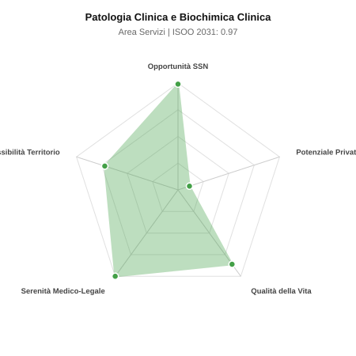

# Scheda di Orientamento: Patologia Clinica e Biochimica Clinica

[← Torna al Report Nazionale](../REPORT_NAZIONALE_MEDCAREER2031.md) | [Guida alla Consultazione](../GUIDA_ALLA_CONSULTAZIONE.md)

---

## 1. Profilo di Sintesi (Coorte SSM 2026–2031)

| Parametro | Valore / Dettaglio |
| :--- | :--- |
| **Area Disciplinare** | Servizi |
| **Durata del Corso** | 4 anni |
| **Semaforo di Occupabilità al 2031** | 🟢 **VERDE CHIARO (Equilibrio Fisiologico / Buona Occupabilità)** |
| **Verdetto di Carriera** | **Equilibrio Fisiologico** |
| **Indice ISOO Nazionale (Baseline)** | **0.97** (Range Scenari: 0.78 – 1.22) |
| **Probabilità Assunzione Concorso SSN** | **99.0%** |
| **Qualità della Vita (QoL Score)** | **86 / 100** |
| **Redditività Lorda Annua Stimata (REP)**| **~84,400 €** (Netto stimato: ~46,400 €) |

### Inquadramento Clinico e Prospettiva Occupazionale
Esecuzione, validazione e interpretazione dei test di laboratorio: chimica clinica, ematologia, immunometria, coagulazione e medicina trasfusionale.

> [!NOTE]
> **Prospettiva al 2031 per chi entra a novembre 2026**:
> Buon bilanciamento tra uscite e nuovi specialisti; accesso regolare al SSN tramite concorso e spazio nel settore convenzionato.

---

## 2. Flusso Formativo e Ricambio Generazionale

I dati ministeriali (MUR / MEF / ANAAO) evidenziano la seguente dinamica di ricambio della forza lavoro per il quinquennio 2026–2031:

- **Contratti annui stimati (media 2024-2026)**: 265 borse/anno
- **Totale contratti stanziati nel quinquennio**: 1,325
- **Tasso fisiologico di abbandono / riassegnazione**: 40.0%
- **Nuovi specialisti effettivi al 2031**: 795 medici formati
- **Specialisti SSN attivi censiti a inizio periodo**: 1,600
- **Uscite stimate per pensionamento (2026–2031)**: 608 dirigenti medici
- **Uscite per dimissioni volontarie / passaggio al privato**: 160 dirigenti medici
- **Fabbisogno netto di rimpiazzo SSN (con fattore demografico)**: 766 posti

---

## 3. Analisi Comparativa Multi-Scenario al 2031

Il modello Stock-Flow a 5 anni simula la convergenza tra domanda e offerta al momento del conseguimento del titolo specialistico sotto 3 differenti assetti normativi ed economici:

| Indicatore Occupazionale | Scenario 1: Baseline Inerziale | Scenario 2: Pletora Grave (Worst) | Scenario 3: Riforma Correttiva (Best) |
| :--- | :---: | :---: | :---: |
| **Uscite Totali SSN (Pensionamenti + Esodo)** | 768 | 630 | 875 |
| **Fabbisogno Netto Stimato SSN** | 766 | 629 | 872 |
| **Nuovi Diplomati Effettivi** | 795 | 835 | 716 |
| **Saldo Netto SSN (Nuovi - Fabbisogno)** | **+29** | **+206** | **-156** |
| **Indice ISOO (Offerta / Domanda Totale)** | **0.97** | **1.22** | **0.78** |
| **Probabilità Assunzione Concorso SSN** | **99.0%** | **78.8%** | **99.0%** |
| **Verdetto Scenario** | Equilibrio Fisiologico | Competitivo / Rischio Saturazione | Carenza Severa (Assunzione Immediata) |

---

## 4. Quadro Territoriale: Domanda e Offerta nelle 21 Regioni e P.A.

La tabella seguente illustra la proiezione occupazionale al 2031 (Scenario Baseline) per ciascuna Regione e Provincia Autonoma, ordinata dal territorio con **maggior fabbisogno non coperto** a quello più saturo:

| Regione / P.A. | Medici Attivi 2026 | Uscite Totali SSN | Nuovi Assegnati | Saldo Netto 2031 | ISOO Reg. | Semaforo |
| :--- | :---: | :---: | :---: | :---: | :---: | :---: |
| Basilicata | 14 | 7 | 6 | -1 | 0.86 | 🟢 |
| Calabria | 50 | 25 | 24 | -1 | 0.89 | 🟢 |
| Sicilia | 130 | 65 | 63 | -1 | 0.93 | 🟢 |
| Molise | 8 | 4 | 3 | -1 | 0.75 | 🟢 |
| P.A. Trento | 15 | 7 | 6 | -1 | 0.86 | 🟢 |
| P.A. Bolzano | 15 | 7 | 6 | -1 | 0.86 | 🟢 |
| Friuli-Venezia Giulia | 32 | 15 | 15 | 0 | 0.94 | 🟢 |
| Toscana | 99 | 48 | 48 | 0 | 0.94 | 🟢 |
| Sardegna | 42 | 20 | 21 | +1 | 1.00 | 🟢 |
| Umbria | 23 | 11 | 12 | +1 | 1.00 | 🟢 |
| Piemonte | 116 | 56 | 57 | +1 | 0.95 | 🟢 |
| Liguria | 41 | 20 | 21 | +1 | 1.00 | 🟢 |
| Puglia | 105 | 50 | 51 | +2 | 0.98 | 🟢 |
| Marche | 40 | 19 | 21 | +2 | 1.05 | 🟢 |
| Abruzzo | 34 | 16 | 18 | +2 | 1.06 | 🟢 |
| Emilia-Romagna | 122 | 58 | 60 | +2 | 0.97 | 🟢 |
| Valle d'Aosta | 3 | 1 | 3 | +2 | 3.00 | 🔴 |
| Lazio | 155 | 75 | 78 | +3 | 0.97 | 🟢 |
| Campania | 151 | 72 | 75 | +4 | 0.99 | 🟢 |
| Veneto | 132 | 61 | 66 | +5 | 1.01 | 🟢 |
| Lombardia | 273 | 126 | 135 | +8 | 0.99 | 🟢 |

> [!TIP]
> **Dinamica Geografica**:
> Le regioni in verde presentano carenza strutturale con concorsi che si prevedono aperti e con elevata probabilita di vincita immediata. Nei territori contrassegnati in rosso, il numero di nuovi specialisti supera il ricambio fisiologico ospedaliero, rendendo necessaria una pianificazione extra-regionale o uno sbocco nella medicina privata.

---

## 5. Scorecard: Qualità della Vita e Redditività Economica

### Radar Chart Professionale a 5 Dimensioni

### Indicatori di Qualità della Vita (QoL Score: 86/100)
- **Notti di guardia attive medie al mese**: 0.5 turni/mese
- **Reperibilità notturne/festive medie al mese**: 1.5 turni/mese
- **Ore settimanali effettive stimate**: 38 ore (compresi straordinari operativi)
- **Classe di rischio medico-legale**: Classe 1 su 5
- **Indice di Burnout percepito nella disciplina**: 45 / 100

### Scomposizione Redditività Economica Potenziale (REP)
- **Retribuzione Base SSN + Indennità contrattuali stimate**: ~76,500 € lordi/anno
- **Potenziale Libera Professione / Attività intramuraria out-of-pocket**: ~7,900 € lordi/anno
- **Reddito Annuo Lordo Complessivo Stimato**: ~84,400 €
- **Stima Netta Annuale (aliquote IRPEF ordinarie + previdenza ENPAM)**: ~46,400 € netti/anno

---

## 6. Guida Clinico-Strategica per lo Specializzando

### Sub-Specializzazioni ad Alto Valore Aggiunto
Per differenziarsi sul mercato e acquisire una solida barriera all'ingresso professionale, si consiglia di costruire competenze nelle seguenti sotto-branche durante la scuola:
- **Medicina trasfusionale, emovigilanza e aferesi terapeutica (SIMT)**
- **Diagnostica di laboratorio delle coagulopatie e trombofilie**
- **Proteomica clinica e spettrometria di massa applicata**
- **Qualita totale di laboratorio e accreditamento ISO 15189**

### Competenze Tecniche e Strumentali Raccomandate
Abilità pratiche da padroneggiare prima del diploma specialistico per massimizzare l'autonomia clinica:
- **Validazione clinica referti complessi e allarmi analitici**
- **Procedure di aferesi produttiva e terapeutica (plasmaferesi)**
- **Elettroforesi proteica capillare e immunofissazione**
- **Gestione LIS e catene robotizzate analitiche**

### Sbocchi nel Mercato del Lavoro
Carenza acuta di dirigenti medici nei Centri Trasfusionali e laboratori Hub SSN con concorsi frequentemente deserti; opportunita stabili nei grandi network privati.

### Strategia Territoriale e Mobilità
Fabbisogno diffuso su tutto il territorio nazionale con assunzione celere nei servizi trasfusionali.

### Gestione del Rischio Professionale e Work-Life Balance
Rischio medico-legale basso (Classe 1-2, tranne reazioni trasfusionali). Qualita della vita superba (QoL > 85): turni regolari, nessuna gestione di degenze per acuti.

---
[← Torna al Report Nazionale](../REPORT_NAZIONALE_MEDCAREER2031.md) | [Guida alla Consultazione](../GUIDA_ALLA_CONSULTAZIONE.md)
