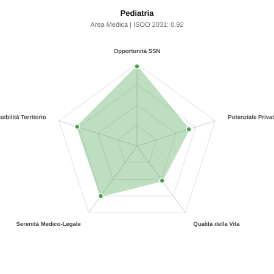

# Scheda di Orientamento: Pediatria

[← Torna al Report Nazionale](../REPORT_NAZIONALE_MEDCAREER2031.md) | [Guida alla Consultazione](../GUIDA_ALLA_CONSULTAZIONE.md)

---

## 1. Profilo di Sintesi (Coorte SSM 2026–2031)

| Parametro | Valore / Dettaglio |
| :--- | :--- |
| **Area Disciplinare** | Medica |
| **Durata del Corso** | 5 anni |
| **Semaforo di Occupabilità al 2031** | 🟢 **VERDE CHIARO (Equilibrio Fisiologico / Buona Occupabilità)** |
| **Verdetto di Carriera** | **Equilibrio Fisiologico** |
| **Indice ISOO Nazionale (Baseline)** | **0.92** (Range Scenari: 0.76 – 1.07) |
| **Probabilità Assunzione Concorso SSN** | **96.9%** |
| **Qualità della Vita (QoL Score)** | **52 / 100** |
| **Redditività Lorda Annua Stimata (REP)**| **~125,800 €** (Netto stimato: ~69,200 €) |

### Inquadramento Clinico e Prospettiva Occupazionale
Salute e sviluppo del neonato, bambino e adolescente: cure primarie, degenza pediatrica, pronto soccorso pediatrico e terapia intensiva neonatale (TIN).

> [!NOTE]
> **Prospettiva al 2031 per chi entra a novembre 2026**:
> Buon bilanciamento tra uscite e nuovi specialisti; accesso regolare al SSN tramite concorso e spazio nel settore convenzionato.

---

## 2. Flusso Formativo e Ricambio Generazionale

I dati ministeriali (MUR / MEF / ANAAO) evidenziano la seguente dinamica di ricambio della forza lavoro per il quinquennio 2026–2031:

- **Contratti annui stimati (media 2024-2026)**: 812 borse/anno
- **Totale contratti stanziati nel quinquennio**: 4,060
- **Tasso fisiologico di abbandono / riassegnazione**: 3.0%
- **Nuovi specialisti effettivi al 2031**: 3,938 medici formati
- **Specialisti SSN attivi censiti a inizio periodo**: 6,200
- **Uscite stimate per pensionamento (2026–2031)**: 2,356 dirigenti medici
- **Uscite per dimissioni volontarie / passaggio al privato**: 620 dirigenti medici
- **Fabbisogno netto di rimpiazzo SSN (con fattore demografico)**: 2,824 posti

---

## 3. Analisi Comparativa Multi-Scenario al 2031

Il modello Stock-Flow a 5 anni simula la convergenza tra domanda e offerta al momento del conseguimento del titolo specialistico sotto 3 differenti assetti normativi ed economici:

| Indicatore Occupazionale | Scenario 1: Baseline Inerziale | Scenario 2: Pletora Grave (Worst) | Scenario 3: Riforma Correttiva (Best) |
| :--- | :---: | :---: | :---: |
| **Uscite Totali SSN (Pensionamenti + Esodo)** | 2,976 | 2,443 | 3,391 |
| **Fabbisogno Netto Stimato SSN** | 2,824 | 2,343 | 3,183 |
| **Nuovi Diplomati Effettivi** | 3,938 | 4,135 | 3,347 |
| **Saldo Netto SSN (Nuovi - Fabbisogno)** | **+1114** | **+1792** | **+164** |
| **Indice ISOO (Offerta / Domanda Totale)** | **0.92** | **1.07** | **0.76** |
| **Probabilità Assunzione Concorso SSN** | **96.9%** | **76.6%** | **99.0%** |
| **Verdetto Scenario** | Equilibrio Fisiologico | Equilibrio Fisiologico | Carenza Severa (Assunzione Immediata) |

---

## 4. Quadro Territoriale: Domanda e Offerta nelle 21 Regioni e P.A.

La tabella seguente illustra la proiezione occupazionale al 2031 (Scenario Baseline) per ciascuna Regione e Provincia Autonoma, ordinata dal territorio con **maggior fabbisogno non coperto** a quello più saturo:

| Regione / P.A. | Medici Attivi 2026 | Uscite Totali SSN | Nuovi Assegnati | Saldo Netto 2031 | ISOO Reg. | Semaforo |
| :--- | :---: | :---: | :---: | :---: | :---: | :---: |
| Valle d'Aosta | 13 | 6 | 10 | +4 | 1.00 | 🟢 |
| Molise | 30 | 15 | 19 | +5 | 0.91 | 🟢 |
| P.A. Bolzano | 57 | 27 | 34 | +8 | 0.87 | 🟢 |
| Basilicata | 55 | 28 | 34 | +8 | 0.87 | 🟢 |
| P.A. Trento | 58 | 27 | 39 | +13 | 0.97 | 🟢 |
| Umbria | 89 | 43 | 58 | +18 | 0.94 | 🟢 |
| Friuli-Venezia Giulia | 126 | 61 | 78 | +19 | 0.89 | 🟢 |
| Abruzzo | 133 | 64 | 82 | +22 | 0.91 | 🟢 |
| Liguria | 159 | 79 | 102 | +25 | 0.89 | 🟢 |
| Marche | 156 | 75 | 97 | +27 | 0.92 | 🟢 |
| Calabria | 192 | 96 | 121 | +30 | 0.89 | 🟢 |
| Sardegna | 164 | 78 | 102 | +31 | 0.94 | 🟢 |
| Toscana | 385 | 184 | 242 | +67 | 0.91 | 🟢 |
| Puglia | 407 | 196 | 257 | +73 | 0.92 | 🟢 |
| Piemonte | 448 | 215 | 286 | +80 | 0.92 | 🟢 |
| Sicilia | 502 | 250 | 320 | +83 | 0.90 | 🟢 |
| Emilia-Romagna | 471 | 226 | 301 | +85 | 0.92 | 🟢 |
| Veneto | 511 | 235 | 325 | +101 | 0.94 | 🟢 |
| Campania | 586 | 282 | 373 | +105 | 0.92 | 🟢 |
| Lazio | 600 | 288 | 383 | +113 | 0.93 | 🟢 |
| Lombardia | 1,059 | 488 | 674 | +206 | 0.94 | 🟢 |

> [!TIP]
> **Dinamica Geografica**:
> Le regioni in verde presentano carenza strutturale con concorsi che si prevedono aperti e con elevata probabilita di vincita immediata. Nei territori contrassegnati in rosso, il numero di nuovi specialisti supera il ricambio fisiologico ospedaliero, rendendo necessaria una pianificazione extra-regionale o uno sbocco nella medicina privata.

---

## 5. Scorecard: Qualità della Vita e Redditività Economica

### Radar Chart Professionale a 5 Dimensioni

### Indicatori di Qualità della Vita (QoL Score: 52/100)
- **Notti di guardia attive medie al mese**: 4.0 turni/mese
- **Reperibilità notturne/festive medie al mese**: 3.0 turni/mese
- **Ore settimanali effettive stimate**: 44 ore (compresi straordinari operativi)
- **Classe di rischio medico-legale**: Classe 2 su 5
- **Indice di Burnout percepito nella disciplina**: 65 / 100

### Scomposizione Redditività Economica Potenziale (REP)
- **Retribuzione Base SSN + Indennità contrattuali stimate**: ~79,400 € lordi/anno
- **Potenziale Libera Professione / Attività intramuraria out-of-pocket**: ~46,400 € lordi/anno
- **Reddito Annuo Lordo Complessivo Stimato**: ~125,800 €
- **Stima Netta Annuale (aliquote IRPEF ordinarie + previdenza ENPAM)**: ~69,200 € netti/anno

---

## 6. Guida Clinico-Strategica per lo Specializzando

### Sub-Specializzazioni ad Alto Valore Aggiunto
Per differenziarsi sul mercato e acquisire una solida barriera all'ingresso professionale, si consiglia di costruire competenze nelle seguenti sotto-branche durante la scuola:
- **Neonatologia e Terapia Intensiva Neonatale (TIN) per prematuri estremi**
- **Pronto soccorso ed emergenza-urgenza pediatrica**
- **Pediatria di Libera Scelta (PLS - convenzione territoriale di famiglia)**
- **Specialita d organo pediatriche (gastroenterologia, allergologia)**

### Competenze Tecniche e Strumentali Raccomandate
Abilità pratiche da padroneggiare prima del diploma specialistico per massimizzare l'autonomia clinica:
- **Rianimazione neonatale in sala parto (linee guida NRP)**
- **Intubazione pediatrica e incannulamento vasi ombelicali**
- **POCUS pediatrico (ecografia polmonare e cerebrale transfontanellare)**
- **Valutazione auxologica con curve di crescita standard**

### Sbocchi nel Mercato del Lavoro
Doppio sbocco: concorsi ospedalieri SSN (reparti e TIN sempre alla ricerca) e convenzione territoriale come Pediatra di Famiglia (PLS) con incarichi rapidi per pensionamenti.

### Strategia Territoriale e Mobilità
Carenza marcata di pediatri sia ospedalieri che di famiglia in molte regioni del Nord e Centro Italia, pur a fronte della denatalita.

### Gestione del Rischio Professionale e Work-Life Balance
Rischio medico-legale medio-alto (Classe 3-4, forte emotivita familiare). Notti impegnative in ospedale/TIN; ottima qualita di vita nella convenzione territoriale.

---
[← Torna al Report Nazionale](../REPORT_NAZIONALE_MEDCAREER2031.md) | [Guida alla Consultazione](../GUIDA_ALLA_CONSULTAZIONE.md)
