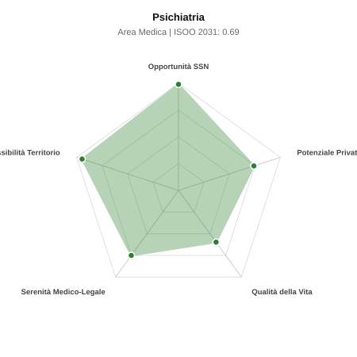

# Scheda di Orientamento: Psichiatria

[← Torna al Report Nazionale](../REPORT_NAZIONALE_MEDCAREER2031.md) | [Guida alla Consultazione](../GUIDA_ALLA_CONSULTAZIONE.md)

---

## 1. Profilo di Sintesi (Coorte SSM 2026–2031)

| Parametro | Valore / Dettaglio |
| :--- | :--- |
| **Area Disciplinare** | Medica |
| **Durata del Corso** | 4 anni |
| **Semaforo di Occupabilità al 2031** | 🟢 **VERDE SCURO (Carenza Elevata / Assunzione Immediata)** |
| **Verdetto di Carriera** | **Carenza Severa (Assunzione Immediata)** |
| **Indice ISOO Nazionale (Baseline)** | **0.69** (Range Scenari: 0.59 – 0.86) |
| **Probabilità Assunzione Concorso SSN** | **99.0%** |
| **Qualità della Vita (QoL Score)** | **60 / 100** |
| **Redditività Lorda Annua Stimata (REP)**| **~130,300 €** (Netto stimato: ~71,700 €) |

### Inquadramento Clinico e Prospettiva Occupazionale
Prevenzione, diagnosi, cura e riabilitazione dei disturbi mentali: psicosi, disturbi dell umore, ansia, personalita e dipendenze patologiche.

> [!NOTE]
> **Prospettiva al 2031 per chi entra a novembre 2026**:
> Posti vacanti diffusi e concorsi spesso deserti; altissima probabilità di assunzione prima del titolo o subito dopo (Decreto Calabria).

---

## 2. Flusso Formativo e Ricambio Generazionale

I dati ministeriali (MUR / MEF / ANAAO) evidenziano la seguente dinamica di ricambio della forza lavoro per il quinquennio 2026–2031:

- **Contratti annui stimati (media 2024-2026)**: 520 borse/anno
- **Totale contratti stanziati nel quinquennio**: 2,600
- **Tasso fisiologico di abbandono / riassegnazione**: 10.0%
- **Nuovi specialisti effettivi al 2031**: 2,340 medici formati
- **Specialisti SSN attivi censiti a inizio periodo**: 4,800
- **Uscite stimate per pensionamento (2026–2031)**: 1,824 dirigenti medici
- **Uscite per dimissioni volontarie / passaggio al privato**: 480 dirigenti medici
- **Fabbisogno netto di rimpiazzo SSN (con fattore demografico)**: 2,413 posti

---

## 3. Analisi Comparativa Multi-Scenario al 2031

Il modello Stock-Flow a 5 anni simula la convergenza tra domanda e offerta al momento del conseguimento del titolo specialistico sotto 3 differenti assetti normativi ed economici:

| Indicatore Occupazionale | Scenario 1: Baseline Inerziale | Scenario 2: Pletora Grave (Worst) | Scenario 3: Riforma Correttiva (Best) |
| :--- | :---: | :---: | :---: |
| **Uscite Totali SSN (Pensionamenti + Esodo)** | 2,304 | 1,891 | 2,626 |
| **Fabbisogno Netto Stimato SSN** | 2,413 | 1,845 | 2,697 |
| **Nuovi Diplomati Effettivi** | 2,340 | 2,457 | 2,106 |
| **Saldo Netto SSN (Nuovi - Fabbisogno)** | **-73** | **+612** | **-591** |
| **Indice ISOO (Offerta / Domanda Totale)** | **0.69** | **0.86** | **0.59** |
| **Probabilità Assunzione Concorso SSN** | **99.0%** | **99.0%** | **99.0%** |
| **Verdetto Scenario** | Carenza Severa (Assunzione Immediata) | Equilibrio Fisiologico | Carenza Severa (Assunzione Immediata) |

---

## 4. Quadro Territoriale: Domanda e Offerta nelle 21 Regioni e P.A.

La tabella seguente illustra la proiezione occupazionale al 2031 (Scenario Baseline) per ciascuna Regione e Provincia Autonoma, ordinata dal territorio con **maggior fabbisogno non coperto** a quello più saturo:

| Regione / P.A. | Medici Attivi 2026 | Uscite Totali SSN | Nuovi Assegnati | Saldo Netto 2031 | ISOO Reg. | Semaforo |
| :--- | :---: | :---: | :---: | :---: | :---: | :---: |
| Sicilia | 389 | 194 | 189 | -13 | 0.68 | 🟢 |
| Lazio | 465 | 223 | 225 | -9 | 0.69 | 🟢 |
| Emilia-Romagna | 365 | 175 | 176 | -9 | 0.68 | 🟢 |
| Campania | 454 | 218 | 220 | -7 | 0.69 | 🟢 |
| Toscana | 298 | 143 | 144 | -6 | 0.69 | 🟢 |
| Liguria | 123 | 61 | 58 | -6 | 0.66 | 🟢 |
| Calabria | 149 | 74 | 72 | -5 | 0.67 | 🟢 |
| Puglia | 315 | 152 | 153 | -5 | 0.69 | 🟢 |
| Piemonte | 347 | 167 | 171 | -4 | 0.69 | 🟢 |
| Marche | 121 | 58 | 58 | -3 | 0.68 | 🟢 |
| Abruzzo | 103 | 49 | 50 | -1 | 0.69 | 🟢 |
| Valle d'Aosta | 10 | 5 | 4 | -1 | 0.57 | 🟢 |
| Sardegna | 127 | 61 | 63 | 0 | 0.71 | 🟢 |
| Basilicata | 43 | 21 | 22 | 0 | 0.71 | 🟢 |
| Lombardia | 820 | 378 | 400 | +1 | 0.71 | 🟢 |
| Friuli-Venezia Giulia | 97 | 47 | 50 | +1 | 0.71 | 🟢 |
| P.A. Trento | 45 | 20 | 22 | +1 | 0.73 | 🟢 |
| P.A. Bolzano | 44 | 20 | 22 | +1 | 0.73 | 🟢 |
| Veneto | 396 | 183 | 194 | +2 | 0.71 | 🟢 |
| Umbria | 69 | 33 | 36 | +2 | 0.73 | 🟢 |
| Molise | 23 | 11 | 14 | +3 | 0.82 | 🟢 |

> [!TIP]
> **Dinamica Geografica**:
> Le regioni in verde presentano carenza strutturale con concorsi che si prevedono aperti e con elevata probabilita di vincita immediata. Nei territori contrassegnati in rosso, il numero di nuovi specialisti supera il ricambio fisiologico ospedaliero, rendendo necessaria una pianificazione extra-regionale o uno sbocco nella medicina privata.

---

## 5. Scorecard: Qualità della Vita e Redditività Economica

### Radar Chart Professionale a 5 Dimensioni

### Indicatori di Qualità della Vita (QoL Score: 60/100)
- **Notti di guardia attive medie al mese**: 3.0 turni/mese
- **Reperibilità notturne/festive medie al mese**: 2.0 turni/mese
- **Ore settimanali effettive stimate**: 42 ore (compresi straordinari operativi)
- **Classe di rischio medico-legale**: Classe 2 su 5
- **Indice di Burnout percepito nella disciplina**: 80 / 100

### Scomposizione Redditività Economica Potenziale (REP)
- **Retribuzione Base SSN + Indennità contrattuali stimate**: ~78,500 € lordi/anno
- **Potenziale Libera Professione / Attività intramuraria out-of-pocket**: ~51,800 € lordi/anno
- **Reddito Annuo Lordo Complessivo Stimato**: ~130,300 €
- **Stima Netta Annuale (aliquote IRPEF ordinarie + previdenza ENPAM)**: ~71,700 € netti/anno

---

## 6. Guida Clinico-Strategica per lo Specializzando

### Sub-Specializzazioni ad Alto Valore Aggiunto
Per differenziarsi sul mercato e acquisire una solida barriera all'ingresso professionale, si consiglia di costruire competenze nelle seguenti sotto-branche durante la scuola:
- **Psicofarmacologia clinica avanzata e depressioni resistenti**
- **Psichiatria delle dipendenze (tossicodipendenze, GAP) nei SerD**
- **Psichiatria forense, perizie penali e gestione REMS**
- **Psicoterapia integrata e riabilitazione psicosociale**

### Competenze Tecniche e Strumentali Raccomandate
Abilità pratiche da padroneggiare prima del diploma specialistico per massimizzare l'autonomia clinica:
- **Gestione del Trattamento Sanitario Obbligatorio (TSO) in SPDC**
- **Antipsicotici Long-Acting Injectable (LAI) e Clozapina**
- **Neuromodulazione (rTMS) ed Esketamina intranasale**
- **Colloquio clinico strutturato e scale psicometriche (PANSS, HAM-D)**

### Sbocchi nel Mercato del Lavoro
Carenza drammatica nei servizi pubblici di salute mentale (SPDC ospedalieri e CSM territoriali); elevata domanda privata e cliniche convenzionate.

### Strategia Territoriale e Mobilità
Assunzione immediata garantita a tempo indeterminato in concorso in ogni ASL italiana con alto potere contrattuale.

### Gestione del Rischio Professionale e Work-Life Balance
Rischio medico-legale medio-alto (Classe 3-4, posizione di garanzia per eventi lesivi). Notti pesanti in SPDC; attivita territoriale e privata ad alta serenita.

---
[← Torna al Report Nazionale](../REPORT_NAZIONALE_MEDCAREER2031.md) | [Guida alla Consultazione](../GUIDA_ALLA_CONSULTAZIONE.md)
