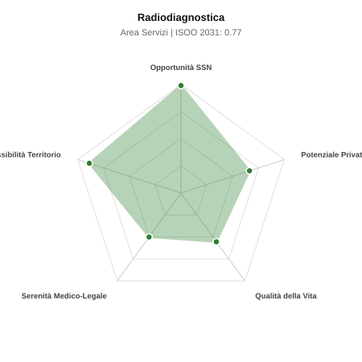

# Scheda di Orientamento: Radiodiagnostica

[← Torna al Report Nazionale](../REPORT_NAZIONALE_MEDCAREER2031.md) | [Guida alla Consultazione](../GUIDA_ALLA_CONSULTAZIONE.md)

---

## 1. Profilo di Sintesi (Coorte SSM 2026–2031)

| Parametro | Valore / Dettaglio |
| :--- | :--- |
| **Area Disciplinare** | Servizi |
| **Durata del Corso** | 4 anni |
| **Semaforo di Occupabilità al 2031** | 🟢 **VERDE SCURO (Carenza Elevata / Assunzione Immediata)** |
| **Verdetto di Carriera** | **Carenza Severa (Assunzione Immediata)** |
| **Indice ISOO Nazionale (Baseline)** | **0.77** (Range Scenari: 0.62 – 0.91) |
| **Probabilità Assunzione Concorso SSN** | **99.0%** |
| **Qualità della Vita (QoL Score)** | **55 / 100** |
| **Redditività Lorda Annua Stimata (REP)**| **~124,500 €** (Netto stimato: ~68,500 €) |

### Inquadramento Clinico e Prospettiva Occupazionale
Produzione e interpretazione specialistica delle immagini diagnostiche del corpo: radiologia tradizionale, ecografia, TC, RM e radiologia interventistica.

> [!NOTE]
> **Prospettiva al 2031 per chi entra a novembre 2026**:
> Posti vacanti diffusi e concorsi spesso deserti; altissima probabilità di assunzione prima del titolo o subito dopo (Decreto Calabria).

---

## 2. Flusso Formativo e Ricambio Generazionale

I dati ministeriali (MUR / MEF / ANAAO) evidenziano la seguente dinamica di ricambio della forza lavoro per il quinquennio 2026–2031:

- **Contratti annui stimati (media 2024-2026)**: 655 borse/anno
- **Totale contratti stanziati nel quinquennio**: 3,275
- **Tasso fisiologico di abbandono / riassegnazione**: 3.0%
- **Nuovi specialisti effettivi al 2031**: 3,177 medici formati
- **Specialisti SSN attivi censiti a inizio periodo**: 6,200
- **Uscite stimate per pensionamento (2026–2031)**: 2,356 dirigenti medici
- **Uscite per dimissioni volontarie / passaggio al privato**: 620 dirigenti medici
- **Fabbisogno netto di rimpiazzo SSN (con fattore demografico)**: 2,969 posti

---

## 3. Analisi Comparativa Multi-Scenario al 2031

Il modello Stock-Flow a 5 anni simula la convergenza tra domanda e offerta al momento del conseguimento del titolo specialistico sotto 3 differenti assetti normativi ed economici:

| Indicatore Occupazionale | Scenario 1: Baseline Inerziale | Scenario 2: Pletora Grave (Worst) | Scenario 3: Riforma Correttiva (Best) |
| :--- | :---: | :---: | :---: |
| **Uscite Totali SSN (Pensionamenti + Esodo)** | 2,976 | 2,443 | 3,391 |
| **Fabbisogno Netto Stimato SSN** | 2,969 | 2,438 | 3,381 |
| **Nuovi Diplomati Effettivi** | 3,177 | 3,336 | 2,700 |
| **Saldo Netto SSN (Nuovi - Fabbisogno)** | **+208** | **+898** | **-681** |
| **Indice ISOO (Offerta / Domanda Totale)** | **0.77** | **0.91** | **0.62** |
| **Probabilità Assunzione Concorso SSN** | **99.0%** | **98.7%** | **99.0%** |
| **Verdetto Scenario** | Carenza Severa (Assunzione Immediata) | Equilibrio Fisiologico | Carenza Severa (Assunzione Immediata) |

---

## 4. Quadro Territoriale: Domanda e Offerta nelle 21 Regioni e P.A.

La tabella seguente illustra la proiezione occupazionale al 2031 (Scenario Baseline) per ciascuna Regione e Provincia Autonoma, ordinata dal territorio con **maggior fabbisogno non coperto** a quello più saturo:

| Regione / P.A. | Medici Attivi 2026 | Uscite Totali SSN | Nuovi Assegnati | Saldo Netto 2031 | ISOO Reg. | Semaforo |
| :--- | :---: | :---: | :---: | :---: | :---: | :---: |
| Valle d'Aosta | 13 | 6 | 5 | -1 | 0.62 | 🟢 |
| Molise | 30 | 15 | 15 | 0 | 0.71 | 🟢 |
| Umbria | 89 | 43 | 44 | +1 | 0.75 | 🟢 |
| Basilicata | 55 | 28 | 29 | +2 | 0.76 | 🟢 |
| P.A. Trento | 58 | 27 | 29 | +2 | 0.76 | 🟢 |
| P.A. Bolzano | 57 | 27 | 29 | +2 | 0.76 | 🟢 |
| Friuli-Venezia Giulia | 126 | 61 | 63 | +2 | 0.75 | 🟢 |
| Calabria | 192 | 96 | 97 | +2 | 0.74 | 🟢 |
| Marche | 156 | 75 | 78 | +3 | 0.75 | 🟢 |
| Liguria | 159 | 79 | 82 | +3 | 0.75 | 🟢 |
| Abruzzo | 133 | 64 | 68 | +4 | 0.76 | 🟢 |
| Sardegna | 164 | 78 | 82 | +5 | 0.77 | 🟢 |
| Sicilia | 502 | 250 | 257 | +9 | 0.75 | 🟢 |
| Piemonte | 448 | 215 | 228 | +13 | 0.76 | 🟢 |
| Emilia-Romagna | 471 | 226 | 242 | +15 | 0.76 | 🟢 |
| Puglia | 407 | 196 | 209 | +15 | 0.77 | 🟢 |
| Toscana | 385 | 184 | 199 | +15 | 0.77 | 🟢 |
| Lazio | 600 | 288 | 306 | +19 | 0.76 | 🟢 |
| Campania | 586 | 282 | 301 | +21 | 0.77 | 🟢 |
| Veneto | 511 | 235 | 262 | +27 | 0.79 | 🟢 |
| Lombardia | 1,059 | 488 | 543 | +53 | 0.79 | 🟢 |

> [!TIP]
> **Dinamica Geografica**:
> Le regioni in verde presentano carenza strutturale con concorsi che si prevedono aperti e con elevata probabilita di vincita immediata. Nei territori contrassegnati in rosso, il numero di nuovi specialisti supera il ricambio fisiologico ospedaliero, rendendo necessaria una pianificazione extra-regionale o uno sbocco nella medicina privata.

---

## 5. Scorecard: Qualità della Vita e Redditività Economica

### Radar Chart Professionale a 5 Dimensioni

### Indicatori di Qualità della Vita (QoL Score: 55/100)
- **Notti di guardia attive medie al mese**: 2.5 turni/mese
- **Reperibilità notturne/festive medie al mese**: 3.5 turni/mese
- **Ore settimanali effettive stimate**: 42 ore (compresi straordinari operativi)
- **Classe di rischio medico-legale**: Classe 3 su 5
- **Indice di Burnout percepito nella disciplina**: 65 / 100

### Scomposizione Redditività Economica Potenziale (REP)
- **Retribuzione Base SSN + Indennità contrattuali stimate**: ~78,100 € lordi/anno
- **Potenziale Libera Professione / Attività intramuraria out-of-pocket**: ~46,400 € lordi/anno
- **Reddito Annuo Lordo Complessivo Stimato**: ~124,500 €
- **Stima Netta Annuale (aliquote IRPEF ordinarie + previdenza ENPAM)**: ~68,500 € netti/anno

---

## 6. Guida Clinico-Strategica per lo Specializzando

### Sub-Specializzazioni ad Alto Valore Aggiunto
Per differenziarsi sul mercato e acquisire una solida barriera all'ingresso professionale, si consiglia di costruire competenze nelle seguenti sotto-branche durante la scuola:
- **Radiologia interventistica vascolare ed extravascolare (embolizzazioni, termoablazioni)**
- **Neuroradiologia diagnostica avanzata (RM funzionale, perfusione, stroke)**
- **Imaging oncologico Body (TC multistrato, RM multiparametrica prostata)**
- **Senologia diagnostica e interventistica (mammografia 3D, biopsie VABB)**

### Competenze Tecniche e Strumentali Raccomandate
Abilità pratiche da padroneggiare prima del diploma specialistico per massimizzare l'autonomia clinica:
- **Ecografia con color-Doppler e contrasto (CEUS)**
- **Refertazione TC total-body con mdc in elezione e trauma**
- **Protocolli e refertazione RM ad alto campo (1.5T e 3T)**
- **Biopsie percutanee e drenaggi ecoguidati o TC-guidati**

### Sbocchi nel Mercato del Lavoro
Piena occupabilita con assunzione rapida nel SSN per la centralita in ogni ospedale; mercato privato enorme e teleradiologia notturna/festiva molto remunerativa.

### Strategia Territoriale e Mobilità
Carenza costante e diffusa in tutta Italia. Forte possibilita di teleradiologia e telelavoro per refertazione remota.

### Gestione del Rischio Professionale e Work-Life Balance
Rischio medico-legale alto (Classe 4, ritardo/mancata diagnosi lesioni). Notti attive in ospedale per Pronto Soccorso; bilanciato da grandissimo potenziale privato.

---
[← Torna al Report Nazionale](../REPORT_NAZIONALE_MEDCAREER2031.md) | [Guida alla Consultazione](../GUIDA_ALLA_CONSULTAZIONE.md)
