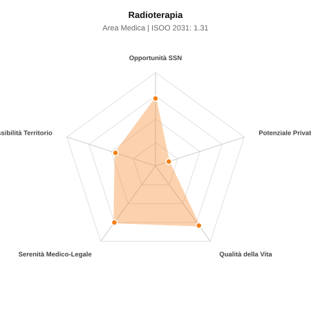

# Scheda di Orientamento: Radioterapia

[← Torna al Report Nazionale](../REPORT_NAZIONALE_MEDCAREER2031.md) | [Guida alla Consultazione](../GUIDA_ALLA_CONSULTAZIONE.md)

---

## 1. Profilo di Sintesi (Coorte SSM 2026–2031)

| Parametro | Valore / Dettaglio |
| :--- | :--- |
| **Area Disciplinare** | Medica |
| **Durata del Corso** | 4 anni |
| **Semaforo di Occupabilità al 2031** | 🟠 **ARANCIONE (Saturazione Moderata / Concorrenza Concorsuale)** |
| **Verdetto di Carriera** | **Competitivo / Rischio Saturazione** |
| **Indice ISOO Nazionale (Baseline)** | **1.31** (Range Scenari: 1.05 – 1.63) |
| **Probabilità Assunzione Concorso SSN** | **72.2%** |
| **Qualità della Vita (QoL Score)** | **79 / 100** |
| **Redditività Lorda Annua Stimata (REP)**| **~86,900 €** (Netto stimato: ~47,800 €) |

### Inquadramento Clinico e Prospettiva Occupazionale
Uso delle radiazioni ionizzanti ad alta energia per il trattamento curativo, adiuvante e palliativo delle neoplasie maligne e patologie selezionate.

> [!NOTE]
> **Prospettiva al 2031 per chi entra a novembre 2026**:
> Graduatorie concorsuali affollate; tempi di attesa per tempo indeterminato SSN mediamente più lunghi; necessario appoggiarsi al privato accreditato.

---

## 2. Flusso Formativo e Ricambio Generazionale

I dati ministeriali (MUR / MEF / ANAAO) evidenziano la seguente dinamica di ricambio della forza lavoro per il quinquennio 2026–2031:

- **Contratti annui stimati (media 2024-2026)**: 170 borse/anno
- **Totale contratti stanziati nel quinquennio**: 850
- **Tasso fisiologico di abbandono / riassegnazione**: 35.0%
- **Nuovi specialisti effettivi al 2031**: 552 medici formati
- **Specialisti SSN attivi censiti a inizio periodo**: 750
- **Uscite stimate per pensionamento (2026–2031)**: 285 dirigenti medici
- **Uscite per dimissioni volontarie / passaggio al privato**: 75 dirigenti medici
- **Fabbisogno netto di rimpiazzo SSN (con fattore demografico)**: 375 posti

---

## 3. Analisi Comparativa Multi-Scenario al 2031

Il modello Stock-Flow a 5 anni simula la convergenza tra domanda e offerta al momento del conseguimento del titolo specialistico sotto 3 differenti assetti normativi ed economici:

| Indicatore Occupazionale | Scenario 1: Baseline Inerziale | Scenario 2: Pletora Grave (Worst) | Scenario 3: Riforma Correttiva (Best) |
| :--- | :---: | :---: | :---: |
| **Uscite Totali SSN (Pensionamenti + Esodo)** | 360 | 296 | 410 |
| **Fabbisogno Netto Stimato SSN** | 375 | 306 | 431 |
| **Nuovi Diplomati Effettivi** | 552 | 580 | 497 |
| **Saldo Netto SSN (Nuovi - Fabbisogno)** | **+177** | **+274** | **+66** |
| **Indice ISOO (Offerta / Domanda Totale)** | **1.31** | **1.63** | **1.05** |
| **Probabilità Assunzione Concorso SSN** | **72.2%** | **56.1%** | **92.1%** |
| **Verdetto Scenario** | Competitivo / Rischio Saturazione | Pletora / Grave Saturazione | Equilibrio Fisiologico |

---

## 4. Quadro Territoriale: Domanda e Offerta nelle 21 Regioni e P.A.

La tabella seguente illustra la proiezione occupazionale al 2031 (Scenario Baseline) per ciascuna Regione e Provincia Autonoma, ordinata dal territorio con **maggior fabbisogno non coperto** a quello più saturo:

| Regione / P.A. | Medici Attivi 2026 | Uscite Totali SSN | Nuovi Assegnati | Saldo Netto 2031 | ISOO Reg. | Semaforo |
| :--- | :---: | :---: | :---: | :---: | :---: | :---: |
| Valle d'Aosta | 2 | 1 | 0 | -1 | 0.00 | 🟢 |
| Molise | 4 | 2 | 3 | +1 | 1.50 | 🔴 |
| Umbria | 11 | 5 | 6 | +1 | 1.00 | 🟢 |
| Basilicata | 7 | 4 | 6 | +2 | 1.20 | 🟠 |
| P.A. Trento | 7 | 4 | 6 | +2 | 1.20 | 🟠 |
| P.A. Bolzano | 7 | 4 | 6 | +2 | 1.20 | 🟠 |
| Friuli-Venezia Giulia | 15 | 8 | 10 | +2 | 1.11 | 🟢 |
| Liguria | 19 | 10 | 13 | +3 | 1.18 | 🟠 |
| Sardegna | 20 | 10 | 13 | +3 | 1.18 | 🟠 |
| Marche | 19 | 9 | 13 | +4 | 1.30 | 🟠 |
| Calabria | 23 | 11 | 16 | +4 | 1.23 | 🟠 |
| Abruzzo | 16 | 8 | 13 | +5 | 1.44 | 🟠 |
| Puglia | 49 | 24 | 36 | +11 | 1.29 | 🟠 |
| Toscana | 47 | 23 | 36 | +12 | 1.33 | 🟠 |
| Piemonte | 54 | 26 | 39 | +12 | 1.30 | 🟠 |
| Emilia-Romagna | 57 | 28 | 42 | +13 | 1.27 | 🟠 |
| Lazio | 73 | 35 | 52 | +15 | 1.27 | 🟠 |
| Sicilia | 61 | 30 | 46 | +15 | 1.31 | 🟠 |
| Veneto | 62 | 28 | 46 | +16 | 1.35 | 🟠 |
| Campania | 71 | 34 | 52 | +16 | 1.30 | 🟠 |
| Lombardia | 128 | 59 | 94 | +32 | 1.34 | 🟠 |

> [!TIP]
> **Dinamica Geografica**:
> Le regioni in verde presentano carenza strutturale con concorsi che si prevedono aperti e con elevata probabilita di vincita immediata. Nei territori contrassegnati in rosso, il numero di nuovi specialisti supera il ricambio fisiologico ospedaliero, rendendo necessaria una pianificazione extra-regionale o uno sbocco nella medicina privata.

---

## 5. Scorecard: Qualità della Vita e Redditività Economica

### Radar Chart Professionale a 5 Dimensioni

### Indicatori di Qualità della Vita (QoL Score: 79/100)
- **Notti di guardia attive medie al mese**: 0.5 turni/mese
- **Reperibilità notturne/festive medie al mese**: 1.5 turni/mese
- **Ore settimanali effettive stimate**: 40 ore (compresi straordinari operativi)
- **Classe di rischio medico-legale**: Classe 2 su 5
- **Indice di Burnout percepito nella disciplina**: 50 / 100

### Scomposizione Redditività Economica Potenziale (REP)
- **Retribuzione Base SSN + Indennità contrattuali stimate**: ~76,400 € lordi/anno
- **Potenziale Libera Professione / Attività intramuraria out-of-pocket**: ~10,500 € lordi/anno
- **Reddito Annuo Lordo Complessivo Stimato**: ~86,900 €
- **Stima Netta Annuale (aliquote IRPEF ordinarie + previdenza ENPAM)**: ~47,800 € netti/anno

---

## 6. Guida Clinico-Strategica per lo Specializzando

### Sub-Specializzazioni ad Alto Valore Aggiunto
Per differenziarsi sul mercato e acquisire una solida barriera all'ingresso professionale, si consiglia di costruire competenze nelle seguenti sotto-branche durante la scuola:
- **Radioterapia stereotassica corporea (SBRT/SABR)**
- **Radioterapia a modulazione d intensita (IMRT, VMAT, IGRT)**
- **Adroterapia (protoni e ioni carbonio per tumori radioresistenti)**
- **Brachiterapia ad alto dose-rate (HDR)**

### Competenze Tecniche e Strumentali Raccomandate
Abilità pratiche da padroneggiare prima del diploma specialistico per massimizzare l'autonomia clinica:
- **Centratura TC e contouring volumetrico organi bersaglio e a rischio**
- **Valutazione piani di trattamento dosimetrici e istogrammi DVH**
- **Gestione clinica della radiotossicita acuta e tardiva**
- **Acceleratori lineari avanzati guidati da RM (MR-Linac)**

### Sbocchi nel Mercato del Lavoro
Posizioni ospedaliere concentrate nei centri oncologici dotati di LINAC (SSN e cliniche convenzionate). Assorbimento stabile ed equilibrato.

### Strategia Territoriale e Mobilità
Servizi presenti nei presidi Hub provinciali e metropolitani; opportunita in espansione nei centri di adroterapia.

### Gestione del Rischio Professionale e Work-Life Balance
Rischio medico-legale moderato (Classe 2-3). Qualita della vita ottima (QoL > 80): attivita programmata feriale, assenza di guardie notturne di reparto.

---
[← Torna al Report Nazionale](../REPORT_NAZIONALE_MEDCAREER2031.md) | [Guida alla Consultazione](../GUIDA_ALLA_CONSULTAZIONE.md)
