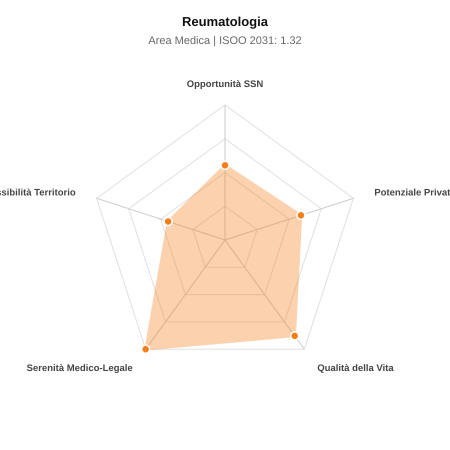

# Scheda di Orientamento: Reumatologia

[← Torna al Report Nazionale](../REPORT_NAZIONALE_MEDCAREER2031.md) | [Guida alla Consultazione](../GUIDA_ALLA_CONSULTAZIONE.md)

---

## 1. Profilo di Sintesi (Coorte SSM 2026–2031)

| Parametro | Valore / Dettaglio |
| :--- | :--- |
| **Area Disciplinare** | Medica |
| **Durata del Corso** | 4 anni |
| **Semaforo di Occupabilità al 2031** | 🟠 **ARANCIONE (Saturazione Moderata / Concorrenza Concorsuale)** |
| **Verdetto di Carriera** | **Competitivo / Rischio Saturazione** |
| **Indice ISOO Nazionale (Baseline)** | **1.32** (Range Scenari: 1.10 – 1.51) |
| **Probabilità Assunzione Concorso SSN** | **55.3%** |
| **Qualità della Vita (QoL Score)** | **88 / 100** |
| **Redditività Lorda Annua Stimata (REP)**| **~117,800 €** (Netto stimato: ~64,800 €) |

### Inquadramento Clinico e Prospettiva Occupazionale
Diagnosi e trattamento delle malattie reumatiche infiammatorie croniche, connettiviti sistemiche, vasculiti, artriti e osteopatie metaboliche.

> [!NOTE]
> **Prospettiva al 2031 per chi entra a novembre 2026**:
> Graduatorie concorsuali affollate; tempi di attesa per tempo indeterminato SSN mediamente più lunghi; necessario appoggiarsi al privato accreditato.

---

## 2. Flusso Formativo e Ricambio Generazionale

I dati ministeriali (MUR / MEF / ANAAO) evidenziano la seguente dinamica di ricambio della forza lavoro per il quinquennio 2026–2031:

- **Contratti annui stimati (media 2024-2026)**: 120 borse/anno
- **Totale contratti stanziati nel quinquennio**: 600
- **Tasso fisiologico di abbandono / riassegnazione**: 2.0%
- **Nuovi specialisti effettivi al 2031**: 588 medici formati
- **Specialisti SSN attivi censiti a inizio periodo**: 500
- **Uscite stimate per pensionamento (2026–2031)**: 190 dirigenti medici
- **Uscite per dimissioni volontarie / passaggio al privato**: 50 dirigenti medici
- **Fabbisogno netto di rimpiazzo SSN (con fattore demografico)**: 250 posti

---

## 3. Analisi Comparativa Multi-Scenario al 2031

Il modello Stock-Flow a 5 anni simula la convergenza tra domanda e offerta al momento del conseguimento del titolo specialistico sotto 3 differenti assetti normativi ed economici:

| Indicatore Occupazionale | Scenario 1: Baseline Inerziale | Scenario 2: Pletora Grave (Worst) | Scenario 3: Riforma Correttiva (Best) |
| :--- | :---: | :---: | :---: |
| **Uscite Totali SSN (Pensionamenti + Esodo)** | 240 | 197 | 273 |
| **Fabbisogno Netto Stimato SSN** | 250 | 204 | 287 |
| **Nuovi Diplomati Effettivi** | 588 | 617 | 500 |
| **Saldo Netto SSN (Nuovi - Fabbisogno)** | **+338** | **+413** | **+213** |
| **Indice ISOO (Offerta / Domanda Totale)** | **1.32** | **1.51** | **1.10** |
| **Probabilità Assunzione Concorso SSN** | **55.3%** | **43.0%** | **74.7%** |
| **Verdetto Scenario** | Competitivo / Rischio Saturazione | Pletora / Grave Saturazione | Equilibrio Fisiologico |

---

## 4. Quadro Territoriale: Domanda e Offerta nelle 21 Regioni e P.A.

La tabella seguente illustra la proiezione occupazionale al 2031 (Scenario Baseline) per ciascuna Regione e Provincia Autonoma, ordinata dal territorio con **maggior fabbisogno non coperto** a quello più saturo:

| Regione / P.A. | Medici Attivi 2026 | Uscite Totali SSN | Nuovi Assegnati | Saldo Netto 2031 | ISOO Reg. | Semaforo |
| :--- | :---: | :---: | :---: | :---: | :---: | :---: |
| Valle d'Aosta | 1 | 0 | 0 | 0 | 2.00 | 🔴 |
| Basilicata | 4 | 2 | 5 | +3 | 1.25 | 🟠 |
| P.A. Bolzano | 5 | 2 | 5 | +3 | 1.25 | 🟠 |
| P.A. Trento | 5 | 2 | 5 | +3 | 1.25 | 🟠 |
| Molise | 2 | 1 | 5 | +4 | 1.67 | 🔴 |
| Friuli-Venezia Giulia | 10 | 5 | 10 | +5 | 1.25 | 🟠 |
| Umbria | 7 | 4 | 10 | +6 | 1.43 | 🟠 |
| Liguria | 13 | 6 | 15 | +9 | 1.36 | 🟠 |
| Marche | 13 | 6 | 15 | +9 | 1.36 | 🟠 |
| Sardegna | 13 | 6 | 15 | +9 | 1.36 | 🟠 |
| Abruzzo | 11 | 5 | 15 | +10 | 1.50 | 🔴 |
| Calabria | 16 | 8 | 20 | +12 | 1.33 | 🟠 |
| Toscana | 31 | 15 | 34 | +18 | 1.26 | 🟠 |
| Puglia | 33 | 16 | 39 | +22 | 1.30 | 🟠 |
| Emilia-Romagna | 38 | 18 | 44 | +25 | 1.29 | 🟠 |
| Piemonte | 36 | 18 | 44 | +25 | 1.29 | 🟠 |
| Sicilia | 41 | 20 | 49 | +28 | 1.32 | 🟠 |
| Veneto | 41 | 19 | 49 | +29 | 1.36 | 🟠 |
| Campania | 47 | 23 | 54 | +30 | 1.29 | 🟠 |
| Lazio | 48 | 23 | 59 | +35 | 1.34 | 🟠 |
| Lombardia | 85 | 39 | 98 | +57 | 1.34 | 🟠 |

> [!TIP]
> **Dinamica Geografica**:
> Le regioni in verde presentano carenza strutturale con concorsi che si prevedono aperti e con elevata probabilita di vincita immediata. Nei territori contrassegnati in rosso, il numero di nuovi specialisti supera il ricambio fisiologico ospedaliero, rendendo necessaria una pianificazione extra-regionale o uno sbocco nella medicina privata.

---

## 5. Scorecard: Qualità della Vita e Redditività Economica

### Radar Chart Professionale a 5 Dimensioni

### Indicatori di Qualità della Vita (QoL Score: 88/100)
- **Notti di guardia attive medie al mese**: 0.5 turni/mese
- **Reperibilità notturne/festive medie al mese**: 1.0 turni/mese
- **Ore settimanali effettive stimate**: 38 ore (compresi straordinari operativi)
- **Classe di rischio medico-legale**: Classe 1 su 5
- **Indice di Burnout percepito nella disciplina**: 45 / 100

### Scomposizione Redditività Economica Potenziale (REP)
- **Retribuzione Base SSN + Indennità contrattuali stimate**: ~76,400 € lordi/anno
- **Potenziale Libera Professione / Attività intramuraria out-of-pocket**: ~41,400 € lordi/anno
- **Reddito Annuo Lordo Complessivo Stimato**: ~117,800 €
- **Stima Netta Annuale (aliquote IRPEF ordinarie + previdenza ENPAM)**: ~64,800 € netti/anno

---

## 6. Guida Clinico-Strategica per lo Specializzando

### Sub-Specializzazioni ad Alto Valore Aggiunto
Per differenziarsi sul mercato e acquisire una solida barriera all'ingresso professionale, si consiglia di costruire competenze nelle seguenti sotto-branche durante la scuola:
- **Artriti croniche e terapie con farmaci biologici e JAK-inibitori**
- **Malattie autoimmuni sistemiche complesse (LES, Sclerosi Sistemica, Sjogren)**
- **Vasculiti sistemiche (arterite a cellule giganti)**
- **Osteoporosi severa e metabolismo osseo**

### Competenze Tecniche e Strumentali Raccomandate
Abilità pratiche da padroneggiare prima del diploma specialistico per massimizzare l'autonomia clinica:
- **Ecografia articolare con Power Doppler per monitoraggio sinovite**
- **Artrocentesi ed infiltrazioni articolari ecoguidate**
- **Capillaroscopia periungueale per fenomeno di Raynaud**
- **Monitoraggio sicurezza immunosoppressori e biotecnologici**

### Sbocchi nel Mercato del Lavoro
Posti ospedalieri dedicati contenuti (spesso ambulatori in Medicina Interna); floridissima attivita specialistica ambulatoriale SUMAI e libera professione privata.

### Strategia Territoriale e Mobilità
Elevatissima domanda privata in tutta Italia per l alta prevalenza di artropatie e dolore cronico nell anziano.

### Gestione del Rischio Professionale e Work-Life Balance
Rischio medico-legale basso (Classe 1-2). Qualita della vita eccellente (QoL > 85): assenza di notti o urgenze di sala, orari ambulatoriali stabili.

---
[← Torna al Report Nazionale](../REPORT_NAZIONALE_MEDCAREER2031.md) | [Guida alla Consultazione](../GUIDA_ALLA_CONSULTAZIONE.md)
