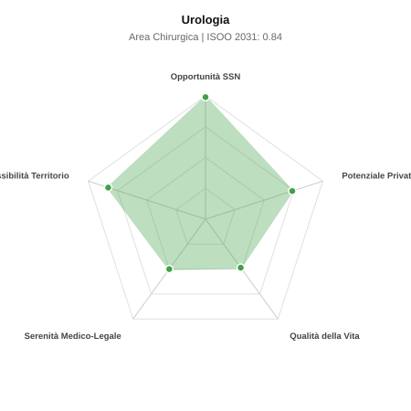

# Scheda di Orientamento: Urologia

[← Torna al Report Nazionale](../REPORT_NAZIONALE_MEDCAREER2031.md) | [Guida alla Consultazione](../GUIDA_ALLA_CONSULTAZIONE.md)

---

## 1. Profilo di Sintesi (Coorte SSM 2026–2031)

| Parametro | Valore / Dettaglio |
| :--- | :--- |
| **Area Disciplinare** | Chirurgica |
| **Durata del Corso** | 5 anni |
| **Semaforo di Occupabilità al 2031** | 🟢 **VERDE CHIARO (Equilibrio Fisiologico / Buona Occupabilità)** |
| **Verdetto di Carriera** | **Equilibrio Fisiologico** |
| **Indice ISOO Nazionale (Baseline)** | **0.84** (Range Scenari: 0.71 – 0.98) |
| **Probabilità Assunzione Concorso SSN** | **99.0%** |
| **Qualità della Vita (QoL Score)** | **49 / 100** |
| **Redditività Lorda Annua Stimata (REP)**| **~130,300 €** (Netto stimato: ~71,700 €) |

### Inquadramento Clinico e Prospettiva Occupazionale
Diagnosi e trattamento chirurgico e medico delle patologie dell apparato urinario maschile/femminile e genitale maschile: tumori, calcolosi e ipertrofia prostatica.

> [!NOTE]
> **Prospettiva al 2031 per chi entra a novembre 2026**:
> Buon bilanciamento tra uscite e nuovi specialisti; accesso regolare al SSN tramite concorso e spazio nel settore convenzionato.

---

## 2. Flusso Formativo e Ricambio Generazionale

I dati ministeriali (MUR / MEF / ANAAO) evidenziano la seguente dinamica di ricambio della forza lavoro per il quinquennio 2026–2031:

- **Contratti annui stimati (media 2024-2026)**: 250 borse/anno
- **Totale contratti stanziati nel quinquennio**: 1,250
- **Tasso fisiologico di abbandono / riassegnazione**: 5.0%
- **Nuovi specialisti effettivi al 2031**: 1,188 medici formati
- **Specialisti SSN attivi censiti a inizio periodo**: 1,850
- **Uscite stimate per pensionamento (2026–2031)**: 703 dirigenti medici
- **Uscite per dimissioni volontarie / passaggio al privato**: 185 dirigenti medici
- **Fabbisogno netto di rimpiazzo SSN (con fattore demografico)**: 926 posti

---

## 3. Analisi Comparativa Multi-Scenario al 2031

Il modello Stock-Flow a 5 anni simula la convergenza tra domanda e offerta al momento del conseguimento del titolo specialistico sotto 3 differenti assetti normativi ed economici:

| Indicatore Occupazionale | Scenario 1: Baseline Inerziale | Scenario 2: Pletora Grave (Worst) | Scenario 3: Riforma Correttiva (Best) |
| :--- | :---: | :---: | :---: |
| **Uscite Totali SSN (Pensionamenti + Esodo)** | 888 | 728 | 1,012 |
| **Fabbisogno Netto Stimato SSN** | 926 | 753 | 1,064 |
| **Nuovi Diplomati Effettivi** | 1,188 | 1,247 | 1,069 |
| **Saldo Netto SSN (Nuovi - Fabbisogno)** | **+262** | **+494** | **+5** |
| **Indice ISOO (Offerta / Domanda Totale)** | **0.84** | **0.98** | **0.71** |
| **Probabilità Assunzione Concorso SSN** | **99.0%** | **85.1%** | **99.0%** |
| **Verdetto Scenario** | Equilibrio Fisiologico | Equilibrio Fisiologico | Carenza Severa (Assunzione Immediata) |

---

## 4. Quadro Territoriale: Domanda e Offerta nelle 21 Regioni e P.A.

La tabella seguente illustra la proiezione occupazionale al 2031 (Scenario Baseline) per ciascuna Regione e Provincia Autonoma, ordinata dal territorio con **maggior fabbisogno non coperto** a quello più saturo:

| Regione / P.A. | Medici Attivi 2026 | Uscite Totali SSN | Nuovi Assegnati | Saldo Netto 2031 | ISOO Reg. | Semaforo |
| :--- | :---: | :---: | :---: | :---: | :---: | :---: |
| Molise | 9 | 5 | 5 | 0 | 0.71 | 🟢 |
| P.A. Bolzano | 17 | 8 | 10 | +1 | 0.77 | 🟢 |
| P.A. Trento | 17 | 8 | 10 | +1 | 0.77 | 🟢 |
| Basilicata | 16 | 8 | 10 | +2 | 0.83 | 🟢 |
| Liguria | 47 | 24 | 28 | +3 | 0.76 | 🟢 |
| Valle d'Aosta | 4 | 2 | 5 | +3 | 1.25 | 🟠 |
| Abruzzo | 40 | 19 | 24 | +4 | 0.80 | 🟢 |
| Marche | 46 | 22 | 28 | +5 | 0.80 | 🟢 |
| Friuli-Venezia Giulia | 37 | 18 | 24 | +5 | 0.83 | 🟢 |
| Umbria | 27 | 13 | 19 | +6 | 0.91 | 🟢 |
| Calabria | 57 | 29 | 38 | +8 | 0.83 | 🟢 |
| Sardegna | 49 | 24 | 33 | +8 | 0.85 | 🟢 |
| Puglia | 121 | 58 | 76 | +15 | 0.83 | 🟢 |
| Sicilia | 150 | 75 | 95 | +16 | 0.81 | 🟢 |
| Toscana | 115 | 56 | 76 | +18 | 0.85 | 🟢 |
| Emilia-Romagna | 140 | 67 | 90 | +20 | 0.84 | 🟢 |
| Piemonte | 134 | 64 | 86 | +20 | 0.84 | 🟢 |
| Lazio | 179 | 86 | 114 | +23 | 0.83 | 🟢 |
| Campania | 175 | 84 | 114 | +25 | 0.84 | 🟢 |
| Veneto | 152 | 70 | 100 | +26 | 0.87 | 🟢 |
| Lombardia | 316 | 146 | 204 | +50 | 0.85 | 🟢 |

> [!TIP]
> **Dinamica Geografica**:
> Le regioni in verde presentano carenza strutturale con concorsi che si prevedono aperti e con elevata probabilita di vincita immediata. Nei territori contrassegnati in rosso, il numero di nuovi specialisti supera il ricambio fisiologico ospedaliero, rendendo necessaria una pianificazione extra-regionale o uno sbocco nella medicina privata.

---

## 5. Scorecard: Qualità della Vita e Redditività Economica

### Radar Chart Professionale a 5 Dimensioni

### Indicatori di Qualità della Vita (QoL Score: 49/100)
- **Notti di guardia attive medie al mese**: 3.0 turni/mese
- **Reperibilità notturne/festive medie al mese**: 4.0 turni/mese
- **Ore settimanali effettive stimate**: 45 ore (compresi straordinari operativi)
- **Classe di rischio medico-legale**: Classe 3 su 5
- **Indice di Burnout percepito nella disciplina**: 60 / 100

### Scomposizione Redditività Economica Potenziale (REP)
- **Retribuzione Base SSN + Indennità contrattuali stimate**: ~78,500 € lordi/anno
- **Potenziale Libera Professione / Attività intramuraria out-of-pocket**: ~51,800 € lordi/anno
- **Reddito Annuo Lordo Complessivo Stimato**: ~130,300 €
- **Stima Netta Annuale (aliquote IRPEF ordinarie + previdenza ENPAM)**: ~71,700 € netti/anno

---

## 6. Guida Clinico-Strategica per lo Specializzando

### Sub-Specializzazioni ad Alto Valore Aggiunto
Per differenziarsi sul mercato e acquisire una solida barriera all'ingresso professionale, si consiglia di costruire competenze nelle seguenti sotto-branche durante la scuola:
- **Uro-oncologia robotica assistita (prostatectomia nerve-sparing, nefrectomia)**
- **Endourologia mininvasiva per calcolosi (RIRS con laser Tullio, PCNL)**
- **Trattamento mininvasivo IPB (laser HoLEP/ThuLEP, Rezum)**
- **Andrologia chirurgica e medica (protesi peniene, infertilita)**

### Competenze Tecniche e Strumentali Raccomandate
Abilità pratiche da padroneggiare prima del diploma specialistico per massimizzare l'autonomia clinica:
- **Cistoscopia flessibile e biopsie prostatiche a fusione (Fusion Biopsy)**
- **Resezione endoscopica transuretrale vescicale (TURB) e prostatica (TURP)**
- **Ureteroscopia semirigida e flessibile con litotressia laser**
- **Ecografia dell apparato urinario e Doppler penieno dinamico**

### Sbocchi nel Mercato del Lavoro
Ottimo assorbimento nei concorsi pubblici SSN per la frequenza di tumori e calcoli; attivita privata ed elettiva eccezionalmente ricca (REP al vertice).

### Strategia Territoriale e Mobilità
Carenza costante negli ospedali Hub e Spoke del Centro-Nord; fortissima richiesta privata legata all invecchiamento maschile.

### Gestione del Rischio Professionale e Work-Life Balance
Rischio medico-legale medio-alto (Classe 3-4, incontinenza o deficit erettile post-chirurgico). Guardie e reperibilita ospedaliere; ampiamente bilanciato da altissimi guadagni.

---
[← Torna al Report Nazionale](../REPORT_NAZIONALE_MEDCAREER2031.md) | [Guida alla Consultazione](../GUIDA_ALLA_CONSULTAZIONE.md)
